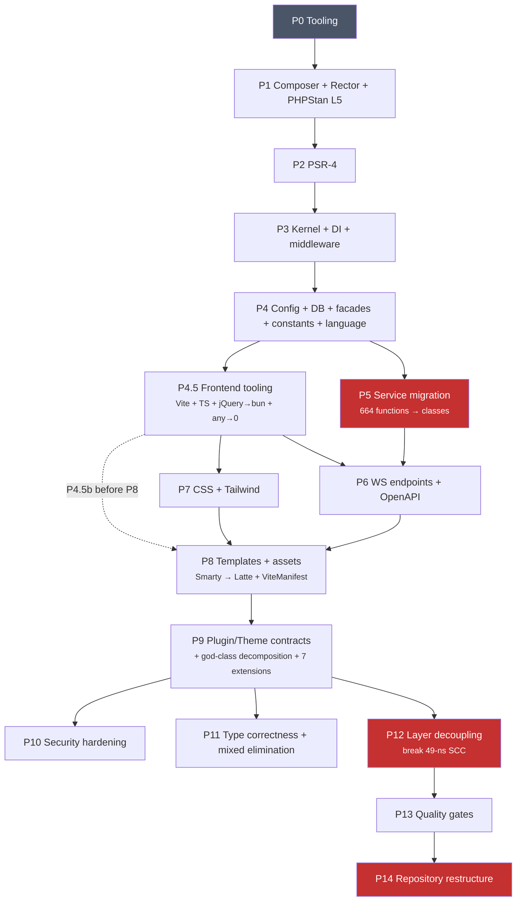

# Plan: Replay `16.x-rewrite` as a clean, tested branch

## Context

`origin/16.x` is legacy Piwigo: no Composer, no tests, no TypeScript, no PSR-4,
vendored Smarty/PHPMailer in `include/`, MyISAM everywhere, zero CI.

`16.x-rewrite` is 2023 commits ahead with full modernization, but the commit
history averages 27 era-switches per 100 commits — CSS interleaved with Latte
interleaved with WS refactoring interleaved with PHPStan fixes. Core files like
`config/container.php` (194 touches) and `include/functions.inc.php` (97 touches)
were modified continuously across the entire timeline.

**Goal:** New branch `16.x-v2` from `origin/16.x`. Replay in clean phases.
Tests accompany each phase. Every commit green.

### Codebase baselines (verified 2026-05-24)

| Metric | origin/16.x | 16.x-rewrite |
|--------|-------------|--------------|
| PHP files | 947 | 894 in `src/Piwigo/` |
| JS files | 333 | 115 TS (82 authored) |
| Templates | 140 `.tpl` (Smarty) | 133 `.latte` (3 more in test fixtures) |
| CSS files | 83 | 101 |
| DB tables | 34 (MyISAM) | 41 (InnoDB + utf8mb4) |
| Config keys | 189 | 271 SCHEMA entries |
| Namespaces | 0 | 53 under `src/Piwigo/` |
| Procedural functions | 664 across 31 files | 1 (`resolve()` in Core/) |
| jQuery refs | 2752 | 0 |
| `define()` constants | 52 | 0 in src/ |
| Tests | 0 | 1122 unit + 153 integration (899 methods × data providers) |
| PHPStan | n/a | Level 10, 0 errors |
| Admin themes | 3 (`clear/default/roma`) | 3 (`_base/dark/light`) |
| Admin pages | 62 PHP files | 9 controllers |
| Frontend controllers | 0 (inline PHP) | 21 controllers |
| WS handlers | procedural | 94 handler files + 83 Params + 7 Results |
| Container services | 0 | 129 (127 factory closures, 1 autowire) |
| Repositories | 0 | 37 |
| Middleware | 0 | 8 |
| Routes | 0 | 37 |
| Events | 0 | 157 PSR-14 classes |
| Enums | 0 | 31 |
| Value Objects | 0 | 21 |
| Vite entries | 0 | 68 |
| `!important` | 720 | 4 |
| `die()` calls | 206 | 0 |
| Upgrade scripts | 23 | 0 (mechanism undefined) |
| Language files | 324 `.lang.php` | 322 `.po` |

**Branch diff:** 1549 deleted, 2271 added, 104 modified, 208 renamed = 4132 files,
527K insertions, 434K deletions.

### Current gate status (reference branch)

| Gate | Status |
|------|--------|
| Unit tests (PHPUnit) | 1122/1122 |
| Integration tests | 153/153 |
| E2E Playwright | 51/51 (3 skipped) |
| PHPStan L10 | 0 errors |
| Pint | clean |
| TypeScript | clean |
| Vite build | 68 entries, 541ms |
| Stylelint | 0 errors, 7 warnings |
| Psalm | 0 errors, 1787 info-level, 98.1% inference |
| Rector | 94 cosmetic diffs (2 rules: arrow fn return types) |
| ESLint | 33 errors in 1 file (`visual-regression.ts`) |

---

## Test framework

Pest 4 (v4.7.0) replaces both PHPUnit and Playwright as a single test harness:

- **Unit/Integration:** Pest 4 runs PHP tests natively (IS PHPUnit under the hood)
- **Browser E2E:** `pestphp/pest-plugin-browser` v4.3.1 wraps Playwright's server
  via WebSocket — same Chromium engine, PHP test syntax. Gaps: no multi-tab, no
  network interception, no dialog handling. Keep Playwright alongside for tests
  that need these features (the current E2E suite has 15 specs written for Playwright).
- **Architecture:** `pestphp/pest-plugin-arch` v4 — structural rules
- **Mutation:** `pestphp/pest-plugin-mutate` v4
- **Type coverage:** `pestphp/pest-plugin-type-coverage` v4

**Exception:** Vitest stays for TypeScript unit tests (Pest can't test TS logic).

---

## Dependency graph



**Critical path:** P0 → P1 → P2 → P3 → P4 → P5 → P6 → P8 → P9 → P12 → P14.
**Parallel:** P4.5 alongside P5-P6. P7 steps 1-5 alongside P6.

---

## Phase breakdown

### P0 — All dev tooling + CI (on bare `origin/16.x`)

Install every tool up front. Most will report hundreds or thousands of issues
against the legacy codebase — expected. Each tool records its baseline issue
count. CI enforces ratchets: counts can only go down.

**The rule from here forward:** no code change lands without all CI gates green
(no regressions from committed baselines).

#### PHP tooling

- `composer.json`: PHP 8.5
- **Pest 4** + plugins: `pest` ^4, `pest-plugin-arch` ^4, `pest-plugin-mutate` ^4,
  `pest-plugin-type-coverage` ^4, `pest-plugin-browser` ^4
- **pcov** for code coverage — NOT currently installed, P0 blocker
- **Pint** (`pint.json`) — format, commit, baseline = 0
- **PHPStan** (`phpstan.neon`, `tools/phpstan-bootstrap.php`) + 6 custom rules
  from `tools/phpstan/` + Latte engine resolver — start at L0, record baseline
- **Rector** (`rector.php`) — record pending transformations
- **Psalm** (`psalm.xml`) — record baseline (will be thousands)
- `phpunit.xml.dist`, `tests/Pest.php`, `tests/bootstrap.php`
- `tests/Unit/SmokeTest.php`, `tests/Arch/StructuralTest.php`

#### Frontend tooling (bun + justfile)

- **bun** as package manager (`bun.lock`), **justfile** as task runner
- `package.json`: all dev deps installed via `bun install`
- **Vite** + `vite.config.ts`, **TypeScript** + `tsconfig.json` (`allowJs: true`)
- **ESLint** + `eslint.config.ts`, **Prettier**, **Stylelint** — baseline error counts
- **Vitest** + `vitest.config.ts` + `@vitest/coverage-v8` + `happy-dom`
- `tests/js/smoke.test.ts`

#### Browser E2E

- `tests/Browser/InstallTest.php`, `SmokeGalleryTest.php`, `SmokeAdminTest.php`
- `.env.test` template

#### CI

`.github/workflows/ci.yml` — all 11 jobs from day one (matching reference):
pest-unit, pest-browser, pint, phpstan, psalm (baseline), rector,
eslint (baseline), stylelint (baseline), vitest, coverage, audit.

#### Dev fixtures + tools

- `dev/fixtures/piwigo-16.x.sql`, `dev/fixtures/README.md`
- 20+ dev tools live under `tools/` on the rewrite branch (latte-lint,
  smarty-to-latte, css-audit, measure-nesting, openapi-dump, plugin-lint, etc.).
  Tools that are needed before the code they lint must land in P0 or their
  consuming phase.

#### Runtime requirements

- PHP 8.5, Node.js 24, MySQL 8.4
- `ext-intl` may be needed by Symfony components
- `ext-sockets` installed (Pest Browser compatible)
- `amphp/amp` already installed (no conflict with Pest Browser deps)

**Test count after P0:** ~5 PHP unit, 3 browser, 1 TS unit, arch rules.
All CI gates green against baselines.

---

### P1 — Composer + Rector + PHPStan (PHP modernization)

Tools already installed and baselined from P0. This phase uses them.

#### PHP 8.5 compatibility of origin/16.x

Origin code parses cleanly (`php -l` passes), but has runtime issues:
- **`utf8_encode/decode`** (removed 8.2): 4 references — **will fatal**
- **Dynamic properties** (deprecated 8.2): 14 classes + vendored libs
- **`addslashes` on all input**: 7 refs in common.inc.php — works but unnecessary
- **`functions_mysql.inc.php`**: 25 dead `mysql_` calls — included by config

P1 must fix the 4 fatal `utf8_encode` calls immediately, then replace the
vendored libs that cause dynamic property warnings.

#### What happens

- Remove vendored `include/smarty/` (173 files), `include/phpmailer/`,
  `include/emogrifier.class.php`, `include/jshrink.class.php`, `include/minify/`,
  `include/passwordhash.class.php`, `include/feedcreator.class.php`,
  `include/phpqrcode.php`, `include/mdetect.php`, `include/base32.class.php`
- `composer require` their packagist equivalents
- Add `require 'vendor/autoload.php'` in `include/common.inc.php`
- Remove `include/php_compat/` shims, `include/dblayer/functions_mysql.inc.php`
- Migrate password hashing to `password_hash()` / bcrypt
- Apply Rector PHP 8.0-8.5 sets (tightens Rector baseline to 0 pending)
- Pint format pass, add `declare(strict_types=1)` to all first-party files
- Push PHPStan from L0 → L5, tightening `.phpstan-baseline.neon` at each level

**Note on PHPStan progression:** The rewrite is at L10. The plan proposes going
L0→L5→L6→L8→L10 across phases. But the code patterns (VOs, readonly classes,
strict typing) were designed FOR L10. Intermediate levels may surface different
errors than the final code — making intermediate green states harder than expected.
Accept that PHPStan baselines at intermediate levels may not shrink monotonically.

**Tests:** Browser E2E after each vendor swap. Password hashing unit test.
Arch test: no vendored lib dirs exist.

**Gate:** PHPStan L5 clean. Rector dry-run clean. Pint clean. Browser green.

---

### P2 — PSR-4 namespace migration

**What happens:**
- Create `src/Piwigo/` directory tree
- PSR-4 autoload config in `composer.json`
- Extract classes from ~51 first-party class declarations across include/ and
  admin/include/ (16 `.class.php` in include/, 8 in admin/include/, plus inline
  classes in `functions_search.inc.php` (7), `ws_core.inc.php` (4),
  `ws_protocols/*.php` (5), `block.class.php` (3), `template.class.php` (5),
  `functions_plugins.inc.php` (2))
- Split multi-class files into one-class-per-file
- Namespace all extracted classes under `Piwigo\`
- Update all `require`/`include` references
- Procedural files (`include/functions_*.inc.php`) stay — converted in P5

**This is extraction + namespace, not "move 62 classes."** Origin/16.x has 75
class declarations; ~51 are first-party after removing vendored. The real work
is extracting classes from procedural files, splitting multi-class files, and
creating stubs for procedural logic.

**Tests:** Unit test for each moved class with testable logic. Browser E2E.
Arch test: all classes in `src/Piwigo/` have `declare(strict_types=1)`.

**Gate:** `composer dump-autoload --strict-psr`. PHPStan clean. Browser green.

---

### P3 — Core kernel + DI + boot sequence

#### Boot sequence (origin → rewrite)

Origin boot (`common.inc.php`): config_default → local overrides → DB credentials →
DB functions (45 procedural) → 52 defines → 78 utility functions → Smarty wrapper →
cache + Logger → session + permissions → content filtering. 10 global variables
beyond `$conf/$user/$page/$lang`.

Rewrite boot (`index.php`): Composer autoload → `Paths::fromIndex()` → fast-paths
for derivatives/install/upgrade → `CommonBootstrap::run()` → ConfigLoader →
Kernel::boot → DI → middleware pipeline.

#### Upgrade mechanism

Origin: `upgrade.php` discovers `install/upgrade_X.Y.Z.php` by version (23 scripts).
Rewrite: All upgrade scripts deleted. `UpgradeController` checks DB version + plugin
deactivation only. `doctrine/migrations` is a dep but used ONLY for plugin migrations
(`PluginMigrationRunner`), not core schema. **Core schema upgrades are undefined** —
fresh installs work via `piwigo_structure-mysql.sql`, but upgrades from existing
installations are not handled. This must be resolved here or in P4.

#### P3a — Kernel + boot skeleton
- `Kernel.php`, `CommonBootstrap.php`, `RequestFactory.php`, `ResponseEmitter.php`
- `index.php` becomes single entry point
- **Tests:** `KernelBootTest.php`, `ContainerSmokeTest.php`

#### P3b — DI container
- `Container.php`, `config/container.php`
- 129 service definitions, all manual `factory()` closures. Container grows
  WITH each subsequent phase — cannot be pulled from the reference branch in bulk.
- **Tests:** `ContainerDefinitionsTest.php`

#### P3c — PSR-15 middleware + routing
- All 8 middleware classes, `MiddlewarePipeline.php`, `config/routes.php`
- Legacy entry points (`i.php`, `action.php`, `ws.php`, etc.) routed through `index.php`
- **Tests:** Middleware unit tests, `FastPathHeadersTest.php`, browser E2E for legacy URLs

**Gate:** PHPStan raise to L6-7. All services resolve. Browser green.

---

### P4 — Config + DB + typed facades + constants + language

#### Config key evolution

189 keys in origin → 271 keys in rewrite SCHEMA. 96 new keys added (many were
previously DB-only in `config.sql`). 14 keys removed: `anti-flood_time`,
`debug_l10n`, `default_filters_views`, `derivatives_strip_metadata_threshold`,
`external_authentification`, `metadata_keyword_separator_regex`, `password_hash`,
`password_verify`, `php_extension_in_urls`, `question_mark_in_urls`,
`tag_url_style`, `template_combine_files`, `checksum_compute_blocksize`,
`comments_page_nb_comments`.

#### Database schema migration

ALL 34 origin tables use `ENGINE=MyISAM` with no explicit charset. Rewrite uses
`ENGINE=InnoDB DEFAULT CHARSET=utf8mb4 COLLATE=utf8mb4_unicode_ci`. No FULLTEXT
indexes exist so migration is safe. This engine+charset change must happen here.

**7 new tables:** `derivative_settings`, `derivative_size`,
`extension_ignored_updates`, `integrity_ignored_anomalies`, `plugin_migrations`,
`search_filter_view`, `user_failed_logins`.

**46 column-level type changes:**

- **10 enum→tinyint** (boolean columns): `categories.commentable`,
  `categories.visible`, `comments.validated`, `groups.is_default`,
  `user_cache.need_update`, `user_infos.enabled_high`, `user_infos.expand`,
  `user_infos.last_visit_from_history`, `user_infos.show_nb_comments`,
  `user_infos.show_nb_hits`, `user_mail_notification.enabled`
- **4 text→JSON**: `config.value`, `search.rules`, `user_cache.forbidden_categories`,
  `user_cache.image_access_list`, `user_infos.preferences`
- **9 binary→utf8mb4_bin**: `categories.permalink`, `images.file`,
  `old_permalinks.permalink`, `plugins.id`, `sessions.id`, `tags.url_name`,
  `user_feed.id`, `user_mail_notification.check_key`, `users.username`
- **7 default changes** (1970-01-01 → NULL): `comments.date`, `history.date`,
  `images.date_available`, `old_permalinks.date_deleted`, `rate.date`,
  `sessions.expiration`, `upgrade.applied`, `user_infos.registration_date`
- 6 TIMESTAMP NOT NULL additions, 3 unsigned fixes, 1 new column
  (`history_summary.summary_id` AUTO_INCREMENT), 0 columns removed.

**Serialized PHP data → normalized:** `extents_for_templates` removed,
`show_nb_*` → JSON, `updates_ignored` → `extension_ignored_updates` table,
derivative params blob → `derivative_settings` + `derivative_size` tables.

#### Language format migration (.lang.php → .po)

324 `.lang.php` files across 72 languages → 322 `.po` files. Added deps:
`gettext/gettext` ^5.7, `gettext/translator` ^1.2. All `$lang['key']` refs →
`Lang::t('key')` (1053 calls in src/). Converter tools exist at `tools/i18n/`.
699 `|translate` calls in templates need the Latte filter.

This migration belongs here alongside LangService + Translator.

#### P4a — Config service
- `Config.php` with 271-entry SCHEMA, `ConfigService.php`, `ConfigLoader.php`,
  `tools/build-config-accessors.php`
- Replace `$conf['key']` reads with typed accessors
- **Tests:** `ConfigTest.php`, `ConfigRepositoryTest.php`, accessor sync CI

#### P4b — Database layer
- Doctrine DBAL Connection, `Dml.php`, first repositories
- Schema migration (MyISAM→InnoDB, charset, column type changes)
- **Tests:** Repository integration tests

#### P4c — Typed facades + constants retirement + language
- `PageState.php`, `CurrentUser.php`
- `Lang.php` + `LangService.php` + `Translator.php` + `.po` file migration
- `Paths.php` value object (replaces `PHPWG_ROOT_PATH`, **885 usages in 282 files**)
- Replace all 52 `define()` constants from `include/constants.php` with typed
  alternatives (`Tables` class, `AppInfo`, `Paths`, `Config` accessors)
- **Tests:** `PageStateTest.php`, `LangTest.php`, `PathsTest.php`, `PemUrlResolverTest.php`
- Arch test: no `define()` in src/, no `PHPWG_ROOT_PATH` in src/

**Gate:** PHPStan raise to L8+. Config accessor sync CI. All tests green.

---

### P4.5 — Frontend tooling (parallel track)

Can run in parallel with P5 — touches `themes/*/js/`, not `src/Piwigo/`.

#### jQuery elimination map

2752 jQuery references → 0. Replacement map:

| jQuery plugin | Replacement |
|---------------|-------------|
| colorbox | glightbox |
| plupload | @uppy/core + dashboard + xhr-upload |
| jQuery UI datepicker | flatpickr |
| selectize, tokeninput | tom-select |
| datatables | datatables.net ^2.3.8 (non-jQuery) |
| chart.js | kept (standalone) |
| tipTip, cluetip | tippy.js |
| jgrowl | native toaster |
| Jcrop | native |
| progressbar | native CSS |
| jQuery UI slider | nouislider |
| underscore | native Array methods |
| moment | dayjs |
| manual cookies | js-cookie |
| positioning | @popperjs/core |
| sort, ajaxmanager, piecon | native / kept |

#### P4.5a — Vite + TypeScript conversion
Vite, TS, ESLint, Prettier, Stylelint already installed and baselined in P0.
- Configure Vite entry points for the project structure (68 entries)
- Convert all 38 authored JS files to `.ts`
- Swap jQuery plugins to bun-managed packages
- Fix lint errors (tightens ESLint + Stylelint baselines toward 0)
- **Tests:** `just build`, `just typecheck`, lint baselines tightened

#### P4.5b — Inline JS extraction + `any` reduction
- `{footer_script}` blocks → `.ts` modules, `data-*` bridges, `getPageData<T>()`
- Window globals declaration files, per-file `any` elimination (478 → 0)
- Open Sans webfonts → `@fontsource` (tiny, same Vite pipeline)
- **Tests:** Vitest for `getPageData`. ESLint `no-explicit-any: error`. Browser E2E.

**SYNC:** P4.5b must complete before P8 — Latte conversion needs `{footer_script}`
blocks to still exist for extraction.

**Gate:** TS clean, ESLint clean, Stylelint clean, Vite builds, zero `any`, E2E green.

---

### P5 — Service layer migration + legacy deletion

**The largest phase.** Converts 664 procedural functions across 31 `include/` files
into typed services under `src/Piwigo/`, migrates 62 admin PHP pages into 9 admin
controllers, creates 21 frontend controllers, deletes `include/` and `admin/`.

#### Procedural function inventory

| File | Functions | Target namespace |
|------|-----------|-----------------|
| `admin/include/functions.php` | 79 | Admin/* services |
| `include/functions.inc.php` | 78 | Core/*, Url/*, Html/*, etc. |
| `include/functions_user.inc.php` | 62 | Users/* |
| `include/dblayer/functions_mysqli.inc.php` | 45 | Db/* (→ Doctrine DBAL) |
| `include/functions_html.inc.php` | 23 | Html/* |
| `include/functions_mail.inc.php` | 22 | Mail/* |
| `include/functions_url.inc.php` | 21 | Url/* |
| `admin/include/functions_upload.inc.php` | 21 | Upload/* |
| `include/functions_notification.inc.php` | 18 | Notification/* |
| `include/functions_search.inc.php` | 17 | Search/* |
| `include/functions_category.inc.php` | 17 | Category/* |
| `admin/include/functions_notification_by_mail.inc.php` | 15 | Notification/* |
| `include/functions_session.inc.php` | 12 | Session/* |
| `include/functions_plugins.inc.php` | 10 | Plugin/* |
| `include/functions_tag.inc.php` | 9 | Tag/* |
| `admin/include/functions_upgrade.php` | 9 | Admin/* |
| `include/functions_comment.inc.php` | 8 | Comment/* |
| `admin/include/functions_metadata.php` | 7 | Metadata/* |
| `admin/include/functions_history.inc.php` | 6 | History/* |
| `include/functions_picture.inc.php` | 6 | Image/* |
| `include/functions_metadata.inc.php` | 5 | Metadata/* |
| Others (12 files) | ≤4 each | Various |

#### Include file cross-dependencies

Only 2: `functions_comment.inc.php` → `functions_mail.inc.php`,
`functions_user.inc.php` → `functions_mail.inc.php`. **Mail must migrate before
Comment and User**, otherwise unconstrained.

#### DB query migration scope

1168 total DB calls (pwg_query + pwg_db_*), 266 query2array(), 139
mass_inserts/updates, 45 DB wrapper functions. Key mappings:
pwg_query→executeQuery, query2array→fetchAllAssociative,
pwg_db_real_escape→prepared statements, mass_inserts→batch INSERT.
165 raw SQL statements exist in final src/ — repositories use DBAL's
executeQuery() with hand-written SQL, not QueryBuilder.

#### Error handling migration

206 die() → exceptions or HTTP responses. 34 trigger_error → exceptions.
78 fatal_error/bad_request/access_denied/page_not_found → HTTP status codes.

#### Namespace dependency cycle (SCC analysis)

**48 of 53 namespaces form one strongly connected component.** Only pure data
types (Event, Common, Exception) and leaf consumers (Routing, Listener) are
outside the cycle. The plan's "Tier 1 → Tier 2 → Tier 3 → Tier 4" ordering is
a **commit grouping** strategy, not a dependency isolation strategy.

This works because PHP-DI evaluates factory closures lazily — dependencies
resolve at call time, not definition time. A factory can reference a class from
namespace B even if B's services aren't wired yet, as long as the class file
exists (PSR-4 autoload handles that).

**Implications:**
1. Integration tests that boot the Kernel (ContainerSmokeTest, WsApiTest)
   only pass after ALL domains are complete
2. Container entries reference services from other domains (circular). Container
   must grow respecting resolution order, not just "URL first, User second."
3. Highest-fanout services (UserService 21 namespaces, SectionInitializer 17,
   SearchService 15, HtmlService 15, CommonBootstrap 15) must migrate last.

#### Strategy

Group by domain, each domain deletes its source file in the same commit.

#### P5a — Include → src (by domain, 4 tiers)

The final rewrite has 35+ namespaces. All must be accounted for in these tiers.

**Tier 1** (no service deps, only Config/DB):
URL, Cookie, Session, HTML, Storage (Flysystem StorageRegistry + `config/storage.php`),
Csrf, Permalink, Site, Feed

**Tier 2** (depend on Tier 1):
Filter, User, Auth (CookieService, PasswordService, EphemeralKeyService),
Tag, Comment, Rate, Group, Caddie, History, Activity

**Tier 3** (depend on 1+2):
Mail, Category, Search, Image, Calendar, Notification, Metadata,
Telemetry (TelemetryService + 5 DTOs), Validation, Common (21 VOs + 4 Enums)

**Tier 4** (depend on 1-3):
Page renderers, Menu, Plugin, Section, Job (5 jobs + 5 handlers + MessengerFactory
+ `config/messenger.php`)

After each domain: that domain's `include/` file is DELETED.

#### P5b — Controller migration

**Admin controllers** (9): Upload → Albums → Users → Config → Extensions →
BatchManager → History → Maintenance → Misc. Admin dispatch changes from
`admin.php` dynamic file inclusion (`include($page.'.php')`) to DI-resolved
`AdminSubControllerInterface` services. Each deletes its `admin/*.php` source.

**Frontend controllers** (21): About, Action, Comments, Feed, Gallery,
Identification, ImageDerivative, Install, Nbm, Notification, Password,
Picture, Popuphelp, Profile, QSearch, Register, Search, Tags, Upgrade,
UpgradeFeed, Ws. Each replaces its root entry point PHP file.

#### P5c — Cleanup

- Delete `ServiceLocator.php`, retire `$GLOBALS` bridges
  ($conf, $user, $page, $lang, $filter, $template, $logger,
  $persistent_cache, $theme, $header_msgs, $header_notes, $dbnow)
- Delete all 23 root entry points
- Delete `include/` and `admin/` directories entirely
- 16 Listener/Subscriber classes under `src/Piwigo/Listener/` are event-driven
  and get wired here (consumed in P9 for event dispatch)
- Arch tests: no `ServiceLocator`, no `$GLOBALS`, no `include/`, no `admin/`

**Function naming convention:** procedural → camelCase methods.
`make_index_url()` → `UrlService::makeIndexUrl()`,
`check_status()` → `PermissionService::checkStatus()`,
`load_language()` → `LangService::loadLanguage()`,
`pwg_mail()` → `MailService::pwgMail()`,
`redirect()` → `RedirectResponder`.

**Tests per domain:** Unit tests for every service. Integration tests for repos.
Browser E2E for every route after each domain batch.

**Gate:** PHPStan L10 clean. Zero `include/` files. Zero `admin/` files.
Browser E2E green. Every namespace has tests (24 of 53 currently have zero).

---

### P6 — WS typed endpoints + OpenAPI

94 individual handler files (one per WS method, NOT "9 endpoint classes"),
organized across 12 domains (Activity, Categories, Comments, Extensions, Groups,
History, Images, Permissions, Rates, Session, Tags, Users) + 5 top-level handlers.
95 registrations total, 94 handler files (1 mismatch to investigate).

- `PwgServer.php`, `MethodDefinition`, `ParamDefinition` value objects
- `WsMethodRegistrar.php` — register all 95 methods (event-driven via
  `WsMethodsRegistering`)
- 83 `*Params.php` typed parameter DTOs
- 7 `*Result.php` typed result DTOs (remaining 87 return untyped arrays → P11)
- Supporting: `WsAction`, `WsHelper`, `WsParams`, `WsResult`, `WsError`, `WsType`,
  `PwgError`, `PwgNamedArray`, `PwgNamedStruct`, encoders (`PwgJsonEncoder`,
  `PwgRestEncoder`, `PwgXmlWriter`), `PwgRestRequestHandler`
- `#[ApiMethod]` attribute on all 94 handlers
- `SpecBuilder` → OpenAPI 3.1 spec generation reading attributes

**Tests:** `WsApiTest.php` — integration test for all 95 endpoints. OpenAPI spec
validation. Parameter validation tests.

**Gate:** All 95 endpoints respond. OpenAPI validates. Integration tests green.

---

### P7 — CSS modernization + Tailwind

#### Admin theme consolidation

Origin has 3 admin themes under `admin/themes/` (clear/default/roma, 316 files).
Rewrite consolidated to `themes/admin/{_base,dark,light}` — moving from
`admin/themes/` to `themes/admin/`, renaming `default` → `_base`, removing
`roma`, rewriting `clear` → `light`. This structural change happens first.

The CSS split is already done on the rewrite branch (`themes/admin/_base/theme.css`
= 15 lines import hub, 54 CSS files). Replay must reproduce this structure, not
rediscover it — pull from the reference branch.

#### Theme system migration

`themeconf.inc.php` (PHP array) → `theme.json` (JSON, schema-validated).
ThemeRegistry reads `theme.json`, validates against JSON schema, resolves parent chains.

#### Steps

1. Admin theme restructure (3 themes → 3 themes, new layout)
2. Delete orphan CSS (`fix-khtml.css`, `fix-ie5-ie6.css`, `fix-ie7.css`)
3. Split theme monoliths (8603 → 54 files admin, 1004 → 22 files frontend)
4. Design tokens (93 `--admin-*` tokens, 42 frontend tokens)
5. Skin/child theme refactor, `!important` elimination (720 → 4)
6. Inline `<style>` extraction, search CSS collapse
7. Install `@tailwindcss/vite`, create `tailwind.css` with `@theme inline`
   referencing `--admin-*` tokens
8. Migrate admin CSS from hand-written rules to Tailwind utilities
9. `@source` for `.latte` scanning, Stylelint config for Tailwind v4

**Steps 7-9 (Tailwind) depend on Latte templates (P8).** If P8 isn't done yet,
do steps 1-6 now and steps 7-9 after P8.

**Tests:** Stylelint clean. Visual regression screenshots. Browser E2E.
`wc -l themes/admin/_base/theme.css` → 15.

**Gate:** Stylelint 0 errors. Theme files at target sizes. E2E green.

---

### P8 — Template migration + asset pipeline (Smarty → Latte → ViteManifest)

ViteManifest is wired INTO the Latte engine via `PiwigoExtension`. The
`{=viteEntry()}` and `{=cssLink()}` calls are Latte functions. Converting
templates and wiring their asset helpers is one concern.

**Depends on:** P5 (services stable), P4.5 (Vite entries exist), P7 steps 1-6
(CSS files in final locations).

#### Smarty template syntax scope (what gets converted)

| Pattern | Count | Latte equivalent |
|---------|-------|-----------------|
| `{if }` | 1117 | `{if }` (same) |
| `{foreach}` | 194 | `{foreach $x as $y}` (syntax change) |
| `\|translate` | 883 | `\|translate` (same via filter) |
| `\|escape` | 214 | Auto-escaped by Latte (remove) |
| `{combine_script}` | 179 | `{=viteEntry('name')}` |
| `{combine_css}` | 88 | `{=cssLink('path')}` |
| `{footer_script}` | 80 | Already extracted to `.ts` in P4.5b |
| `{include}` | 71 | `{include 'file.latte'}` |
| `{assign}` | 43 | `{var $x = y}` |
| `{html_style}` | 15 | Extract to `.css` file |
| Other modifiers | ~50 | 27 filters + 9 functions in PiwigoExtension |

#### Converter

`tools/smarty-to-latte/Converter.php` has 30+ regex-based rewrite passes.
**94% clean** — 127 of 135 templates convert without residues. 8 need manual fix:
`intro.tpl`, `search_filters.inc.tpl`, `mainpage_categories.tpl`,
`month_calendar.tpl`, `picture_content.tpl` (multi-arg pipe in `{if}`),
`plugins_installed.tpl`, `updates_pwg.tpl` (`{counter}` tag),
`picture_nav_buttons.tpl` (`|window` unknown modifier).

#### Template variables

245 unique template variables assigned across all src/ files. These are the
contract between PHP controllers/renderers and Latte templates. Every Smarty→Latte
conversion must preserve all 245 variable names.

#### Steps

1. Add Latte engine, wire `PiwigoExtension` (includes ViteManifest)
2. `ViteManifest.php` — reads `dist/manifest.json`
3. Build/port Smarty → Latte converter tool
4. Convert admin templates (70 files)
5. Convert frontend templates (56 files — includes mail templates)
6. Convert standard pages templates (7 files)
7. Precompile pipeline + CI gate
8. Delete Smarty dependency + legacy asset pipeline (`CombineService`, etc.)

**Tests:** `ViteManifestTest.php`, `AssetServiceTest.php`, `composer lint:latte`,
`composer precompile:templates`, visual regression, browser E2E every route.

**Gate:** Zero `.tpl` files. All assets from `dist/assets/`. Latte lint + precompile
clean. E2E green.

---

### P9 — Plugin / Theme contracts + bundled extensions + decomposition

Shipping PluginInterface without decomposing the god-classes that manage plugins
leaves the admin layer broken. Shipping contracts without migrating bundled
extensions means no proof they work. One phase.

**Depends on:** P5 (service layer), P6 (WS endpoints), P8 (Latte templates).

#### Event system mapping

6 legacy events intentionally removed (asset pipeline hooks). 15 new PSR-14 events
added with no legacy ancestor. All other ~120 events have 1:1 mapping
(trigger_notify/trigger_change → class).

#### Steps

1. PSR-14 event system — 157 typed event classes + 16 Listener/Subscriber classes
2. EventDispatcher integration
3. `PluginInterface` + `PluginRegistry` + `PluginMigrationRunner`
4. `ThemeInterface` + `ThemeRegistry`
5. Decompose `Plugins.php` (726 lines) → `PluginScanner`, `PluginLifecycle`, `PemCatalog`
6. Decompose `Themes.php` (692 lines) + `Languages.php` (385 lines)
7. Fix WS handler Demeter violations (10 consumers reaching into public arrays)
8. Migrate 7 bundled extensions (1 commit each):
   AdminTools, LocalFilesEditor, TakeATour, language_switch,
   elegant, modus, smartpocket
9. OpenAPI SpecBuilder
10. Delete legacy event functions (`add_event_handler`, `trigger_notify`, `trigger_change`)

**Tests:**
- `PluginRegistryTest.php`, `PluginSchemaTest.php`, `EventSymmetryTest.php`
- Unit tests for each decomposed service
- Plugin install/activate/deactivate/delete lifecycle integration tests
- Browser E2E: each bundled extension's main feature works
- Arch test: all event classes are readonly
- OpenAPI spec validation

**Gate:** All 157 events dispatch. Plugin lifecycle works. All 7 extensions functional.

---

### P10 — Security hardening

1. Session cookie hardening (`SameSite=Lax`, `HttpOnly`, `Secure`)
2. Rate limiting + login throttle
3. Security headers middleware (CSP, XFO, XCTO, etc.)
4. `docs/SECURITY.md`

**Tests:** Integration: cookie attributes, rate limit, header presence.
Browser E2E: login/logout. `composer lint:no-inline-scripts`.

**Gate:** All security headers present. Rate limit tests pass. E2E green.

---

### P11 — Type correctness + mixed elimination (§1.6 + §1.7 complete)

Both "already done" (§1.6, partial §1.7) and "remaining" (rest of §1.7) are the
same concern — same patterns, same files. One phase, ordered by dependency depth.

#### Repository pattern (target)

Repositories return typed Projection/Entity DTOs, not raw arrays.
CategoryRepository alone has 24 projection types + 1 entity type. Each projection
is a `final readonly class` with `fromRow(array $row)`. This pattern spreads to
all 37 repositories (249 methods still return untyped arrays).

#### Steps

1. Config schema metadata (`sensitive`, `required`, `description` on 271 entries)
2. `RequestCache` with `@template T`
3. ValueObjects (replay 21 existing) + Enums (replay 31 existing — these are
   replay, not new creation)
4. Entity + Projection patterns (new work: 7 Entity, 73 projection shapes —
   none exist on the rewrite branch yet)
5. Session VO + `SessionStore` rename (6 call sites)
6. WsResult DTOs (87 of 94 handlers still return untyped arrays)
7. Web/admin Request DTOs (796 raw `$_POST`/`$_GET`/`$_REQUEST`/`$_FILES` reads)
8. Container Factory classes (127 closures in 392 LOC → typed factories)
9. Bare-array repo returns (249 methods → typed)
10. SearchRules deep adoption (SearchService + SearchFilterRenderer)
11. `is_array(.* ?? null)` elimination (152 → 0)
12. Typed error responses (PwgError → enum + i18n key)
13. Psalm as secondary CI gate

**Tests:** Each VO/Entity/DTO/Result gets construction + validation tests.
Integration tests for every search filter combination.

**Gate:** PHPStan L10. `psalm --show-info` < 50.
`grep -rn 'is_array(.* ?? null)' src/` → 0.
`grep -rn '\$_POST\|\$_GET\|\$_REQUEST\|\$_FILES' src/` → 0.

---

### P12 — Layer decoupling (break the 49-namespace SCC)

**Depends on:** P11 (types clean — interfaces need typed contracts to be useful).

49 of 53 namespaces form one strongly connected component. The code works
(PHP-DI lazy evaluation), but the architecture has no enforceable layers —
every namespace can reach every other namespace.

#### Target layer model

| Layer | Namespaces | May depend on |
|-------|-----------|---------------|
| L0 Data | Common, Event, Exception | nothing |
| L1 Infrastructure | Config, Core, Db, Lang, Storage, Session, Cache, Csrf, Routing, Validation | L0 |
| L2 Domain | Activity, Auth, Caddie, Calendar, Category, Comment, Feed, Filter, Group, History, Image, Language, Mail, Metadata, Notification, Permalink, Permission, Picture, Plugin, Rate, Search, Section, Site, Tag, Telemetry, Theme, Url, Users | L0, L1 |
| L3 Presentation | Html, Http, Menu, Page, Template, Asset, Listener | L0, L1, L2 |
| L4 Integration | Admin, Bootstrap, Controller, Job, Ws | L0, L1, L2, L3 |

#### Current violations: 55

The two dominant patterns (40 of 55 violations):

1. **Domain (L2) → Html/Template (L3)**: 25 violations. Domain services call
   `HtmlService::renderTag()`, `Template::assign()`, or import Template types
   directly. Fix: domain services return data; presentation layer renders it.
   Introduce `Renderable` interface or DTO pattern at the boundary.

2. **Everything → Admin (L4)**: 8 violations. Domain services import admin-layer
   types (e.g. `Activity→Admin`, `Image→Admin`, `Users→Admin`). Fix: extract
   shared types to L2 or L1, make Admin depend on them instead.

Remaining 10 violations are infrastructure reaching up (Core→Bootstrap,
Config→Image, Lang→Users, Session→Http, Event→Ws/Comment/Image) — each
needs case-by-case interface extraction.

#### Steps

1. **Add arch test** measuring SCC size and layer violation count. Starts at
   49/55. CI fails if either number increases. Ratchet down.
2. **Extract Html/Template interfaces to L1/L2.** Create `HtmlRenderable` or
   similar contracts that domain services depend on instead of concrete Html/
   Template classes. This alone cuts ~25 violations.
3. **Push Admin deps down.** For each L2→Admin edge, move the shared type to the
   domain namespace. Admin imports from domain, not the reverse.
4. **Fix infrastructure back-edges.** Core→Bootstrap (extract bootable interface),
   Config→Image (move type), Lang→Users (extract user-locale interface),
   Session→Http (extract request-context interface), Event→concrete types
   (events should only reference L0/L1 types).
5. **Enforce with `pest-plugin-arch` rules.** Layer boundary assertions:
   `expect('Piwigo\Common')->toOnlyDependOn('nothing')`,
   `expect('Piwigo\Config')->not->toUse('Piwigo\Html')`, etc.

#### Realistic target

The SCC won't fully dissolve — some domain-level cycles are inherent (User↔Category
for permissions, Category↔Image for album contents). The goal is:
- **SCC size ≤ 15** (down from 49) — the remaining cycle is the domain core
- **Layer violations = 0** — no L2→L3, no L2→L4, no L1→L2+ deps
- **Arch tests enforce the layering** — new violations fail CI

**Gate:** `pest --filter=arch` green. SCC ≤ 15. Layer violations = 0.

---

### P13 — Quality gates

Coverage measurement active since P0. This phase raises thresholds and adds
remaining quality tools now that the codebase is substantially complete.

1. Coverage ratchet ≥40% on `src/Piwigo/`. Every namespace has ≥1 test.
2. Mutation testing: `pest --mutate`, MSI ≥60%, covered-MSI ≥75%
3. Type coverage: `pest --type-coverage --min=95`
4. Bundle size budgets: `size-limit` per Vite entry point
5. A11y: axe-core in browser tests, WCAG 2.1 AA gate

**Gate:** All quality gates green.

---

### P14 — Repository restructure (STRUCTURE-PLAN)

Last phase. Full plan at `docs/STRUCTURE-PLAN.md`. Needs everything stable
because it moves every directory and updates every config file.

14-step filesystem reorganization:
1. `_data/` → `var/`
2. `galleries/` + `upload/` → `var/`
3. Permission-checked original-file controller
4. Rewrite originals URLs to `?/p/<id>`
5. `dev/fixtures/` → `tests/Fixtures/`
6. `build/` cleanup, docs consolidation
7. `src/Piwigo/Plugins/` → `src/Piwigo/PluginConfig/` rename
8. `themes/` dissolution → `resources/` (biggest step)
9. TS types out of `src/`, install SQL move, `language/` → `resources/lang/`
10. Public shim + setup script
11. Meta files + STRUCTURE.md rewrite

**Web-root isolation:** Only `public/` is HTTP-reachable. `vendor/`, `src/`,
`var/` outside the web root. Private albums become actually private.

**Also handles:**
- `template-extension/` directory (sample overrides in origin — delete or migrate)
- `doc/` directory (README translations — consolidate or delete)
- `local/` directory (config override structure — must survive)

**Tests per step:** Full test suite. Any red = stop. Browser E2E + visual regression.

**Gate:** `setup.sh` produces working installation. `vendor/`, `src/`, `var/` not
HTTP-accessible.

---

### Deferred / on-demand (not phased)

- **Monolog:** Swap logger backend when structured logging needed
- **S3/SFTP adapters:** Wire in `config/storage.php` when disk pressure
- **Supervisor/systemd:** Package worker daemon config
- **Renovate:** Port dev-dep auto-merge if churn warrants

---

## What changes from the original branch

| Aspect | `16.x-rewrite` (original) | `16.x-v2` (replay) |
|--------|--------------------------|---------------------|
| Phases | 22 artificially separated | 15 phases (merged by concern) |
| Test framework | PHPUnit + Playwright (separate) | Pest 4 (unified: unit + browser + arch + mutate) |
| TS unit tests | None | Vitest |
| Commit style | 27 era-switches per 100 commits | One concern per phase |
| Coverage | Unmeasured (24 namespaces at zero) | Measured from P0, ratcheted, every namespace tested |
| Mutation testing | None | pest-plugin-mutate |
| `include/` deletion | Incremental (97 modifications over months) | By domain, each deleted same commit as migration (P5) |
| PHPStan | L0→L10 in one burst | L5 in P1, raised through P4-P5, L10 by end of P5 |
| CSS + Tailwind | CSS interleaved throughout, Tailwind not started | One phase: tokens → Tailwind (P7) |
| Latte + ViteManifest | Two Latte waves + separate ViteManifest | One phase: Latte + asset pipeline together (P8) |
| Plugin contracts | Mixed with WS refactoring | Contracts + decomposition + extensions together (P9) |
| Type correctness | §1.6 done, §1.7 partial, split across phases | One phase: all VOs/Entities/DTOs/Results/repos (P11) |
| OpenAPI | SpecBuilder separate from endpoints | WS endpoints + `#[ApiMethod]` + OpenAPI together (P6) |
| Namespace coupling | 49-ns SCC, no layering | 5-layer architecture enforced by arch tests (P12) |

---

## Execution approach

For each phase:

1. **Write tests first** (or alongside — test file in same commit group)
2. Use `git show 16.x-rewrite:<path>` to see the target state of every file
3. Pull via `git checkout 16.x-rewrite -- <files>` where the file's final state
   is self-contained (CSS files, templates, standalone classes)
4. Manual re-implementation where the original was built incrementally
   (`config/container.php`, `CommonBootstrap.php` — must match current phase scope)
5. After each commit group: run full gate suite. Fix before proceeding.

**Key constraint:** `config/container.php` and `CommonBootstrap.php` grow WITH
each phase. Cannot be pulled from reference branch in bulk.

---

## Estimated effort

| Phase | Effort | Notes |
|-------|--------|-------|
| P0 Tooling | 2-3 days | Pest + Vitest + CI + coverage + pcov |
| P1 Composer + Rector + PHPStan | 3-4 days | Vendor swaps + Rector + L0→L5 + PHP 8.5 fixes |
| P2 PSR-4 | 3-5 days | ~51 class extractions + test writing |
| P3 Kernel/DI/boot | 4-5 days | Core architecture + upgrade mechanism |
| P4 Config/DB/facades/constants/lang | 7-10 days | 271 SCHEMA + 885 PHPWG_ROOT_PATH + 46 schema changes + .po migration |
| P4.5 Frontend tooling | 3-5 days | Parallel: Vite + TS + jQuery→bun + any→0 + webfonts |
| P5 Service migration | 12-18 days | 664 functions, 35+ namespaces, 30 controllers, ServiceLocator kill |
| P6 WS endpoints + OpenAPI | 5-8 days | 94 handlers + 83 Params + #[ApiMethod] + SpecBuilder |
| P7 CSS + Tailwind | 3-5 weeks | Theme restructure + tokens + splitting + Tailwind |
| P8 Templates + assets | 5-7 days | 133 Latte conversions + ViteManifest |
| P9 Plugins + extensions | 2-3 weeks | 157 events + registries + 3 god-classes + 7 extensions |
| P10 Security | 2-3 days | Cookies + rate limit + headers |
| P11 Type correctness | 4-7 weeks | Full §1.6 + §1.7: 249 repo methods + 87 WsResults + 796 raw reads |
| P12 Layer decoupling | 2-3 weeks | 55 violations → 0, SCC 49 → ≤15, arch tests |
| P13 Quality gates | 2-3 days | Mutation, a11y, bundle budgets |
| P14 Repo restructure | 2-3 weeks | 14 steps + web-root isolation |

**Total: ~24-35 weeks** of focused work.

---

## Verification (final state)

```bash
vendor/bin/pest                                   # All suites: unit, integration, browser, arch
vendor/bin/pest --mutate --min=60                  # Mutation score
vendor/bin/pest --type-coverage --min=95           # Type coverage
vendor/bin/pint --test                             # PSR-12
vendor/bin/phpstan analyse                         # Level 10, 0 errors
vendor/bin/rector --dry-run                        # Clean
composer lint:latte && composer precompile:templates
just typecheck && just lint-js && just lint-css
just build
bun run test:unit -- --coverage                   # Vitest TS coverage
bunx size-limit                                   # Bundle budgets
```
