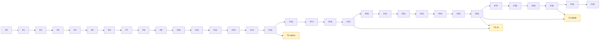
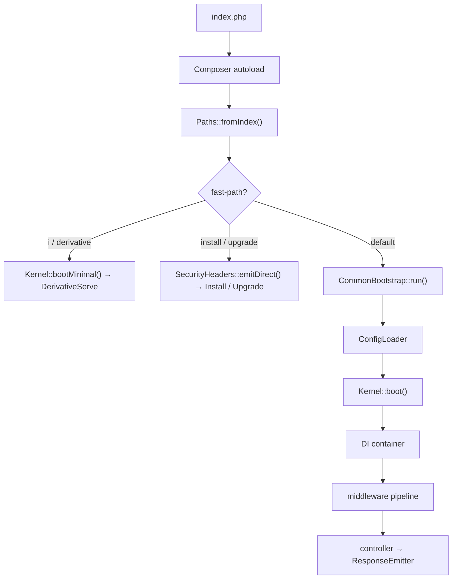
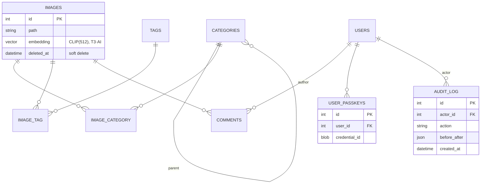
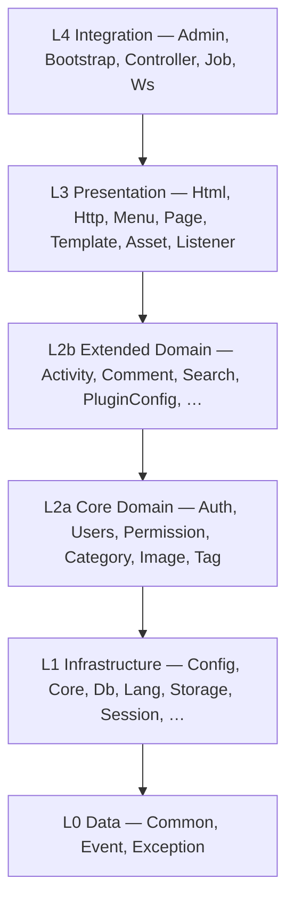

# Plan: Replay `16.x-rewrite` as a clean, tested branch

## Executive summary

Rebuild Piwigo on a fresh `17.x-rewrite` branch cut from `origin/16.x`, replaying the
proven modernization of `16.x-rewrite` in **33 strictly-sequential backbone phases (P0–P32)**
(grouped in 9 epochs A–I), plus cuttable greenfield tracks, with
tests landing alongside each phase and **every commit green**. The effort is
**dual-purpose**: a *replay* of work that already has a reference implementation, and a
*greenfield* modernization that adds net-new capabilities (`16.x-rewrite` has no
counterpart for them).

- **Arc (epochs A–I):** A Foundation/tooling (P0–P4) → B Composer/Rector/PHPStan + PSR-4
  (P5–P6) → C kernel/DI/HTTP (P7–P12) → D config/DB/language (P13–P16) → E service layer
  (P17–P23) → F frontend (P24–P25) → G REST/OpenAPI + types (P26–P27) → H security +
  templates/CSS (P28–P30) → I plugins/layering/repo-restructure (P31–P32). Cuttable
  greenfield (web platform, AI, riders) rides in the T3 tracks.
- **Working rule:** no change lands unless all CI gates pass **on a clean checkout** — CI, not a
  local worktree, is the source of truth for "green" (local `vendor/`/classmap drift is not a
  regression); tool baselines **ratchet** (issue counts may only go down). Local WIP may be
  rebased/squashed before landing, but cleanup **folds a fix into the commit that caused it** — a
  later "resolve N failures" commit is a smell, not a milestone, and means a red commit was landed.
- **Additive-only foundation (tests before refactors):** phases P0–P1 install tooling and record
  baselines but **must not modify existing first-party code**. The first code-modifying pass — ECS
  `--fix`, any Rector apply, vendor swaps — is gated on the **P2 regression harness (browser E2E +
  contract) being green** against pristine `origin/16.x`, so a mis-behaving fixer is caught, not
  shipped blind. (Corollary: the whole-codebase ECS reformat is P5 step 11, not P0.)
- **Read this first:** the four [key product decisions](#key-product-decisions) and the
  [REPLAY vs GREENFIELD + tier](#replay-vs-greenfield-and-priority-tiers) convention frame
  every item below.

## Table of contents

- [Executive summary](#executive-summary)
- [Conventions and key decisions](#conventions-and-key-decisions)
- [Glossary](#glossary)
- [Documentation deliverables](#documentation-deliverables)
- [Context](#context) — baselines, current gate status, gate targets after P0
- [Test framework](#test-framework)
- [Phase sequence](#phase-sequence)
- [Security: threat model and master checklist](#security-item-master-checklist)
- [Phase breakdown](#phase-breakdown) — P0–P32 + [Greenfield tracks](#greenfield-tracks) (use the Phase-sequence table as the index)
- [What changes from the original branch](#what-changes-from-the-original-branch)
- [Execution approach](#execution-approach)
- [Rollback and risk management](#rollback-and-risk-management)
- [MySQL infrastructure notes](#mysql-infrastructure-notes-8097-migration-awareness)
- [Performance considerations](#performance-considerations)
- [Migration path](#migration-path)
- [Verification (final state)](#verification-final-state)
- [Architecture Decision Records](#architecture-decision-records)
- [Plan manifest and traceability](#plan-manifest-and-traceability)

## Conventions and key decisions

### Key product decisions

1. **Clean fork — no *in-place upgrade* from upstream Piwigo.** Existing installs cannot be
   upgraded in place into `17.x`; instead a one-way **`import:legacy`** tool migrates their data
   into a fresh v17 install ([ADR-0025]). Version-to-version upgrades *within* the fork use
   Doctrine Migrations (P14). This is deliberate and shapes the entire plan —
   see [Migration path](#migration-path).
2. **Dual-purpose: replay + greenfield.** `16.x-rewrite` is the design/target reference for
   everything that is a *replay*; net-new features are built fresh. Each item is tagged by
   **Kind** (below).
3. **Bleeding-edge runtime, hard-required.** PHP 8.5, MySQL 9.7 (with MariaDB 12.x /
   PostgreSQL 18 in the provider matrix), Node 24. There is **no** lower-version floor and
   **no** capability-gating — features that need a specific server version require it. MySQL
   9.x is an *Innovation* (non-LTS) release line; this is an accepted risk (see the
   [risk register](#rollback-and-risk-management)). Versions verified 2026-05-31; re-verify
   at execution time.
4. **Every *landed* commit green; baselines ratchet.** From P0, CI gates — run on a clean
   checkout — block regressions and tool issue-counts may only decrease. Local WIP may be
   rebased/squashed before landing, but the cleanup must fold each fix into the commit that
   caused it; never land a red commit followed by a separate repair.

### Replay vs greenfield, and priority tiers

Each work item carries two independent attributes:

- **Kind** — **REPLAY**: a reference implementation exists on `16.x-rewrite`; reproduce it
  (lower risk). **GREENFIELD**: net-new, no reference; needs a short design step (ADR or
  design note) *before* tests and implementation (higher risk). In the
  [What changes](#what-changes-from-the-original-branch) matrix, a non-empty
  "`16.x-rewrite` (original)" cell ⇒ REPLAY; "None"/"n/a" ⇒ GREENFIELD.
- **Tier** — **T1 Core-parity** (required to match `16.x-rewrite` behaviour),
  **T2 Modernization** (clear-ROI infra/quality: Doctrine, Latte, Vite, security headers,
  CI), **T3 Stretch** (net-new, **cuttable** without blocking a release). On overrun, T3 is
  dropped first. The T3 set is listed under
  [What changes](#what-changes-from-the-original-branch).

Each phase header states its dominant **Tier**, its **Depends on**, and a **Greenfield delta**
(which of its tasks are net-new).

### Code snippets and reference blocks

Code, SQL DDL and YAML throughout this plan — and especially the
`#### Reference implementation (16.x-rewrite)` blocks — are **illustrative**. They capture
*shape and design intent* (signatures, the CSP policy, rate limits, table columns, the
namespace tree), not authoritative source. **The source of truth is the code on the
`16.x-rewrite` branch**; method bodies and exact DDL will drift and must not be
copy-pasted — reproduce behaviour, not bytes (no `git checkout` / `cherry-pick`; see
[Execution approach](#execution-approach)).

## Glossary

| Term | Meaning |
| --- | --- |
| **REPLAY / GREENFIELD** | Item has / lacks a `16.x-rewrite` reference implementation (above). |
| **T1 / T2 / T3** | Priority tier: core-parity / modernization / cuttable stretch (above). |
| **Gate** | A CI check that must pass for a commit to land (PHPStan, Pest, ECS, …). |
| **Ratchet** | A baseline issue-count that CI only lets decrease, never increase. |
| **Baseline** | The recorded issue count / suppression set for a tool against legacy code. |
| **Reference branch / worktree** | `16.x-rewrite`, checked out at `../piwigo16-rewrite`; a read-only design target, never merged or cherry-picked. |
| **SCC** | Strongly-connected component — the 49-namespace import cycle driven out in P32 (ratcheted down from P17). |
| **SEC-NN** | A globally-unique security-hardening item (see the master checklist). |
| **`bootMinimal`** | The kernel fast-path that serves image derivatives without the full pipeline. |
| **MPA** | Multi-page app — the server renders a full HTML page per URL (vs a SPA's one shell + client-side routing). |
| **Fat island** | A mounted Lit component tree (with signals) for one app-like screen — a contained mini-app inside a server-rendered page, not a whole-app SPA. |

## Documentation deliverables

`docs/PLAN-REPLAY.md` (this file) is the only plan doc present on `17.x-rewrite` today.
Every other doc referenced below is a **deliverable created in the phase shown** — until
then the reference is forward-looking, not dangling.

| Doc | Created in | Status |
| --- | --- | --- |
| `docs/DEVELOPMENT.md` | P0 | created (P0) |
| `docs/ARCHITECTURE.md` | P6 (extended P7–P23, P27, P32) | created (P6) |
| `docs/CONFIG.md` | P13 | created (P17–P23 gap-closure) |
| `docs/FRONTEND.md` | P24 (extended P29–P30) | planned |
| `docs/API.md` (REST) | P26 | planned |
| `docs/SECURITY.md` | P28 | planned |
| `docs/PLUGINS.md`, `docs/EVENTS.md` | P31 | planned |
| `docs/DEPLOYMENT.md` | P4 / P10 | created (P4) |
| `docs/schemas/plugin.schema.json`, `theme.schema.json` | P31 | planned |
| `docs/STRUCTURE.md` | P32 | planned |
| `docs/STRUCTURE-PLAN.md` | — | **exists on the `16.x-rewrite` reference branch** (P32 source) |
| `docs/PRIVACY.md` | P17–P23 (backend), P26/P29 (REST + UI exposure) | planned — see note below |
| `docs/AI.md` | T3·AI | planned |
| `docs/adr/` (+ `0000-template.md`) | P0 (**hard gate**); new ADRs added per phase | created (P0) |
| `docs/plan/manifest.yaml` | P0 (**hard gate**) | created (P0) |
| `tools/plan-lint` | P0 (minimal: asserts every phase commit maps to a manifest step) | created (P0) |
| `tests/Load/` (k6) | P29 (perf budgets) — *moved from P0; no load surface exists until then* | planned |

This table was a frozen, pre-P0 snapshot until now (`docs/PLAN-REPLAY-AUDIT.md` finding #10) —
6 rows were marked `planned` despite the file already existing and being actively used/CI-wired.
**`docs/PRIVACY.md` is a different kind of gap, not just a missing file:** its "Created in"
column names P17–P23, but the doc's own GDPR/privacy-tooling section (`PrivacyService`, SEC-56)
says the service is "exposed as REST endpoints (`/api/v1`, P26) + a user/admin UI (P29)" — and
`PrivacyService` itself doesn't exist anywhere in the codebase yet. Writing this doc before that
service is built would document a feature that isn't real; it stays `planned` until the backend
lands (P17–P23-shaped work, but not yet done) and its full scope isn't documentable until P26/P29
exist too.

**Plan self-enforcement (P0 hard gates).** The plan is only worth its guarantees if it enforces
itself; three cheap mechanisms make drift *visible* instead of silent, and are hard P0 gates (not
"nice to have"):

- **`docs/plan/manifest.yaml`** enumerates every phase's numbered steps with a
  `status: done | skipped(reason) | pending` field. A step may not be silently dropped or merged
  away — skipping requires an explicit `skipped(reason)`. This is what stops a mid-phase step (e.g.
  a Rector pass) from vanishing when adjacent steps are combined.
- **commitlint `scope-enum`** restricts every commit scope to a phase tag (`p0`…`p32`); a fix to an
  already-landed phase keeps that phase's tag (e.g. `fix(p2):`). Bare/untagged scopes are rejected,
  so every commit is attributable to a phase.
- **CI on a clean checkout** is the sole definition of "green" (see the Working rule); `docs/RUNBOOK.md`
  documents the one-command bootstrap (`composer install && composer dump-autoload
  --classmap-authoritative`, `bun install`) so the gate is reproducible off any fresh worktree — a
  green claim that can't be reproduced from a clean checkout does not count.

  **A commit's `(pN)` scope is attributable to *a* phase, not necessarily the phase whose numbered
  steps the work matches** (`docs/PLAN-REPLAY-AUDIT.md` finding #11): a full `git log` shows every
  tag P0–P22 tracking this doc's own phase numbers with plausible small counts, but `(p23)` and
  `(p24)` both ballooned into catch-all buckets for gap-closure/legacy-coupling-retirement work
  that matches this doc's P23/P27 *content*, not its literal P24 ("Vite + TypeScript conversion",
  separately real and still unbuilt as of this note). Trust the commit-tag ↔ doc-phase mapping for
  P0–P22; for anything tagged `(p23)`/`(p24)`, read the commit/phase content against evidence
  before assuming the tag names the actual phase being worked.

## Context

`origin/16.x` is legacy Piwigo: no Composer, no tests, no TypeScript, no PSR-4,
vendored Smarty/PHPMailer in `include/`, MyISAM everywhere, zero CI.

`16.x-rewrite` is 2023 commits ahead with full modernization, but the commit
history averages 27 era-switches per 100 commits — CSS interleaved with Latte
interleaved with WS refactoring interleaved with PHPStan fixes. Core files like
`config/container.php` (194 touches) and `include/functions.inc.php` (97 touches)
were modified continuously across the entire timeline.

**Goal:** New branch `17.x-rewrite` from `origin/16.x`. Replay in clean phases.
Tests accompany each phase. Every commit green.

**Dual purpose.** This is a *second* clean attempt: the prior phased replay landed on
`16.x-v2`, which broke its `just test` harness and accumulated bugs (see the `16.x-v2`
lesson-learned notes below) and is being abandoned. The plan is at the same time a
**greenfield modernization** — many items (soft deletes, WebAuthn, ThumbHash, VECTOR
similarity search, outbound webhooks, tus uploads, the T3·WEB PWA set,
etc.) are net-new and **not present in `16.x-rewrite`**; they are built fresh by design,
not replayed. `16.x-rewrite` remains the design/target reference for everything that
*is* a replay.

### Codebase baselines (verified 2026-05-24)

| Metric               | origin/16.x              | 16.x-rewrite                                               |
| -------------------- | ------------------------ | ---------------------------------------------------------- |
| PHP files            | 947                      | 894 in `src/Piwigo/`                                       |
| JS files             | 333                      | 115 TS (82 authored)                                       |
| Templates            | 140 `.tpl` (Smarty)      | 133 `.latte` (3 more in test fixtures)                     |
| CSS files            | 83                       | 101                                                        |
| DB tables            | 34 (MyISAM)              | 41 (InnoDB + utf8mb4)                                      |
| Config keys          | 189                      | 277 SCHEMA entries                                         |
| Namespaces           | 0                        | 53 under `src/Piwigo/`                                     |
| Procedural functions | 664 across 31 files      | 1 (`resolve()` in Core/)                                   |
| jQuery refs          | 2752                     | 0                                                          |
| `define()` constants | 52                       | 0 in src/                                                  |
| Tests                | 0                        | 1122 unit + 153 integration (899 methods × data providers) |
| PHPStan              | n/a                      | Level 10, 0 errors                                         |
| Admin themes         | 3 (`clear/default/roma`) | 3 (`_base/dark/light`)                                     |
| Admin pages          | 62 PHP files             | 9 controllers                                              |
| Frontend controllers | 0 (inline PHP)           | 21 controllers                                             |
| WS handlers          | procedural               | 94 handler files + 83 Params + 7 Results                   |
| Container services   | 0                        | 129 services (autowire default; explicit entries for interfaces) |
| Repositories         | 0                        | 37                                                         |
| Middleware           | 0                        | 8                                                          |
| Routes               | 0                        | 37                                                         |
| Events               | 0                        | 157 PSR-14 classes                                         |
| Enums                | 0                        | 31                                                         |
| Value Objects        | 0                        | 21                                                         |
| Vite entries         | 0                        | 68                                                         |
| `!important`         | 720                      | 4                                                          |
| `die()` calls        | 300 (all first-party)    | 0                                                          |
| Upgrade scripts      | 23                       | 0 (mechanism undefined)                                    |
| Language files       | 324 `.lang.php`          | 322 `.po`                                                  |

**Branch diff:** 1549 deleted, 2271 added, 104 modified, 208 renamed = 4132 files,
527K insertions, 434K deletions.

### Current gate status (reference branch `16.x-rewrite`)

| Gate                 | Status                                             |
| -------------------- | -------------------------------------------------- |
| Unit tests (PHPUnit) | 1122/1122                                          |
| Integration tests    | 153/153                                            |
| E2E Pest browser     | 51/51 (3 skipped)                                  |
| PHPStan L10          | 0 errors                                           |
| ECS                  | clean                                              |
| TypeScript           | clean                                              |
| Vite build           | 68 entries, 541ms                                  |
| Stylelint            | 0 errors, 7 warnings                               |
| Psalm                | 0 errors, 1787 info-level, 98.1% inference         |
| Rector               | 94 cosmetic diffs (2 rules: arrow fn return types) |
| ESLint               | 0 errors, 9 warnings (`no-console` in CLI script)  |

### Gate targets after P0

Branch: `17.x-rewrite` — based on `origin/16.x` @ `54bdc4e21`

| Gate                   | Target            | Notes                                                                                |
| ---------------------- | ----------------- | ------------------------------------------------------------------------------------ |
| Pest unit + arch       | 3/3 passed        | SmokeTest, StructuralTest                                                            |
| Pest integration       | 2/2 passed        | InstallChainTest, GallerySmokeTest                                                   |
| Pest contract (WS API) | 93/93 passed      | 21 `Ws*Test` classes (+ 1 `ContractTestCase` base) covering all testable WS methods; 29 JSON schemas (flat under `tests/Contract/schemas/`, no `v1/` subdir — the WS API never gets a v2, it's removed outright at P26) |
| Pest browser E2E       | 48/48 passed      | 15 files; visual-regression, 32 baselines (`tests/Browser/VisualRegressionTest.php`'s 30 routes + 2 explicit tests). Reference branch is 51/51 (3 skipped) — see note below |
| PHPStan                | L0, 0 errors      | Full codebase scanned; baseline in `phpstan-baseline.neon`                           |
| ECS                    | installed         | Configured, **not** applied; codebase reformat + ECS gate deferred to P5 (after the P2 harness)  |
| Rector                 | dry-run recorded  | Pending count recorded; NO rules applied until P5                                    |
| Psalm                  | 0 errors          | Pest-internal noise baselined in `psalm-baseline.xml`                                |
| Vitest                 | 2/2 passed        | `tests/Unit/smoke.test.ts`                                                           |
| ESLint                 | 0 errors          | Full codebase scanned; legacy violations in `eslint-suppressions.json` baseline      |
| Stylelint              | 0 errors          | Legacy CSS paths excluded until P30                                                 |
| Vite build             | ✓                 | Placeholder `build/noop.ts` entry; 68 real entries in P24                          |
| ComposerRequireChecker | 0 errors          | All used packages declared in `composer.json`                                        |
| ComposerUnused         | 0 unused          | No orphaned `require`/`require-dev` entries                                          |
| knip                   | 0 unused          | No unused JS/TS files, exports, or dependencies                                     |
| Deptrac                | n/a until P6      | Layer config (`deptrac.yaml`) added when PSR-4 namespaces exist                      |
| Lighthouse CI          | baseline recorded | Performance + a11y scores recorded; budget gates tighten in P29                       |
| actionlint             | 0 errors          | All GitHub Actions workflow files valid                                               |
| commitlint             | 0 errors          | All commits follow conventional commit format                                        |
| size-limit             | n/a until P24   | Placeholder config; real budgets set when Vite entries are real                       |
| PHPBench               | n/a until P7      | Benchmark suite starts when kernel exists                                            |
| `just test`            | **all suites**    | Verified: chains `analyse` (PHPStan only from mid-P5 — Psalm paused, see `docs/adr/0026-pause-psalm-gating.md`), `require-checker`, `unused` (composer-unused+knip), every Pest suite (`test-php`/`-integration`/`-contract`/`-browser`/`-visual`), and `test-js` (Vitest) via the justfile's dependency list, with ECS non-blocking (last, `-` prefix) — counts match each recipe's individual run |

> **E2E count reconciliation.** The reference branch reports **51/51 (3 skipped)**; the
> `17.x` target is **48/48 (0 skipped)**. The 3 skipped specs need Pest-browser features
> that don't exist yet (multi-tab, network interception, dialog handling); they are filed
> upstream and tracked, not lost. The 48 are the runnable remainder — no coverage is
> dropped, only the 3 known-unsupported cases.

---

## Test framework

Pest 4 (v4.7.0) replaces PHPUnit as the PHP test harness and provides
browser E2E via `pest-plugin-browser`:

- **Unit/Integration:** Pest 4 runs PHP tests natively (IS PHPUnit under the hood)
- **Browser E2E:** `pestphp/pest-plugin-browser` v4.3.1 wraps Playwright's server
  via WebSocket — same Chromium engine, PHP test syntax. Known gaps: no multi-tab,
  no network interception, no dialog handling. If a specific test truly can't be
  written in Pest browser, skip it with `->skip('requires multi-tab support')` and
  file an upstream issue. Don't maintain a second framework for edge cases.
- **Architecture:** `pestphp/pest-plugin-arch` v4 — structural rules
- **Mutation:** `pestphp/pest-plugin-mutate` v4
- **Type coverage:** `pestphp/pest-plugin-type-coverage` v4

**Exception:** Vitest stays for TypeScript unit tests (Pest can't test TS logic).

### PHP error log verification

Every test must verify that no PHP errors/warnings/notices were emitted during
execution. Two complementary mechanisms:

**1. Test-mode error-drain route (`GET /__test/errors`)** — for HTTP integration
tests (`RestApiTest`) and E2E. A TestMode-gated internal route (available only when
`TestMode::isActive()`) that returns all PHP errors collected by `ErrorCollector` since the
last drain, then clears the buffer.

`ErrorCollector` already captures errors in a static array via `set_error_handler()`. Add
`ErrorCollector::drain(): array` that returns and clears the buffer. Register the
TestMode-gated `GET /__test/errors` route that calls `drain()`. Integration tests call it
after each HTTP request:

```php
protected function assertNoPhpErrors(): void {
    $data = $this->getJson('/__test/errors');
    self::assertEmpty($data['result'], 'PHP errors during request: ' . json_encode($data['result']));
}
```

Works with parallel workers — each worker's `X-Piwigo-Env: test-w<N>` header
routes to a separate PHP process, so `ErrorCollector`'s static array is
per-worker.

**2. Dedicated error log file** — for unit/integration tests that boot the
kernel in-process (not via HTTP). When `TestMode::isActive()`,
`ErrorCollector` additionally writes to `_data/logs/test_errors.log`.
`IntegrationTestCase` truncates it in `setUp()` and asserts empty in
`tearDown()`:

```php
protected function setUp(): void {
    file_put_contents($this->errorLogPath, '');
}
protected function tearDown(): void {
    $errors = file_get_contents($this->errorLogPath);
    self::assertEmpty($errors, "PHP errors logged:\n" . $errors);
}
```

The drain endpoint lands in P17–P23 (when `ErrorCollector` and WS infrastructure
exist). The error log file mechanism can be wired in P0 since `ErrorCollector`
is a standalone class.

---

## Phase sequence

All phases are strictly sequential — one active concern at a time. Each row in the table below is
a first-class, independently-gated commit unit; epochs (**bold**) are navigation grouping only.

| Phase | Name | Scope |
| ----- | ---- | ----- |
| **A — Foundation & tooling** (bare `origin/16.x`) | | |
| P0 | PHP tooling + baselines | Pest, PHPStan, Psalm, ECS, Rector install + baselines |
| P1 | Frontend tooling + baselines | bun, Vite, TS, ESLint, Stylelint, Vitest, knip + baselines |
| P2 | Test harness | env/install split, fixtures, browser-E2E + WS contract suites |
| P3 | CI pipeline | `ci.yml` all jobs, matrix, caching, actionlint, commitlint |
| P4 | Containerization | multi-stage Dockerfile, compose, devcontainer, health probes |
| **B — Language modernization** | | |
| P5 | Composer + Rector + PHPStan | vendor swaps, Rector safe sets, L0→L10 |
| P6 | PSR-4 | ~51 class extractions, namespacing, `deptrac.yaml` baseline |
| **C — Kernel & HTTP** | | |
| P7 | Kernel + boot skeleton | `Kernel`, `CommonBootstrap`, `index.php`, worker loop |
| P8 | DI container | `Container`, `config/container.php`, autowire default |
| P9 | PSR-15 middleware + routing | 8 middleware, pipeline, routes, extensible `SecurityHeadersMiddleware` |
| P10 | Observability | Monolog channels, Server-Timing, OTel/Sentry |
| P11 | Cache + session + messenger | `symfony/cache` pools, session handler, messenger, `opcache.preload` |
| P12 | CLI + backup/restore | `bin/piwigo`, backup/restore, graceful shutdown, PHPBench |
| **D — Config, data, language** | | |
| P13 | Config service | 277 SCHEMA, `ConfigLoader`, typed accessors |
| P14 | DB layer + Doctrine ORM | DBAL/EntityManager, entities, custom types, repositories |
| P15 | Schema migration + multi-provider | engine/charset, FKs + orphan cleanup, type norm, 7 new tables, MySQL/MariaDB/PG |
| P16 | Typed facades + constants + language | `Paths`/`CurrentUser`/`PageState`, retire 52 `define()`, `.po` migration |
| **E — Service layer** | | |
| P17 | Domain tier 1 | URL, Cookie, Session, HTML, Storage, Csrf, Permalink, Site, Feed |
| P18 | Domain tier 2 | Mail, Filter, User, Auth, Tag, Comment, Rate, Group, Caddie, History, Activity |
| P19 | Domain tier 3 | Category, Search, Image, Calendar, Notification, Metadata, Telemetry, Validation, Common |
| P20 | Domain tier 4 | Page, Menu, PluginConfig, Section, Job |
| P21 | Admin controller migration | 62 admin pages → per-slug sub-controllers |
| P22 | Frontend controller migration | 21 frontend controllers (Smarty `$vars` seam) |
| P23 | Legacy deletion & cleanup | delete `include/`+`admin/`, bridges, `Tables`, cache tables |
| **F — Frontend** | | |
| P24 | Vite + TS conversion | entries, JS→TS, jQuery→0 |
| P25 | Inline-JS extraction + `any`→0 | `{footer_script}`→modules, `getPageData<T>`, bundle budgets |
| **G — API & types** | | |
| P26 | REST + OpenAPI | `/api/v1` (cover 94 legacy ops), OpenAPI-first; **legacy WS API deleted**; typed client |
| P27 | Type correctness + DTOs | REST request/response DTOs, mixed elimination |
| **H — Security & presentation** | | |
| P28 | Security hardening | Argon2id, CSRF, rate limiting, session fixation, CSP posture |
| P29 | Latte templates + assets | Smarty → Latte, ViteManifest, image elements, email/DKIM, a11y gate |
| P30 | CSS + Tailwind | theme restructure, tokens, splitting, Tailwind |
| **I — Extensibility & structure** | | |
| P31 | Plugin/theme contracts | 157 events, registries, decomposition wiring, 7 extensions |
| P32 | Layer decoupling + repo restructure | drive Deptrac residue → 0; web-root isolation, `public/` entry point |
| **T3 — Greenfield tracks** (cuttable; see [Greenfield tracks](#greenfield-tracks)) | | |
| T3·WEB | Web platform features | PWA, View Transitions, Speculation Rules, JSON-LD, SRI, OG, Web Share |
| T3·AI | AI, integrations & federation | NL/semantic search, auto-tagging, MCP server, ActivityPub |
| T3·* | Riders | CQRS, libvips/HEIC, vector/CLIP, tus, webhooks, Fibers, Mercure, passkeys, OIDC, soft-delete |
| **Adoption tooling** (T2, non-cuttable — outside the parity sequence) | | |
| Legacy import | Existing-Piwigo adoption | `bin/piwigo import:legacy` (old DB + files → v17; depends on P15 + P23) |

The **T3 greenfield tracks** are cuttable and land *after* the backbone phase they depend on is
green; they never gate a backbone commit (see [Greenfield tracks](#greenfield-tracks)).

The backbone is a strict linear chain P0→P32; the T3 tracks fan in from their dependency phase.



---

## Security item master checklist

### Threat model

Top-down view: attacker goals mapped to the bottom-up `SEC-NN` items that mitigate them, so
coverage gaps are visible. Every `SEC-NN` appears in at least one row (the two exceptions,
SEC-05 Brotli and SEC-06 `Cache-Control: immutable`, are performance items, not
mitigations — intentionally absent). Mitigations
that are *not* numbered items (nonce-based CSP, the PSR-18 SSRF guard, DB-level account
locking, dual passwords) are shown in *italics*. The **Verified by** column names the
gate/test that keeps each mitigation shipped.

| Threat (attacker goal) | Mitigations | Verified by |
| --- | --- | --- |
| Anonymous reads a private album's originals/derivatives | SEC-33, SEC-35, SEC-38, SEC-47; *P32 web-root isolation* | derivative/permission integration tests (P19/P28); isolation gate (P32) |
| Stored XSS via uploaded SVG or HTML descriptions | SEC-20, SEC-21, SEC-48 | upload-sanitization tests (P19/P29) |
| Script injection / XSS execution | *nonce-based CSP* (P28), SEC-45, SEC-62 (Trusted Types); `lint:no-inline-scripts` | CSP-header + Trusted-Types integration tests + no-inline-scripts lint (P28) |
| Credential brute force | SEC-41, SEC-44; *LoginThrottle*, *DB `FAILED_LOGIN_ATTEMPTS`* | rate-limit + throttle integration tests (P28) |
| Account enumeration via registration | SEC-31 | registration integration test (P18) |
| CSRF on state-changing actions | SEC-11, SEC-12, SEC-42 | CSRF middleware integration tests (P9/P28) |
| Session hijacking / fixation | SEC-13, SEC-14, SEC-25, SEC-27, SEC-28 | cookie-attribute + session-regen tests (P18/P28) |
| SQL injection | SEC-08, SEC-18, SEC-40; *Doctrine DBAL parameterization* | SearchService unit + REST contract tests (P19/P26) |
| Command / code injection | SEC-15, SEC-16, SEC-49 | no-eval/exec grep gate + unit tests (P20/P31) |
| Open redirect / host-header poisoning | SEC-17, SEC-29 | redirect + host-header integration tests (P17) |
| Local file inclusion via locale | SEC-26 | LangService unit test (P16) |
| SSRF via remote fetch | SEC-23, SEC-24; *PSR-18 SSRF guard* | fetchRemote unit tests with blocked targets (P17) |
| Information disclosure (errors / debug output) | SEC-22, SEC-30, SEC-36, SEC-37 | error-path integration tests (P21/P26) |
| Weak randomness in tokens | SEC-07 | ECS `RandomApiMigrationFixer` + no-`mt_rand` grep (P5) |
| Secrets leaking into stack traces / logs | SEC-09; *`secret_key` handling (below)* | inspection + logged-context unit test (P18) |
| Missing input validation (mass assignment, type confusion) | SEC-10, SEC-19, SEC-39, SEC-40 | Request-DTO validation tests (P27) |
| DoS (zip bomb, unbounded API/queries) | SEC-32, SEC-44, SEC-65 (Idempotency-Key replay store); *`connection_memory_limit`, resource groups* | zip-bomb unit test + rate-limit + idempotency-replay tests (P20/P26/P28) |
| Clickjacking / cross-origin leakage / CORS overexposure | SEC-39, SEC-43, SEC-46, SEC-63 (Fetch Metadata); *X-Frame-Options / frame-ancestors* | security-headers + Fetch-Metadata integration tests (P28) |
| Sensitive files served over HTTP | SEC-01, SEC-02, SEC-03, SEC-04; *P32 isolation* | `.htaccess` deny E2E (P4); isolation gate (P32) |
| Re-install / setup abuse | SEC-34 | install E2E (P22) |
| Shared cache serves logged-in content to anon (or vice-versa) | SEC-47 | `Vary` / `Cache-Control` header tests (P28) |
| Supply-chain compromise (malicious / CVE dependency) | SEC-50, SEC-51, SEC-52, SEC-64 (OpenSSF Scorecard); *roave/security-advisories, composer/bun audit, Renovate* | CI `audit` + SBOM + Scorecard jobs (P3) |
| Tampered build / unsigned release artifact | SEC-53, SEC-54; *SLSA provenance* | CI provenance (P3) + cosign keyless sign + verify gate (P4) |
| Federated-identity attack (token replay, IdP spoof, code interception) | SEC-55 | OIDC tests: PKCE, state/nonce, ID-token signature (P28) |
| Privacy / data-subject abuse (mass export, erasure griefing) | SEC-56 | data-subject endpoint tests: re-auth + rate limit (P18/P28) |
| Audit-log tampering / repudiation | SEC-57 | append-only + hash-chain verification test (P15/P18) |
| Unauthorized feature-flag change | SEC-58 | flag-service authz + audit tests (P11) |
| AI-surface abuse (MCP leaks private data / unbounded calls) | SEC-59 | MCP auth-scope + permission tests + rate limit (T3·AI) |
| Cross-request state bleed (worker mode serves user A's data to B) | SEC-60 | worker-isolation arch test + integration: fresh request scope, no static mutation (P7) |
| Realtime topic leak (private-album update pushed to an unauthorized subscriber) | SEC-61 | Mercure JWT topic-authz tests (P11) |

### Master checklist

Every security-hardening item has a globally unique `SEC-NN` ID. Items are
described in detail within their implementing phase's "Security hardening"
subsection. This table is the master index.

| ID | Phase | Item |
| --- | --- | --- |
| SEC-01 | P4 | `.htaccess` deny rules for sensitive directories |
| SEC-02 | P0 | CLI guards on all `tools/*.php` scripts |
| SEC-03 | P2 | No fixture SQL with secrets in web root |
| SEC-04 | P4 | Ship `robots.txt` |
| SEC-05 | P4 | Brotli compression |
| SEC-06 | P4 | `Cache-Control: immutable` for hashed assets |
| SEC-07 | P5 | Replace `mt_rand()` with `random_int()` |
| SEC-08 | P5 (applied P17–P23) | Replace loose `==` with `===` (manual, per-domain) |
| SEC-09 | P5 | `#[\SensitiveParameter]` on secret-carrying params |
| SEC-10 | P9→P17–P23 | Remove `addslashes()` superglobal sanitization (deferred to service migration) |
| SEC-11 | P9 | CSRF token md5→sha256 HMAC |
| SEC-12 | P9 | CSRF verification via `hash_equals()` |
| SEC-13 | P9 | `CookieService` HttpOnly + Secure flags |
| SEC-14 | P9 | Cookie deletion calls include all flags |
| SEC-15 | P20 | Eliminate 2 of 3 `eval()` calls (third = SEC-49) |
| SEC-16 | P19 | Wrap `exec()` calls with `escapeshellarg()` |
| SEC-17 | P17 | URL validation in `RedirectResponder::redirect()` |
| SEC-18 | P19 | Replace `addslashes()` in `SearchService` with prepared statements |
| SEC-19 | P21–P22 | Controllers use PSR-7 request, not superglobals |
| SEC-20 | P19 | XXE protection on SVG/XML parsing |
| SEC-21 | P19 | SVG stored XSS sanitization on upload |
| SEC-22 | P21 | Replace `phpinfo()` with curated server info |
| SEC-23 | P17 | SSRF hardening for `fetchRemote()` |
| SEC-24 | P17 | Remove local-file read fallback in `fetchRemote()` |
| SEC-25 | P18 | Session fixation: regenerate on privilege escalation (verified P28) |
| SEC-26 | P16 | Validate locale before `include` in `LangService` |
| SEC-27 | P18 | Auto-login key HMAC sha1→sha256 + `hash_equals()` |
| SEC-28 | P18 | `EphemeralKeyService` HMAC md5→sha256 + `hash_equals()` |
| SEC-29 | P17 | Host header poisoning defense |
| SEC-30 | P17–P22 | `PiwigoException` messages don't expose internals |
| SEC-31 | P18 | Account enumeration via registration |
| SEC-32 | P20 | ZIP bomb protection in `ZipExtractor` |
| SEC-33 | P19 | Derivative serving leaks file existence |
| SEC-34 | P22 | Install sentinel DB-flag secondary check |
| SEC-35 | P19 | Remove non-standard headers from derivative pipeline |
| SEC-36 | P26 | REST error responses never leak internals (folds into SEC-30; legacy `PwgServer` deleted with WS) |
| SEC-37 | P26 | No object dumps in the REST error path (folds into SEC-30; `PwgServer` deleted) |
| SEC-38 | P26 | REST route authorization — explicit `adminOnly` vs `requiresAuth` middleware |
| SEC-39 | P26 | Validate `Content-Type: application/json` on REST request bodies |
| SEC-40 | P27 | Request DTOs as a hard input-validation security gate |
| SEC-41 | P28 | Password hashing `PASSWORD_BCRYPT`→`PASSWORD_DEFAULT` (Argon2id) |
| SEC-42 | P28 | CSRF middleware: remove `/admin*` exemption |
| SEC-43 | P28 | No `Access-Control-Allow-Origin: *` on the REST OpenAPI spec endpoint |
| SEC-44 | P28 | API rate limiting + rate-limit headers |
| SEC-45 | P28 | CSP violation reporting (`report-to` → `/csp-report`) |
| SEC-46 | P28 | Cross-Origin Isolation (COOP/COEP) |
| SEC-47 | P28 | `Vary: Cookie` on permission-dependent responses |
| SEC-48 | P29 | Default `allow_html_descriptions` to `false` |
| SEC-49 | P31 | Remove `eval_visible` (plugin-facing half of SEC-15) |
| SEC-50 | P3 | CycloneDX SBOM generated as a CI artifact |
| SEC-51 | P3 | Pin GitHub Actions to commit SHAs |
| SEC-52 | P3 | OSV-Scanner over `composer.lock` + `bun.lock` in CI |
| SEC-53 | P3 | SLSA build provenance + attestations |
| SEC-54 | P4 | Sign container images + release artifacts (cosign/sigstore) |
| SEC-55 | P28 | OIDC SSO: PKCE + state/nonce + ID-token validation |
| SEC-56 | P18 | GDPR data-subject endpoints behind re-auth + rate limit |
| SEC-57 | P15 | Append-only / tamper-evident audit log (PII-aware) |
| SEC-58 | P11 | Feature-flag changes authz-gated + audited |
| SEC-59 | T3·AI | MCP server: scoped read-only tokens, permission-aware |
| SEC-60 | P7 | Worker-mode request isolation — no global/static state bleed between requests |
| SEC-61 | P11 | Mercure topic authorization — JWT-scoped subscriptions; private updates only to authorized subscribers |
| SEC-62 | P28 | Trusted Types — `require-trusted-types-for 'script'` + default TS policy (report-only → enforce) |
| SEC-63 | P28 | Fetch Metadata isolation — `ResourceIsolationMiddleware` rejects illegitimate cross-site `Sec-Fetch-*` |
| SEC-64 | P3 | OpenSSF Scorecard — repo security-posture scoring in CI |
| SEC-65 | P26 | API `Idempotency-Key` replay store — bounded TTL, abuse-safe (no unbounded growth) |

### Secrets & key management

- **Where secrets live.** DB credentials and the application `secret_key` live in `.env`,
  which is never web-served (SEC-01 denies it; SEC-03 keeps fixtures out of the web root;
  P32 moves `.env` outside `public/` entirely). No secret is committed to git.
- **`secret_key` blast radius.** A single `secret_key` derives the HMACs for CSRF tokens
  (SEC-11/12), the auto-login cookie (SEC-27) and ephemeral keys (SEC-28). **Rotating it
  invalidates all three at once** — every active session's CSRF token, every remember-me
  cookie, and every outstanding password-reset/ephemeral key. `docs/SECURITY.md` documents
  the rotation procedure and its forced-re-login consequence; rotate on suspected compromise.
- **DB password rotation** is zero-downtime via MySQL dual passwords (P28): `ALTER USER …
  RETAIN CURRENT PASSWORD`, roll `.env` across app servers, then `DISCARD OLD PASSWORD`.
- **Platform secret stores (optional).** Deployments that support it may source `.env`
  values from Docker/K8s secrets or systemd `LoadCredential` instead of a file on disk.
  Out of scope for the default install; noted for `docs/DEPLOYMENT.md`.

---

## Phase breakdown

### Epoch A — Foundation & tooling (P0–P4, on bare `origin/16.x`)

> **Epoch greenfield:** SBOM/OSV/Actions-SHA pinning (SEC-50–52), Renovate, release-please,
> lefthook, Lighthouse CI + `web-vitals`, knip, size-limit, commitlint, Docker multi-stage +
> devcontainer. **Replay:** Pest/Vitest/PHPStan/Psalm/ECS/Rector setup, fixtures, CI layout.

Install every tool up front. Most will report hundreds or thousands of issues
against the legacy codebase — expected. Each tool records its baseline issue
count. CI enforces ratchets: counts can only go down.

**The rule from here forward:** no code change lands without all CI gates green
(no regressions from committed baselines).

### P0 — PHP tooling + baselines

> **Tier** T2 · **Depends on** none (bare `origin/16.x`) · **Greenfield delta:** roave/security-advisories, Deptrac, PHPBench, ComposerRequireChecker/Unused. **Replay:** Pest/PHPStan/Psalm/ECS/Rector install + baselines.

1. `composer.json`: set `"require": { "php": "^8.5" }`, add `require-dev` deps
2. **Pest 4** + plugins: `pest` ^4, `pest-plugin-arch` ^4, `pest-plugin-mutate` ^4,
   `pest-plugin-type-coverage` ^4, `pest-plugin-browser` ^4
3. **pcov** for code coverage (`php8.5-pcov` via apt)
4. **ECS** (Easy Coding Standard, `ecs.php`) — **install and configure only.** Record a
   check-mode violation count (run `ecs` without `--fix`); do **not** reformat the codebase here.
   `ecs --fix` is a code-modifying pass over ~500 legacy files and is deferred to P5 step 11,
   once the P2 regression harness exists to catch a mis-behaving fixer (see the additive-only
   foundation rule). ECS is therefore not yet a blocking gate. Config from rewrite branch:
   `cleanCode`, `common`, `psr12` prepared sets (the installed `symplify/easy-coding-standard`
   ^13.1 marks the separate `symplify` prepared set `@deprecated` — "rules moved to the common
   sets" — so passing `common: true` alone is the complete, non-deprecated equivalent) +
   `DeclareStrictTypesFixer`, `LineEndingFixer`, `RandomApiMigrationFixer`,
   `SingleLineEmptyBodyFixer`.
   Skip `DeclareStrictTypesFixer` until P5 (after vendor removal).
   Skip `GeneralPhpdocAnnotationRemoveFixer`, `LineLengthFixer`,
   `ParamReturnAndVarTagMalformsFixer` (too aggressive on legacy docblocks).
5. **PHPStan** ^2.1 (`phpstan.neon`, `tools/phpstan-bootstrap.php`) — start at L0,
   scan full codebase, record baseline in `phpstan-baseline.neon`. 2.1 ships
   25-40% faster analysis and full PHP 8.5 support (`^2.0` allows it). Known issue:
   `include/pwgsession_php7.class.php` has 6 non-ignorable `tentativeReturnType`
   errors on `SessionHandlerInterface` methods (PHPStan cannot baseline these)
   — fix them directly (add `#[\ReturnTypeWillChange]` or proper return types)
6. **Psalm** (`psalm.xml`) — scan full codebase, record baseline in
   `psalm-baseline.xml`. Psalm catches different issues than PHPStan
   (inference depth, taint analysis, unused code). Both run from P0 onward.
7. **Rector** (`rector.php`) — dry-run scan, record pending count. Do NOT apply
   rules yet — see P5 Rector strategy
8. Bootstrap files: `phpunit.xml.dist`, `tests/Pest.php`, `tests/bootstrap.php`
9. Seed tests: `tests/Unit/SmokeTest.php`, `tests/Arch/StructuralTest.php`
10. **roave/security-advisories** (`require-dev` — `conflict`-only
    meta-package). Makes `composer update` fail if any installed package has a
    known CVE. Zero config, zero runtime overhead — it only adds `conflict`
    rules to `composer.lock` resolution.
11. **Deptrac** (`qossmic/deptrac` — `require-dev`). Architectural layer
    enforcement. Install now; layer config (`deptrac.yaml`) lands in P6 when
    PSR-4 namespaces exist. The 6-layer model (L0 Data → L4 Integration, with
    L2a/L2b domain split) from P32 is encoded as Deptrac layers + rulesets. Runs alongside
    `pest-plugin-arch` — Deptrac catches file-level import violations, Pest
    arch catches class-level structural rules.
12. **ComposerRequireChecker** (`maglnet/composer-require-checker` —
    `require-dev`). Finds code that uses classes/functions from packages not
    declared in `composer.json`. Catches "works on my machine" failures where
    a transitive dependency is used directly without being declared.
13. **ComposerUnused** (`icanhazstring/composer-unused` — `require-dev`).
    Finds `require`/`require-dev` entries that nothing actually imports. Keeps
    the dependency tree lean. Run after each vendor swap in P5.
14. **PHPBench** (`phpbench/phpbench` — `require-dev`, `tests/Bench/`
    directory). Benchmark critical paths (image derivative serving, WS
    dispatch, template rendering) with regression detection. Benchmarks
    start in P12 when the kernel exists; CI records results as artifacts for
    cross-commit comparison.

### P1 — Frontend tooling + baselines (bun + justfile)

> **Tier** T2 · **Depends on** P0 · **Greenfield delta:** knip, size-limit, commitlint, Lighthouse CI + `web-vitals`. **Replay:** bun/Vite/TS/ESLint/Stylelint/Vitest setup + baselines.

1. **bun** as package manager (`bun.lock`), **justfile** as task runner
2. `package.json`: all dev deps installed via `bun install`
3. **Vite** + `vite.config.ts` with `build/noop.ts` placeholder entry (68 real
   entries added in P24), **TypeScript** + `tsconfig.json` (`allowJs: true`)
4. **ESLint** + `eslint.config.ts` — scan full authored JS (exclude bundled
   third-party); record legacy violations in `eslint-suppressions.json` as
   ratchet baseline
5. **Prettier** + **Stylelint** — Stylelint scope limited to new CSS (legacy
   CSS paths excluded until P30)
6. **Vitest** + `vitest.config.ts` + `@vitest/coverage-v8` + `happy-dom`
7. `tests/Unit/smoke.test.ts`
8. **knip** (`knip` — `devDependencies`). Finds unused files, exports,
   dependencies, and types in the JS/TS codebase. The frontend equivalent of
   ComposerUnused. Run against full codebase from P0; tightens as TS
   conversion progresses in P24.
9. **size-limit** (`@size-limit/preset-app` + `@size-limit/file` —
   `devDependencies`, config in `.size-limit.json`). Bundle size budgets per
   Vite entry point. Placeholder config with `build/noop.ts` entry in P0;
   real budgets (68 entries) set in P25 when Vite entries are real.
10. **commitlint** (`@commitlint/cli` + `@commitlint/config-conventional` —
    `devDependencies`, config in `commitlint.config.ts`). Enforces
    conventional commit message format (`feat:`, `fix:`, `refactor:`, etc.)
    so changelogs can be auto-generated. Runs as a git `commit-msg` hook
    via a simple shell script in `.githooks/`.
10b. **lefthook** (`evilmartians/lefthook` — single Go binary, no Node
    dependency). Pre-commit hook runs ECS + ESLint on staged files only.
    Pre-push hook runs PHPStan + Psalm. Config in `lefthook.yml`:

    ```yaml
    pre-commit:
      commands:
        ecs:
          glob: "*.php"
          run: vendor/bin/ecs check {staged_files}
        eslint:
          glob: "*.{ts,js}"
          run: bunx eslint {staged_files}
    pre-push:
      commands:
        phpstan:
          run: vendor/bin/phpstan analyse --no-progress
    ```

    Prevents CI failures by catching lint/type errors locally. commitlint
    stays in `.githooks/commit-msg` (lefthook handles pre-commit/pre-push).
10c. **Changelog generation:** `release-please` (Google) reads conventional
    commits and auto-generates `CHANGELOG.md` + GitHub Releases with
    categorized entries (features, fixes, breaking changes). Runs as a
    GitHub Action on push to main. Config: `.release-please-manifest.json`.
    Alternative: `conventional-changelog-cli` for manual `bun run changelog`.
10d. **Renovate** (`renovate.json` — zero-install GitHub App). Opens PRs
    when composer/bun packages have updates. Groups minor/patch updates
    into a single PR per week, separates major bumps. Automerges patch
    updates that pass CI. Covers: `composer.json`, `package.json`, Dockerfile
    base images, GitHub Actions versions. Essential for security patch velocity.
11. **Lighthouse CI** (`@lhci/cli` — `devDependencies`, config in
    `lighthouserc.json`). Runs Lighthouse against the test instance in CI.
    Catches performance regressions (LCP, CLS), accessibility violations
    (WCAG 2.2 AA), and SEO basics. Photo galleries are performance-sensitive.
    Meaningful results from P3 (legacy pages load); a11y gate tightens in P29
    when templates are rewritten.
11b. **Real User Monitoring (`web-vitals`):** Google's `web-vitals` package
    (2KB) measures real Core Web Vitals from actual users: LCP, INP, CLS,
    FCP, TTFB. Lighthouse CI is synthetic (lab data); web-vitals captures
    real-world performance (slow connections, low-end devices). Report to
    a `/analytics/vitals` endpoint via `navigator.sendBeacon()` → structured
    JSON log (Monolog `app` channel). Dashboard via admin page showing p75
    metrics. Install: `bun add web-vitals`.
12. **`.editorconfig`** — ensures consistent formatting across all file types
    (SQL, YAML, Markdown, shell scripts, `.env`) regardless of IDE. ECS
    handles PHP, Prettier handles JS/TS — `.editorconfig` catches everything
    else. Universal editor support, zero runtime cost.

> **Audit note (2026-07-13):** item 11b's `web-vitals` RUM wiring was never
> actually built — the npm package is installed (confirmed in `package.json`),
> but there's no beacon call anywhere in the TS tree, no `/analytics/vitals`
> endpoint, and no admin dashboard. Found during a full P0-P22 phase-by-phase
> audit (code verified directly, not manifest claims). Remediation tracked as
> a standalone post-P22 fix, independent of P23.
>
> **Remediated (2026-07-13), Step 3.4:** `build/vitals.ts` reports
> LCP/INP/CLS/FCP/TTFB via `navigator.sendBeacon()` to `/analytics/vitals`
> (`Piwigo\Controller\VitalsController`), logged as structured JSON on the
> Monolog `app` channel. Loaded on every page via `footer.tpl`. Deliberately
> log-only — no admin dashboard yet, tracked as a separate follow-up once the
> log data's real shape is known (building UI against unseen data was judged
> premature).

### P2 — Test harness (env/install, fixtures, browser-E2E + contract suites)

> **Tier** T2 · **Depends on** P1 · **Greenfield delta:** none — *merges* the three test-setup units (env/install, browser-E2E + WS contract, fixtures/tools). **Replay:** env split, fixtures, Pest-browser + contract suites.

Env-based DB separation so tests run against a separate database without
touching production:

1. `.env` / `.env.test` / `.env.example` — two independent env files, no
   inheritance. `.env` = production, `.env.test` = tests. Example `.env.test`:

   ```text
   PIWIGO_DB_HOST=127.0.0.1
   PIWIGO_DB_USER=piwigo_test
   PIWIGO_DB_PASSWORD=piwigo_test
   PIWIGO_DB_BASE=piwigo_test
   PIWIGO_DB_PREFIX=piwigo_
   PIWIGO_DB_PORT=3306
   PIWIGO_BASE_URL=http://localhost/piwigo16
   ```

2. `X-Piwigo-Env: test` header routing — `TestMode.php` (or inline in
   `include/env.inc.php` until P13 when TestMode lands as a class) detects the
   header from loopback and loads `.env.test` instead of `.env`
3. `local/.installed` / `local/.installed.test` — separate install sentinels
4. `include/env.inc.php` — env loading bootstrap (loaded by `common.inc.php`)
5. `IntegrationTestCase` base class — `setUpConnectionFromEnv()`,
   `resetDatabase()` + `loadFixture(string $path)` (a mysqldump-import pair, not
   the DELETE+INSERT-SELECT design floated below — see that section's own
   correction), `testHeader()`, `markTestInstalled()`, `requireBaseUrl()`

#### Browser E2E + contract tests (part of P2)

All E2E tests written as Pest browser tests (PHP syntax, Chromium via
`pest-plugin-browser`). No standalone Playwright — the plugin wraps
Playwright's server internally.

1. `tests/Browser/` — 15 test files, 48 tests targeting all major user flows:
   - `InstallTest.php` — fresh install end-to-end
   - `GallerySmokeTest.php` — gallery home loads
   - `AdminSmokeTest.php` — admin login + dashboard
   - `AlbumCreateTest.php` — album creation via WS API
   - `PhotoUploadApiTest.php` — photo upload via API
   - `SettingsRoundtripTest.php` — config round-trip
   - `ConsoleCleanTest.php` — route smoke (no JS errors)
   - `RememberMeTest.php` — login + remember-me cookie
   - `PhotoUploadPageTest.php` — upload page via admin route
   - `PhotoAlbumLifecycleTest.php` — photo-in-album lifecycle
   - `SearchTest.php` — search page + API search
   - `TagCrudTest.php` — tag CRUD
   - `UserManagementTest.php` — user CRUD
   - `AdminExtendedSmokeTest.php` — admin page smoke
   - `AlbumTreeTest.php` — album tree operations
2. `tests/Browser/Helpers/` — PHP helper traits for admin login, upload,
   test data, page monitoring (JS errors + console.error + failed XHRs)
3. Visual regression: screenshot comparison with committed baseline PNGs
   (65+ baselines) via Pest browser's screenshot API.
   - First-time generation: `PEST_UPDATE_BASELINES=1 vendor/bin/pest
     --filter=Browser` runs all browser tests and saves screenshots as
     baselines to `tests/Browser/baselines/`
   - Baselines committed as PNGs in the repo (~2MB total)
   - Updated with same command after P29 (templates) and P30 (CSS)
   - Threshold: configurable per-test, default 0.1% pixel diff tolerance

**Contract tests (WS API):**

Contract tests are the migration safety net: JSON schemas in `tests/Contract/
schemas/v1/` lock the **legacy WS** response shapes during P2–P23 while internals are
refactored. **At P26 the WS API is removed** — these WS contract tests retire and REST
contract tests against `/api/v1` replace them (and feed the typed client).

1. `tests/Contract/` — 22 test classes, 23 JSON schemas:
   - `WsCategoriesTest`, `WsCategoriesMutationTest`
   - `WsImagesTest`, `WsImagesMutationTest`
   - `WsUsersTest`, `WsUsersMutationTest`
   - `WsTagsTest`, `WsTagsMutationTest`
   - `WsCommentsTest`, `WsCommentsMutationTest`
   - `WsGroupsTest`, `WsGroupsMutationTest`
   - `WsPermissionsTest`, `WsPermissionsMutationTest`
   - `WsSessionTest`, `WsHistoryTest`, `WsPluginsTest`
   - `WsTopLevelTest`, `WsUploadTest`, `WsApiKeyTest`
   - `ContractTestCase` base class
2. Each test validates response shape against JSON schema + functional assertions

#### Dev fixtures + tools (part of P2)

1. `tests/Fixtures/piwigo-17.0.sql` — fixture dump for integration/contract tests.
   Generated by the install E2E spec + seeding spec, dumped via
   `RegenerateFixtureTest.php`. Authored directly in its final `tests/Fixtures/`
   home from the start (no later relocation).
2. `tests/Fixtures/README.md` — documents fixture regeneration process
3. Tools from the rewrite branch: only port tools needed before their consuming
   phase. Most land in their consuming phase (e.g., `smarty-to-latte` in P29,
   `plugin-lint` in P31). Tools ported in P0:
   - `tools/phpstan-bootstrap.php` — PHPStan boot shim (empty for now; legacy
     constants are all `define()`'d within analyzed files, so PHPStan already
     sees them in the same run — grows as later phases need stubs)

   **Not ported in P0, despite existing on the reference `16.x-rewrite` branch —
   a P4 audit read that branch's `tools/phpstan/` directly and found every one of
   these depends on infrastructure this replay branch doesn't have yet:**
   - **Latte PHPStan integration** (`efabrica/phpstan-latte` + a `tools/phpstan-latte/`
     vendored patch + `tools/phpstan-latte-engine.php` bootstrap) — needs actual
     `.latte` templates to resolve against; this codebase is Smarty-only until P29.
     Porting the resolver now would wire a compiler with nothing to compile.
   - `StrictTypesRequiredRule` — its own docblock says "the global sweep already
     landed; this rule keeps new files from regressing" — that sweep is P5's
     `DeclareStrictTypesFixer` rollout (deliberately deferred past P0, see step 4
     above); porting the rule before the sweep would flag every legacy file in
     `src/`, `include/`, `admin/` that lacks `declare(strict_types=1)`.
   - `NoErrorSuppressionRule` — its docblock says "Task #9 of the PHP
     modernization roadmap eliminated all 263 `@` sites"; that elimination hasn't
     happened on this branch, so the rule would flag every existing `@` site.
   - `NoDynamicNewRule`, `NoGlobalInSrcRule`, `SerializeAllowedRule` — all scoped
     to `src/`, which doesn't exist until P6's PSR-4 extraction. Genuinely inert
     (zero matches) until then, so harmless to add early, but pointless too.
   - `ConfigKeyExistsRule` — references `Piwigo\Config\Config::SCHEMA`, a typed
     config service that doesn't exist yet (`docs/DEVELOPMENT.md`'s env-split
     notes point at P13 unifying config loading) — adding it now would fail to
     even resolve the class it checks against.

   Port each once its own prerequisite phase lands, not before — porting early
   would mean either a baseline-worthy flood of pre-emptive errors or a rule
   checking a class that doesn't exist.

### P3 — CI pipeline

> **Tier** T2 · **Depends on** P2 · **Greenfield delta:** actionlint, commitlint, SBOM/OSV jobs, OpenSSF Scorecard, reusable workflows. **Replay:** `ci.yml` job layout, matrix, caching.

`.github/workflows/ci.yml` — all jobs from day one:

| Job | What it runs |
| --- | --- |
| `pest` | `vendor/bin/pest` (unit + integration + arch + browser E2E) |
| `ecs` | `vendor/bin/ecs --no-progress-bar` |
| `phpstan` | `vendor/bin/phpstan analyse` |
| `psalm` | not gated from mid-P5 onward — see `docs/adr/0026-pause-psalm-gating.md` |
| `rector` | `vendor/bin/rector --dry-run` |
| `eslint` | `bunx eslint --max-warnings=0` (with suppressions baseline) |
| `stylelint` | `bunx stylelint` (legacy paths excluded) |
| `vitest` | `bun run test:unit` |
| `coverage` | `vendor/bin/pest --coverage --min=X` (pcov) |
| `audit` | `composer audit && bun audit` |
| `deptrac` | `vendor/bin/deptrac --no-progress` (from P2 onward, when `deptrac.yaml` exists) |
| `composer-require-checker` | `vendor/bin/composer-require-checker check` |
| `composer-unused` | `vendor/bin/composer-unused` |
| `knip` | `bunx knip` |
| `actionlint` | `actionlint .github/workflows/*.yml` |
| `lighthouse` | `bunx lhci autorun` (against test instance, budget assertions from P10) |
| `commitlint` | `bunx commitlint --from origin/16.x --to HEAD` |
| `phpbench` | `vendor/bin/phpbench run --report=aggregate` (from P3, results stored as CI artifact) |
| `size-limit` | `bunx size-limit` (from P24, when real Vite entries exist) |
| `k6-load` | `k6 run tests/Load/*.js` against the test instance — p95 latency budgets, non-blocking (warning) |

#### Runtime requirements

> **Versions verified 2026-05-31** against current release channels; **re-verify at
> execution time.** MySQL 9.x is an Innovation (non-LTS) release line — accepted per
> [key product decisions](#key-product-decisions).

- PHP 8.5, Node.js 24, MySQL 9.7
- **App server: FrankenPHP** (Caddy core; worker mode, HTTP/3, built-in Mercure hub)
  recommended; **Apache + PHP-FPM** is the supported fallback (shared hosting)
- Apache with `mod_rewrite` (for E2E tests against a local Apache install)
- **libvips** (recommended image backend) — 4-10x faster and ~10x less
  memory than GD/Imagick. Native JPEG, PNG, WebP, AVIF, HEIF support.
  PHP binding: `jcupitt/vips` (pure FFI, no extension needed) or `ext-vips`
  (C extension, faster). Config `graphics_library` defaults to `vips` with
  fallback chain: vips → ext-imagick → gd (auto-detected at install time).
- `ext-imagick` (optional fallback) compiled with **libheif** (for
  HEIC/HEIF if libvips is unavailable)
- **CI environment:** GitHub Actions with service containers for MySQL 9.7.
  PHP 8.5 + Apache via `shivammathur/setup-php` action. Bun installed via
  `oven-sh/setup-bun`. Browser E2E requires Chromium (Pest browser installs
  it via `npx playwright install chromium`). Self-hosted runner if GitHub-hosted
  runners don't support PHP 8.5 at the time of P3.
- **CI caching:** all jobs use `actions/cache` to avoid reinstalling from
  scratch on every run:
  - `vendor/` keyed on `hashFiles('composer.lock')`
  - `node_modules/` + `~/.bun/` keyed on `hashFiles('bun.lock')`
  - Playwright browsers keyed on `pest-plugin-browser` version
  - PHPStan result cache (`/tmp/phpstan/resultCache.php`)
  - Psalm cache
  On a 20-job matrix, cached runs save 2–5 minutes per job.
- **CI matrix:** `strategy.matrix` runs the test suite across:
  - PHP: 8.5
  - Database: MySQL 9.7, MariaDB 12.x, PostgreSQL 18 (multi-provider from P15)
  - OS: ubuntu-latest

  Total: 1×3 = 3 jobs (expanding as versions release). PHPStan and Psalm
  run on PHP 8.5 only (single canonical version). ECS + ESLint run once
  (formatting is version-independent). The matrix catches provider-specific
  SQL regressions early.
- **Reusable workflows (deferred to P15):** extract test/lint/build into reusable
  workflows (`.github/workflows/test.yml`, `lint.yml`, `build.yml`)
  called from the main `ci.yml` via `uses: ./.github/workflows/test.yml`.
  Keeps CI DRY as the matrix grows. Each reusable workflow accepts
  inputs (PHP version, DB provider) and runs independently. The entire
  justification is "as the matrix grows" — today's matrix is PHP 8.5 ×
  MySQL 9.7 × ubuntu-latest, i.e. no matrix at all yet (multi-provider lands
  at P15, see the runtime-requirements table below). Extracting reusable
  workflows now, before the duplication they'd solve actually exists, would
  be premature abstraction over a single-configuration `ci.yml` — do this
  once P15's matrix creates the real DRY problem, not before.

#### `just test` verification (16.x-v2 lesson learned)

**Before ANY code change on the new branch**, verify that `just test` actually
runs ALL suites. The 16.x-v2 branch had a broken `just test` that silently skipped
suites — broken code was committed "green."

The `just test` recipe MUST run these commands (in this order):

```bash
vendor/bin/ecs --no-progress-bar         # formatting (ECS)
vendor/bin/phpstan analyse               # static analysis (PHPStan)
# vendor/bin/psalm — not gated from mid-P5, see docs/adr/0026-pause-psalm-gating.md
vendor/bin/composer-require-checker check # undeclared dependency check
vendor/bin/composer-unused               # unused dependency check
vendor/bin/pest --exclude-group=visual   # unit + integration + arch + browser E2E
vendor/bin/pest --group=visual           # visual regression, run in isolation (clean fixture reload; not bundled with mutating browser tests)
vendor/bin/pest --filter=Contract        # WS contract tests
bun run test:unit                        # Vitest TS
bunx knip                               # unused JS/TS files, exports, deps
```

**Verification step:** after writing the justfile, run each command individually
AND via `just test`. Compare the test counts. If they diverge, fix the justfile
before proceeding.

**CI smoke check:** add a job that counts test files on disk (`find tests -name
'*Test.php' | wc -l`) and compares to the sum of test
files reported by each runner. Gate fails if counts diverge.

**Test count after P0:** 3 PHP unit/arch, 2 PHP integration, 93 WS contract,
48 browser E2E (0 skipped), 2 TS unit = 148 total. All CI gates green.

**Full `just` recipe set** (beyond `just test`):

| Recipe | What it does |
| --- | --- |
| `just dev` | Start Apache + Vite dev server (HMR) |
| `just test` | All suites (see above) |
| `just lint` | All linters: ECS + PHPStan + ESLint + Stylelint (Psalm paused, see `docs/adr/0026-pause-psalm-gating.md`) |
| `just build` | Vite production build |
| `just coverage` | `vendor/bin/pest --coverage --min=X` |
| `just bench` | `vendor/bin/phpbench run --report=aggregate` |
| `just load` | k6 load + soak against the test instance (`tests/Load/`) |
| `just db:reset` | Drop + recreate test DB from fixture |
| `just db:migrate` | Run pending Doctrine Migrations |
| `just db:fixture` | Load fixture SQL into test DB |
| `just cache:clear` | Delete DI cache + Latte cache + APCu flush |
| `just typecheck` | `bunx tsc --noEmit` |

**Documentation:** `docs/DEVELOPMENT.md` — dev environment setup (PHP 8.5,
MySQL 9.7, bun, Apache), `just` recipe reference, CI overview.

### P4 — Containerization + runtime image

> **Tier** T2 · **Depends on** P3 · **Greenfield delta:** all of it — multi-stage Dockerfile, compose, devcontainer, FrankenPHP image, `/health`+`/ready`, restore drills. **Replay:** none.

`Dockerfile` — multi-stage build:

- **Stage 1 (`builder`):** `FROM composer:2` — install PHP deps
- **Stage 2 (`frontend`):** `FROM oven/bun` — `bun install && bun run build`
- **Stage 3 (`production`):** `FROM dunglas/frankenphp` (Caddy + PHP 8.5, **worker mode**,
  native HTTP/3 + 103 Early Hints, built-in Mercure) — copy `vendor/` from builder, `dist/`
  from frontend. Installs only runtime extensions (libvips-dev + ext-gd + ext-mbstring +
  ext-mysqli + ext-zip + ext-imagick + ext-redis + ext-apcu). No composer, no bun, no
  node_modules, no dev deps. Image ~40-60% smaller than single-stage. **Fallback image:**
  `FROM php:8.5-apache` (mod_rewrite, classic FPM) for hosts that need Apache — the
  `.htaccess` / X-Sendfile controls apply there; the FrankenPHP image uses the documented
  Caddyfile equivalents.

`.dockerignore` — excludes `.git/`, `tests/`, `docs/`, `node_modules/`,
`_data/`, `.env*`, `*.md`, `dev/` from the build context. Without it,
the entire repo is sent as context (slow builds, bloated layers).

`HEALTHCHECK` in Dockerfile:

```dockerfile
HEALTHCHECK --interval=30s --timeout=5s --start-period=10s --retries=3 \
  CMD curl -f http://localhost/health || exit 1
```

Docker Compose, Swarm, and Kubernetes use this to detect unhealthy
containers and restart them automatically.

`docker-compose.yml` (app + mysql:9.7 + redis:7), `.devcontainer/devcontainer.json`
for VS Code / GitHub Codespaces. A **Helm chart** (`deploy/helm/`) packages the same image
for Kubernetes users (T3), wiring the `HEALTHCHECK` / `/health` + `/ready` probes as
liveness/readiness checks.

**Runtime hardening:** the production image runs **rootless** (non-root `USER` +
Helm `runAsNonRoot: true`), with a **read-only root filesystem** (tmpfs for the
`_data` scratch/cache paths), **all Linux capabilities dropped**
(`capabilities: { drop: [ALL] }`), `allowPrivilegeEscalation: false`, and a
**seccomp** profile (`RuntimeDefault`). FrankenPHP binds the privileged ports via
a file capability or a high port behind the ingress, so runtime root is unneeded.

**Restore drills + runbook:** a CI/staging **restore-drill** restores the latest backup into a
scratch DB and asserts row counts + a smoke query, so backups are *proven*, not assumed.
`docs/RUNBOOK.md` covers incident response, restore, secret rotation, and a one-paragraph
disaster-recovery plan (RPO/RTO + offsite backup).

The CI environment (P3) can use the same Dockerfile for parity — test in
the same image that runs in production. `docker-compose.yml` includes a
`test` service profile that starts the test DB + runs `just test`.

```yaml
services:
  app:
    build: .
    ports: ["8080:80"]
    volumes: [".:/var/www/html"]
    depends_on: [mysql, redis]
  mysql:
    image: mysql:9.7
    command: --container-aware=ON
    environment:
      MYSQL_ROOT_PASSWORD: piwigo
      MYSQL_DATABASE: piwigo
  redis:
    image: redis:7-alpine
```

`--container-aware=ON` (MySQL 9.3+/9.6) enables automatic tuning of all
major InnoDB parameters based on container CPU/memory limits:
`innodb_buffer_pool_instances`, `innodb_buffer_pool_size`,
`innodb_page_cleaners`, `innodb_purge_threads`, `innodb_read_io_threads`,
`innodb_parallel_read_threads`, `innodb_log_writer_threads`,
`innodb_redo_log_capacity`, `temptable_max_ram`. Thread pool parameters
are also auto-configured (9.5): `thread_pool_size`,
`thread_pool_max_transactions_limit`, `thread_pool_query_threads_per_group`.
No manual MySQL tuning needed in Docker — resource allocation adapts to
the container's cgroup limits.

#### Security hardening (17.x-rewrite improvement over 16.x-rewrite)

1. **[SEC-01] Ship server-level deny rules for sensitive paths — for *every* supported server,
   not just Apache.** Until P32 physically moves the web root to `public/`, every file is
   HTTP-reachable, so the deny ruleset is the *only* boundary for ~13 phases and must not be
   Apache-only. Ship, as first-class P0 artifacts:
   - **Apache** `.htaccess` (`mod_rewrite`-based — not `Require all denied`, so the same file
     stays portable to whatever `REQUEST_URI` prefix a shared host mounts this under) denying:
     `config/`, `tools/`, `dev/`, `src/`, `tests/`, `install/` (except the routed install path),
     `vendor/`, `node_modules/`, `docs/`, `deploy/`, `.git/`. Also block direct access to
     `composer.json`, `composer.lock`, `package.json`, `bun.lock`, `phpstan.neon`, `psalm.xml`,
     `rector.php`, `ecs.php`, `knip.json`, `lefthook.yml`, `tsconfig.json`, `.stylelintrc.json`,
     `.prettierrc.json`,
     `lighthouserc.json`, `.size-limit.json`, `renovate.json`, `release-please-config.json`,
     `.release-please-manifest.json`, `eslint-suppressions.json`, `.editorconfig`, `.gitignore`,
     `.dockerignore`, `Dockerfile`, `docker-compose.yml`, `justfile`, `*.ts` config files,
     `.env*`. (A P4 audit found `vendor/`/`docs/`/`deploy/` and every one of those config files
     still serving `200` despite the directory list above already existing — `vendor/` in
     particular is copied into the production image via an explicit
     `COPY --from=builder`, so `.dockerignore` excluding it was never sufficient on its own.)
   - **FrankenPHP/Caddy** + **nginx** snippets denying the same set (the FrankenPHP image is the
     *recommended* runtime per ADR-0013, so its deny rules are not optional).
   - An **E2E deny test that runs against each supported server** (extends the `.htaccess` deny
     E2E in the threat model) so the boundary is verified, not assumed, on all of them.

   P32 web-root isolation **hardens** this boundary (only `public/` reachable); it does not
   *introduce* it. The control exists from day one on every server.

2. **[SEC-02] Add CLI guards to all `tools/*.php` scripts.** Add
   `if (PHP_SAPI !== 'cli') { http_response_code(403); exit('CLI only'); }`
   to every tool script.

3. **[SEC-03] Don't ship fixture SQL with secrets in the web root.** `tests/Fixtures/`
   will contain fixture SQL with `secret_key` and bcrypt password hashes.
   Block `tests/` via `.htaccess` (SEC-01; robots.txt already disallows `/tests/`
   per SEC-04) and exclude `tests/` from release archives.

4. **[SEC-04] Ship `robots.txt`.** Disallow: `/admin`, `/api`, `/config/`, `/tools/`,
   `/dev/`, `/install/`, `/src/`, `/tests/`.
   No `Sitemap:` line until P26 actually generates `/sitemap-index.xml` — pointing
   crawlers at a resource that 404s until then adds nothing; add the line in the
   same commit that lands the sitemap.

5. **[SEC-05] Brotli compression.** Apache `mod_brotli` provides 15-20% better
   compression than gzip for text assets (HTML, CSS, JS, JSON, SVG).
   `.htaccess` additions:

   ```apache
   <IfModule mod_brotli.c>
     AddOutputFilterByType BROTLI_COMPRESS text/html text/css text/javascript
     AddOutputFilterByType BROTLI_COMPRESS application/javascript application/json
     AddOutputFilterByType BROTLI_COMPRESS image/svg+xml
   </IfModule>
   ```

   Vite build pre-compresses `.br` files for static serving
   (`vite-plugin-compression`). Fallback to gzip via `mod_deflate` for
   clients without Brotli support.

6. **[SEC-06] `Cache-Control: immutable` for hashed assets.** Vite output files
   have content hashes (`app.abc123.js`). `.htaccess` rule:

   ```apache
   <IfModule mod_headers.c>
     <FilesMatch "\.[\da-f]{8}\.(js|css|woff2|avif|webp|png|jpg)$">
       Header set Cache-Control "public, max-age=31536000, immutable"
     </FilesMatch>
   </IfModule>
   ```

   Browser never revalidates — no conditional requests, no 304s.

**Supply-chain hardening** (complements `roave/security-advisories` + `composer audit` /
`bun audit` + Renovate, all already in P0/P1):

1. **[SEC-50] CycloneDX SBOM as a CI artifact.** Generate `sbom.cdx.json` each build via
   `cyclonedx-php-composer` (PHP) and `@cyclonedx/cyclonedx-npm` (JS). Enables downstream
   vulnerability scanning and license audit, and gives an inventory for incident response.
2. **[SEC-51] Pin GitHub Actions to commit SHAs.** Reference every third-party action by
   full commit SHA, not a floating tag (`@v4`), so a moved or compromised tag can't inject
   steps. Renovate keeps the SHAs updated with provenance.
3. **[SEC-52] OSV-Scanner over lockfiles in CI.** Run Google's OSV-Scanner against
   `composer.lock` + `bun.lock` as an independent advisory source alongside the audit jobs;
   it catches advisories not yet in the other feeds.
4. **[SEC-53] SLSA build provenance + attestations.** The release workflow emits a signed
   provenance attestation (`actions/attest-build-provenance`) binding each artifact to the
   commit, builder and inputs — consumers can verify *how* a build was produced (SLSA L3).
5. **[SEC-54] Sign container images + release artifacts (cosign/sigstore).** Keyless
   `cosign sign` (OIDC → Fulcio/Rekor) on the published Docker image and release tarballs;
   `cosign verify` is a deploy-time gate. Stops tampered-image / unsigned-artifact attacks.
6. **[SEC-64] OpenSSF Scorecard in CI.** The `scorecard-action` scores the repo's *own*
   security posture (branch protection, pinned deps, token permissions, dangerous workflows)
   and uploads to the code-scanning dashboard — catches regressions in the project's own
   supply-chain hygiene, distinct from dependency CVEs.

---

### Epoch B — Language modernization (P5–P6)

> **Epoch depends on** P4 (tooling complete). P5 vendor swaps + Rector + PHPStan L0→L10; P6 PSR-4 namespacing.

### P5 — Composer + Rector + PHPStan (PHP modernization)

> **Tier** T2 · **Depends on** P0 · **Greenfield delta:** none — full replay (the L0→L10-in-one-pass sequencing is the only change).
>
> **Why the full climb stays here:** keeping L0→L10 at P5 (rather than deferring the deep levels
> past PSR-4) is deliberate and should be recorded as an ADR: P6 is *extraction + namespace, not
> rewrite*, so the ~51 extractable classes carry their types forward and the typing is not thrown
> away; L10 in place then type-checks the P17–P23 service refactors. The only typing truly redone
> later is on the pure-procedural `functions_*.inc.php` files that P17–P23 rewrite.

Tools already installed and baselined from P0–P4. This phase uses them.

#### PHP 8.5 compatibility of origin/16.x

Origin code parses cleanly (`php -l` passes), but has runtime issues:

- **`utf8_encode/decode`** (removed 8.2): 4 references — **will fatal**
- **Dynamic properties** (deprecated 8.2): 14 classes + vendored libs
- **`addslashes` on all input**: 7 refs in common.inc.php — works but unnecessary
- **`functions_mysql.inc.php`**: 25 dead `mysql_` calls — included by config

P5 must fix the 4 fatal `utf8_encode` calls immediately, then replace the
vendored libs that cause dynamic property warnings.

#### Commit ordering

One commit per step, each tracked as a step in `docs/plan/manifest.yaml` — do **not** silently
merge or drop steps. The Rector passes 12–14 are distinct and must land as separate commits, not
combined; if a step is genuinely deferred (as the former `DateTime` step was — see the note after
step 16) it must be recorded as a doc note explaining why and where the work moved, not silently
dropped. (Vendor-swap steps 2–10 may leave the vendored file dormant and batch the physical file
deletions into the ECS commit (11), but each swap commit must already have stopped *referencing*
the vendored lib.) Full test suite after each (browser E2E at minimum; full `vendor/bin/pest` for
Rector/PHPStan steps). Order matters — each step builds on the previous.

1. Fix 4 fatal `utf8_encode` calls (replace with `mb_convert_encoding`)
2. Remove vendored Smarty (`include/smarty/`, 173 files) + `composer require smarty/smarty ^5` (Smarty stays as rendering engine until P29)
3. Remove `include/phpmailer/` + `composer require symfony/mailer ^8 symfony/mime ^8`
   ([ADR-0021] — replaces PHPMailer with `Symfony\Component\Mailer\Mailer` +
   `Symfony\Component\Mime\Email`, DSN transports (SMTP and the existing
   native/sendmail fallback), testable; DKIM via Symfony Mime `DkimSigner`.
   P5 ships this **synchronously** — `symfony/messenger` isn't a P5 dependency
   (it lands P7+ with the rest of the Symfony/Doctrine layer), so async send
   on the Messenger bus is a later enhancement, not this phase's job.
   `pelago/emogrifier` stays as the CSS inliner, invoked at message build —
   note its v8 API is fluent/static (`Emogrifier::fromHtml()->inlineCss()->render()`),
   a real call-site rewrite from the current `new Emogrifier($content)` usage,
   not just a `composer require`.)
4. Remove `include/emogrifier.class.php` + `composer require pelago/emogrifier ^8`
5. Remove `include/phpqrcode.php` + `composer require endroid/qr-code ^6`
6. Remove `include/mdetect.php` — **no replacement** ([ADR-0021]). User-Agent
   string parsing is a declining technique (Chromium freezes/reduces the UA
   string), and the v17 server-rendered MPA + responsive CSS (container
   queries, P30) removes the need for runtime device branching. Where a
   server-side hint is genuinely needed (e.g. picking a derivative size), read
   native User-Agent Client Hints — `Sec-CH-UA-Mobile` / `Sec-CH-UA-Platform` /
   `Sec-CH-Viewport-Width`, requested via `Critical-CH` (header reads, no
   library). `mobiledetect/mobiledetectlib` is **not** added.
7. Remove `include/jshrink.class.php`, `include/minify/`, `include/feedcreator.class.php`
   (no replacements — Vite handles minification; `feedcreator.class.php`'s one
   caller, root `feed.php`, gets a small first-party RSS/XML writer function
   in its place — a real `FeedController` needs routing infrastructure that
   doesn't exist before P9, so that extraction is later work, not P5's).
   **`include/base32.class.php` is untouched by this step** — it already
   declares a plain, first-party `PwgBase32` class (RFC 4648, no vendored
   code), so there's nothing to replace; P6 moves it into `src/Piwigo/Auth/`
   like every other first-party class once namespacing lands.
8. `composer require symfony/http-client ^8.0 psr/http-client ^1.0` — replaces
   the 100-line `fetchRemote()` (curl → `file_get_contents` → `fsockopen` with
   manual redirect handling, proxy tunneling). `HttpClientService` wraps
   `Symfony\HttpClient` behind PSR-18 `ClientInterface`. Auto-retry, timeout,
   proxy support built-in. SSRF protection (SEC-23) applies to this service.
9. Remove `include/passwordhash.class.php` + migrate `pwg_password_hash()`/
   `pwg_password_verify()` to native `password_hash(PASSWORD_BCRYPT)`/
   `password_verify()` (unit test included). **Not a bare swap** — the
   current `pwg_password_verify()` has two legacy fallback tiers, not one:
   phpass (`$P$`, this codebase's own current format) and a separate
   MD5/`$conf['pass_convert']` tier bridging from *upstream* Piwigo's pre-2.5
   format. Per `docs/adr/0002-clean-fork-no-inplace-upgrade.md` (no in-place
   upgrade from upstream — that's the one-shot `import:legacy` tool's job,
   P15/P23), the MD5/`pass_convert` tier is removed outright here, not carried
   forward. The phpass tier stays and gets a verify-and-rehash-to-bcrypt path
   (same pattern SEC-41/P28 reuses later for bcrypt→Argon2id) — every
   password hashed before this step lands needs it to keep working. Chain:
   bcrypt (new) → phpass (legacy, rehash-forward). Remove
   `$conf['password_hash']`/`$conf['password_verify']`/`$conf['pass_convert']`
   config-key overrides.
10. Add `require 'vendor/autoload.php'` in `include/common.inc.php` + remove `include/php_compat/` shims + `include/dblayer/functions_mysql.inc.php`
11. ECS format pass on entire codebase (one large commit — cosmetic only). **This is the first
    whole-codebase reformat** — deferred here from P0 so the P2 harness guards it; run the full
    browser E2E + contract suites after it to catch any fixer that changed behaviour, not just layout
12. Rector `withPhpSets(php85: true)` (full tests)
13. Rector `typeDeclarations: true` (full tests)
14. Rector `instanceOf: true` (full tests)
15. `declare(strict_types=1)` on all first-party files (after Rector type declarations so signatures are already tightened)
16. PHPStan L0→L10: one commit per level, fixing all errors at that level before advancing (each commit includes the neon level bump)

> **Dropped step, investigated live during replay:** an earlier draft of this
> list had a step 14, "Rector `DateTimeToDateTimeImmutableRector`," meant to
> replace ~105 legacy `date()`/`strftime()`/`time()`/`mktime()` calls with
> `DateTimeImmutable`. That rule does not exist anywhere in Rector's history —
> confirmed by searching Rector's own repo/docs (only `DateTimeToDateTimeInterfaceRector`
> exists, which retypes existing `DateTime`-typed properties/params to
> `DateTimeInterface`, not procedural `date()`/`time()`/`mktime()` calls to
> objects) and by checking `16.x-rewrite`'s own finished `rector.php` and
> `src/` tree: it never ran this conversion either — `withPhpSets(php85) +
> TYPE_DECLARATION` only, and 61 raw `date()`/`time()`/`mktime()` calls remain
> in the finished tree alongside 31 organically-adopted `DateTimeImmutable`
> uses. `strftime()` was independently confirmed unused in 17.x-rewrite
> (zero grep hits — no PHP 8.1 breakage risk). No PHP-version-compatibility
> deadline forces this conversion, and 81 individually-risky manual
> timezone/format rewrites (native `date()` reads PHP's default timezone
> implicitly; `DateTimeImmutable` built from a raw timestamp defaults to UTC)
> aren't worth doing as a mechanical sweep with no tooling support. Moved to
> P27 step 10 (below) — DateTimeImmutable adoption makes more sense once the
> call sites live in typed, namespaced, individually-tested classes instead
> of sprawled across untyped procedural includes.

#### Rector strategy (16.x-v2 lesson learned)

**Problem:** the 16.x-v2 branch ran Rector `codeQuality` + `codingStyle` as bulk
passes across 170+ files. The `StrictComparisonRector` (`==` → `===`) silently
broke runtime behavior because PHP legacy code relies on type juggling:
`$_GET` values are strings, DB results return strings for numeric columns,
`$conf` values are mixed types. `'1' == 1` is true but `'1' === 1` is false.
The `deadCode` set removed code reached via dynamic includes. The `earlyReturn`
set reordered side effects in nested if/else chains. Tests weren't running
(`just test` was broken), so the breakage went undetected.

**Rule:** never run Rector as a bulk behavioral pass on legacy code. Apply
rule-by-rule, with the FULL test suite between each rule.

**Safe for P5 (apply in bulk, test after each set):**

- `withPhpSets(php85: true)` — syntax modernization (arrow functions, named
  args, match expressions, property promotion). Syntactic, doesn't change
  behavior. Also introduces PHP 8.4/8.5 stdlib replacements:
  `array_find()`, `array_any()`, `array_all()` (8.4 — replaces
  `array_filter()` + `count()` / `!empty()` patterns),
  `array_first()` / `array_last()` (8.5 — replaces `reset()` / `end()` +
  pointer manipulation), and pipe operator `|>` (8.5 — if Rector adds a
  rule). These are expected Rector outputs; reviewers should not revert them.
- `typeDeclarations: true` — adds return types and parameter types. PHPStan
  catches mismatches.
- `instanceOf: true` — `is_a()` → `instanceof`. Safe.

**Postpone to P17–P23 (per-domain, after tests exist for each function):**

- `deadCode: true` — Rector can't see dynamic includes, variable function
  calls, or conditional requires. It removes "dead" code that's actually
  reached at runtime. Apply per-domain during service migration when the
  call graph is explicit and tested.
- `earlyReturn: true` — inverts conditions and adds early returns. In legacy
  code with deeply nested if/else chains and side effects, this can reorder
  operations. Apply per-function during migration when the logic is understood.

**Skip entirely (apply manually during P17–P23 migration):**

- `codingStyle: true` — contains `StrictComparisonRector`. Apply `==` → `===`
  manually when each function is migrated to a typed service with known
  parameter types. At that point the developer knows whether `$x` is a string
  or int and can choose `===` safely.
- `codeQuality: true` — contains behavioral changes
  (`BooleanNotIdenticalToComparisonRector`, `ChangeArrayPushToArrayAssignRector`,
  etc.). Apply individual rules per-domain during migration.

**Rector config for P5:**

```php
return RectorConfig::configure()
    ->withPaths([__DIR__ . '/admin', __DIR__ . '/include', __DIR__ . '/install'])
    ->withRootFiles()
    ->withPhpSets(php85: true)
    ->withPreparedSets(
        typeDeclarations: true,
        instanceOf: true,
    );
    // POSTPONED TO P17–P23: deadCode, earlyReturn
    // MANUAL IN P17–P23: codingStyle (StrictComparisonRector), codeQuality
```

#### Test-fixture coupling and test-mode KDF cost (replay lesson)

Two coupling hazards this phase must handle **in the same commit as the change that triggers them**:

- **Fixture coupling.** Any step that changes an auth/crypto scheme or a data shape the test
  fixture depends on must update the fixture in that same commit. The password migration (step 9)
  invalidates every pre-hashed login in the browser fixture — if the fixture still holds the old
  hashes, *every* login-dependent E2E test breaks at once, and the failure points at the tests
  rather than the cause. This rule generalises to P14/P15 (schema + seed data) and P28 (Argon2id).
- **Test-mode KDF cost.** `pwg_password_hash()` must read its cost from
  `pwg_test_mode_is_active()` (`include/env.inc.php`, added P3 — the existing
  test-mode idiom this codebase already uses for `pwg_now()`; there's no
  `PasswordService`/`TestMode` class pre-P6): **cost-4 (and skip rehash) in
  test mode**, production cost set separately. A production-strength
  bcrypt/Argon2 cost (~1s/hash) exceeds the browser suite's per-action timeout
  and fails logins on *timing, not logic*. Bake this in from step 9 — do not
  discover it via flaky timeouts.

**Tests:** Browser E2E after each vendor swap. Password hashing unit test.
Arch test: no vendored lib dirs exist. **Full test suite after each Rector
set** — not `just test`, the actual commands: `vendor/bin/pest`,
`vendor/bin/pest --filter=Contract`, `bun run test:unit`.

**Gate:** PHPStan L10, 0 errors. Psalm is not gated — see
`docs/adr/0026-pause-psalm-gating.md` (decided mid-P5: its scanner
doesn't hold up on non-namespaced procedural code at this scale; resumes
post-P6/P17-P23). Rector dry-run clean (for enabled sets only). ECS clean.
Browser green. All test suites green.

**Documentation:** Update `docs/DEVELOPMENT.md` with Composer workflow,
Rector/ECS/PHPStan commands.

#### Reference implementation (16.x-rewrite)

**Production dependencies (`composer.json` `require` — 40 entries):**

```text
php ^8.5, ext-ffi, ext-gd, ext-mbstring, ext-mysqli, ext-zip,
composer/semver ^3.4, doctrine/dbal ^4.4, doctrine/migrations ^3.9, doctrine/orm ^3,
endroid/qr-code ^6.0, gettext/gettext ^5.7, gettext/translator ^1.2,
jcupitt/vips ^2.0, latte/latte ^3.1, league/flysystem ^3.33, league/flysystem-local ^3.31,
monolog/monolog ^3.0,
nyholm/psr7 ^1.8, nyholm/psr7-server ^1.1, opis/json-schema ^2.6,
pelago/emogrifier ^8.0, php-di/php-di ^7.0, sentry/sentry ^4,
psr/event-dispatcher ^1.0, psr/http-message ^2.0,
psr/http-server-handler ^1.0, psr/http-server-middleware ^1.0,
psr/log ^3.0, psr/simple-cache ^3.0,
symfony/cache ^8.0, symfony/console ^8.0, symfony/doctrine-messenger ^8.0,
symfony/dotenv ^8.0, symfony/event-dispatcher ^8.0, symfony/http-client ^8.0,
symfony/mailer ^8.0, symfony/messenger ^8.0, symfony/mime ^8.0,
symfony/rate-limiter ^8.0, symfony/routing ^8.0, symfony/scheduler ^8.0
```

Not all deps are needed in P5 — only the vendor replacements (`latte/latte`,
`symfony/mailer` + `symfony/mime`, `pelago/emogrifier`, `endroid/qr-code`).
The PSR/Symfony/Doctrine deps land in P7+.
But the full `require` block is listed here because P5 produces the final
`composer.json` shape.

**Vendored → packagist replacement map:**

| Vendored path | Packagist / native replacement |
| --- | --- |
| `include/smarty/` (173 files) | `smarty/smarty` ^5 (Smarty stays as rendering engine until P29; `latte/latte` ^3.1 also added for PHPStan Latte analysis tooling) |
| `include/phpmailer/` | `symfony/mailer` ^8.0 + `symfony/mime` ^8.0 (P5: synchronous send — `symfony/messenger` isn't a P5 dependency, so async-via-Messenger is a later enhancement; DKIM via `DkimSigner`) |
| `include/emogrifier.class.php` | `pelago/emogrifier` ^8.0 |
| `include/jshrink.class.php` | removed — Vite handles minification |
| `include/minify/` | removed — Vite |
| `include/passwordhash.class.php` | `password_hash()` / `password_verify()` native (P5: stays procedural in `include/functions_user.inc.php`; `src/Piwigo/Auth/PasswordService.php` is the post-P6 extraction destination, not P5's) |
| `include/feedcreator.class.php` | P5: a small first-party RSS/XML writer function used directly by `feed.php` (`src/` doesn't exist yet); extraction into a real `FeedController` is later work, once routing infrastructure exists (P9+) |
| `include/phpqrcode.php` | `endroid/qr-code` ^6.0 |
| `include/mdetect.php` | removed — native User-Agent Client Hints (`Sec-CH-UA-*`) + responsive CSS |
| `fetchRemote()` (admin/include/functions.php) | P5: a small plain-class wrapper in `include/` behind PSR-18 (`symfony/http-client`); `HttpClientService` under `src/Piwigo/` is the post-P6 destination |
| `include/base32.class.php` | **untouched by P5** — already a plain, first-party `PwgBase32` class, not vendored; P6 moves it to `src/Piwigo/Auth/PwgBase32.php` like every other first-party class |
| `include/php_compat/` | removed — PHP 8.5 native |
| `include/dblayer/functions_mysql.inc.php` | removed — dead `mysql_*` calls |

**Password hashing:** P5 migrates `pwg_password_hash()`/`pwg_password_verify()`
(`include/functions_user.inc.php`) to native `password_hash(PASSWORD_BCRYPT)`/
`password_verify()`, staying procedural — `src/Piwigo/Auth/PasswordService.php`
is the post-P6 extraction, not something P5 creates early (`src/` doesn't
exist until P6). Replaces the vendored `include/passwordhash.class.php`. Chain
is bcrypt (new) → phpass `$P$` (this codebase's own prior format, rehash-forward
on verify) — the old MD5/`$conf['pass_convert']` legacy tier (bridging from
*upstream* Piwigo's pre-2.5 format) is removed outright, per
`docs/adr/0002-clean-fork-no-inplace-upgrade.md`'s no-in-place-upgrade stance,
not carried forward. The `$conf['password_hash']`/`$conf['password_verify']`/
`$conf['pass_convert']` config keys (callable overrides) are all removed.

#### Security hardening (17.x-rewrite improvement over 16.x-rewrite)

1. **[SEC-07] Replace all `mt_rand()` with `random_int()`** — Rector PHP 8.x sets
   include `RandomFunctionRector`. `mt_rand()` uses Mersenne Twister (predictable
   seed). 2 first-party call sites (checked directly, pre-P6 procedural code —
   not the `SectionInitializer`/`PhotoController`/`StringUtil` class names,
   which are post-P6 extractions): `include/section_init.inc.php`'s random
   redirect selection, `admin/picture_modify.php`'s random category. Also
   replace `array_rand()` with `random_int(0, count($arr) - 1)` indexing. ECS's
   `RandomApiMigrationFixer` (already in `ecs.php`) and Rector's PHP-set pass
   sweep these plus any other bare `rand()` call sites mechanically — no
   dedicated per-site work needed beyond confirming the fixer ran.

2. **[SEC-08] Replace all loose `==` with `===`** — **NOT via Rector in P5.** The 16.x-v2
   branch proved that `StrictComparisonRector` on legacy code is unsafe (452
   mixed-type comparisons where `$_GET` strings are compared to int literals).
   Instead, apply `==` → `===` manually during P17–P23 service migration, when
   each function's parameter types are known from the typed signature. See
   the Rector strategy section above.

3. **[SEC-09] `#[\SensitiveParameter]`** (PHP 8.2) — add to all function
    parameters that carry secrets: passwords, tokens, API keys, CSRF
    tokens. Stack traces (Sentry, error logs) show `[REDACTED]` instead
    of plaintext values. Rector rule: `SensitiveParameterRector`. P5's actual
    scope is the procedural functions it touches directly (no `src/` classes
    exist yet — Finding 1's pattern applies here too): `pwg_password_hash($password)`,
    `pwg_password_verify($password, $hash, ...)`
    (`include/functions_user.inc.php`), `register_user($login, $password, ...)`
    (same file, already exists procedurally, trivial attribute addition).
    `CsrfService`/`EphemeralKeyService` are post-extraction class names for
    functionality that isn't built yet (CSRF middleware is P9+) — out of scope
    for P5, land with their own phases.

---

### P6 — PSR-4 namespace migration

> **Tier** T2 · **Depends on** P5 · **Greenfield delta:** none — full replay (~51 class extractions, namespacing; Deptrac `deptrac.yaml` first appears here).

**What happens:**

- Create `src/Piwigo/` directory tree
- PSR-4 autoload config in `composer.json`
- Extract classes from ~51 first-party class declarations across include/ and
  admin/include/ (16 `.class.php` in include/, 8 in admin/include/, plus inline
  classes in `functions_search.inc.php` (7), `ws_core.inc.php` (4),
  `ws_protocols/*.php` (5), `block.class.php` (3), `template.class.php` (5),
  `functions_plugins.inc.php` (2))
- Split multi-class files into one-class-per-file
- Namespace all extracted classes under `Piwigo\`
- Extraction strategy for `require`/`include` references:
  - **Class-only files** (e.g., `block.class.php`, `template.class.php`):
    delete the file entirely. Composer autoload handles the new namespaced
    classes. Any `require_once` referencing the old file is deleted.
  - **Mixed class+procedural files** (e.g., `functions_search.inc.php`,
    `functions_plugins.inc.php`): extract `class {...}` blocks to
    `src/Piwigo/`, leave procedural functions in the include file. The
    classes are autoloaded; the procedural functions are still
    `require_once`'d by `common.inc.php` until P17–P23.
  - **Short-name references:** files that reference extracted classes by
    short name get `use Piwigo\...\ClassName;` statements added.
- Procedural files (`include/functions_*.inc.php`) stay — converted in P17–P23

**This is extraction + namespace, not "move 62 classes."** Origin/16.x has 75
class declarations; ~51 are first-party after removing vendored. The real work
is extracting classes from procedural files, splitting multi-class files, and
creating stubs for procedural logic.

**Tests:** Unit test for each moved class with testable logic. Browser E2E.
Arch test: all classes in `src/Piwigo/` have `declare(strict_types=1)`.
Arch test: `#[\Override]` required on every method that overrides a parent
or implements an interface method — enforced from P6 onward for all new
classes, covering repositories (`ServiceEntityRepository`), subscribers
(`EventSubscriberInterface`), controllers (`ControllerInterface`,
`AdminSubControllerInterface`), WS handlers (`WsAction::__invoke()`), and
test `setUp()`/`tearDown()`. Use PHPStan's `phpstan-override-attribute`
extension or a Pest arch rule.

**Deptrac layer config:** with PSR-4 namespaces in place, add `deptrac.yaml`
encoding the 6-layer model from P32: L0 Data (Common, Event, Exception),
L1 Infrastructure (Config, Core, Db, etc.), L2a Core Domain (Auth, Users,
Permission, Category, Image, Tag), L2b Extended Domain (remaining domain
namespaces), L3 Presentation (Html, Http, Menu, Page, Template, Asset,
Listener), L4 Integration (Admin, Bootstrap, Controller, Job, Ws). Record
baseline violation count — it ratchets down over subsequent phases.

**Gate:** `composer dump-autoload --strict-psr`. PHPStan clean. Deptrac
baseline recorded. Browser green.

**Documentation:** `docs/ARCHITECTURE.md` — PSR-4 namespace tree, layer model
overview.

#### Reference implementation (16.x-rewrite)

**Final namespace tree (53 top-level namespaces, 125 directories under `src/Piwigo/`):**

```text
Activity/, Activity/Details/, Activity/Projection/
Admin/, Admin/Album/, Admin/BatchManager/, Admin/Category/, Admin/Config/,
  Admin/Extensions/, Admin/History/, Admin/Image/, Admin/Integrity/,
  Admin/Metadata/, Admin/Notification/, Admin/Sync/, Admin/Tag/,
  Admin/Upload/, Admin/Users/
Asset/
Auth/, Auth/Projection/
Bootstrap/
Cache/
Caddie/
Calendar/
Category/, Category/Entity/, Category/Projection/
Comment/, Comment/Entity/, Comment/Projection/
Common/, Common/Dto/, Common/Enum/, Common/ValueObject/
Config/
Controller/, Controller/Admin/
Core/
Csrf/
Db/
Event/Admin/, Event/Album/, Event/BlockManager/, Event/Lifecycle/,
  Event/Location/, Event/Mail/, Event/Picture/, Event/Search/,
  Event/Tag/, Event/Template/, Event/Theme/, Event/User/, Event/Ws/
Exception/
Feed/
Filter/
Group/, Group/Projection/
History/
Html/
Http/, Http/Middleware/
Image/, Image/Entity/, Image/Projection/, Image/View/
Job/, Job/Handler/
Lang/
Language/
Listener/
Mail/
Menu/
Metadata/
Notification/, Notification/Projection/
Page/, Page/Context/
Permalink/
Permission/
Picture/
PluginConfig/, PluginConfig/Migration/, PluginConfig/Testing/
Rate/, Rate/Projection/
Routing/
Search/, Search/Inflector/, Search/Rules/
Section/
Session/
Site/
Storage/
Tag/, Tag/Entity/, Tag/Projection/
Telemetry/
Template/, Template/Latte/
Theme/
Url/
Users/, Users/Projection/
Validation/
Ws/, Ws/Action/Pwg/, Ws/Action/Pwg/{Activity,Categories,Comments,
  Extensions,Groups,History,Images,Permissions,Rates,Session,Tags,Users}/,
  Ws/Encoder/, Ws/OpenApi/, Ws/Protocol/
```

**PSR-4 autoload in `composer.json`:**

```json
"autoload": {
    "psr-4": { "Piwigo\\": "src/Piwigo/" },
    "files": ["src/Piwigo/Core/resolve.php"]
}
```

The `files` entry loads `resolve()` — the single surviving procedural function.
It is a `@template T of object` wrapper around `ContainerInterface::get()` that
preserves the class-string→return-type relationship so Psalm/PHPStan don't lose
type info at every `$c->get(SomeClass::class)` call site.

**Class extraction map** (origin multi-class files → namespace directories):

| Origin file | Classes | Target |
| --- | --- | --- |
| `include/ws_core.inc.php` | Server, NamedArray, NamedStruct, Error | `Ws/PwgServer.php`, `Ws/PwgNamedArray.php`, `Ws/PwgNamedStruct.php`, `Ws/PwgError.php` |
| `include/ws_protocols/rest_handler.php` + `rest_encoder.php` + `xmlrpc_encoder.php` | 4 classes | `Ws/Protocol/PwgRestRequestHandler.php`, `Ws/Protocol/PwgRestEncoder.php`, `Ws/Protocol/PwgJsonEncoder.php`, `Ws/Protocol/PwgXmlWriter.php` |
| `include/functions_search.inc.php` | 7 inline classes | `Search/QExpression.php`, `Search/QMultiToken.php`, `Search/QSingleToken.php`, `Search/QParserState.php`, `Search/QResults.php`, `Search/QSearchScope.php`, `Search/QConstants.php`, `Search/QDateRangeScope.php`, `Search/QNumericRangeScope.php` |
| `include/block.class.php` | 3 classes | `Menu/` namespace |
| `include/template.class.php` | 5 classes | `Template/` namespace |
| `include/functions_plugins.inc.php` | 2 classes | `PluginConfig/` namespace |
| `admin/include/image.class.php` | 1 + 4 drivers | `Admin/Image/PwgImage.php`, `Admin/Image/ImageInterface.php`, `Admin/Image/ImageGd.php`, `Admin/Image/ImageImagick.php`, `Admin/Image/ImageExtImagick.php`, `Admin/Image/ImageVips.php` |

**What P6 does NOT move:** procedural functions in `include/functions_*.inc.php`
files stay until P17–P23. P6 only extracts existing `class` declarations and
namespaces them. The procedural-to-service migration is P17–P23's scope.

---

### Epoch C — Kernel & HTTP (P7–P12)

> **Epoch depends on** P6 (PSR-4). Six gated phases
> (P7–P12). Shared boot/upgrade context for the epoch follows.
>
> **Greenfield delta:** Monolog channels, Server-Timing, OpenTelemetry-first observability
> (OTLP → Sentry/Tempo/Jaeger), `FeatureFlag` service (SEC-58), `/health` + `/ready`,
> graceful shutdown, backup/restore CLI, `opcache.preload`, PHPBench, `symfony/cache` pools,
> FrankenPHP worker runtime (SEC-60), Mercure realtime hub (SEC-61). **Replay:** Kernel, DI
> container, PSR-15 middleware, routing.

**Formerly the single largest infrastructure phase** — now flattened into six
independently-gated phases (**P7** kernel · **P8** DI · **P9** middleware/routing ·
**P10** observability · **P11** cache/session/messenger · **P12** CLI/backup). Each is a
separate commit group with its own gate; do not start the next until the current one is green.
The shared boot/upgrade context below applies across P7–P12.

#### Boot sequence (origin → rewrite)

Origin boot (`common.inc.php`): config_default → local overrides → DB credentials →
DB functions (45 procedural) → 52 defines → 78 utility functions → Smarty wrapper →
cache + Logger → session + permissions → content filtering. 10 global variables
beyond `$conf/$user/$page/$lang`.

Rewrite boot (`index.php`): Composer autoload → `Paths::fromIndex()` → fast-paths
for derivatives/install/upgrade → `CommonBootstrap::run()` → ConfigLoader →
Kernel::boot → DI → middleware pipeline.



#### Upgrade mechanism

Origin: `upgrade.php` discovers `install/upgrade_X.Y.Z.php` by version (23 scripts).
Rewrite: All upgrade scripts deleted. `UpgradeController` checks DB version + plugin
deactivation only. `doctrine/migrations` is a dep but used ONLY for plugin migrations
(`PluginMigrationRunner`), not core schema. On the reference branch **core schema
upgrades are undefined** — fresh installs work via `piwigo_structure-mysql.sql`, but
in-place upgrades from existing installations are not handled (a one-way `import:legacy` is provided instead — see Migration path). **Resolved in P14–P15:** Doctrine
Migrations become the core-schema source of truth (P14 architectural improvement) and
fresh installs use the generated per-provider `install/schema/*.sql` snapshots (P15) —
the hand-maintained `piwigo_structure-mysql.sql` is deleted.

> **Deliberate divergence from the reference (P23 sub-batch 8g, 2026-07-16, explicit
> user decision):** unlike `16.x-rewrite` (which deleted all 145 historical
> `install/db/*.php` + `install/upgrade_X.Y.Z.php` scripts), this fork **retains the
> in-place upstream upgrade mechanism, migrated to real OOP**: the 121 one-shot
> patches are `Piwigo\Admin\Install\DbPatch\Patch61..Patch181` (ledger-driven via
> `DbPatchRegistry`), and the 23 version-step scripts are
> `Piwigo\Admin\Install\VersionUpgrade\UpgradeFrom_*` (a class chain entered by
> `UpgradeRunner`'s release-detection ladder). The frozen script files and their
> whole compat surface (mysqli free-function facades, `functions_upgrade.php`
> delegates, `IMG_*`/`UPGRADES_PATH` defines) are deleted. ADR-0002's clean-fork
> stance and the future `import:legacy` tool are unchanged as the *recommended*
> adoption path; the migrated in-place chain simply remains functional alongside it.

### P7 — Kernel + boot skeleton

> **Tier** T2 · **Depends on** P6 · **Greenfield delta:** FrankenPHP worker loop (SEC-60, rider). **Replay:** `Kernel`, `CommonBootstrap`, `index.php`, fast-paths.

- `Kernel.php`, `CommonBootstrap.php`, `RequestFactory.php`, `ResponseEmitter.php`
- `index.php` becomes single entry point
- **Tests:** `KernelBootTest.php`, `ContainerSmokeTest.php`
- **FrankenPHP worker runtime [SEC-60]:** `index.php` supports a **worker loop** — FrankenPHP
  boots the kernel once and reuses it across requests (no per-request bootstrap). Requires
  **request-isolated state**: a per-request container scope, no mutable statics/globals
  leaking between requests (enforced by an arch test; the injectable-`Config` +
  "extract a state object" design already complies). Native **HTTP/3**, **103 Early Hints**
  and zstd/brotli come from the Caddy core. **Apache + PHP-FPM stays a supported fallback**
  (classic per-request boot via `opcache.preload`); worker mode is opt-in.

> **Audit note (2026-07-13):** the worker loop was never actually implemented.
> The production Dockerfile does run `dunglas/frankenphp:1-php8.5`, but
> `docker/Caddyfile` has no `worker` directive and `index.php` has no
> `frankenphp_handle_request()` loop — it's classic per-request execution on
> the FrankenPHP binary, not true worker mode. "The injectable-`Config` design
> already complies" is also incomplete as a state-isolation claim: direct grep
> found **13 classes** with request-scoped static/singleton state and a
> `reset()` method (`Kernel`, `Config`, `ShutdownHandler`, `SessionService`,
> `StorageRegistry`, `ServerTiming`, `Lang`, `PageState`, `CurrentUser`,
> `SectionContextRegistry`, `Translator`, `MailService`, `EventDispatcher`),
> only 5 of which have an arch test enforcing their `reset()` stays
> test-only. Found during a full P0-P22 phase-by-phase audit. Remediation
> tracked as a post-P23 fix (deferred past P23 so the reset-state audit isn't
> done twice — P23's bootstrap-chain replacement changes what state
> `CommonBootstrap` manages).

### P8 — DI container

> **Tier** T2 · **Depends on** P7 · **Greenfield delta:** none. **Replay:** `Container`, `config/container.php`, autowire default.

- `Container.php`, `config/container.php`
- Container grows WITH each subsequent phase — cannot be copied from the
  reference in bulk.
- **Default to `DI\autowire()`** for services with typed constructor params.
  Reserve `factory()` closures only for: interface bindings, non-obvious
  construction (config values, factory methods), and services needing
  unresolvable string/Paths parameters. This reduces the rewrite's 392-LOC /
  129-definition `container.php` to ~120 LOC — the constructor IS the config.
- **Tests:** `ContainerDefinitionsTest.php`

### P9 — PSR-15 middleware + routing

> **Tier** T2 · **Depends on** P8 · **Greenfield delta:** extensible `SecurityHeadersMiddleware` (contributor pattern), cross-server deny rules (SEC-01). **Replay:** 8 middleware, pipeline, routes.

- All 8 middleware classes, `MiddlewarePipeline.php`, `config/routes.php`
- **Build `SecurityHeadersMiddleware` for extension from the start.** It ships a baseline
  header set here, but accepts **pluggable header contributors** so later phases *add providers*
  rather than rewrite the class: P28 adds nonce-CSP / COOP / COEP / Trusted-Types /
  Fetch-Metadata / CSP-reporting, P29 adds the per-request nonce + SRI on emitted asset tags,
  T3·WEB adds 103 Early-Hints `Link` headers. This avoids re-authoring the middleware in P28/P29.
- Legacy entry points (`i.php`, `action.php`, `ws.php`, etc.) routed through `index.php`
- **Tests:** Middleware unit tests, `FastPathHeadersTest.php`, browser E2E for legacy URLs

> **Audit note (2026-07-13):** SEC-11/SEC-12 (CSRF token hardening — this
> section's own reference material specifies `hash_hmac('sha256', ...)` +
> `hash_equals()`) were never actually applied to `CsrfService`. Direct read
> of `src/Piwigo/Csrf/CsrfService.php` found `getToken()` still using
> `hash_hmac('md5', ...)` and `check()` still using plain `===`. A P17/P18
> follow-up (`a64fccbb6`) fixed a *different* bug in the same file (reading
> the DB-persisted secret key correctly) but never touched the hash algorithm
> or comparison method — despite the identical weak-hash-plus-non-constant-
> comparison pattern being correctly fixed in the sibling `AuthService`/
> `EphemeralKeyService` classes during P18 (SEC-27/SEC-28). Found during a
> full P0-P22 phase-by-phase audit. Remediation tracked as a standalone
> post-P22 fix, independent of P23.

### P10 — Observability (Monolog + Server-Timing + Sentry)

> **Tier** T2 · **Depends on** P9 · **Greenfield delta:** all of it — Monolog channels, Server-Timing, OpenTelemetry-first (OTLP → Sentry/Tempo/Jaeger). **Replay:** none.

**Monolog wiring:** with the kernel booting, wire `monolog/monolog` with two
channels:

- `security` → `_data/logs/security.log` (failed logins, rate limit hits,
  CSRF violations, session regeneration — consumed starting P28)
- `app` → `_data/logs/piwigo.log` (general application events)

Both use `RotatingFileHandler` (daily rotation, 30-day retention) with
`JsonFormatter` for structured, machine-parseable output. Security events
include structured Monolog context fields (`user_id`, `ip`, `action`,
`result`) instead of interpolated strings — queryable via `jq`, Grafana
Loki, CloudWatch Logs Insights, or any structured log aggregator. Container
binds `LoggerInterface` → app channel. Services needing the security channel
receive a named `$securityLogger` parameter.

**`Server-Timing` header:** expose server-side timing breakdowns in the
HTTP response header. Browser DevTools Network tab displays these as a
waterfall under "Server Timing":

```php
// ServerTimingMiddleware (PSR-15)
header('Server-Timing: db;dur=12.5, render;dur=8.3, cache;desc="HIT"');
```

`ServerTimingMiddleware` collects named timings from services:

- `db` — total DB query time (sum of all queries in the request)
- `render` — template rendering time
- `cache` — cache hit/miss indicator
- `boot` — kernel boot time
- `auth` — authentication resolution time

Services call `ServerTiming::start('db')` / `::stop('db')` — a simple
stopwatch registry. The middleware reads all recorded timings and emits
the header before the response is sent.

**Production:** emit only metric names + durations, no descriptions
(descriptions can leak internal architecture). Gate behind a config key
`server_timing_enabled` (default `true` for admin users, `false` for
anonymous). Zero overhead when disabled — the middleware short-circuits.

**Sentry (error tracking + APM):** `sentry/sentry` PHP SDK +
`@sentry/browser` JS SDK. Captures:

- **Errors:** PHP exceptions with full stack traces, request context,
  breadcrumbs (DB queries, cache operations, log entries), user context
  (id, username, role — never email/IP). Replaces silent `error_log()`.
- **Performance:** transaction tracing with spans for boot, DB, render,
  cache. Shows waterfall in Sentry Performance dashboard.
- **Release tracking:** tag each deploy with version (from `AppInfo`).
  Sentry links errors to commits, shows regression detection.

Config via env vars (`.env`):

```text
SENTRY_DSN=https://key@sentry.io/project
SENTRY_TRACES_SAMPLE_RATE=0.1
SENTRY_ENVIRONMENT=production
```

`SentryBootstrap` initializes the SDK in `CommonBootstrap::run()` after
env loading. PSR-15 `SentryMiddleware` wraps the request in a transaction.
The SDK auto-instruments DB queries via Doctrine (`sentry/sentry-symfony`
is NOT needed — the plain PHP SDK + manual spans suffice for a
non-Symfony app).

**JS SDK:** `@sentry/browser` (loaded via Vite entry) captures frontend
errors, unhandled promise rejections, and performance (LCP, FID, CLS).
DSN injected via `getPageData<{sentryDsn: string}>('sentry')`.

**Privacy:** PII scrubbing enabled (`send_default_pii: false`). User
context sends only `id` + `username`, never email or IP. Request body
scrubbed for passwords. Image file paths are safe to send.

**Self-hosted option:** Sentry is open-source — can be self-hosted via
`docker compose` alongside Piwigo. Document in `docs/DEPLOYMENT.md`.

**OpenTelemetry-first observability:** instrument with the vendor-neutral OpenTelemetry
SDK (`open-telemetry/sdk`) from the start — traces, metrics and logs over the OTLP
exporter. The **backend is a deployment choice, not a code dependency**: point
`OTEL_EXPORTER_OTLP_ENDPOINT` at Sentry (it ingests OTLP), Grafana Tempo + Loki, Jaeger,
Datadog or New Relic. The kernel emits spans for boot → DB → render → response (the same
path `Server-Timing` exposes), and Monolog records carry the active trace/span IDs for
log↔trace correlation. Sentry is no longer the instrumentation layer — just one OTLP
endpoint among several, so there is no vendor lock-in to unwind later (ADR: *OTel-first
observability*).

**Realtime hub (Mercure) [SEC-61]:** FrankenPHP embeds a **Mercure** hub. A `RealtimeService`
publishes updates on domain events (upload progress, new comments, batch-job status, album
changes); browsers subscribe with `EventSource` and feed the existing ARIA-live regions —
push instead of poll. Topics are **JWT-authorized**: a subscriber only receives updates for
albums it may see (realtime analogue of SEC-33). Degrades to no-op when no hub is configured
(progressive enhancement). Publishers land in P20; subscribers in T3·WEB. (Standalone
`symfony/mercure` hub when not running on FrankenPHP.)

### P11 — Cache + session + messenger + `opcache.preload`

> **Tier** T2 · **Depends on** P10 · **Greenfield delta:** `FeatureFlag` service (SEC-58), Mercure hub (SEC-61, rider). **Replay:** `symfony/cache` pools, session handler, messenger, preload.

**`opcache.preload`:** with the kernel and hot services in place, add
`config/preload.php` listing classes to preload into shared memory at
Apache start. Eliminates file reads and autoloader lookups for hot paths:
Kernel, Container, Config, ConfigLoader, Router, MiddlewarePipeline,
SecurityHeaders, ResponseEmitter, RequestFactory, Paths, AppInfo,
EntityManager, Connection. `php.ini` directive:
`opcache.preload=/path/config/preload.php`. Document in
`docs/DEVELOPMENT.md`. CI runs without preload (tests need fresh resolution).

**Cache architecture (`config/cache.php`):** `symfony/cache` provides the
PSR-6 `CacheItemPoolInterface` and PSR-16 `CacheInterface` implementations.
The cache adapter is selected by a config key (`cache_adapter`) with env
var override (`PIWIGO_CACHE_ADAPTER`):

| Adapter | When | Package |
| --- | --- | --- |
| `apcu` (default) | Single-server, zero-config. APCu is a PHP extension (shared memory, ~1μs reads). Works out of the box on most PHP installs. | `symfony/cache` (built-in `ApcuAdapter`) |
| `redis` | Multi-server, persistent across restarts, shared between workers. | `symfony/cache` (built-in `RedisAdapter`) + `ext-redis` or `predis/predis` |
| `filesystem` | Fallback when APCu is not installed. Slower but always available. | `symfony/cache` (built-in `FilesystemAdapter`) |

Env vars for Redis: `PIWIGO_REDIS_DSN` (e.g., `redis://localhost:6379`).
Added to `.env.example` with commented-out defaults.

`CacheFactory` (`src/Piwigo/Cache/CacheFactory.php`) reads the config and
returns the appropriate adapter. Container binds both `CacheItemPoolInterface`
and `CacheInterface` to the same pool instance.

**Named cache pools** — different TTLs and namespaces for different concerns:

| Pool | Namespace | TTL | Consumers | Phase |
| --- | --- | --- | --- | --- |
| `config` | `piwigo.config` | 60s | `ConfigService::loadConfFromDb()` — avoids re-reading 277 config rows on every request | P13 |
| `permissions` | `piwigo.perms` | 30s | `PermissionService` — caches `user_cache.forbidden_categories` per user | P18 |
| `category_tree` | `piwigo.tree` | 300s | `CategoryRepository` tree queries (breadcrumbs, album counts) | P19 |
| `tag_cloud` | `piwigo.tags` | 300s | `TagRepository::getCloudTags()` | P18 |
| `rate_limiter` | `piwigo.rate` | — | `LoginRateLimiterFactory`, API rate limiter (P28) | P11 |
| `general` | `piwigo.general` | 3600s | Catch-all for expensive computations (PEM catalog, telemetry) | P19+ |

Cache invalidation: services call `$pool->deleteItem($key)` or
`$pool->clear()` on write operations that affect cached data. The
`config` pool is cleared on `ConfigService::persist()`. The `permissions`
pool is cleared on permission changes. The `category_tree` pool is cleared
on album create/move/delete. Short TTLs provide a safety net — stale data
is bounded even if invalidation is missed.

**Session storage:** `SessionService` implements `SessionHandlerInterface`
and currently uses `SessionRepository` (DB-backed). With Redis available,
sessions can optionally move to Redis via PHP's built-in `session.save_handler
= redis` + `session.save_path = "tcp://localhost:6379"` in `php.ini` (no
code change — PHP's session handler delegates to Redis natively). This is
a deployment config choice, not a code change. Document in
`docs/DEVELOPMENT.md`.

**Messenger transport:** `config/messenger.php` currently routes jobs to
Doctrine transport (DB polling). With Redis available, switch to
`redis://localhost:6379/messages` transport for lower latency and no DB
polling overhead. This is a config change in `config/messenger.php`:

```php
'async' => Config::redisEnabled()
    ? 'redis://' . Config::redisDsn() . '/messages'
    : 'doctrine://default?queue_name=piwigo_async',
```

**Testing:** `CacheFactoryTest.php` verifies all three adapters resolve.
Integration tests use `ArrayAdapter` (in-memory, no external deps) via a
test container override. The `TestMode` check in `CacheFactory` can
force `ArrayAdapter` to avoid test pollution across cache stores.

**PHPBench baseline:** with the kernel booting, add initial benchmarks in
`tests/Bench/`: `KernelBootBench` (cold boot time), `DerivativeServeBench`
(derivative fast-path latency). Record baseline numbers as CI artifacts.
Subsequent phases compare against these — regressions flag warnings.

> **Audit note (2026-07-13):** the "Named cache pools" architecture above
> (`config`/`permissions`/`category_tree`/`tag_cloud`/`rate_limiter`/`general`,
> each its own namespace and TTL) was never built. `CacheFactory::create()`
> only produces one generic `piwigo`-namespaced pool; direct grep found zero
> real consumers of `CacheItemPoolInterface`/`CacheInterface` anywhere in
> `src/Piwigo/` besides `CacheClearCommand` (which only clears it). None of
> the phases that were supposed to wire a named pool did so:
> `ConfigService::loadConfFromDb()` (P13), `PermissionService::
> getForbiddenCategories()` (P18), `TagRepository::getCloudTags()` (P18),
> `CategoryRepository`'s tree queries (P19) all recompute fresh on every call
> with no caching at all. This is directly load-bearing for P23's own
> cache-table-rationalization gate, which assumes the `permissions`/
> `category_tree` pools already exist. Found during a full P0-P22
> phase-by-phase audit. Remediation folded into P23 (see that section).

### P12 — CLI tool + backup/restore + graceful shutdown

> **Tier** T2 · **Depends on** P11 · **Greenfield delta:** all of it — `bin/piwigo`, backup/restore, graceful shutdown, PHPBench. **Replay:** none.

**CLI tool (`bin/piwigo`):** `symfony/console ^8.0` provides a CLI entry
point for admin operations. Commands mirror the 15 maintenance actions
currently web-UI-only:

| Command | Web equivalent |
| --- | --- |
| `bin/piwigo cache:clear` | Purge compiled templates + user cache |
| `bin/piwigo maintenance:orphan-tags` | Delete orphan tags |
| `bin/piwigo maintenance:repair-db` | Repair and optimize database |
| `bin/piwigo maintenance:purge-history` | Purge history detail/summary |
| `bin/piwigo maintenance:purge-sessions` | Purge sessions |
| `bin/piwigo user:list` | List users (new — CLI only) |
| `bin/piwigo migration:run` | Run Doctrine migrations |
| `bin/piwigo schema:dump` | Regenerate `install/schema/*.sql` from migrations (all 3 providers) |
| `bin/piwigo backup:create` | Dump DB + uploads to timestamped archive |
| `bin/piwigo backup:restore <file>` | Restore from backup archive |

> **Audit note (2026-07-13):** the 4 `maintenance:*` commands in this table
> were never built. `config/commands.php`'s own comment says they're
> deferred and points at "docs/PLAN-REPLAY.md P12's scope-decision section"
> for the reasoning — that section doesn't exist; this note is the first
> real one. Of the 4, `purge-history` and `purge-sessions` are ready to wrap
> today (`DbMaintenanceRepository::purgeHistoryDetail()`/`purgeHistorySummary()`/
> `purgeSessionsForDeletedUsers()` have existed since P21); `orphan-tags`
> needs a small extraction first (`delete_orphan_tags()` is still a free
> function in `admin/include/functions.php:424`); `repair-db`'s backing logic
> lives in `include/dblayer/functions_mysqli.inc.php`, genuinely P23 scope
> since that file is part of P23's own absorption work. Found during a full
> P0-P22 phase-by-phase audit. Remediation: 3 of the 4 as a standalone
> post-P22 fix, `repair-db` folded into P23.

**Backup strategy:** `backup:create` produces a `.tar.gz` containing:

- SQL dump (via `mysqldump` or Doctrine DBAL schema introspection)
- `_data/i/` derivatives (optional — can be regenerated)
- `upload/` original images
- `config/local.inc.php` (DB credentials excluded by default)

Stored in `_data/backups/`. Admin UI page lists backups with
download/delete buttons. Critical for self-hosted software with
irreplaceable data (photos). `backup:restore` validates the archive,
stops the app, restores DB + files, runs pending migrations.

Enables: Docker ENTRYPOINT scripts, cron jobs, SSH-only admin, CI
post-deploy hooks. `bin/piwigo` boots the Kernel in CLI mode (no
session, no template). Each command is a class in `src/Piwigo/Command/`.

**Graceful shutdown:** Docker containers receive SIGTERM on stop/restart.
`bin/piwigo` registers `pcntl_signal(SIGTERM, ...)` to:

- Messenger worker: finish current job, then exit (no mid-job interrupt)
- Long-running commands: clean up temp files, release locks
- Apache: `StopSignal SIGWINCH` in Dockerfile for graceful connection drain

Without this, jobs are interrupted mid-execution and requeued (duplicate
processing, orphaned temp files).

**Gate:** All services resolve. Browser green. PHPBench baseline recorded.
Monolog channels write to expected log files (JSON format verified).
Cache pools resolve with configured adapter. `bin/piwigo list` shows
all registered commands.

**Documentation:** Update `docs/ARCHITECTURE.md` with kernel boot sequence, DI
container, middleware pipeline, routing, cache architecture, CLI commands.

#### Reference implementation (16.x-rewrite)

**Entry point (`index.php`) — single file, 4 fast-path branches + default:**

```text
1. ?i/…       → ConfigLoader::applyDefaults() → loadEnv() → Kernel::bootMinimal()
               → SecurityHeaders::emitDirect() → ImageDerivativeController
2. ?install   → ConfigLoader::applyDefaults() → SecurityHeaders::emitDirect()
               → new InstallController($paths)
3. ?upgrade_feed → defaults → env → Kernel::boot() → UpgradeFeedController
4. ?upgrade   → defaults → env → Kernel::boot() (opcache.enable=0) → UpgradeController
5. default    → CommonBootstrap::run($paths) → Kernel::handle($request) → ResponseEmitter
```

**Kernel (`src/Piwigo/Core/Kernel.php`):**

```php
final class Kernel {
    private static bool $booted = false;
    private static ?ContainerInterface $container = null;

    static boot(?Paths): void          // full: PageState + Lang + CurrentUser + Container + StorageRegistry
    static bootMinimal(?Paths): void   // derivative fast-path: Container + NullLogger only
    static handle(ServerRequestInterface): ResponseInterface  // runs middleware pipeline
    static container(): ContainerInterface  // for Bootstrap/ and index.php only
    static isBooted(): bool
}
```

**v17 note:** `Kernel::service()` (the rewrite's 230-call service locator) is
NOT reproduced. Services receive deps via constructor injection from the start.
`Kernel::container()` exists only for `Bootstrap/` and `index.php` where the
container itself must be accessed before injection is possible. Arch test
enforces this boundary from P7 onward.

Idempotent guard (`self::$booted`). `boot()` builds the DI container from
`config/container.php` + the pre-seeded Config instance (which ConfigLoader
populated in steps 1-5). All services — `PageState`, `Lang`, `CurrentUser`,
`StorageRegistry`, Monolog channels — are container-resolved singletons
obtained via constructor injection, not static initialization calls.

`Kernel` is the single intentional static class — it bootstraps the container
that makes everything else injectable. The arch test restricts
`Kernel::container()` to `Bootstrap/` and `index.php`.

`bootMinimal()` builds a minimal container with only the services the
derivative pipeline needs — no session, no user, no plugins.

**CommonBootstrap (`src/Piwigo/Bootstrap/CommonBootstrap.php`) — boot sequence:**

1. `ExceptionHandler::register()`
2. Sanitize `$_GET`, `$_POST`, `$_COOKIE`, `$_SERVER['PATH_INFO']` via `addslashes`
3. `ConfigLoader::applyDefaults()` — seed Config from SCHEMA defaults
4. `ConfigLoader::loadEnv($paths->root)` — `.env` / `.env.test` via `symfony/dotenv` ([ADR-0021])
5. `ConfigLoader::applyEnvOverrides()` — map `PIWIGO_DB_*` env vars to conf keys
6. `InstallSentinel::isInstalled($paths)` — redirect to `/install` if `.installed` missing
7. `ErrorCollector::install()`
8. `Kernel::boot($paths)` — DI container
9. DB connection test (`Connection` from container)
10. `ConfigService::loadConfFromDb()` — merge DB config into Config instance
11. `ConfigLoader::validateRequired()` — assert critical keys present
12. `UserBootstrap::bootstrap()` — auth resolution chain (details below)
13. Plugin boot — `PluginRegistry::bootActive()` walks active plugins
14. Template init — creates `Template` for admin or frontend theme, sets `TemplateRegistry`
15. `NoPhotoYetRenderer::render()` — empty gallery state
16. `Init` event dispatch

**UserBootstrap (`src/Piwigo/Users/UserBootstrap.php`) — 276 LOC, auth chain:**

The auth resolution chain tries multiple sources in order, accumulating a
`$userId` (starts as `Config::guestId()`):

1. **Session cookie present** → check for `?act=logout` (→ `AuthService::logoutUser()` + redirect), otherwise read `$session->userId`
2. **Auto-login cookie** → `AuthService::autoLogin()` (remember-me cookie)
3. **Apache authentication** → `Config::apacheAuthentication()` enabled → read `REMOTE_USER` / `REDIRECT_REMOTE_USER` → look up or auto-register user
4. **Auth-key** (`?auth=` query param) → `AuthService::authKeyLogin()`
5. **API key** (WS context only, `X-Piwigo-API` header) → `AuthService::authKeyLogin()` with API flag → marks `ApiKeyAuthRegistry`, injects CSRF token

After user resolution: `UserService::buildUser($userId)` → `CurrentUser::set()`.
Then: language stack push, filter context init, guest name override, auth-key
expiration notifications, template init (admin vs frontend theme), gallery lock
check, upgrade feed check, header notes from config, `Init` event dispatch.

**Container (`src/Piwigo/Bootstrap/Container.php`):**

```php
final class Container {
    static build(Paths $paths, array $extraDefinitions = []): ContainerInterface
}
```

Uses `DI\ContainerBuilder`. Loads `config/container.php`, overrides `Paths`
binding. Extra definitions allow test overrides. In production (when
`!TestMode::isActive()`), calls `$builder->enableCompilation($paths->data .
'cache/di/')` — eliminates per-request reflection for autowired services.
CI runs without compilation (tests need fresh resolution). `just cache:clear`
deletes `_data/cache/di/` alongside Latte compiled templates.

**`config/container.php`** — v17 uses `DI\autowire()` as the default.
Services with only class-typed constructor params need no container entry at
all — PHP-DI resolves them via reflection. Explicit entries only for:

- **Interface bindings:** `EventDispatcherInterface::class => get(EventDispatcher::class)`
- **Non-obvious construction:** config values, factory methods, conditional logic
- **Unresolvable params:** `Paths`, string parameters, named logger channels

```php
// Autowired (no entry needed — PHP-DI reads the constructor):
// CategoryService::class — all params are typed class references

// Explicit entry (interface binding):
EventDispatcherInterface::class => factory(function (ContainerInterface $c) {
    return new EventDispatcher(/* lazy subscriber wiring */);
}),

// Explicit entry (config value):
Connection::class => factory(function () {
    return DbConnection::build();
}),
```

The rewrite's 392 LOC / 129 definitions shrinks to ~120 LOC. The constructor
IS the container config — changes to constructor signatures change the wiring
automatically.

**Key constraint:** container grows WITH each phase. Cannot be copied from
the reference in bulk. Each domain migration in P17–P23 adds explicit entries
only where autowiring is insufficient.

**5 config files in `config/`:**

| File | Content |
| --- | --- |
| `config/container.php` | DI definitions (~120 LOC; autowire default, explicit entries for interfaces/config) |
| `config/routes.php` | 37 routes via `symfony/routing` RouteCollection |
| `config/storage.php` | 8 Flysystem disk factories |
| `config/messenger.php` | 5 job→transport mappings for `symfony/messenger` (Doctrine default, Redis optional) |
| `config/cache.php` | Named cache pool factories (APCu default, Redis optional, filesystem fallback) |

**MiddlewarePipeline (`src/Piwigo/Http/MiddlewarePipeline.php`):**

```php
final readonly class MiddlewarePipeline implements RequestHandlerInterface {
    __construct(list<MiddlewareInterface> $middleware, RequestHandlerInterface $fallback)
    handle(ServerRequestInterface $request): ResponseInterface
}
```

PSR-15 compliant. Immutable recursive peel: first middleware calls
`$handler->handle()` on a new pipeline wrapping the remaining middleware.

**8 middleware (`src/Piwigo/Http/Middleware/`) — execution order:**

1. `ExceptionHandlerMiddleware` — catches all throwables, returns error response
2. `SecurityHeadersMiddleware` — adds CSP, X-Frame-Options, X-Content-Type-Options, Referrer-Policy, Permissions-Policy, HSTS
3. `SessionMiddleware` — starts PHP session, hydrates `Session` VO from `$_SESSION`
4. `AuthMiddleware` — resolves `CurrentUser` from session/cookie/API key
5. `CsrfMiddleware` — validates CSRF token on POST requests
6. `FilterMiddleware` — applies content filters (recent period, etc.)
7. `RoutingMiddleware` — matches URL to route via `Router::dispatch()`
8. `ControllerInvokerMiddleware` — resolves controller from container, calls `__invoke()`

**Routes (`config/routes.php`) — 37 routes:**

```php
$routes->add('gallery', new Route(
    path: '/', defaults: ['_controller' => 'Piwigo\Controller\GalleryController'], methods: ['GET']
));
```

Route groups: gallery/browse (17 routes: gallery, gallery\_cat, gallery\_cats,
gallery\_pic, tags, gallery\_tags, search, gallery\_search, gallery\_search\_paged,
favorites, recent\_pics, best\_rated, most\_visited, recent\_cats, random,
gallery\_chronology\_created, gallery\_chronology\_posted, gallery\_list), auth/user
(4: identification, register, password, profile), content (6: comments,
notification, feed, about, nbm, popuphelp), technical (10: image, ws, admin,
qsearch, action, upgrade\_feed, install, upgrade), operational (2: health,
ready).

**Health and readiness endpoints:**

- `/health` — returns 200 if the PHP process is alive (no DB check).
  Used by Docker `HEALTHCHECK`, load balancer probes.
- `/ready` — returns 200 if DB is connected + cache is reachable + upload
  disk is writable, 503 otherwise. Returns JSON with per-check status:
  `{"db": "ok", "cache": "ok", "disk": "ok"}`. Used by k8s readiness
  probes, deployment gates. Both bypass the full middleware stack (no
  session, no auth) — they are unauthenticated by design.

Complex URL parsing (`category/12-foo/start-24`) is NOT done in routes —
`{rest}` is a catch-all passed to `SectionInitializer` for further parsing.

**Controller contracts:**

```php
// Frontend / API controllers
interface ControllerInterface {
    __invoke(ServerRequestInterface $request, array $args = []): ResponseInterface;
}

// Admin sub-controllers dispatched by AdminController
interface AdminSubControllerInterface {
    handle(string $page, ServerRequestInterface $request): ResponseInterface;
}
```

**Admin dispatch chain:**
`AdminController` receives all `/admin*` requests → extracts `$page` slug from
query → `AdminPageRegistry::find($slug)` → resolves the
`AdminSubControllerInterface` from container → `handle($page)`.

```php
final readonly class AdminPage {
    __construct(string $slug, string $label, string $controllerClass,
                AdminMenuGroup $menuGroup, int $permission = AccessLevel::Administrator)
}

enum AdminMenuGroup: string {
    case Albums, Photos, Users, Configuration, Plugins, Themes, Tools, Misc
}
```

Registry populated at boot via `AdminPagesRegistering` event by
`CoreTabsRegistrar` + plugin subscribers.

**Routing support (`src/Piwigo/Routing/`):**

- `Router` — wraps `symfony/routing` `UrlMatcher` + `UrlGenerator`
- `RouteResult` — `final readonly class` with `status` (FOUND=0, NOT\_FOUND=1,
  METHOD\_NOT\_ALLOWED=2), `handler` (controller FQCN), `args` (route params)

**Http support (`src/Piwigo/Http/`):**

| File | Role |
| --- | --- |
| `RequestFactory` | `fromGlobals()` → PSR-7 `ServerRequestInterface` via `nyholm/psr7-server` (**deps-to-watch:** this and `nyholm/psr7` are maintenance-only — last meaningful commit 2022; pinned in P7, revisit if formally abandoned — the ~30 LOC it provides is stable since PSR-7 is frozen) |
| `ResponseEmitter` | Sends PSR-7 response to SAPI (headers + body streaming) |
| `ResponseFactory` | Creates PSR-7 responses (200, redirect, JSON, etc.) |
| `SecurityHeaders` | Static `headerMap()` + `emitDirect()` for fast-path branches |
| `RequestContext` / `RequestContextRegistry` | Per-request state singleton |
| `PathExtractor` | Extracts route path from query string |
| `RequestScheme` | Detects HTTP vs HTTPS |
| `DeviceDetectionService` | Reads native User-Agent Client Hints (`Sec-CH-UA-*`); no UA-string library ([ADR-0021]) |
| `ApiKeyAuthRegistry` | API key authentication |

**URL generation (`src/Piwigo/Url/`):**

- `UrlGenerator` — typed facade: simple routes via `Router::generate()`, gallery/picture/tags via `UrlService`
- `UrlService` — complex URL building (category slugs, pagination, search tokens, etc.)

**Bootstrap support (`src/Piwigo/Bootstrap/`):**

- `Container` — `DI\ContainerBuilder` wrapper
- `CommonBootstrap` — full boot sequence
- `ExceptionHandler` — `register()` sets PHP error/exception handlers

**Exception hierarchy (`src/Piwigo/Exception/`):**

```text
PiwigoException (base)
├── AuthException
├── ConfigException
├── DbException
├── HttpException
├── NotFoundException
└── ValidationException
```

**Tests to write in P7–P12:**

Unit tests (`tests/Unit/`):

- `Core/KernelBootTest.php` — boot idempotency, `bootMinimal()` skips user/plugins, `container()` returns the typed container (no `Kernel::service()` — it is never introduced)
- `Core/ContainerDefinitionsTest.php` — every `config/container.php` entry resolves without error (grows with each phase)
- `Core/InstallSentinelTest.php` — `.installed` detection, `.installed.test` for test mode
- `Core/ZipExtractorTest.php` — ZIP extraction utility
- `Routing/RouterTest.php` — dispatch returns FOUND/NOT\_FOUND/METHOD\_NOT\_ALLOWED, generates URLs
- `Routing/RouteDefinitionsTest.php` — all 37 routes parse, no duplicate names, controllers referenced are valid class-strings
- `Http/PathExtractorTest.php` — query string → route path extraction
- `Http/RequestSchemeTest.php` — HTTP vs HTTPS detection
- `Http/ApiKeyAuthRegistryTest.php` — mark/check API key auth state

Integration tests (`tests/Integration/`):

- `ContainerSmokeTest.php` — boots Kernel against real DB, iterates all resolvable services and asserts each resolves. Domain-aware: grows with each phase as new services are added. Always green because it only tests what's wired.
- `FastPathHeadersTest.php` — security headers present on `/i/`, `/ws`, `/admin` paths
- `InstallChainTest.php` — fresh install via InstallController produces working DB

#### Security hardening (17.x-rewrite improvement over 16.x-rewrite)

1. **[SEC-10] `addslashes()` superglobal sanitization: deferred to P17–P23.** The rewrite still
   does `array_walk_recursive($_GET, addslashes(...))` — a legacy MySQL escaping
   ritual. Raw SQL concatenation still exists in `include/` at this point, so
   removing it before those files migrate to prepared statements could open a SQL
   injection window. See P17–P23 service migration — each domain removes `addslashes`
   reliance alongside its migration to DBAL prepared statements.

2. **[SEC-11] CSRF token: upgrade `hash_hmac('md5', session_id(), secretKey)` to
   `hash_hmac('sha256', ...)`** in `CsrfService::getToken()`. MD5-HMAC isn't
   broken but sha256 is the modern baseline — no reason to use a deprecated hash.

3. **[SEC-12] CSRF verification: use `hash_equals()` instead of `!==`** in
   `CsrfService::check()`. The `!==` operator short-circuits on first byte
   mismatch, enabling timing side-channel attacks on the token.

4. **[SEC-13] `CookieService::setCookieVar()` — add `HttpOnly` and `Secure` flags.**
   Lines 62/66 only set `expires`, `path`, `samesite`. Add
   `'httponly' => true, 'secure' => RequestScheme::isHttps()`. The session
   cookie already sets both (in `SessionBootstrap`), but general-purpose
   cookies (`pwg_display_thumbnail`, `pwg_anonymous_rater`) are currently
   readable by JavaScript and sent over plain HTTP.

5. **[SEC-14] Cookie deletion calls: include all flags.** `AuthService` lines 161,
   195 clear the remember-me cookie but omit `httponly` and `secure`. All
   `setcookie()` calls — including deletions — should consistently include
   both flags.

#### Architectural improvements (17.x-rewrite improvement over 16.x-rewrite)

1. **Design the middleware pipeline so ALL responses flow through it.** The
   rewrite has 22 `exit()`, 32 `echo`, and 50 `header()` calls that bypass
   the PSR-15 pipeline. In v17, `HtmlService::fatalError()` → throw
   `PiwigoException` (caught by `ExceptionHandlerMiddleware`).
   `RedirectResponder::redirect()` → return `ResponseInterface` with 302.
   `DerivativePipeline` is the only documented exception (performance
   fast-path). Gate: `grep -rn '\bexit(\|\becho \|\bheader(' src/` → 0
   except DerivativePipeline.

2. **Eliminate `Kernel::service()` entirely.** The rewrite has 230
   `Kernel::service()` calls — a service locator anti-pattern. v17 never
   introduces it: services receive deps via constructor injection from the
   start. `Kernel::container()` exists for `Bootstrap/` and `index.php` only.
   Gate: arch test enforcing this boundary from P7 onward, not deferred to P32.

   **`resolve()` scope rule:** `resolve()` is a `@template T` wrapper around
   `ContainerInterface::get()` preserving static type info. It is permitted
   only in: `config/container.php` factory closures, `Bootstrap/`,
   `index.php`, and test infrastructure. Arch test:
   `expect('Piwigo\\*')->not->toUse('resolve')` with exclusions for
   `Bootstrap/` and `config/`.

---

### Epoch D — Config, data & language (P13–P16)

> **Epoch depends on** P12 (kernel complete). Four
> gated phases (P13 Config · P14 DB+ORM · P15 Schema migration · P16 facades+language). Shared
> config/schema context for the epoch follows.
>
> **Greenfield delta:** FK constraints + orphan cleanup, soft deletes/trash (T3), generated
> columns, VECTOR(512) + CLIP similarity (T3), FULLTEXT search,
> JSON CHECK constraints, recursive CTEs, feature-flag store (SEC-58), append-only
> `audit_log` (SEC-57). **Replay:** 277 config SCHEMA, InnoDB + utf8mb4,
> `.po` migration, Doctrine entities/types.

#### Config key evolution

189 keys in origin → 277 keys in rewrite SCHEMA. 102 new keys added (many were
previously DB-only in `config.sql`). 14 keys removed: `anti-flood_time`,
`debug_l10n`, `default_filters_views`, `derivatives_strip_metadata_threshold`,
`external_authentification`, `metadata_keyword_separator_regex`, `password_hash`,
`password_verify`, `php_extension_in_urls`, `question_mark_in_urls`,
`tag_url_style`, `template_combine_files`, `checksum_compute_blocksize`,
`comments_page_nb_comments`.

#### Database schema migration

ALL 34 origin tables use `ENGINE=MyISAM` with no explicit charset. Rewrite uses
`ENGINE=InnoDB DEFAULT CHARSET=utf8mb4 COLLATE=utf8mb4_0900_ai_ci`. No FULLTEXT
indexes exist so migration is safe. This engine+charset change happens in P15.

Core data model (representative — the full schema is 41 tables; **new in 17.x**: `audit_log`,
`user_passkeys`, soft-delete `deleted_at`, and the CLIP `embedding` vector):



#### Feature flags & audit log (17.x additions)

**Feature flags / progressive delivery [SEC-58].** A `FeatureFlag` service reads flags from
config (a `feature_flags` SCHEMA group; optional per-user or percentage rollout). Flags gate
every **T3** capability and any risky change, so half-built work ships *dark* and flips on
per-environment — the unit of rollback becomes a flag, not a `git revert`. Flag writes are
admin-only and audit-logged (below); wired as a kernel service (P11), toggled from an admin
page (P29).

**Audit log / change trail [SEC-57].** An append-only `audit_log` table (actor, action,
entity, before/after JSON, ip, `created_at`) records every admin action, permission change
and deletion — complementing soft-delete/trash. Tamper-evidence via an optional per-row hash
chain (each row hashes the prior); writes never UPDATE/DELETE. PII-aware (stores user id,
not raw PII). `AuditService` (P18) + an admin viewer (P29); retention governed by the GDPR
retention policy (P18).

#### MySQL 9.7 behavioral changes and new defaults

Cumulative changes across 9.0→9.7 that affect the plan. Grouped by impact.

> **Tasks vs reference.** Only two groups below are committed P15 work: **Breaking changes**
> (code must account for these) and the **7 new tables** / **43 column-level type changes**
> inventories. The **New SQL features**, **Default value changes**, and **Infrastructure
> improvements** groups are *informational context* (a capability catalog like the 8.0+ section
> below) — they don't gate a P15 commit and are adopted by their consuming phase.

**Breaking changes (code must account for these):**

- **`mysql_native_password` removed (9.0).** All DB users must use
  `caching_sha2_password`. DBAL handles this natively. The install SQL
  (`CREATE USER`) must not specify `mysql_native_password`.
- **`MD5()` and `SHA1()` SQL functions moved to `classic_hashing` component
  (9.6) and deprecated (9.4).** Not installed by default. Any SQL using
  `MD5()` (e.g., for `images.md5sum` computation) must either install the
  component or compute in PHP (`md5()` / `hash()`). The plan computes
  md5 in PHP (`Md5Sum` VO), so no impact — but document that the MySQL
  functions are unavailable without the component.
- **`ER_SUBQUERY_NO_1_ROW` no longer ignored by `IGNORE` (9.0).**
  `UPDATE IGNORE` / `INSERT IGNORE` with scalar subqueries that return
  multiple rows now raise errors instead of silently picking one row.
  Audit any `IGNORE` usage in repositories during P17–P23 migration.
- **`FLUSH PRIVILEGES` deprecated (9.2).** Never rely on it — grants take
  effect immediately with `CREATE USER` / `GRANT` / `REVOKE`.
- **Plugin API deprecated (9.4).** `--early-plugin-load` raises warnings.
  The plan's `PluginInterface` (P31) uses PHP-level contracts, not the
  MySQL plugin API — no impact. But note that MySQL keyring plugins must
  migrate to keyring components.
- **Storage engines ARCHIVE, BLACKHOLE, FEDERATED, MEMORY, MERGE removed
  (9.0).** The plan uses InnoDB exclusively — no impact.

**New SQL features available:**

- **Inline FK syntax enforced (9.0).** `column_name REFERENCES table(col)`
  now works (previously parsed but ignored). Can use this shorter syntax
  in `CREATE TABLE` statements alongside the traditional `FOREIGN KEY`
  clause.
- **`CREATE VIEW IF NOT EXISTS` (9.1).** Available for migration scripts.
- **`GROUP BY ROLLUP(col1, col2)` syntax (9.1).** Alternative to
  `GROUP BY col1, col2 WITH ROLLUP`. Use whichever is more readable —
  both work. The S10 history stats queries can use either form.
- **Correlated subquery with `LIMIT 1` optimization (9.0).** The optimizer
  can now transform correlated subqueries containing `LIMIT 1` into outer
  left joins on derived tables. Write subqueries naturally — the optimizer
  handles the rewrite.
- **`UNIQUE NOT NULL` treated as PK equivalent (9.7).** For `CREATE TABLE`
  and `ALTER TABLE` — tables with a `UNIQUE NOT NULL` key satisfy
  `SQL_REQUIRE_PRIMARY_KEY`. The plan uses explicit `PRIMARY KEY` on all
  tables, but this is useful for `user_group` and other junction tables
  where the composite unique key IS the primary key.
- **Atomic `CREATE DATABASE` and `DROP DATABASE` (9.1).** Now fully
  crash-safe. Relevant for the install flow and test DB setup.

**Default value changes (verify config compatibility):**

- **`gtid_mode` default → `ON` (9.5).** GTID-based replication is now the
  default. No impact for single-server deployments, but the install SQL
  should be GTID-safe (no `CREATE TABLE ... SELECT` in the same
  transaction as other DDL).
- **`explain_format` default → `TREE` (9.5), `explain_json_format_version`
  default → `2` (9.5).** `EXPLAIN` output format changed. PHPBench and
  debugging tools should expect TREE format by default.
- **`back_log` default → `10000` (9.4).** Connection burst handling
  improved. No action needed — just a better default for high-traffic
  gallery pages.
- **Replication SSL defaults hardened (9.5).** `SOURCE_SSL` default `1`,
  `group_replication_ssl_mode` default `REQUIRED`,
  `group_replication_recovery_use_ssl` default `ON`. No impact for
  single-server, but good for future clustering.
- **`caching_sha2_password_digest_rounds` default → `10000` (9.5).**
  Stronger password hashing. No action needed.
- **`innodb_change_buffering` default → `ALL` (9.5).** Improves secondary
  index update performance. No action needed.

**Infrastructure improvements:**

- **Foreign keys moved from InnoDB to SQL layer (9.6).** FK cascade
  operations are now properly logged in the binary log and visible to
  analytics/replication. The FK constraints added in P15 benefit from
  better observability. System variable `innodb_native_foreign_keys`
  falls back to InnoDB-level handling if needed.
- **InnoDB container-aware auto-tuning (9.3).** When `container_aware=ON`
  (added to docker-compose in P4), InnoDB auto-configures:
  `innodb_buffer_pool_instances`, `innodb_buffer_pool_size`,
  `innodb_page_cleaners`, `innodb_purge_threads`, `innodb_read_io_threads`,
  `innodb_parallel_read_threads`, `innodb_log_writer_threads`,
  `innodb_redo_log_capacity`, `temptable_max_ram` — all based on container
  CPU/memory limits. No manual tuning needed in Docker.
- **Thread pool auto-configuration (9.5).** Auto-detects VCPUs and sets
  optimal `thread_pool_size`, `thread_pool_max_transactions_limit`,
  `thread_pool_query_threads_per_group`, `thread_pool_algorithm`.
- **`innodb_log_writer_threads` default logic (9.5).** Off when ≤32 CPUs
  with binlog enabled, on when >32 CPUs. Auto-tuned — no manual config.

**7 new tables (P15):** `derivative_settings`, `derivative_size`,
`extension_ignored_updates`, `integrity_ignored_anomalies`, `plugin_migrations`,
`search_filter_view`, `user_failed_logins`.

**43 column-level type changes (deferred to P17–P23, per domain):**

These co-migrate WITH their consuming service code to prevent broken
intermediate states. The full inventory for reference:

- **11 enum→tinyint** (boolean columns): `categories.commentable`,
  `categories.visible`, `comments.validated`, `groups.is_default`,
  `user_cache.need_update`, `user_infos.enabled_high`, `user_infos.expand`,
  `user_infos.last_visit_from_history`, `user_infos.show_nb_comments`,
  `user_infos.show_nb_hits`, `user_mail_notification.enabled`
- **5 text→JSON**: `config.value`, `search.rules`, `user_cache.forbidden_categories`,
  `user_cache.image_access_list`, `user_infos.preferences`
- **9 binary→utf8mb4_bin**: `categories.permalink`, `images.file`,
  `old_permalinks.permalink`, `plugins.id`, `sessions.id`, `tags.url_name`,
  `user_feed.id`, `user_mail_notification.check_key`, `users.username`
- **8 default changes** (1970-01-01 → NULL): `comments.date`, `history.date`,
  `images.date_available`, `old_permalinks.date_deleted`, `rate.date`,
  `sessions.expiration`, `upgrade.applied`, `user_infos.registration_date`
- 6 TIMESTAMP NOT NULL additions, 3 unsigned fixes, 1 new column
  (`history_summary.summary_id` AUTO_INCREMENT), 0 columns removed.

**Serialized PHP data → normalized:** `extents_for_templates` removed,
`show_nb_*` → JSON, `updates_ignored` → `extension_ignored_updates` table,
derivative params blob → `derivative_settings` + `derivative_size` tables.

#### MySQL 8.0+ SQL features available for use

> **Reference catalog — NOT P15 commit tasks.** Everything in this subsection is *available
> capability*, not work P15 must land. Nothing here gates a green commit; each item is adopted
> (if at all) by the **consuming** phase, which links back here. The committed P15 tasks are
> only: engine+charset, FKs + orphan cleanup, type normalization, the 7 new tables, and the ANSI
> compliance grep-gates below. Treat the rest as a menu, not a checklist.

These features were introduced in MySQL 8.0→8.4 and are all available on
9.7. Piwigo was designed for MySQL 5.x and never used them.

**Expression default values (8.0.13):** `DEFAULT (expression)` works for
JSON, BLOB, TEXT columns. Use meaningful defaults for the 5 JSON columns:

```sql
ALTER TABLE user_infos MODIFY preferences JSON DEFAULT (JSON_OBJECT());
ALTER TABLE user_cache MODIFY forbidden_categories JSON DEFAULT (JSON_ARRAY());
```

**CHECK constraints (8.0.16):** beyond the JSON_SCHEMA_VALID constraints
already in the plan, add value-range constraints during P15/P17–P23:

```sql
ALTER TABLE images ADD CONSTRAINT chk_dimensions CHECK (width > 0 AND height > 0);
ALTER TABLE rate ADD CONSTRAINT chk_score CHECK (score BETWEEN 0 AND 5);
ALTER TABLE user_infos ADD CONSTRAINT chk_recent_period CHECK (recent_period BETWEEN 1 AND 365);
```

**Invisible indexes (8.0.0):** mark indexes invisible to test performance
impact without destructive drops. Use during P15 migration to evaluate
legacy indexes before removing:

```sql
ALTER TABLE images ALTER INDEX images_i3 INVISIBLE;
-- benchmark with PHPBench, then DROP or ALTER ... VISIBLE
```

**Invisible columns (8.0.23):** hidden from `SELECT *` but accessible
when named. Useful during P17–P23 migration for temporary columns (old value
alongside new during column renames):

```sql
ALTER TABLE images ADD COLUMN old_hit INT INVISIBLE;
```

**`INTERSECT` / `EXCEPT` set operations (8.0.31):** for permission set
operations, category difference queries, tag intersection:

```sql
SELECT category_id FROM user_access WHERE user_id = ?
EXCEPT
SELECT jt.cat_id FROM user_cache uc,
  JSON_TABLE(uc.forbidden_categories, '$[*]' COLUMNS (cat_id INT PATH '$')) jt
WHERE uc.user_id = ?
```

**`JSON_VALUE()` (8.0.21):** simplified JSON extraction with `RETURNING`
clause. Enables functional indexes on JSON columns:

```sql
CREATE INDEX idx_pref_theme ON user_infos(
  (JSON_VALUE(preferences, '$.theme' RETURNING CHAR(50)))
);
```

**`JSON_OVERLAPS()` (8.0.17):** test if two JSON arrays share elements.
For tag/category intersection queries without `JSON_TABLE`:

```sql
WHERE JSON_OVERLAPS(forbidden_categories, CAST('[42,78]' AS JSON))
```

**`UUID_TO_BIN()` / `BIN_TO_UUID()` (8.0.0):** efficient UUID storage
(16 bytes binary vs 36 char). `search.search_uuid` is currently CHAR(23);
consider BINARY(16) with swap-optimized storage for better indexing:

```sql
UUID_TO_BIN(uuid, 1)  -- time-sorted for index locality
BIN_TO_UUID(bin, 1)   -- for display
```

**`VALUES ROW()` and `TABLE` statements (8.0.19):** SQL standard row
constructors and table shorthand available for cleaner repository code:

```sql
INSERT INTO tags (name, url_name) VALUES ROW('Tag1','tag1'), ROW('Tag2','tag2');
TABLE tags ORDER BY name;  -- equivalent to SELECT * FROM tags ORDER BY name
```

**AUTO_INCREMENT persistence (8.0.0):** InnoDB auto-increment counters
survive server restarts (was a MyISAM-era problem where counter was
recomputed from MAX(id)+1 on restart). No action needed — ID gaps after
rollback+restart no longer occur.

**ICU regex functions (8.0.4):** `REGEXP_REPLACE()`, `REGEXP_LIKE()`,
`REGEXP_INSTR()`, `REGEXP_SUBSTR()` replace the old Spencer regex library
from 5.x. The ICU implementation is faster, supports Unicode properly (72
languages), and has consistent behavior. The plan's `SearchService`
currently uses `REGEXP` — the new functions are drop-in replacements with
better multilingual support.

**JSON aggregate functions (8.0.1):** `JSON_ARRAYAGG()` and
`JSON_OBJECTAGG()` aggregate rows into JSON arrays/objects directly in
SQL. Repositories can return JSON results without PHP-side array building:

```sql
SELECT category_id, JSON_ARRAYAGG(image_id) AS image_ids
FROM image_category GROUP BY category_id;
```

Also: `JSON_PRETTY()` for human-readable JSON in admin/debug pages,
`JSON_MERGE_PATCH()` (RFC 7396) for PATCH-style config updates,
`JSON_STORAGE_SIZE()` / `JSON_STORAGE_FREE()` for monitoring JSON column
storage efficiency.

**`SELECT ... FOR SHARE/UPDATE ... NOWAIT` (8.0.1):** returns immediately
if the row is locked instead of waiting. Useful for permission checks
where blocking is unacceptable:

```sql
SELECT * FROM categories WHERE id = ? FOR SHARE NOWAIT;
-- ER_LOCK_NOWAIT if locked, instead of blocking
```

`SKIP LOCKED` (already in plan for job queue) and `NOWAIT` are
complementary: SKIP LOCKED for queue dequeueing, NOWAIT for fast-fail
permission lookups.

**`SET_VAR()` optimizer hint (8.0.3):** per-statement variable changes
without affecting session state. Useful for adjusting buffer sizes on
heavy queries:

```sql
SELECT /*+ SET_VAR(sort_buffer_size=16M) */ * FROM images
ORDER BY date_available DESC LIMIT 1000;
```

**Derived condition pushdown (8.0.22):** the optimizer pushes WHERE
conditions into derived tables and views automatically (enabled by
default via `derived_condition_pushdown` flag). The plan's use of CTEs,
LATERAL joins, and subqueries benefits from this — conditions on the
outer query are pushed down into the derived table for index usage.

**`EXPLAIN FORMAT=TREE` (8.0.16) and `EXPLAIN ANALYZE` (8.0.18):**
iterator-based execution plan output with actual timing and row counts.
`EXPLAIN ANALYZE` is the primary debugging tool for PHPBench and query
optimization during P17–P23 repository migration:

```sql
EXPLAIN ANALYZE SELECT * FROM images
JOIN image_category ON images.id = image_category.image_id
WHERE image_category.category_id = 42;
```

**Resource groups (8.0.3):** assign threads to CPU groups for workload
isolation. The derivative pipeline and job workers can use dedicated
resource groups to avoid contending with gallery page requests:

```sql
CREATE RESOURCE GROUP derivative_workers TYPE=USER VCPU=2-3 THREAD_PRIORITY=10;
SET RESOURCE GROUP derivative_workers;
```

**Connection memory tracking (8.0.28):** `connection_memory_limit` and
`global_connection_memory_limit` prevent single queries or runaway
connections from consuming all server memory. Set via the admin
maintenance page (P21):

```sql
SET PERSIST connection_memory_limit = 104857600;  -- 100MB per connection
SET PERSIST global_connection_memory_limit = 1073741824;  -- 1GB total
```

**`AUTOEXTEND_SIZE` (8.0.23):** controls tablespace file extension
granularity. For the `images` table (potentially millions of rows), larger
extensions reduce fragmentation:

```sql
ALTER TABLE images AUTOEXTEND_SIZE = 64M;
```

**`AT TIME ZONE` operator (8.0.22):** TIMESTAMP to UTC conversion in SQL
without PHP-side timezone handling:

```sql
SELECT CAST(date_available AT TIME ZONE 'UTC' AS DATETIME) FROM images;
```

Useful for history/stats queries that need consistent UTC timestamps
regardless of server timezone.

#### ANSI SQL compliance (fixing legacy non-standard patterns)

Legacy Piwigo drops `ONLY_FULL_GROUP_BY` from `sql_mode` at connection
time and uses several non-ANSI MySQL patterns. The plan enforces ANSI
compliance from P15 onward.

**Never modify `sql_mode` (P15 rule).** The legacy
`functions_mysqli.inc.php:62-68` code that strips `ONLY_FULL_GROUP_BY`
is deleted when DBAL replaces the legacy DB layer. The server's default
`sql_mode` is respected. Gate: `grep -rn 'sql_mode' src/` → 0.

**Fix all ~60 GROUP BY queries for `ONLY_FULL_GROUP_BY` compliance.**
Every non-aggregated SELECT column must appear in the GROUP BY clause or
be functionally dependent on grouped columns. MySQL recognizes functional
dependency through PRIMARY KEY — if `GROUP BY c.id` and `c.id` is the PK,
then `c.name`, `c.id_uppercat` etc. are accepted without listing them.
The FK and type normalization work (FK1, FK4) ensures PKs are properly
defined, making most queries compliant without modification. For columns
where the value is arbitrary within the group, use `ANY_VALUE()`:

```sql
SELECT c.id, ANY_VALUE(c.global_rank) AS global_rank, COUNT(*) AS cnt
FROM categories c JOIN ... GROUP BY c.id
```

Each domain migration in P17–P23 verifies its GROUP BY queries.

**Replace `SQL_CALC_FOUND_ROWS` + `FOUND_ROWS()` (deprecated 8.0.17).**
8 uses of `SQL_CALC_FOUND_ROWS`, 5 of `FOUND_ROWS()`. Replace with
`COUNT(*) OVER()` window function (single query) or separate `COUNT(*)`
query:

```sql
-- BEFORE (deprecated, forces full scan):
SELECT SQL_CALC_FOUND_ROWS * FROM images WHERE ... LIMIT 20 OFFSET 40;
SELECT FOUND_ROWS();

-- AFTER (window function — total in every row):
SELECT *, COUNT(*) OVER() AS total_count FROM images WHERE ... LIMIT 20 OFFSET 40;
```

Gate: `grep -rn 'SQL_CALC_FOUND_ROWS\|FOUND_ROWS()' src/` → 0.

**Replace `NOW()` / `CURDATE()` with ANSI equivalents.**
47 uses. `NOW()` → `CURRENT_TIMESTAMP`, `CURDATE()` → `CURRENT_DATE`.
`UNIX_TIMESTAMP()` has no ANSI equivalent — compute epoch in PHP
(`(new \DateTimeImmutable())->getTimestamp()`). Prefer date/time
computation in PHP over SQL-side functions.
Gate: `grep -rn 'NOW()' src/` → 0.

**No backtick quoting in repository SQL.** 99 backtick-quoted identifiers
in legacy code. All table/column names are lowercase snake_case with no
reserved word conflicts (after FK3 renames). If quoting is needed, use
DBAL's `$conn->quoteIdentifier()` which emits platform-correct quoting.

**Replace `REPLACE INTO` and `INSERT IGNORE`.**
1 `REPLACE INTO` → `INSERT ... ON DUPLICATE KEY UPDATE`.
5 `INSERT IGNORE` → `INSERT ... ON DUPLICATE KEY UPDATE` for upserts,
or explicit existence check + INSERT for skip-on-exists. `INSERT IGNORE`
behavior changed in MySQL 9.0 (scalar subqueries now raise errors).
Gate: `grep -rn 'REPLACE INTO\|INSERT IGNORE' src/` → 0.

#### Language format migration (.lang.php → .po)

324 `.lang.php` files across 72 languages → 322 `.po` files. Added deps:
`gettext/gettext` ^5.7, `gettext/translator` ^1.2. All `$lang['key']` refs →
`Lang::t('key')` (1053 calls in src/). Converter tools exist at `tools/i18n/`.
699 `|translate` calls in templates need the Latte filter.

**ICU MessageFormat for pluralization:** `l10n_dec()` only handles
singular/plural (2 forms). Languages like Russian (3 forms), Arabic
(6 forms), Polish (3 forms) need ICU plural rules:

```php
// Old: l10n_dec('%d photo', '%d photos', $n)
// New: Lang::t('{count, plural, one {# photo} other {# photos}}', count: $n)
```

PHP's `ext-intl` `MessageFormatter` provides this natively. `Lang::t()`
detects ICU pattern syntax (`{...}`) and delegates to `MessageFormatter`.
Legacy `l10n_dec()` calls are migrated incrementally — both syntaxes
work during transition. Proper pluralization is essential for a
multi-language photo gallery (Piwigo supports 70+ languages).

This migration belongs here alongside LangService + Translator.

**Accept-Language locale negotiation:** automatic locale detection for
anonymous users. `Locale::acceptFromHttp($_SERVER['HTTP_ACCEPT_LANGUAGE'])`
(ext-intl) picks the best match from the 70+ available languages.
`LangService::resolveLocale()` priority:

1. Registered user's stored preference (from `user_profiles`)
2. Session override (language switcher)
3. `Accept-Language` header (best match from installed languages)
4. Gallery default language (config)

Registered users keep their stored preference. Anonymous users get
their browser language automatically — no manual selection needed.

### P13 — Config service

> **Tier** T2 · **Depends on** P12 · **Greenfield delta:** none. **Replay:** 277-entry SCHEMA, `ConfigLoader`, typed accessors.

- `Config.php` with 277-entry SCHEMA, `ConfigService.php`, `ConfigLoader.php`,
  `tools/build-config-accessors.php`
- **Author the full per-entry metadata here, once.** Each SCHEMA entry carries its
  complete shape from the start — `type`, `default`, `method`, optional
  `nullable`/`custom`, **and** `sensitive`/`required`/`description`. The 277 entries
  are not revisited in P27 to backfill metadata (see P27 step 1). `sensitive: true`
  feeds the SEC-09 `#[\SensitiveParameter]` work and SEC-40 input validation; marking
  it at authoring time avoids a second 277-entry pass.
- **`$conf` bridge strategy:** `CommonBootstrap` continues to populate
  `$GLOBALS['conf']` from the same Config instance (dual-write). New code
  in `src/Piwigo/` uses `$config->accessor()` via constructor injection.
  Procedural code in `include/` continues using `$conf['key']` until each
  domain migrates in P17–P23. `$GLOBALS['conf']` bridge is deleted in P23.
  Gate: `grep -rn '\$conf\[' src/` → 0 by end of P23.
- **Tests:** `ConfigTest.php`, `ConfigRepositoryTest.php`, accessor sync CI

> **Audit note (2026-07-13):** the `$conf` → `Config` migration stalled well
> short of the P23 gate above. Direct grep found **72 files** under
> `src/Piwigo/` (not just legacy `include/`) still read `global $conf`
> directly. This isn't stalled migration — it's a necessary workaround:
> `Config::` accessors are provably unsynced with DB-persisted values.
> `ConfigService::loadConfFromDb()` populates the legacy `$conf` global (via
> `common.inc.php`'s bootstrap chain) but never writes back into
> `Config::$data`, so any `src/Piwigo/` code that used `Config::` accessors
> for a DB-configurable setting would silently read stale/default values —
> confirmed as the root cause of a real shipped bug (`CsrfService` reading an
> empty `secret_key` via `Config::secretKey()`, fixed P17/P18 by switching to
> `global $conf` instead, `a64fccbb6`). The `grep -rn '\$conf\[' src/` → 0
> gate isn't achievable until `ConfigService`'s DB-loaded values actually
> flow into `Config::$data`. Found during a full P0-P22 phase-by-phase audit.
> Remediation folded into P23's bootstrap-chain-replacement batch.

### P14 — DB layer + Doctrine ORM

> **Tier** T2 · **Depends on** P13 · **Greenfield delta:** none — Doctrine ORM/DBAL, EntityManager, custom types. **Replay:** repositories as `ServiceEntityRepository` from day one. *(Schema migration is P15.)*

- **Doctrine ORM from the start.** P14 sets up the full ORM stack — DBAL
  `Connection`, `EntityManager` in the container (see reference section below),
  attribute-based entity mapping, and Doctrine custom types for Value Objects.
  The first repositories (ConfigRepository and any others needed for Config/DB
  bootstrap) are written as `ServiceEntityRepository` subclasses with DQL/
  NativeQuery from day one — NOT as DBAL `AbstractRepository` subclasses that
  would be rewritten in P17–P23. The `AbstractRepository` DBAL bridge exists ONLY as
  a thin shim for procedural code still in `include/` that issues raw SQL; it is
  deleted in P23 when `include/` is removed. New code in `src/Piwigo/` never
  uses it.

> **Audit note (2026-07-13):** this design was followed only for
> `ConfigRepository` itself (P13's own repository, genuinely a real
> `EntityRepository` over an attribute-mapped `ConfigEntry` entity). Direct
> grep found all ~27 domain repositories built in P17-21 (`Category`,
> `Image`, `Users`, `Search`, `Comment`, `Tag`, `Rate`, `History`,
> `Activity`, `Permission`, `Group`, `Audit`, and more) extend
> `AbstractRepository` instead — the exact DBAL pattern this section says is
> "ONLY" for not-yet-migrated `include/` code. In practice `AbstractRepository`
> +`Tables::` became the real, working, tested pattern for query-heavy domain
> repositories (hand-tuned JOINs/aggregates that don't map cleanly onto DQL),
> not a legacy-only shim. Found during a full P0-P22 phase-by-phase audit.
> **User decision:** migrate all ~27 repositories to the originally-intended
> ORM pattern for real, rather than correct this section to match current
> practice — tracked as a new `remediation:` initiative in
> `docs/plan/manifest.yaml`, sequenced after P23 (so it touches a stable,
> already-cleaned-up repository surface exactly once, not concurrently with
> P23's own changes to `PermissionService`/`TagRepository`/`CategoryRepository`).
> `Tables.php`/`AbstractRepository` are therefore **not** deleted in P23 —
> see that phase's own note.
### P15 — Schema migration + multi-provider

> **Tier** T1–T2 · **Depends on** P14 · **Greenfield delta:** FK constraints + orphan cleanup, JSON CHECK constraints, multi-provider (MariaDB/PG), `audit_log` (SEC-57). Cache tables (`user_cache`, `user_cache_categories`, `history_summary`) get engine/charset only — type-norm skipped (dropped in P23). **Replay:** InnoDB+utf8mb4, 7 new tables. *(Schema half of the DB-layer work.)*

- Schema migration: **engine + charset + FKs + type normalization** on
  all 34 origin tables. The 7 new tables also land here.
  - **Exception — the cache tables are not type-normalized here.** `user_cache`,
    `user_cache_categories` and `history_summary` are slated for removal in P23 (see Cache
    table rationalization), so P15 gives them engine+charset only and **skips** type
    normalization / FK work / the `user_cache.image_access_type` ENUM conversion — migrating
    columns that are about to be dropped is wasted work. They are dropped in P23 when CTEs + the
    `permissions`/`category_tree` cache pools replace them.
  - `MyISAM → InnoDB` and `DEFAULT CHARSET utf8mb4 COLLATE utf8mb4_0900_ai_ci`
  - **Type normalization:** every PK becomes `INT UNSIGNED AUTO_INCREMENT`,
    every FK becomes `INT UNSIGNED`. No more `smallint`/`mediumint`/`tinyint`
    for IDs, no display widths, no signed/unsigned mismatches. Non-ID integer
    columns use the smallest appropriate type (`INT UNSIGNED` for pixel
    dimensions, `TINYINT UNSIGNED` for small bounded values).
  - **Foreign key constraints** added during the InnoDB migration (FKs
    require InnoDB). In MySQL 9.6, FK cascade operations moved from InnoDB
    to the SQL layer — cascades are now properly logged in the binary log
    and visible to analytics/replication. Inline FK syntax is also
    enforced since 9.0 (`column_name REFERENCES table(col)` — previously
    parsed but ignored). Before adding FKs, an orphan cleanup migration
    deletes rows with dangling references and logs the counts.

    Core entity FKs:

    ```sql
    ALTER TABLE image_category
      ADD CONSTRAINT fk_ic_image FOREIGN KEY (image_id) REFERENCES images(id) ON DELETE CASCADE,
      ADD CONSTRAINT fk_ic_category FOREIGN KEY (category_id) REFERENCES categories(id) ON DELETE CASCADE;
    ALTER TABLE image_tag
      ADD CONSTRAINT fk_it_image FOREIGN KEY (image_id) REFERENCES images(id) ON DELETE CASCADE,
      ADD CONSTRAINT fk_it_tag FOREIGN KEY (tag_id) REFERENCES tags(id) ON DELETE CASCADE;
    ALTER TABLE comments
      ADD CONSTRAINT fk_comments_image FOREIGN KEY (image_id) REFERENCES images(id) ON DELETE CASCADE;
    ALTER TABLE rate
      ADD CONSTRAINT fk_rate_image FOREIGN KEY (element_id) REFERENCES images(id) ON DELETE CASCADE;
    ALTER TABLE categories
      ADD CONSTRAINT fk_cat_parent FOREIGN KEY (id_uppercat) REFERENCES categories(id) ON DELETE SET NULL;
    ALTER TABLE image_format
      ADD CONSTRAINT fk_if_image FOREIGN KEY (image_id) REFERENCES images(id) ON DELETE CASCADE;
    ```

    User-related FKs:

    ```sql
    ALTER TABLE user_infos
      ADD CONSTRAINT fk_ui_user FOREIGN KEY (user_id) REFERENCES users(id) ON DELETE CASCADE;
    ALTER TABLE user_group
      ADD CONSTRAINT fk_ug_user FOREIGN KEY (user_id) REFERENCES users(id) ON DELETE CASCADE,
      ADD CONSTRAINT fk_ug_group FOREIGN KEY (group_id) REFERENCES groups(id) ON DELETE CASCADE;
    ALTER TABLE user_access
      ADD CONSTRAINT fk_ua_user FOREIGN KEY (user_id) REFERENCES users(id) ON DELETE CASCADE,
      ADD CONSTRAINT fk_ua_cat FOREIGN KEY (cat_id) REFERENCES categories(id) ON DELETE CASCADE;
    ALTER TABLE group_access
      ADD CONSTRAINT fk_ga_group FOREIGN KEY (group_id) REFERENCES groups(id) ON DELETE CASCADE,
      ADD CONSTRAINT fk_ga_cat FOREIGN KEY (cat_id) REFERENCES categories(id) ON DELETE CASCADE;
    ALTER TABLE favorites
      ADD CONSTRAINT fk_fav_user FOREIGN KEY (user_id) REFERENCES users(id) ON DELETE CASCADE,
      ADD CONSTRAINT fk_fav_image FOREIGN KEY (image_id) REFERENCES images(id) ON DELETE CASCADE;
    ALTER TABLE caddie
      ADD CONSTRAINT fk_cad_user FOREIGN KEY (user_id) REFERENCES users(id) ON DELETE CASCADE,
      ADD CONSTRAINT fk_cad_image FOREIGN KEY (element_id) REFERENCES images(id) ON DELETE CASCADE;
    ```

    Cascade strategy: `ON DELETE CASCADE` for junction tables, comments,
    rates, favorites, caddie, user_infos, user_cache, user_cache_categories.
    `ON DELETE SET NULL` for categories.id_uppercat (parent deletion doesn't
    delete children — they become root albums) and history.image_id (keep
    history even if image is deleted). `ON DELETE RESTRICT` for
    images.storage_category_id (can't delete album with physical photos).

  - **Entity relationship cleanup:**
    - `users` ↔ `user_infos`: 1:1 split — **decision: keep the split and rename
      `user_infos` → `user_profiles`** (preserves plugin extensibility; the rename
      lands in P18 with the consuming service, see the column/table rename table).
      Merging the columns back into `users` was considered and rejected.
    - `history.tag_ids` is a comma-separated string of tag IDs (schema
      antipattern). Should be a junction table `history_tag(history_id,
      tag_id)` but history is append-only and high-volume — the junction
      table would be enormous. Keep as-is but document why.
- **Column-type changes (43 total) are deferred to P17–P23**, co-migrating WITH
  their consuming service code. When `CategoryService` replaces
  `functions_category.inc.php`, the same commit ALTERs
  `categories.commentable` from `enum` to `tinyint`. This prevents broken
  intermediate states where the schema has changed but the code hasn't.
- **JSON column CHECK constraints:** when the 5 text→JSON
  column changes land in P17–P23, each Doctrine Migration adds a
  `JSON_SCHEMA_VALID()` CHECK constraint alongside the ALTER:

  ```sql
  ALTER TABLE config MODIFY value JSON;
  ALTER TABLE config ADD CONSTRAINT chk_config_value
    CHECK (value IS NULL OR JSON_VALID(value));

  ALTER TABLE user_cache MODIFY forbidden_categories JSON;
  ALTER TABLE user_cache ADD CONSTRAINT chk_uc_forbidden_cats
    CHECK (forbidden_categories IS NULL
           OR JSON_SCHEMA_VALID('{"type":"array","items":{"type":"integer"}}',
                                forbidden_categories));
  ```

  The 5 columns: `config.value` (any valid JSON), `search.rules` (matches
  `SearchRules` structure), `user_cache.forbidden_categories` (array of
  integers), `user_cache.image_access_list` (array of integers),
  `user_infos.preferences` (object). Schemas are loose (validate structure,
  not business rules) — database-level validation catches malformed data
  from direct SQL, migration bugs, or plugin writes.
- **Generated columns:** when the `images` table column-type
  changes land in P19, add generated columns for values currently computed
  at query time:

  ```sql
  ALTER TABLE images ADD COLUMN aspect_ratio DECIMAL(5,3)
    GENERATED ALWAYS AS (width / NULLIF(height, 0)) STORED;
  ALTER TABLE images ADD COLUMN megapixels DECIMAL(7,2)
    GENERATED ALWAYS AS ((width * height) / 1000000.0) STORED;
  CREATE INDEX idx_images_aspect ON images(aspect_ratio);
  CREATE INDEX idx_images_megapixels ON images(megapixels);
  ```

  Enables efficient ratio-based and megapixel-based search (P19 Search/
  domain) without runtime computation. `STORED` columns are indexable;
  `VIRTUAL` are not — use `STORED` since search queries filter on these.
- **Multi-valued indexes on JSON arrays:** when
  `user_cache.forbidden_categories` and `user_cache.image_access_list` are
  ALTERed to JSON in P19, add multi-valued indexes so `MEMBER OF()` queries
  are index-backed:

  ```sql
  CREATE INDEX idx_uc_forbidden
    ON user_cache((CAST(forbidden_categories->'$[*]' AS UNSIGNED ARRAY)));
  CREATE INDEX idx_uc_image_access
    ON user_cache((CAST(image_access_list->'$[*]' AS UNSIGNED ARRAY)));
  ```

  Without these, `JSON_CONTAINS()` and `MEMBER OF()` require full scans.
- **Functional indexes:** add expression-based indexes for
  case-insensitive lookups that currently require `LOWER()` at query time:

  ```sql
  CREATE INDEX idx_tag_lower ON tags((LOWER(url_name)));
  CREATE INDEX idx_user_lower ON users((LOWER(username)));
  ```

  The optimizer uses these for `WHERE LOWER(url_name) = ?` without a
  filesort. Add during the P17–P23 domain migration for each table.
- **Descending indexes:** the most common photo query is
  `ORDER BY date_available DESC, id DESC`. A composite index with matching
  direction avoids a filesort:

  ```sql
  CREATE INDEX idx_images_date_desc ON images(date_available DESC, id DESC);
  ```

  Also: `history(date DESC, id DESC)` for the history pages. Add during
  the P15 engine+charset migration since these are pure index additions.
- **InnoDB FULLTEXT indexes:** add full-text search capability to the
  images and tags tables:

  ```sql
  ALTER TABLE images ADD FULLTEXT INDEX ft_images(name, comment, author);
  ALTER TABLE tags ADD FULLTEXT INDEX ft_tags(name);
  ```

  `SearchService` emits `MATCH(name, comment, author) AGAINST(? IN
  NATURAL LANGUAGE MODE)` for word-based searches — dramatically faster
  than `LIKE '%term%'` with built-in relevance ranking. Falls back to
  `LIKE` for pattern/partial searches and `REGEXP` for advanced syntax.
  Replaces the `addslashes`-based REGEXP/LIKE patterns flagged in SEC-18.
- **Hypergraph optimizer (MySQL 9.7):** a new query optimizer available in
  Community Edition that treats queries as graphs and uses dynamic
  programming to find optimal join plans. Supports bushy plans (not just
  left-deep), cost-based nested-loop vs hash join selection, and
  interesting-order propagation. Not enabled by default (still evolving).
  Enable per-session for benchmarking:
  `SET optimizer_switch='hypergraph_optimizer=on'`. PHPBench (P12) should
  benchmark critical queries (category tree joins, permission filtering,
  search multi-joins) with both optimizers. The complex queries introduced
  by recursive CTEs, LATERAL joins, and window functions are exactly the
  workload where the hypergraph optimizer shows 15-26% improvement.
  Config key `use_hypergraph_optimizer` (default `false`) — enable when
  benchmarks confirm benefit for the specific query mix.
- **`INSTANT` DDL:** many of the 43 column-type changes
  in P17–P23 qualify for `ALGORITHM=INSTANT` — adding nullable columns, changing
  defaults, renaming columns (8.0.28+). This avoids full table rebuilds on
  large tables (the `images` table can have millions of rows). Doctrine
  Migrations should specify `ALGORITHM=INSTANT` where supported. Changes
  that require table rebuild (e.g., changing column type from `enum` to
  `tinyint`) use `ALGORITHM=INPLACE, LOCK=NONE` for online DDL — no
  downtime, concurrent reads/writes continue during the ALTER.
- **Transaction management rule:** repositories never start transactions.
  Services own transaction boundaries via `$em->wrapInTransaction()`.
  Controllers never start transactions. This rule applies to every
  repository and service created in P17+.
- **Multi-provider support (PostgreSQL + MariaDB, committed, from P15):** the
  schema is created and tested against MySQL 9.7, MariaDB 12.x, and PostgreSQL 18
  from this phase onward, matching the CI matrix.
  - **Schema generation:** there is no hand-maintained schema SQL for *any*
    provider — `install/piwigo_structure-mysql.sql` is deleted along with the
    never-created `-pgsql.sql` / `-mariadb.sql`. **Doctrine Migrations are the
    single source of truth** for the schema; they express per-platform DDL that
    attribute mapping alone cannot (`VECTOR`, functional/descending indexes,
    multi-valued indexes, generated columns) via `$this->platform`. A
    `bin/piwigo schema:dump` command regenerates the install artifacts: for each
    provider it boots a throwaway database, runs all migrations, and dumps the
    schema (no data) to `install/schema/{mysql,mariadb,pgsql}.sql`. Those
    committed `.sql` files are generated, never edited by hand, and exist only
    as a fast install path and for inspection. `InstallController` imports the
    file matching the configured driver. **Drift guard:** CI runs `schema:dump`
    and fails on `git diff --exit-code`, so a snapshot that has fallen behind
    the migrations breaks the build. Dump output is normalized (strip
    `AUTO_INCREMENT=` counters and version-stamped headers, stable index order)
    so the diff check is deterministic.
  - **Type mapping:** `INT UNSIGNED` → `INTEGER` + a CHECK `>= 0` constraint on
    PG (PG has no unsigned ints; MariaDB keeps native `UNSIGNED` like MySQL);
    `tinyint` booleans → `BOOLEAN`; MySQL `JSON` → PG `JSONB` (MariaDB `JSON` is
    a `LONGTEXT` alias with a `JSON_VALID` CHECK, so it maps as-is); `ENUM`
    columns are already normalized to `tinyint`/lookup so they map cleanly.
    MariaDB DDL uses `utf8mb4_uca1400_ai_ci` (UCA 14.0.0) — its parallel to
    MySQL's `utf8mb4_0900_ai_ci`, which MariaDB does not implement. Doctrine
    custom types for the Value Objects declare each platform's SQL
    representation.
  - **The ~20% NativeQuery methods** already branch on
    `getDatabasePlatform()` (see reference section). MariaDB shares MySQL's
    FULLTEXT `MATCH/AGAINST` syntax, so that branch covers both (it keys on
    `AbstractMySQLPlatform`, the shared base). The MySQL-9.x-only features
    (`JSON_TABLE`, multi-valued indexes, hypergraph optimizer, `VECTOR`) have
    PG equivalents declared in the same method: `to_tsvector`/`tsquery` for
    search, `jsonb_array_elements` for JSON expansion, GIN indexes for JSONB
    containment, `pgvector` for similarity. MariaDB carries its own forms
    (`VEC_DISTANCE`/`VECTOR` since 11.7, `JSON_TABLE` since 11.7) behind an
    explicit `MariaDBPlatform` branch where the syntax diverges. Where no
    equivalent exists, the feature degrades gracefully (e.g. similarity search
    requires `pgvector` on PG or the MariaDB vector index; gated by the existing
    `similarity_search_enabled` config key).
  - **Migrations:** Doctrine Migrations emit platform-specific SQL via
    `$this->platform` checks in each `up()`/`down()`. The migration test suite
    runs against all three providers in CI.
- **Tests:** Repository integration tests run against MySQL 9.7, MariaDB 12.x,
  and PostgreSQL 18 (CI matrix). A `SchemaParityTest` asserts `SchemaTool`
  produces a valid schema on all three platforms with no validation errors
  (`orm:validate-schema`).

### P16 — Typed facades + constants retirement + language

> **Tier** T1–T2 · **Depends on** P15 · **Greenfield delta:** ICU MessageFormat pluralization, Accept-Language negotiation. **Replay:** `Paths`/`CurrentUser`/`PageState`, retire 52 `define()`, `.po` migration.

- `PageState.php`, `CurrentUser.php`
- `Lang.php` + `LangService.php` + `Translator.php` + `.po` file migration
- `Paths.php` value object — introduced here but `PHPWG_ROOT_PATH` constant
  coexists until P17–P23. P16 only uses `Paths` in `src/Piwigo/` code (Kernel,
  CommonBootstrap, Container — ~10 usages). The bulk replacement of
  **885 usages in 282 files** happens per-domain during P17–P23 service migration
  (`PHPWG_ROOT_PATH` → `$this->paths->root`). The constant is deleted in P23.
- Replace all 52 `define()` constants from `include/constants.php` with typed
  alternatives (`Tables` class, `AppInfo`, `Paths`, `Config` accessors)
- **Tests:** `PageStateTest.php`, `LangTest.php`, `PathsTest.php`, `PemUrlResolverTest.php`
- Arch test: no `define()` in src/, no `PHPWG_ROOT_PATH` in src/

**Gate:** Config accessor sync CI. All tests green.

> **Audit note (2026-07-13):** a full P0-P22 phase-by-phase audit checked
> test coverage per top-level `src/Piwigo/` namespace and found exactly one
> namespace with real logic and zero direct unit tests: `Template/` (8
> files — `Template`, `ScriptLoader`, `CssLoader`, `FileCombiner`,
> `Combinable`, `Css`, `Script`, `PwgTemplateAdapter`). It's indirectly
> exercised by the Browser E2E suite (every page renders through it) but has
> no dedicated `tests/Unit/Template/` coverage of its own logic (asset
> combining/ordering, loader dedup). Noted here since this is the closest
> "typed facades" section to where that coverage belongs; the classes
> themselves weren't necessarily built in P16. Remediation tracked as a
> standalone post-P22 fix, independent of P23.

**Documentation:** Update `docs/ARCHITECTURE.md` with Config SCHEMA, DB layer,
language system. `docs/CONFIG.md` — all 277 config keys with types and
defaults.

#### Reference implementation (16.x-rewrite)

**Config (`src/Piwigo/Config/Config.php`):**

`final class Config` with `private array $data = []` (instance, not static).
The `SCHEMA` constant holds 277 entries, each with its full shape authored in P13:
`type` (`string`|`int`|`bool`|`float`|`array`), `default`, `method` (accessor name),
`sensitive`/`required`/`description`, and optional `nullable`/`custom` flags. (P27 does
not backfill metadata — it only verifies coverage.)

**v17 design:** Config is an injectable instance resolved as a container
singleton. Services receive it via `private readonly Config $config`.

One typed **instance** accessor per SCHEMA key, hand-written between
`<<<CONFIG-ACCESSORS-BEGIN>>>` and `<<<CONFIG-ACCESSORS-END>>>` sentinels.
Custom accessors (complex return types) live below the END sentinel, marked
`'custom' => true` in SCHEMA. `SchemaIntegrityTest` enforces the 1:1 link
between SCHEMA entries and accessor methods.

```php
$config->override($key, $value)   // runtime mutation (not persisted)
$config->persist($key, $value)    // DB-persisted mutation
$config->has($key): bool
```

A thin static bridge `Config::instance()` exists during P13–P23 only for the
few procedural files not yet migrated. All bridge methods use the PHP 8.4
`#[\Deprecated]` attribute to emit runtime `E_USER_DEPRECATED` notices:

```php
#[\Deprecated("Use constructor injection instead", since: "17.x-rewrite P13")]
public static function instance(): self { return self::$instance; }
```

This makes remaining bridge calls visible in `ErrorCollector` output and
test runs — not just IDE warnings. Arch test counts remaining usages;
by the end of P23 (when `include/` is deleted) the bridge has zero callers
and the static method is deleted in the same cleanup commit.

The same `#[\Deprecated]` pattern applies to all temporary bridge methods:
`Tables::` static methods (P14–P23), `Lang::global()`, `CurrentUser::get()`,
`PageState::current()`, and any `::current()` / `::instance()` singleton
accessors on registries that get replaced with injectable instances.

**ConfigLoader (`src/Piwigo/Config/ConfigLoader.php`):**

- `applyDefaults()` — seeds `Config::$data` from SCHEMA defaults
- `loadEnv($root)` — loads `.env` or `.env.test` via `symfony/dotenv` (chosen by `TestMode::envFile()`)
- `applyEnvOverrides()` — maps env vars to conf keys via hand-curated `ENV_MAPPING` (currently only DB credentials: `PIWIGO_DB_HOST`, `PIWIGO_DB_USER`, `PIWIGO_DB_PASSWORD`, `PIWIGO_DB_NAME`, `PIWIGO_DB_PREFIX`)
- `validateRequired()` — asserts critical keys present post-boot

**Config namespace (`src/Piwigo/Config/`) — 9 files:**

| File | Role |
| --- | --- |
| `Config.php` | 277-entry SCHEMA, instance `$data`, typed accessors |
| `ConfigLoader.php` | Boot-time: defaults → env → overrides → validate |
| `ConfigService.php` | `loadConfFromDb()` — DB→Config bridge |
| `ConfigRepository.php` | `config` table CRUD (extends `ServiceEntityRepository`) |
| `TestMode.php` | Per-request prod/test switch via `X-Piwigo-Env` header; controls `.env` / `.env.test` / `.installed` / `.installed.test` file selection |
| `MissingRequiredConfigException.php` | Thrown by `ConfigLoader::validateRequired()` |
| `UnknownConfigKeyException.php` | Thrown on access to non-SCHEMA key |
| `NotificationChannelConfig.php` | Typed config for notification channels |
| `NotificationConfig.php` | Typed config for notification settings |

**ConfigService + ConfigRepository:**

```php
final readonly class ConfigService {
    __construct(private Config $config, private ConfigRepository $repo)
    loadConfFromDb(?string $condition, bool $dieOnConditionWithNoResult): void
}
```

`loadConfFromDb()` reads all rows from config table, JSON-decodes values,
calls `$this->config->override()` for each. Resolved from the container after
`Kernel::boot()` — Config is already seeded with `.env` credentials by
ConfigLoader before the container builds.

**Tables (`src/Piwigo/Db/Tables.php`) — migration convenience, deleted in P23:**

The rewrite's `Tables` has 41 static methods calling `Config::dbPrefix()`.
With Config now injectable, static `Config::*` calls are unavailable. ORM
repositories address tables via entity mapping (`#[ORM\Table(name: ...)]` with
the prefix applied by a Doctrine naming strategy), so they never need `Tables`.
It exists only during migration for procedural code that writes raw SQL outside
repositories (via the `AbstractRepository` DBAL shim). Once `include/` is
deleted in P23, `Tables` is deleted too. Arch test:
`grep -rn 'Tables::' src/` → 0 after P23.

> **Replay note (2026-07-17):** superseded — per the P14 audit note above,
> `Tables`/`AbstractRepository` became the real, tested pattern for the ~27
> query-heavy domain repositories, so both are **retained through P23** in
> active, correct use (P23 batch 9 closed the legacy deletion with them still
> in place). They are deleted by the separately-tracked post-P23 ORM
> migration (Step 5) instead, when the repositories move onto
> `ServiceEntityRepository` for real.

Full table list: activity, caddie, categories, comments, config,
derivative\_settings, derivative\_size, extension\_ignored\_updates, favorites,
group\_access, groups, history, history\_summary, image\_category,
image\_format, image\_tag, images, integrity\_ignored\_anomalies, languages,
lounge, old\_permalinks, plugins, rate, search, search\_filter\_view, sessions,
sites, tags, themes, upgrade, user\_access, user\_auth\_keys, user\_cache,
user\_cache\_categories, user\_failed\_logins, user\_feed, user\_group,
user\_infos, user\_mail\_notification, users.

**AppInfo (`src/Piwigo/Core/AppInfo.php`):**

```php
final class AppInfo {
    const string VERSION                = '17.0.0';
    const string DEFAULT_LANGUAGE       = 'en_UK';
    const string DEFAULT_TEMPLATE       = 'modus';
    const string REQUIRED_PHP_VERSION   = '8.5.0';
    const string REQUIRED_MYSQL_VERSION = '9.7.0';
    const string PROJECT_URL            = 'https://piwigo.example';

    static branchFromVersion(string $version): string  // '17.0.0' → '17'
}
```

**Paths (`src/Piwigo/Core/Paths.php`):**

```php
final readonly class Paths {
    public function __construct(
        public string $root,         // absolute install dir, trailing /
        public string $plugins,      // {root}plugins/
        public string $themes,       // {root}themes/
        public string $local,        // {root}local/
        public string $data,         // {root}_data/
        public string $derivatives,  // {root}_data/i/
        public string $logs,         // {root}_data/logs/
        public string $upload,       // {root}upload/
        public string $config,       // {root}config/
        public string $vendor,       // {root}vendor/
    ) {}

    static fromIndex(string $indexFile): self   // production: Paths::fromIndex(__FILE__)
    static fromRoot(string $rootDir): self      // tests/tools fallback
}
```

Hardcoded subdirectory names — NOT config-driven because Paths must exist
before ConfigLoader runs. Config-driven dirs (e.g. `Config::dataLocation()`,
`Config::logDir()`) compose against the base properties at the call site.

**PageState (`src/Piwigo/Core/PageState.php`):**

Uses PHP 8.4 asymmetric visibility: reads are public (templates iterate
them), writes go through mutation methods. Prevents accidental
`$pageState->errors = []` resets from outside code.

*(The code below shows the 16.x-rewrite static-singleton shape. In v17 `PageState`
is a container singleton injected as `private PageState $pageState`; the static
`current()` accessor survives only as the P17–P23 bridge and is deleted in P23 — see
Architectural improvements 3/5.)*

```php
final class PageState {
    private static ?self $instance = null;
    static current(): self  // singleton

    /** @var list<string|Html> */ public private(set) array $errors = [];
    /** @var array<string, string> */ public private(set) array $keyedErrors = [];
    /** @var list<string|Html> */ public private(set) array $warnings = [];
    /** @var list<string|Html> */ public private(set) array $messages = [];
    /** @var list<string|Html> */ public private(set) array $infos = [];
    /** @var list<string|Html> */ public private(set) array $headerMessages = [];
    /** @var list<string|Html> */ public private(set) array $headerNotes = [];
    /** @var list<string> */ public private(set) array $bodyClasses = [];
    /** @var array<string,mixed> */ public private(set) array $bodyData = [];
    public private(set) string $executionUuid = '';

    public function addError(string|Html $error): void { $this->errors[] = $error; }
    public function addWarning(string|Html $warning): void { $this->warnings[] = $warning; }
    public function addMessage(string|Html $message): void { $this->messages[] = $message; }
    public function addInfo(string|Html $info): void { $this->infos[] = $info; }
    public function addHeaderMessage(string|Html $msg): void { $this->headerMessages[] = $msg; }
    public function addHeaderNote(string|Html $note): void { $this->headerNotes[] = $note; }
    public function addBodyClass(string $class): void { $this->bodyClasses[] = $class; }
    public function setBodyData(string $key, mixed $value): void { $this->bodyData[$key] = $value; }
    public function setKeyedError(string $key, string $msg): void { $this->keyedErrors[$key] = $msg; }
}
```

The same `public private(set)` pattern applies to other mutable per-request
singletons: `SectionContext`, `FilterContext`, `RequestContext`.

Entries can be plain `string` (auto-escaped) or `Latte\Runtime\Html`
(pre-trusted). Templates print both via bare `{$x}`.

**CurrentUser (`src/Piwigo/Users/CurrentUser.php`):**

*(The signature below is the 16.x-rewrite static-singleton shape. In v17 `CurrentUser`
is a container singleton with instance `get()`/`set()`; the static API is the P17–P23 bridge
only, deleted in P23 — see Architectural improvements 5.)*

```php
final class CurrentUser {
    static attachGlobals(): void     // init as guest (called by Kernel::boot)
    static get(): User
    static set(User $user): void    // called by UserBootstrap::bootstrap
    static updateLanguage(string): void
    static isInitialized(): bool
}
```

**User VO (`src/Piwigo/Users/User.php`):**

```php
final readonly class User {
    public function __construct(
        public int $id, public string $username, public string $email,
        public string $language, public string $theme, public UserStatus $status,
        public bool $enabledHigh, public array $internalStatus = [],
        public array $rawAttributes = [],
    ) {}

    static fromUserArray(array $row): self
    withLanguage(string): self       // immutable update → new User
    withUsername(string): self
    withRawAttribute(string, mixed): self
}
```

**`clone with` (PHP 8.5, conditional):** if PHP 8.5 ships the `clone with`
RFC, the `with*()` methods collapse from manual reconstruction to:

```php
public function withLanguage(string $lang): self {
    return clone $this with { language: $lang };
}
```

Apply if the RFC lands; otherwise keep manual reconstruction.

`rawAttributes` carries the full `$user` array for legacy reads during P17–P23
migration. Retirement gates: P18 records baseline read-count; P27 arch test
enforces zero `rawAttributes` reads outside `Users/` namespace; P32 deletes
the property entirely.

**Database layer (`src/Piwigo/Db/`) — Doctrine ORM (hybrid CQRS):**

Multi-provider SQL support via Doctrine ORM. Three query strategies:

- **Writes:** `EntityManager::persist()/flush()` — fully portable
- **Portable reads (~80%):** DQL (Doctrine Query Language) — compiles to
  provider-specific SQL automatically
- **Advanced reads (~20%):** `NativeQuery` with `ResultSetMapping` — raw
  SQL per provider for FULLTEXT, VECTOR, LATERAL, JSON_TABLE, etc.

```php
// Entity mapping via PHP 8 attributes
#[ORM\Entity(repositoryClass: CategoryRepository::class)]
#[ORM\Table(name: 'piwigo_categories')]
final class Category {
    #[ORM\Id, ORM\GeneratedValue]
    #[ORM\Column(type: 'integer', options: ['unsigned' => true])]
    public readonly int $id;

    #[ORM\Column(length: 255)]
    public string $name;

    #[ORM\ManyToOne(targetEntity: self::class)]
    #[ORM\JoinColumn(name: 'parent_id', onDelete: 'SET NULL')]
    public ?Category $parent = null;

    #[ORM\OneToMany(targetEntity: ImageCategory::class, mappedBy: 'category')]
    public Collection $imageLinks;
}

// Repository — hybrid CQRS
final class CategoryRepository extends ServiceEntityRepository {
    // WRITE: ORM (portable)
    public function save(Category $cat): void {
        $this->getEntityManager()->persist($cat);
    }

    // READ: DQL (portable — compiles to any provider)
    /** @return list<CategoryBrief> */
    public function findBriefs(): array {
        return $this->getEntityManager()
            ->createQuery('SELECT NEW CategoryBrief(c.id, c.name, c.permalink)
                           FROM Category c ORDER BY c.globalRank')
            ->getResult();
    }

    // READ: NativeQuery (provider-specific — MySQL LATERAL)
    public function recentPhotosPerAlbum(array $ids, int $limit): array {
        $rsm = new ResultSetMappingBuilder($this->getEntityManager());
        // ... MySQL-specific LATERAL query
        return $this->getEntityManager()->createNativeQuery($sql, $rsm)
            ->setParameter('ids', $ids)->getResult();
    }
}
```

**Entity/Projection/VO split preserved:**

- **Entities** (ORM-mapped): `Category`, `Image`, `Tag`, `Comment`, `User`
  — full table rows with relationships, PHP 8 ORM attributes
- **Projections** (read-only DTOs): `CategoryBrief`, `ImageSummaryRow`,
  etc. — hydrated via DQL `NEW ClassName()` syntax or NativeQuery RSM
- **Value Objects**: `CategoryId`, `ImageId`, etc. — registered as Doctrine
  custom types so entity properties use typed IDs directly:
  `#[ORM\Column(type: 'category_id')] public CategoryId $id`

**Container config:**

```php
EntityManagerInterface::class => factory(function (Connection $conn, Paths $paths) {
    $config = ORMSetup::createAttributeMetadataConfiguration(
        paths: [$paths->root . 'src/Piwigo'],
        isDevMode: TestMode::isActive(),
    );
    $config->enableNativeLazyObjects(true); // PHP 8.4 lazy objects — no proxy generation
    return new EntityManager($conn, $config);
}),
```

**PHP 8.4 native lazy objects:** `enableNativeLazyObjects(true)` (Doctrine ORM
3.4+) makes entities lazy via PHP 8.4 `newLazyGhost()` / `newLazyProxy()`
instead of generated proxy classes — no `proxyDir`, no `orm:generate-proxies`
build step, nothing for `just cache:clear` to purge. Lazy DI services use the
same primitive. (Generated proxies were the pre-8.4 workaround; native lazy
objects remove that whole code-generation surface.)

**NativeQuery platform detection** for the ~20% provider-specific queries:

```php
$platform = $this->getEntityManager()->getConnection()->getDatabasePlatform();
if ($platform instanceof AbstractMySQLPlatform) {
    // MySQLPlatform and MariaDBPlatform both extend this — shared FULLTEXT syntax
    $sql = "SELECT *, MATCH(name,comment) AGAINST(?) AS relevance ...";
} elseif ($platform instanceof PostgreSQLPlatform) {
    $sql = "SELECT *, ts_rank(to_tsvector(...), plainto_tsquery(...)) AS relevance ...";
}
return $this->getEntityManager()->createNativeQuery($sql, $rsm)->getResult();
```

No SqlDialect abstraction — just platform-checking in the few methods
that need it. DBAL's `getDatabasePlatform()` provides detection. `MariaDBPlatform`
does not extend `MySQLPlatform` (both extend `AbstractMySQLPlatform`), so checks
keying on shared MySQL/MariaDB syntax use the abstract base; the few spots where
MariaDB diverges (`VECTOR`, `JSON_TABLE`) get an explicit `instanceof MariaDBPlatform`
branch.

**Transaction management:** services own boundaries via
`$em->wrapInTransaction()` (replaces `$conn->transactional()`).
Repositories never start transactions.

**Migration path (P17–P23):** the ORM stack and `ServiceEntityRepository` base
already exist from P14. Each domain migration writes its repository directly
as a `ServiceEntityRepository` subclass with ORM entities (PHP 8 attributes),
DQL/NativeQuery reads, and projection DTOs via DQL `NEW` — no DBAL-to-ORM
rewrite step. The procedural `include/` code that still issues raw SQL via the
`AbstractRepository` DBAL shim is replaced wholesale as each domain migrates;
the shim and `Tables.php` are deleted in P23 when `include/` is removed.

**Remaining Db/ files:**

- `DbConnection` — factory: `build(Config $config): Connection`. The container
  wires this as an explicit `factory()` entry reading from the Config singleton
  (which ConfigLoader already seeded with `.env` credentials before the
  container builds). No static Config access. MySQL 9.7 requires
  `caching_sha2_password` authentication (`mysql_native_password` was
  removed in 9.0). DBAL supports this natively — no special configuration
  needed, but the MySQL user account must use `caching_sha2_password`
  (the default for `CREATE USER` since 8.0).
- `SchemaHelper` — **not built in v17.** Despite the name, this is *not* a DDL helper: its
  one method, `getEnums($table, $field)`, reflects a MySQL `ENUM` column's allowed values, used
  in 5 places (`Ws/.../Users/GetListHandler`, `Ws/.../History/SearchHandler`,
  `Activity/ActivityLogger`, `Controller/Admin/UsersController`,
  `Controller/Admin/MaintenanceController`) to list valid `status` / `image_type` / `section`
  values. In v17 the 11 DB `ENUM` columns become PHP **backed enums** (P15/P17–P23), so the
  authoritative value set is `SomeEnum::cases()` — reflecting MySQL `ENUM` strings is obsolete.
  Those 5 callers read `Enum::cases()` instead; `SchemaHelper` is never authored. (Schema DDL is
  owned by Doctrine Migrations + `$this->platform`, which never needed this class anyway.)
- `SqlExpr` — typed SQL expression builder for composing WHERE clauses
- `SqlFragment` — raw SQL fragment value object (trusted string, not user input)
- `DbInfo` — `getServerVersion()`, `getEngineType()`
- `DbMaintenanceRepository` — `OPTIMIZE TABLE`, `REPAIR TABLE`

**Lang (`src/Piwigo/Core/Lang.php`):**

```php
final class Lang {
    private static array $data = [];   // key → translated string
    private static array $days = [];   // 0 (Sun) – 6 (Sat) → name
    private static array $months = []; // 1–12 → name
    private static array $langInfo = [];

    static t(string $key, string|int|float|bool|null ...$args): string  // primary translation API
    static attachGlobals(): void   // snapshot from $GLOBALS['lang'] at boot
    static setString(string $key, string $value): void
    static bulkSet(array $translations): void
}
```

**LangService (`src/Piwigo/Lang/LangService.php`):**

```php
final class LangService {
    __construct(Paths $paths)
    t(?string $key, ...): string           // delegates to Lang::t()
    l10n(?string $key, ...): string        // alias
    loadLanguageForPlugin(string $pluginDir): bool  // discovers <pluginDir>/language/<locale>/plugin.po
}
```

**Translator (`src/Piwigo/Lang/Translator.php`):**
Uses `gettext/gettext` `PoLoader` + `gettext/translator`. `mirrorToGlobal()`
feeds loaded translations into `Lang::setString()`.

**Language files:** `language/<locale>/common.po` — 322 files across 72 languages.
Converter tools at `tools/i18n/` (12 scripts: `convert-all.php`, `php-to-po.php`,
`php-to-po-fn.php`, `extract-pairs.php`, `patch-day-month.php`,
`plural-forms.php`, `vendor-po-reader.php`, `verify-parity.php`,
`verify-parity-ext.php`, `convert-ext-languages.php`).

**Core utilities (`src/Piwigo/Core/`) — 21 files:**

AccessLevel, ActivitySystem, AppInfo, BoolUtil, DateService, DebugCollector,
ErrorCollector, ExecutionMutex, Filesystem, InstallSentinel, Kernel, Lang,
LanguageStack, Logger, LoggerRegistry, PageState, Paths, StringUtil,
ValidationPattern, ZipExtractor, resolve.php

**Storage (`config/storage.php`) — 8 named Flysystem disks:**

| Disk name | Root path |
| --- | --- |
| `uploads` | `{root}{Config::uploadDir()}` |
| `derivatives` | `{root}{Config::dataLocation()}i` |
| `watermarks` | `{local}watermarks` |
| `themes` | `{root}{Config::themesDir()}` |
| `plugins` | `{root}plugins` |
| `exports` | `{root}{Config::dataLocation()}exports` |
| `local` | `{local}` |
| `temp` | `sys_get_temp_dir()/piwigo` |

Each is a lazy closure returning `new Filesystem(new LocalFilesystemAdapter(...))`.
Swapping a disk to cloud storage only requires editing this file + adding the
Flysystem adapter package.

**Environment files (`.env.example` → `.env` / `.env.test`):**

Two-file split, fully independent (no inheritance). `.env` = production,
`.env.test` = tests (loaded when `X-Piwigo-Env: test` header from loopback).
`TestMode.php` controls the switch.

Env vars mapped to Config keys (hand-curated in `ConfigLoader::ENV_MAPPING`):

| Env var | Config key |
| --- | --- |
| `PIWIGO_DB_HOST` | `db_host` |
| `PIWIGO_DB_USER` | `db_user` |
| `PIWIGO_DB_PASSWORD` | `db_password` |
| `PIWIGO_DB_BASE` | `db_base` |
| `PIWIGO_DB_PREFIX` | `db_prefix` |

Optional infrastructure extras (not mapped to Config):
`PIWIGO_CACHE_ADAPTER` (`apcu`|`redis`|`filesystem`, default `apcu`),
`PIWIGO_REDIS_DSN` (e.g., `redis://localhost:6379`).

Test-only extras (not mapped to Config): `PIWIGO_DB_PORT`, `PIWIGO_BASE_URL`.

Install sentinel: `local/.installed` (prod) / `local/.installed.test` (test).

**Schema — 41 tables** (generated to `install/schema/{mysql,mariadb,pgsql}.sql` by `bin/piwigo schema:dump`, never hand-edited):

All tables use `ENGINE=InnoDB DEFAULT CHARSET=utf8mb4 COLLATE=utf8mb4_0900_ai_ci`.
The 7 new tables (not in origin/16.x):

| Table | Purpose |
| --- | --- |
| `derivative_settings` | Singleton row: JPEG quality + watermark JSON + custom-size map (replaces `derivatives` serialize blob) |
| `derivative_size` | Per-size derivative params: name, enabled, max\_width/height, crop, sharpen, last\_mod\_time (replaces serialize blob) |
| `extension_ignored_updates` | Ignored extension updates by type+id (replaces `updates_ignored` serialize blob) |
| `integrity_ignored_anomalies` | Acknowledged integrity check anomalies (replaces `c13y_ignore` serialize blob) |
| `plugin_migrations` | Tracks applied Doctrine migrations per plugin (plugin\_id + version + executed\_at) |
| `search_filter_view` | Admin search filter-view presets as JSON (replaces `filters_views` serialize blob) |
| `user_failed_logins` | Login throttle: user\_id + ip + attempted\_at with indexes |

**Tests to write in P13–P16:**

Unit tests (`tests/Unit/`):

- `Core/ConfigTest.php` — SCHEMA defaults, typed accessors, `override()`, `persist()`, unknown key rejection
- `Core/PathsTest.php` — `fromIndex()` derives root + subdirs, `fromRoot()` normalizes trailing slash
- `Core/LangTest.php` — `t()` interpolation, `attachGlobals()` snapshot, `setString()` / `bulkSet()`
- `Core/PageStateTest.php` — instance lifecycle, error/warning/message accumulation, body classes/data
- `Config/ConfigLoaderApplyDefaultsTest.php` — seeds all 277 SCHEMA defaults into `Config::$data`
- `Config/ConfigLoaderTest.php` — env loading, override mapping, required validation
- `Config/SchemaIntegrityTest.php` — every SCHEMA entry has a matching accessor method (1:1 sync)
- `Config/TestModeTest.php` — header detection, env file selection, loopback guard
- `Log/LoggerTest.php` — log file creation, severity filtering
- `Storage/StorageRegistryTest.php` — all 8 disks resolve, lazy instantiation

Integration tests (`tests/Integration/`):

- `Repository/ConfigRepositoryTest.php` — CRUD against real `config` table

#### Architectural improvements (17.x-rewrite improvement over 16.x-rewrite)

1. **`Config` is injectable from the start.** The rewrite's `Config` has 293
   static methods called 1018 times — unmockable in unit tests, hides
   dependencies, and makes every namespace depend on `Config`. In v17, `Config`
   is a normal class resolved from the container as a singleton. Services
   receive it via constructor injection (`private readonly Config $config`).
   Accessors are instance methods. A thin static `Config::instance()` bridge
   exists only during P13–P23 for not-yet-migrated procedural code; it is
   deleted at the end of P23 when `include/` is deleted. No ~1000-site
   retrofit in P32.

2. **Implement core schema upgrades via Doctrine Migrations.** The rewrite
   deleted all 23 upgrade scripts and left core upgrades undefined.
   `doctrine/migrations` is already a dependency (used for plugin migrations).
   Use it for core schema too: `install/migrations/Version*.php` files, run
   by `UpgradeController`. Each migration has `up()`/`down()` methods. The
   `piwigo_db_version` config key tracks the current state.

   **Data migration pattern:** the 5 text→JSON column changes and serialized
   PHP→normalized table changes require data transformation inside the
   migration's `up()` method, not just DDL:

   ```php
   public function up(Schema $schema): void
   {
       // 1. Read existing serialized/text data
       $rows = $this->connection->fetchAllAssociative(
           'SELECT id, value FROM config WHERE value LIKE ?',
           ['a:%']  // serialized arrays start with 'a:'
       );

       // 2. Transform: unserialize PHP → json_encode
       foreach ($rows as $row) {
           $decoded = @unserialize($row['value']);
           if ($decoded !== false) {
               $json = json_encode($decoded, JSON_THROW_ON_ERROR);
               $this->connection->executeStatement(
                   'UPDATE config SET value = ? WHERE id = ?',
                   [$json, $row['id']]
               );
           }
       }

       // 3. ALTER column type
       $this->addSql('ALTER TABLE config MODIFY value JSON');
   }
   ```

   For normalized tables (derivatives params blob → `derivative_settings` +
   `derivative_size`): migration creates the new tables, reads the blob,
   inserts normalized rows, then drops the old column.

---

### Epoch E — Service layer (P17–P23)

> **Epoch depends on** P16 (config/data/language complete). Seven gated
> phases: P17–P20 domain tiers 1–4, P21 admin controllers, P22 frontend
> controllers, P23 legacy deletion & cleanup. The PSR-18 SSRF-guarded HTTP client and the SEC
> items land with their domain (most SEC-15..35, SEC-56/57). **Greenfield riders (T3, cuttable,
> in the [Greenfield tracks](#greenfield-tracks)):** libvips/HEIC, tus uploads, outbound
> webhooks, CQRS bus, Fibers/AMPHP, Mercure publishers. Shared inventory/SCC context follows.

**The largest phase.** Converts 664 procedural functions across 31 `include/` files
into typed services under `src/Piwigo/`, migrates 62 admin PHP pages into focused
per-slug admin sub-controllers, creates 21 frontend controllers, deletes `include/`
and `admin/`.

ValueObjects (21), Enums (31), and **typed Projection/Entity DTOs** all land
WITH their consuming domains — matching the reference branch's F5-a commit
order. Avoids double-write on the ~100 service files that import typed IDs.
Repository methods return typed DTOs from day one (not raw arrays); the
`fromRow()` factory pattern is established here, not retrofitted in P27.

#### GDPR / privacy data-subject tooling [SEC-56] (T2)

A user-data application needs first-class privacy controls. `PrivacyService` provides:

- **Data export** — a user (or admin on their behalf) downloads a portable archive of all
  their data: account, comments, ratings, favourites, uploaded-image metadata.
- **Right to erasure** — anonymize or delete a user and their content via soft-delete +
  scheduled purge; the `audit_log` records the request (who/when), never the erased PII.
- **Consent records** — consent (analytics/RUM, email) stored with timestamp + version.
- **Retention-as-code** — config-driven retention auto-purges logs, history and trash, and
  bounds `audit_log` growth.

Exposed as REST endpoints (`/api/v1`, P26) + a user/admin UI (P29), gated by re-auth + rate
limit (SEC-56).
Documented in `docs/PRIVACY.md`.

#### Command/query bus & concurrency (17.x additions)

- **CQRS bus [ADR-0015].** Writes go through a **Messenger command bus** (controllers dispatch
  `CreateAlbum`, `MoveImages`, …); reads through a query bus. Handlers own the transaction
  boundary (the existing "services own txns, repos never start" rule) and reuse the Messenger
  transport already wired for async jobs (P11) — sync by default, async by routing a message
  to a queue.
- **Concurrent I/O via Fibers [T3].** `revolt` / `amphp` v3 parallelize independent I/O —
  batch `fetchRemote()` and **parallel derivative generation / HEIC transcode** — behind the
  existing `ImageInterface` / PSR-18 client. Most effective under the resident FrankenPHP
  worker; sequential fallback when fibers don't help.

Oversized repositories, high-fanout services, and admin controllers are built in
their **decomposed** form from the start (Architectural improvements 8/9/11) —
`CategoryRepository`→Read/Write/Tree, `ImageRepository`→Read/Write, `UserService`→
`UserQueryService`/`UserCommandService`, and the admin god-classes split per slug.
They are never built monolithic and then split in a later pass.

**Column-type changes (43 total) co-migrate with their consuming service code.**
When `CategoryService` replaces `functions_category.inc.php`, the same commit
also runs a Doctrine Migration ALTERing `categories.commentable` from `enum` to
`tinyint`. The migration file and the service code land together, guaranteeing
every commit is green.

Mutation testing (`pest --mutate`) and type coverage (`pest --type-coverage`)
thresholds introduced here once enough code exists.

#### Procedural function inventory

| File                                                   | Functions | Target namespace             |
| ------------------------------------------------------ | --------- | ---------------------------- |
| `admin/include/functions.php`                          | 79        | Admin/\* services            |
| `include/functions.inc.php`                            | 78        | Core/*, Url/*, Html/\*, etc. |
| `include/functions_user.inc.php`                       | 62        | Users/\*                     |
| `include/dblayer/functions_mysqli.inc.php`             | 45        | Db/\* (→ Doctrine DBAL)      |
| `include/functions_html.inc.php`                       | 23        | Html/\*                      |
| `include/functions_mail.inc.php`                       | 22        | Mail/\*                      |
| `include/functions_url.inc.php`                        | 21        | Url/\*                       |
| `admin/include/functions_upload.inc.php`               | 21        | Upload/\*                    |
| `include/functions_notification.inc.php`               | 18        | Notification/\*              |
| `include/functions_search.inc.php`                     | 17        | Search/\*                    |
| `include/functions_category.inc.php`                   | 17        | Category/\*                  |
| `admin/include/functions_notification_by_mail.inc.php` | 15        | Notification/\*              |
| `include/functions_session.inc.php`                    | 12        | Session/\*                   |
| `include/functions_plugins.inc.php`                    | 10        | PluginConfig/\*                    |
| `include/functions_tag.inc.php`                        | 9         | Tag/\*                       |
| `admin/include/functions_upgrade.php`                  | 9         | Admin/\*                     |
| `include/functions_comment.inc.php`                    | 8         | Comment/\*                   |
| `admin/include/functions_metadata.php`                 | 7         | Metadata/\*                  |
| `admin/include/functions_history.inc.php`              | 6         | History/\*                   |
| `include/functions_picture.inc.php`                    | 6         | Image/\*                     |
| `include/functions_metadata.inc.php`                   | 5         | Metadata/\*                  |
| Others (smaller `include/` + `admin/include/` files)   | ~174      | Various                      |

The 21 itemized files account for ~490 of the **664** total functions; the remaining
~174 are spread across the smaller `include/` and `admin/include/` files (this is a
top-21 breakdown, not the full per-file list — the headline 664 is the canonical count).

#### Include file cross-dependencies

Only 2: `functions_comment.inc.php` → `functions_mail.inc.php`,
`functions_user.inc.php` → `functions_mail.inc.php`. **Mail must migrate before
Comment and User**, otherwise unconstrained.

#### DB query migration scope

1168 total DB calls (pwg*query + pwg_db*\*), 266 query2array(), 139
mass_inserts/updates, 45 DB wrapper functions. Key mappings:
pwg_query→executeQuery, query2array→fetchAllAssociative,
pwg_db_real_escape→prepared statements, mass_inserts→batch INSERT.
165 raw SQL statements exist in final src/ — repositories use DBAL's
executeQuery() with hand-written SQL, not QueryBuilder.

**Temp table elimination:** the legacy `mass_updates()` function creates a
physical temp table, bulk inserts into it, JOIN-updates the real table, then
drops the temp table — a MyISAM workaround since MyISAM has no transactions.
With InnoDB this pattern is replaced by:

- `INSERT ... ON DUPLICATE KEY UPDATE` for upserts
- Transactions (`$connection->transactional()`) for multi-statement atomicity
- Batch `UPDATE ... CASE WHEN id = ? THEN ? ... END` for multi-row updates
  with different values per row
Rule: never create temporary tables for batch operations.

**Column/table renames (co-migrate with consuming service code in P17–P23):**

Merges FK naming consistency + reserved keyword elimination + clarity
improvements. After these renames, no column name is a SQL reserved
keyword in MySQL, PostgreSQL, or SQLite — no quoting needed anywhere.

| Current | Renamed | Tables | Reason |
|---------|---------|--------|--------|
| `cat_id` | `category_id` | group_access, user_access, old_permalinks, user_cache_categories | FK naming |
| `element_id` | `image_id` | caddie, rate | FK naming |
| `id_uppercat` | `parent_id` | categories | FK naming |
| `rank` | `sort_rank` | categories, image_category | `RANK` is window function keyword |
| `date` (comments) | `created_at` | comments | `DATE` is data type keyword |
| `date` (history) | `occurred_on` | history | `DATE` is data type keyword |
| `date` (rate) | `rated_at` | rate | `DATE` is data type keyword |
| `time` | `occurred_time` | history | `TIME` is data type keyword |
| `year` | `summary_year` | history_summary | `YEAR` is keyword |
| `month` | `summary_month` | history_summary | `MONTH` is keyword |
| `day` | `summary_day` | history_summary | `DAY` is keyword |
| `hour` | `summary_hour` | history_summary | `HOUR` is keyword |
| `visible` | `is_visible` | categories | `VISIBLE` is index keyword (8.0+) |
| `value` | `setting_value` | config | `VALUE` reserved in ANSI/PG |
| `data` | `session_data` | sessions | `DATA` reserved in some dialects |
| `rate` (column) | `score` | rate | table=column name conflict; reserved |
| `password` | `password_hash` | users | clarifies it's a hash |
| `file` | `filename` | images | `FILE` reserved; more descriptive |
| `path` | `file_path` | images | more descriptive |
| `level` | `privacy_level` | images, user_infos | `LEVEL` reserved in Oracle/ANSI |
| `enabled` | `is_enabled` | user_mail_notification | boolean convention |
| `object` | `target_type` | activity | clearer meaning |
| `action` | `action_type` | activity | `ACTION` reserved in some dialects |
| `state` | `plugin_state` | plugins | avoids ambiguity |
| `hit` | `view_count` | images | clarity |
| `coi` | `center_of_interest` | images | clarity |
| `comment` (categories) | `description` | categories | semantic match |
| `comment` (images) | `description` | images | semantic match |
| `anonymous_id` | `guest_fingerprint` | comments | clarity |
| `user_infos` | `user_profiles` | table rename | clarity |

**Columns keeping their names** (not reserved in MySQL 9.7 / PG / SQLite):
`id`, `name`, `status`, `version`, `language`, `description` (upgrade table).

Each rename lands WITH its consuming service migration (same commit).
`ALTER TABLE ... RENAME COLUMN` is INSTANT DDL on MySQL 9.7. With
Doctrine ORM, entity properties use clean PHP names (`$sortRank`,
`$isVisible`) mapped via `#[ORM\Column(name: 'sort_rank')]`.

#### Error handling migration

128 die() (excluding the installer's 172, which `InstallController` replaces wholesale)
→ exceptions or HTTP responses. 34 trigger_error → exceptions.
78 fatal_error/bad_request/access_denied/page_not_found → HTTP status codes.

#### Namespace dependency cycle (SCC analysis)

**49 of 53 namespaces form one strongly connected component.** Only pure data
types (Common, Exception) and leaf consumers (Routing, Listener) are outside the
cycle. (`Event` is *inside* the SCC today — domain code dispatches events and
event classes reference domain types; it becomes a pure L0 namespace only as the
P32 target.) The plan's "Tier 1 → Tier 2 → Tier 3 → Tier 4" ordering is a
**commit grouping** strategy, not a dependency isolation strategy.

This works because PHP-DI resolves services lazily — dependencies are
instantiated at call time, not definition time. A service can depend on a class
from namespace B even if B's services aren't wired yet, as long as the class
file exists (PSR-4 autoload handles that). With autowiring, this is even simpler
— the constructor signature IS the wiring, and PHP-DI resolves it on demand.

**Implications:**

1. `ContainerSmokeTest` is domain-aware: it iterates registered definitions
   and asserts each resolves. It grows with each domain migration and stays
   green throughout P17–P23. `RestApiTest` runs after P26 when all `/api/v1` resources exist.
2. Container entries reference services from other domains (circular). Container
   must grow respecting resolution order, not just "URL first, User second."
3. Highest-fanout services (UserService 21 namespaces, SectionInitializer 17,
   SearchService 15, HtmlService 15, CommonBootstrap 15) must migrate last.

#### Strategy

Group by domain, each domain deletes its source file in the same commit.
After each domain's service is created and tested, run Rector `deadCode`
and `earlyReturn` on JUST that domain's files
(`--path src/Piwigo/{Domain}/`). Full test suite after each. This is the
per-domain application the P5 Rector strategy deferred.

### P17 — Domain tier 1 (URL/Cookie/Session/HTML/Storage/Csrf/Permalink/Site/Feed)

> **Tier** T1 · **Depends on** P16 · **Greenfield delta:** PSR-18 HTTP client + SSRF guard (SEC-23/24). Establishes the from-P17 Deptrac ratchet (domain → no `Html`/`Template` concretes). **Replay:** tier-1 domains (no service deps).

These tiers cover the ~35 **domain** namespaces migrated in P17–P20; the other ~18 of
the 53 total are infrastructure/presentation namespaces already built in P7–P16 (kernel/config epochs)
(Core, Config, Db, Http, Routing, Cache, Csrf, Lang, Storage, Validation, etc.).
Every domain namespace must be accounted for in these tiers.

**Tier 1** (no service deps, only Config/DB):
URL, Cookie, Session, HTML, Storage (Flysystem StorageRegistry + `config/storage.php`),
Csrf, Permalink, Site, Feed

### P18 — Domain tier 2 (Mail/Filter/User/Auth/Tag/Comment/Rate/Group/Caddie/History/Activity)

> **Tier** T1 · **Depends on** P17 · **Greenfield delta:** `AuditService` (SEC-57). Cookie/auth/session SEC items land here (SEC-13/14/25/27/28/31). **Replay:** tier-2 domains.

**Tier 2** (depend on Tier 1):
Mail (Symfony Mailer + Emogrifier — infrastructure deps only, must migrate before
User and Comment per include-file constraint), Filter, User,
Auth (CookieService, PasswordService, EphemeralKeyService),
Tag, Comment, Rate, Group, Caddie, History, Activity

### P19 — Domain tier 3 (Category/Search/Image/Calendar/Notification/Metadata/Telemetry/Validation/Common)

> **Tier** T1 · **Depends on** P18 · **Greenfield delta:** libvips/HEIC + vector/CLIP (riders). Search/image/SVG SEC items land here (SEC-18/20/21/33/35). **Replay:** tier-3 domains, recursive CTEs, LATERAL joins.

**Tier 3** (depend on 1+2):
Category, Search, Image, Calendar, Notification, Metadata,
Telemetry (TelemetryService + 5 DTOs), Validation, Common (21 VOs + 4 Enums)

### P20 — Domain tier 4 (Page/Menu/PluginConfig/Section/Job)

> **Tier** T1 · **Depends on** P19 · **Greenfield delta:** CQRS bus, tus uploads, webhooks, Fibers, Mercure publishers (riders). **Replay:** tier-4 domains (page renderers, menu, plugin, section, jobs).

**Tier 4** (depend on 1-3):
Page renderers, Menu, PluginConfig, Section, Job (5 jobs + 5 handlers + MessengerFactory,
`config/messenger.php`)

After each domain: that domain's `include/` file is DELETED.

### P21 — Admin controller migration

> **Tier** T1 · **Depends on** P20 · **Greenfield delta:** none — admin god-classes built decomposed per-slug from the start. SEC-16/22 land here. **Replay:** 62 admin pages → `AdminSubControllerInterface` services.

**Admin controllers:** the legacy `admin.php` dynamic file inclusion
(`include($page.'.php')`) becomes DI-resolved `AdminSubControllerInterface` services
dispatched by `AdminController`. Controllers are built **decomposed from the start**
(Architectural improvement 9): one focused controller per page slug (<200 LOC, <10
deps) — the reference god-classes `MaintenanceController` (→ 9), `MiscController`
(→ 12), and `BatchManagerController` (→ 3) are never reproduced as monoliths. Migration
proceeds by domain (Upload → Albums → Users → Config → Extensions → BatchManager →
History → Maintenance → Misc); each batch deletes its `admin/*.php` source.

**Admin PEM services are also built decomposed from the start** (same rule, extending
Architectural improvement 9 to services). When the Extensions batch lands, the reference
god-classes `Admin/Plugins.php` (711L), `Admin/Themes.php` (701L), and
`Admin/Languages.php` (398L) are **never reproduced as monoliths** — they are authored
directly as their decomposed parts (`PluginScanner`, `PluginLifecycle`, `PemCatalog`, and
the theme/language equivalents). P31 then only *wires* these existing services to
`PluginInterface`/`ThemeInterface`; it does not perform a decomposition pass.

### P22 — Frontend controller migration

> **Tier** T1 · **Depends on** P21 · **Greenfield delta:** none. SEC-17/19/33 (served-path check) land here. **Replay:** 21 frontend controllers (Smarty `$vars` seam → one-line Latte swap in P29).

**Frontend controllers** (21): About, Action, Comments, Feed, Gallery,
Identification, ImageDerivative, Install, Nbm, Notification, Password,
Picture, Popuphelp, Profile, QSearch, Register, Search, Tags, Upgrade,
UpgradeFeed, Ws. Each replaces its root entry point PHP file. These render via the
Smarty `Template` engine in P22, collecting an engine-agnostic `$vars` array; P29 swaps
only the render call to Latte `renderToString($file, $vars)` — a one-line change per
controller, not a rewrite. `ActionController` is the permission-checked original-file
handler (legacy `action.php`); it enforces the served-path check ([SEC-33]) here in P22.

> **Audit note (2026-07-13):** P20's own `SectionInitializer` docblock said
> the `$page`/`$template` population half of `include/section_init.inc.php`
> (the ~450 non-`SectionInitializer::parse()` lines — raw SQL for `$page['items']`,
> favorites, next/prev navigation) was "P22 scope." `GalleryController`
> (built here) only relocated the `include()` call site into the controller
> — the actual absorption never happened, and `GalleryController`'s own
> docblock doesn't explain why. A full P0-P22 phase-by-phase audit swept all
> of `src/`/`include/`/`admin/` for this exact "PXX scope, not delivered"
> pattern and found this to be the only instance. Remediation folded into
> P23 (see that section's Gallery/Picture absorption batch).

### P23 — Legacy deletion & cleanup

> **Tier** T1 · **Depends on** P22 · **Greenfield delta:** none. **Replay:** delete `include/`+`admin/`, `$GLOBALS`/static bridges, `Tables`; drop the 3 cache tables (replaced by CTEs + cache pools).

> **Replay note (2026-07-17, after P23 batches 8f-9):** this fork's replay
> deliberately diverges from several bullets below. `include/` is not
> deleted entirely — it keeps the 4-file bootstrap seam
> (`common.inc.php`, `config_default.inc.php`, `env.inc.php`, plus the
> anti-listing stub; the 8f-5 design keeps every root entry point
> including the same seam path, with SEC-60 keeping its `define()`s out
> of `src/`). `admin/` keeps its anti-listing stub, `popuphelp.php`, and
> the live `themes/` assets. The root entry points are retained as thin
> shells (this fork keeps Piwigo's URL surface rather than moving to a
> single front controller). `Tables.php`/`AbstractRepository` are
> retained until the post-P23 ORM migration (see the P14 audit note).
> The exact remaining layout is pinned by
> `tests/Arch/LegacyDirectoryTest.php` (batch 9).
>
> **Batch 10 outcome (2026-07-17):** the `$GLOBALS`/static-bridge
> retirement bullets were audited and deliberately NOT executed in P23 —
> their premise ("zero callers remain after `include/` deletion") does
> not hold in this fork, because the retained root entry shells and the
> ported classes' preserved `global` contracts (~230 src/ files, kept
> verbatim by the migration discipline) are live, correct consumers of
> the bridge. `ServiceLocator.php` never existed here to delete;
> of the named registries only `SectionContextRegistry` was ever built
> (all statics have live callers); `Config::instance()` (genuinely
> zero-caller) was removed in batch 9. The static→DI conversion maps
> onto the later replay phases (P31's typed event system, the post-P23
> ORM/repository remediation) rather than P23. admin.php's ~440-line
> top-level orchestration was folded into `Piwigo\Admin\AdminShell`
> (batch 10), leaving every root entry point in index.php's thin
> bootstrap+dispatch form.

- Delete `ServiceLocator.php`, retire `$GLOBALS` bridges
  ($conf, $user, $page, $lang, $filter, $template, $logger,
  $persistent_cache, $theme, $header_msgs, $header_notes, $dbnow)
- Delete all 23 root entry points
- Delete `include/` and `admin/` directories entirely
- Delete `Tables.php` and the `AbstractRepository` DBAL shim — all repos are
  ORM `ServiceEntityRepository` subclasses; the shim's only callers were the
  now-deleted procedural `include/` files
- Delete static bridge methods from `Config`, `Lang`, `CurrentUser`, `PageState`
  **and every other registry** (`LoggerRegistry`, `TemplateRegistry`,
  `PwgServerRegistry`, `RequestContextRegistry`, `SectionContextRegistry`,
  `FilterContextRegistry`, `PictureContextRegistry`, `MailNotificationContext`,
  `DbConnection`, `RequestCache`) — all were injectable from the start, so zero
  callers remain after `include/` deletion (P32 only verifies, item 15)
- 16 Listener/Subscriber classes under `src/Piwigo/Listener/` are event-driven,
  wired here (consumed in P31 for event dispatch)
- **Cache table rationalization:** with InnoDB + proper indexes + window
  functions + the APCu/Redis cache layer (P11), the MyISAM-era denormalized
  cache tables are replaced:
  - `user_cache` — **deleted entirely** (not reduced to a husk). `forbidden_categories` →
    recursive CTE cached in the APCu/Redis `permissions` pool (30s TTL); `nb_total_images` →
    `COUNT(*)` with cache; the only other payload, `cache_update_time`, is subsumed by cache
    TTLs. This is tractable because the read surface is **centralized**: the ~41
    `forbidden_categories` reads in `src/` almost all funnel through one method,
    `PermissionService::getSqlConditionFandF([...])`, so the swap lands in one place when
    Users/Permission migrates in P18.
  - `user_cache_categories` — **deleted**; per-user per-album counts → SQL view or
    cached query using `COUNT(*) ... WHERE category_id NOT IN (forbidden)
    GROUP BY category_id`, cached in `category_tree` pool (300s TTL).
  - `history_summary` — **deleted**; precomputed rollups → `WITH ROLLUP` queries (S10) in the
    `general` cache pool, or a materialized summary refreshed by a maintenance job built via
    `INSERT ... SELECT ... WITH ROLLUP`.
  Gate: no direct reads of `user_cache.forbidden_categories` in `src/`; the three cache tables
  do not exist after P23. (These tables also skip P15 type-normalization — see P15.)

> **Batch 3 progress note (2026-07-14):** implementation-time verification split this batch
> into three sub-batches, each independently gated on its own real read surface rather than
> attempted as one cutover.
> - **3a — `user_cache_categories` existence-filter reads** (`SearchService`'s 2 JOINs,
>   `SearchController`'s 1 raw query): **done**. All three were pure "is this category not
>   forbidden for this user" checks, never reading any other cache-table column — converted to
>   a plain `id NOT IN ($user['forbidden_categories'])` filter against `categories` alone, using
>   a value already computed on every request. Zero new caching needed.
> - **3b — `CategoryRepository::findMenuCategories()`** (the sidebar category-menu rollup —
>   `nb_images`/`count_images`/`count_categories`/`max_date_last`): **done**. Unlike 3a, this
>   reads precomputed aggregate columns, so it needed a real cache-backed replacement, not a
>   query rewrite. New `Piwigo\Category\CategoryTreeCache` wraps `CategoryService::
>   getComputedCategories()` (the same recursive rollup already used to *build* the cache row)
>   merged with `CategoryRepository::findNamesByIds()` (name/permalink, already existed),
>   cached in the `category_tree` pool (300s TTL) — matching the TTL this doc's own bullet
>   above already specified. `get_categories_menu()`'s SQL `$where` branches became `array_filter()`
>   predicates over the cached rollup; `findMenuCategories()` deleted. The `300s` TTL is a real,
>   user-visible staleness tradeoff vs. the current immediate-on-next-request cache-rebuild
>   behavior — accepted, matches this doc's original design.
> - **3c — `history_summary`**: **deferred**, not built in batch 3. Full consumer trace found
>   two real, substantial, still-unabsorbed `admin/*.php` files reading the table directly
>   (`admin/stats.php`'s 4 chart queries, `admin/include/functions.php`'s
>   `get_pwg_general_statitics()` feeding `admin/intro.php`'s dashboard) — unlike 3a/3b, whose
>   only real callers were already in `src/`. `StatsSubController`/`IntroSubController` are
>   deliberately thin delegates around these files (P21's own documented decision), so
>   replacing the table now means either preempting batch 6's ("admin absorption") own per-page
>   audit or leaving those two pages' raw SQL broken. `HistoryService::summarize()`/
>   `autopurge()` (the write side and the purge safety gate) and
>   `DbMaintenanceRepository::purgeHistorySummary()` are all already typed and unaffected either
>   way. Its actual replacement (`WITH ROLLUP` live queries vs. a materialized summary, per this
>   section's own text above) and the Doctrine Migration dropping the table now land
>   interleaved with batch 6 instead.
- Arch tests: no `ServiceLocator`, no `$GLOBALS`, no `include/`, no `admin/`,
  no `Tables::`, no static bridge methods (`Config::instance()`, etc.)

**Function naming convention:** procedural → camelCase methods.
`make_index_url()` → `UrlService::makeIndexUrl()`,
`check_status()` → `PermissionService::checkStatus()`,
`load_language()` → `LangService::loadLanguage()`,
`pwg_mail()` → `MailService::pwgMail()`,
`redirect()` → `RedirectResponder`.

**Multibyte trim (PHP 8.4):** during each domain migration, replace
`trim()` / `ltrim()` / `rtrim()` on user-submitted text with `mb_trim()`
/ `mb_ltrim()` / `mb_rtrim()`. The gallery supports 72 languages including
CJK, Arabic, Hebrew — multibyte whitespace (ideographic space U+3000,
NBSP U+00A0) is silently preserved by `trim()`. Applies to search queries,
tag names, comments, usernames — any input from `$request->getParsedBody()`
or `$request->getQueryParams()`. Rector's `php85: true` may include a rule;
if not, check manually during each domain's migration.

**Tests per domain:** Unit tests for every service. Integration tests for repos.
Browser E2E for every route after each domain batch.

**Gate:** PHPStan L10 clean. Zero `include/` files. Zero `admin/` files.
All 43 column-type Doctrine Migrations applied. All repositories return typed
DTOs. Zero static bridge callers (Config, Lang, CurrentUser, PageState bridges
deleted). Browser E2E green. Every namespace has tests (24 of 53 currently
have zero). **Deptrac/Pest-arch ratchet green: no domain (L2a/L2b) namespace imports
`Html`/`Template` concretes, and the layer-violation baseline only decreases** — this is the
enforcement that lets P32 be residue-closure rather than a refactor.

**Documentation:** Update `docs/ARCHITECTURE.md` with service layer patterns
(repository, projection, VO, enum), transaction management rules.
Per-domain docblocks on service classes.

#### Reference implementation (16.x-rewrite)

**Final file counts per namespace (894 files total under `src/Piwigo/`):**

> **God-class note:** the per-namespace counts and class names in this reference
> section are the *16.x-rewrite* shape. v17 builds the oversized repositories
> (`CategoryRepository`, `ImageRepository`), high-fanout services (`UserService`),
> the admin controller god-classes (`MaintenanceController`, `MiscController`,
> `BatchManagerController`), and the admin PEM services (`Admin/Plugins.php`,
> `Admin/Themes.php`, `Admin/Languages.php` → scanner/lifecycle/catalog parts)
> **decomposed** per Architectural improvements 8/9/11 — so the v17 file counts for
> `Category/`, `Image/`, `Users/`, `Controller/`, and `Admin/` run higher than the
> reference numbers below.

| Namespace | Files | Key classes |
| --- | --- | --- |
| Ws/ (total) | 210 | PwgServer, WsMethodRegistrar, 94 handlers, 83 Params, 7 Results |
| Admin/ (total) | 54 | AdminService, Plugins (711L), Themes (701L), Languages (398L), InstallService, UpgradeService |
| Event/ (total) | 157 | 13 sub-namespaces of PSR-14 event classes |
| Search/ | 45 | SearchService, SearchRepository, QExpression parser, Rules/, Inflector/ |
| Image/ | 37 | ImageRepository (90+ methods), DerivativeImage, SrcImage, ImageStdParams, DerivativeSize |
| Controller/ | 33 | 21 frontend + 9 admin sub-controllers + AdminController + 2 interfaces (reference; v17 splits the admin god-classes per slug) |
| Category/ | 29 | CategoryRepository (110+ methods), CategoryService, 24 projections, 1 entity |
| Users/ | 23 | UserService (21 namespace deps), UserRepository, PermissionService, AuthService |
| Activity/ | 23 | ActivityLogger, ActivityRepository, 12 detail types, 4 projections |
| Core/ | 21 | Kernel, Paths, PageState, Lang, AppInfo, Logger, etc. |
| Common/ | 27 | 21 VOs, 4 Enums, 2 DTOs |
| Http/ | 20 | MiddlewarePipeline, 8 middleware, RequestFactory, ResponseEmitter |
| Listener/ | 16 | All EventSubscriberInterface implementations |
| Comment/ | 16 | CommentService, CommentRepository, 5 projections, 1 entity |
| Job/ | 13 | 5 jobs, 5 handlers, MessengerFactory |
| PluginConfig/ | 12 | PluginInterface, PluginRegistry, PluginManifest, Migration/ |
| Config/ | 9 | Config, ConfigService, ConfigLoader, ConfigRepository, TestMode |
| Page/ | 9 | PageHeaderRenderer, PageTailRenderer, PaginationService, 5 contexts |
| Theme/ | 8 | ThemeInterface, ThemeRegistry, ThemeManifest, ThemeService |
| Db/ | 7 (6 after Tables deletion in P23) | Tables, DbConnection, SqlExpr, SqlFragment, DbInfo, DbMaintenanceRepository + Doctrine ORM config (EntityManager in container, custom types in Db/Type/) — **no `SchemaHelper`** (ENUM reflection obsolete once DB ENUMs become PHP enums; see Db/ notes) |
| Auth/ | 8 | PasswordService, CookieService, EphemeralKeyService, LoginRateLimiterFactory |
| Tag/ | 8 | TagService, TagRepository, 4 projections, 1 entity |
| Picture/ | 8 | PictureService |
| Rate/ | 7 | RateService, RateRepository, 3 projections |
| Exception/ | 7 | PiwigoException + 6 subclasses |
| Telemetry/ | 6 | TelemetryService + 5 DTOs |
| Calendar/ | 6 | CalendarService, CalendarRepository |
| History/ | 6 | HistoryRepository |
| Notification/ | 6 | NotificationRepository, 3 projections |
| Template/ | 6 | Template, TemplateRegistry, Latte/PiwigoExtension, Latte/PiwigoPolicy |
| Session/ | 5 | Session VO, SessionService, SessionRepository, ConnectionType |
| Menu/ | 5 | MenuService, MenubarLayoutRepository |
| Section/ | 3 | SectionInitializer, SectionContext, SectionContextRegistry |
| Filter/ | 3 | FilterService, FilterContext, FilterContextRegistry |
| Mail/ | 2 | MailService (Symfony Mailer + Emogrifier) |
| Others (≤4 each) | ~30 | Storage, Routing, Url, Permalink, Permission, Feed, Site, Cache, Caddie, Csrf, Html, Language, Metadata, Asset, Validation |

**Per-domain file inventories (every file under `src/Piwigo/`):**

<details>
<summary>Activity/ (23 files)</summary>

- `ActivityAction.php` (enum), `ActivityDetails.php`, `ActivityEvent.php`, `ActivityLogger.php`, `ActivityObject.php` (enum), `ActivityRepository.php`, `ActivityRow.php`
- `Details/`: ConfigDetails, DeleteAlbumDetails, EmptyDetails, FormatAddDetails, GenericDetails, InstallDetails, MaintenanceDetails, MoveAlbumDetails, ProfileEditDetails, SyncAddDetails, UserAssocDetails, VersionDetails
- `Projection/`: ActionCountRow, AppUserAgentStatRow, CoreUpdateActivityRow, DailyActionCountRow

</details>

<details>
<summary>Admin/ (54 files)</summary>

- Root: `AdminMenuGroup.php` (enum), `AdminPage.php`, `AdminPageRegistry.php`, `AdminService.php`, `AdminStats.php`, `AvailableVersions.php`, `CoreTabsRegistrar.php`, `InstallService.php`, `Languages.php` (398L), `MaintenanceService.php`, `PemUrlResolver.php`, `Plugins.php` (711L), `SyncMode.php` (enum), `Tabsheet.php`, `Themes.php` (701L), `Updates.php`, `UpgradeService.php`
- `Album/`: AlbumsTabRenderer
- `BatchManager/`: FilterResolver
- `Category/`: CategoryAdminService, CreateCategoryResult
- `Config/`: SizesProcessor, WatermarkProcessor
- `Extensions/`: ExtensionAction (enum), ExtensionType (enum), IgnoredExtensionLists, IgnoredUpdatesRepository, UpgradeStatus
- `History/`: HistoryAdminService
- `Image/`: DuplicateField (enum), GraphicsLibrary (enum: Gd, Imagick, ExtImagick, Vips), ImageAdminService, ImageExtImagick, ImageGd, ImageImagick, ImageVips, ImageInterface, PwgImage
- `Integrity/`: C13yInternal, CheckIntegrity, IntegrityIgnoredAnomaliesRepository
- `Metadata/`: MetadataAdminService
- `Notification/`: NotificationAdminService
- `Sync/`: SiteSyncContext, SyncError, SyncInfo
- `Tag/`: CreateTagResult, TagAdminService
- `Upload/`: DirectPreparer, ImageFileInfo, UploadAddStatus, UploadParamSpec, UploadService, TusServer
  - **Resumable uploads via tus protocol:** add `tus-php/tus-php` as a
    server-side companion to Uppy's tus plugin (`@uppy/tus`). Handles
    large RAW/TIFF/HEIC files (50-100MB) over spotty connections — the
    browser resumes from where it left off. Config: chunk size (default
    5MB), incomplete upload expiry (default 24h). `TusServer` wraps
    `tus-php` and delegates completed uploads to `UploadService`.
  - **HEIC/HEIF source support:** `UploadService` accepts HEIC/HEIF
    uploads (modern iPhones shoot HEIC by default). On ingest, the active
    image backend transcodes HEIC→JPEG as the source file; derivatives
    are generated from the JPEG. Config key `accept_heic` (default `true`).
    libvips has native HEIF/HEIC support (no extra dependencies).
    Imagick requires `ext-imagick` compiled with libheif. GD does not
    support HEIC at all.
- `Users/`: UserAdminService, UserTabRenderer

</details>

<details>
<summary>Auth/ (8 files)</summary>

PasswordService, CookieService, EphemeralKeyService, LoginRateLimiterFactory, AuthKeyRepository, PwgBase32, PwgTOTP, `Projection/ApiKeyRow`
</details>

<details>
<summary>Calendar/ (6 files)</summary>

CalendarBase (abstract), CalendarConstants, CalendarMonthly, CalendarRepository, CalendarService, CalendarWeekly
</details>

<details>
<summary>Category/ (29 files)</summary>

- Root: CategoryCatsRenderer, CategoryDefaultRenderer, CategoryRepository (110+ methods), CategoryService
- **Recursive CTEs:** `CategoryRepository` tree operations (ancestor path,
  permission propagation, breadcrumbs) should use recursive CTEs
  instead of PHP-side tree walking, eliminating N+1 query patterns:

  ```sql
  WITH RECURSIVE cat_tree AS (
    SELECT id, name, id_uppercat, CAST(id AS CHAR(200)) AS uppercats
    FROM piwigo_categories WHERE id_uppercat IS NULL
    UNION ALL
    SELECT c.id, c.name, c.id_uppercat, CONCAT(t.uppercats, ',', c.id)
    FROM piwigo_categories c JOIN cat_tree t ON c.id_uppercat = t.id
  )
  SELECT * FROM cat_tree WHERE id = ?;
  ```

  The existing `uppercats` column (comma-separated ancestor IDs) can be kept
  as a denormalized cache with a CTE-based integrity check, or computed
  on-the-fly by the CTE.
- **LATERAL joins:** gallery home page shows N recent photos per album.
  Without `LATERAL`, this requires N+1 queries or a correlated subquery
  with row numbering. With `LATERAL`, one query:

  ```sql
  SELECT c.id, c.name, recent.*
  FROM piwigo_categories c,
  LATERAL (
      SELECT i.id, i.file, i.date_available
      FROM piwigo_image_category ic
      JOIN piwigo_images i ON ic.image_id = i.id
      WHERE ic.category_id = c.id
      ORDER BY i.date_available DESC LIMIT 3
  ) AS recent
  WHERE c.id IN (?)
  ```

- `Entity/`: Category
- `Projection/` (24 types): AdminCategoryRow, CategoryBrief, CategoryDateRange, CategoryDetail, CategoryLinkRow, CategoryListingBrief, CategoryListingRow, CategoryNamePermalink, CategoryNamePermalinkUppercats, CategoryParentInfo, CategoryPermalinkRow, CategoryRankInfo, CategoryUppercatsSite, CategoryWithCounter, ComputedCategoryRow, DeletedPermalinkRow, ImageCategoryInfo, ImageCategoryLink, MenuCategoryRow, PhysicalCategoryRow, PictureNavCategoryRow, RankUpdateRow, RelatedCategoryRow, SiteStorageStat

</details>

<details>
<summary>Comment/ (16 files)</summary>

- Root: CommentDateRange, CommentManagementAction (enum), CommentModerationAction (enum), CommentRepository, CommentService, CommentUpdateData, CommentsSummary, NewCommentData, SqlFilterClause, SqlFilterKind (enum)
- `Entity/`: Comment
- `Projection/`: AdminListingRow, AuthorCount, CommentSummary, PictureCommentRow, RecentCommentRow

</details>

<details>
<summary>Feed/ (4 files)</summary>

FeedHelper, FeedItem, FeedRepository, PiwigoFeedCreator (custom RSS — replaces vendored feedcreator)
</details>

<details>
<summary>Filter/ (3 files)</summary>

FilterService, FilterContext, FilterContextRegistry (per-request singleton)
</details>

<details>
<summary>Group/ (5 files)</summary>

GroupRepository, `Projection/`: GroupMemberCount, GroupRow
</details>

<details>
<summary>History/ (6 files)</summary>

HistoryPageRow, HistoryRepository, HistorySummaryDetail, HistorySummaryRow, HourlyGroupingRow, LastVisit

`HistoryRepository` stats queries should use `WITH ROLLUP` for subtotals
and grand totals (currently computed with multiple queries or PHP-side
post-processing):

```sql
SELECT YEAR(date) AS y, MONTH(date) AS m, section, COUNT(*) AS hits
FROM piwigo_history
GROUP BY YEAR(date), MONTH(date), section WITH ROLLUP
```

Single query returns row-level counts + monthly subtotals + yearly
subtotals + grand total (NULL values in grouped columns indicate rollup
rows).
</details>

<details>
<summary>Html/ (1 file)</summary>

HtmlService — large utility class for HTML rendering, status headers, fatal errors, tag rendering, thumbnail titles
</details>

<details>
<summary>Image/ (37 files)</summary>

- Core: DerivativeImage, SrcImage, ImageStdParams (derivative size registry), DerivativeParams, DerivativeService, DerivativePipeline, SizingParams, WatermarkParams, WatermarkPosition
- Modern image formats: `DerivativePipeline` generates three formats per
  derivative size: **AVIF** (60–80% smaller than JPEG, ~95% browser support),
  **WebP** (~30% smaller, ~99% support), and **JPEG** (universal fallback).
  `DerivativeImage` exposes `avifUrl()`, `webpUrl()`, `url()` (JPEG) plus
  `avifSrcset()`, `webpSrcset()`, `srcset()` for responsive delivery.
  `ImageStdParams` gets `avifQuality` (default 60) and `webpQuality`
  (default 75, vs JPEG 85). **libvips** (recommended) handles all three
  formats natively with 4-10x better performance and ~10x less memory than
  GD/Imagick — critical when generating 36 files per image (12 sizes × 3
  formats). Fallback: GD's `imageavif()`/`imagewebp()` or Imagick. Config
  keys `derivative_avif_enabled` and `derivative_webp_enabled` (both
  default `true`) — disableable if the server lacks format support.
- **Color management + wide-gamut / HDR [ADR-0024]:** libvips carries the source
  **ICC profile** through resize and tags each derivative, so a photographer's
  colors don't silently shift. Derivatives are emitted in **sRGB** plus — where
  the source is wide-gamut — a **Display-P3** variant (and an AVIF **HDR**
  variant for HDR sources). `DerivativeImage` gains `p3Url()` / `p3Srcset()`;
  `ImageStdParams` gains `derivative_p3_enabled` / `derivative_hdr_enabled`
  (default `false`, opt-in). Delivery negotiates via `<picture>` `color-gamut` /
  `dynamic-range` media queries (P29), falling back to sRGB everywhere.
- Settings: DerivativeSettings, DerivativeSettingsRepository, DerivativeSizeRepository, PartitionedDerivativeSizes
- Enums/VOs: DerivativeSize (12 cases), DerivativeEncoding, ExifOrientation, ImageType, OrderSpec, OrderByService
- Repository: ImageRepository (90+ methods), ImageFormatRepository, LoungeRepository
- DTOs: ExtensionStat, ImageDerivativeContext, ImageRect, LastUploadedCategoryInfo, LoungeEntry, MaxIdAndCount
- `Entity/`: Image, ImageIdFilename, ImageIdPathRepresentative, PathRepresentative
- `Projection/`: DerivativeCandidateRow, ImageDimension, ImageFormatPair, ImageSummaryRow
- `View/`: PictureViewModel
- **VECTOR column for image similarity search (MySQL 9.7):** add a
  `VECTOR(512)` column to the `images` table storing CLIP embeddings
  (generated on upload via a background job). Enables "find visually
  similar images" without an external vector database:

  ```sql
  ALTER TABLE images ADD COLUMN embedding VECTOR(512) DEFAULT NULL;
  SELECT id, file FROM images
    ORDER BY DISTANCE(embedding, ?, 'COSINE') LIMIT 20;
  ```

  Supports COSINE, L2_SQUARED, DOT_PRODUCT distance measures. Current
  limitation: no native HNSW index in InnoDB — full table scan for
  unbounded queries. Mitigate by filtering on album/date/tags first
  (metadata narrowing), then vector distance on the reduced set. Embedding
  generation requires a CLIP model (Python sidecar or external API) —
  wire as a `GenerateEmbeddingJob` in the symfony/messenger queue.
  Config key `similarity_search_enabled` (default `false`) — opt-in since
  it requires the CLIP dependency. Useful for: duplicate detection,
  "more like this" recommendations, visual search.
- **ThumbHash image placeholders:** compute a ~28-byte ThumbHash at upload
  time (during derivative generation). Store in `images.thumbhash` column
  (`VARCHAR(40)` — base64-encoded). Render as inline `` or CSS
  `background-image: url(data:image/png;base64,...)` while the real
  derivative loads. ThumbHash preserves aspect ratio and dominant colors.
  Eliminates blank spaces during image load — major perceived performance
  improvement for thumbnail grids.

  PHP implementation: `SRWieZ/thumbhash` (pure PHP, no extension needed).
  JS implementation: `evanw/thumbhash` (for client-side decode in <1ms).

  Pipeline: `ImageProcessingService::generateDerivatives()` also computes
  `thumbhash` → `ImageRepository::updateThumbHash()`. Template helper:
  `{=thumbhashImg($image)}` in PiwigoExtension returns a tiny data-URI
  `` used as `background-image` on the thumbnail container.
- **Soft deletes / trash:** deleting images and albums is permanent in
  legacy Piwigo — no undo. Add `deleted_at` column (nullable DATETIME)
  to `images` and `categories` tables. Doctrine `SoftDeleteable` filter
  excludes soft-deleted rows from all queries by default.

  - `ImageService::delete()` sets `deleted_at` instead of `DELETE FROM`
  - `AlbumService::delete()` sets `deleted_at` on album + cascades to images
  - Admin "Trash" page lists soft-deleted items with restore/permanent-delete
  - Auto-purge: `bin/piwigo trash:purge` permanently deletes items older
    than 30 days (configurable via `trash_retention_days` config key)
  - Derivatives of trashed images are NOT regenerated (saves disk)

  Critical for a photo gallery where accidental deletion loses
  irreplaceable photos.

</details>

<details>
<summary>Language/ (2 files)</summary>

LanguageRepository, LanguageService (language install/activate/deactivate lifecycle)
</details>

<details>
<summary>Mail/ (2 files)</summary>

MailService (Symfony Mailer + Emogrifier for HTML mail), MailHelper
</details>

<details>
<summary>Menu/ (5 files)</summary>

BlockManager (block-based menu system), DisplayBlock, MenubarLayoutRepository, MenubarRenderer, RegisteredBlock
</details>

<details>
<summary>Metadata/ (1 file)</summary>

MetadataService (EXIF/IPTC reading)
</details>

<details>
<summary>Notification/ (6 files)</summary>

- Root: MailNotificationContext, NotificationRepository, NotificationService
- `Projection/`: NotifiableUserRow, RecentCategoryRow, UserNotificationRow

</details>

<details>
<summary>Permalink/ (2 files)</summary>

PermalinkRepository, PermalinkService
</details>

<details>
<summary>Permission/ (4 files)</summary>

CatUppercatRank, GroupCatAccess, PermissionRepository, UserCatAccess
</details>

<details>
<summary>Picture/ (8 files)</summary>

PictureCommentRenderer, PictureContentRenderer, PictureContext, PictureContextRegistry, PictureMetadataRenderer, PictureRateRenderer, PictureService, SlideshowParams
</details>

<details>
<summary>Rate/ (7 files)</summary>

RateService, RateRepository, `Projection/`: RateRow, RatedImageRow, UserRateRow
</details>

<details>
<summary>Search/ (45 files)</summary>

- Core: SearchService, SearchRepository, SearchFilterRenderer, SearchFilterViewRepository, SearchQuery, SearchId, SearchInfo
- QParser: QConstants, QDateRangeScope, QExpression, QMultiToken, QNumericRangeScope, QParserState, QResults, QSearchScope, QSingleToken
- Projection DTOs: AddedByCountRow, AuthorCountRow, FilterRenderContext, ImageDateRow, ImageDimensionRow, ImageFilesizeRow, ImageRatingRow, MalformedSearchRulesException
- `Inflector/`: InflectorEn, InflectorFr, InflectorInterface
- `Rules/` (18 files): SearchRules (aggregate root), AddedByFilter, AllwordsField (enum), AllwordsFilter, AllwordsMode (enum), AuthorFilter, CatFilter, DateCreatedFilter, DatePostedFilter, DatePresetCode (enum), ExpertFilter, FileSizeFilter, FiletypesFilter, HeightFilter, RatingFilter, RatioFilter, TagsFilter, WidthFilter

</details>

<details>
<summary>Section/ (3 files)</summary>

SectionInitializer (URL token parser: `category/12-name/start-24` → structured SectionContext), SectionContext, SectionContextRegistry
</details>

<details>
<summary>Session/ (5 files)</summary>

Session (typed VO — 30+ public properties replacing `$_SESSION` direct access), SessionService (implements `SessionHandlerInterface`), SessionRepository, ConnectionType (enum: PwgUi, AuthKey, ApiKey, WsSessionLoginApiKey)
</details>

<details>
<summary>Tag/ (8 files)</summary>

- Root: TagRepository, TagService
- `Entity/`: Tag
- `Projection/`: TagCount, TagMergeInfo, TagRow, TagWithUrl

</details>

<details>
<summary>Telemetry/ (6 files)</summary>

TelemetryService (anonymous stats "phone home"), + 5 DTOs
</details>

<details>
<summary>Users/ (23 files)</summary>

- Root: AuthService (login/logout/auto-login/auth-key), CurrentUser (static singleton on the reference branch; injectable instance in v17 — see Architectural improvement 5), LoginThrottle, PermissionLevel (VO), PermissionService, PreferencesService, ProfileService, StoredCredentials, UpdateUserResult, User (readonly VO), UserBootstrap (276L auth chain), UserFieldsMap, UserService (highest-fanout: 21 namespace deps)
- Repositories: UserCaddieRepository, UserFailedLoginRepository, UserFavoriteRepository, UserRepository
- `Projection/`: ActivationKeyRow, GroupMailRecipient, MailRecipientFull, UserCredentialRow, UserMailRecipient, UserStatusRow

</details>

<details>
<summary>Small namespaces (1-2 files each)</summary>

- `Asset/`: AssetService, ViteManifest
- `Cache/`: CacheFactory, RequestCache, (1 more)
- `Caddie/`: CaddieRepository
- `Csrf/`: CsrfService
- `Language/`: LanguageRepository, LanguageService
- `Metadata/`: MetadataService
- `Site/`: LocalSiteReader, SiteRepository
- `Storage/`: StorageRegistry
- `Validation/`: InputValidator

</details>

**40 repositories (target: `ServiceEntityRepository` via Doctrine ORM; the oversized
Category and Image repos are built split by concern per Architectural improvement 8;
procedural code in `include/` uses `AbstractRepository` DBAL bridge until deleted in
P23):**

ActivityRepository, AuthKeyRepository, CaddieRepository, CalendarRepository,
CategoryReadRepository, CategoryWriteRepository, CategoryTreeRepository,
CommentRepository, ConfigRepository,
DbMaintenanceRepository, DerivativeSettingsRepository,
DerivativeSizeRepository, FeedRepository, GroupRepository, HistoryRepository,
IgnoredUpdatesRepository, ImageFormatRepository, ImageReadRepository,
ImageWriteRepository, IntegrityIgnoredAnomaliesRepository, LanguageRepository,
LoungeRepository,
MenubarLayoutRepository, MessengerRepository, NotificationRepository,
PermalinkRepository, PermissionRepository, PluginRepository, RateRepository,
SearchFilterViewRepository, SearchRepository, SessionRepository,
SiteRepository, TagRepository, ThemeRepository, UserCaddieRepository,
UserFailedLoginRepository, UserFavoriteRepository, UserRepository

**Repository pattern — Doctrine ORM (hybrid CQRS), typed returns:**

Repositories extend `ServiceEntityRepository` and use the three query strategies
(ORM write / DQL read / NativeQuery for provider-specific reads) shown in the P14
reference section above (`CategoryRepository` example) — not duplicated here. Per
Architectural improvement 8 the oversized repos are built **already split** by concern:
the write strategy lands in `CategoryWriteRepository`, the DQL/projection reads in
`CategoryReadRepository`, and the recursive-CTE/LATERAL tree reads in
`CategoryTreeRepository` — never one god-class. Entities map via PHP 8 ORM attributes;
projection DTOs hydrate via DQL `NEW ClassName()` or NativeQuery `ResultSetMapping`;
Value Objects register as Doctrine custom types.

**MySQL 9.7 query patterns — reference for all repository authors:**

Repositories target MySQL 9.7 and should use modern SQL features instead of
self-joins, PHP-side processing, or multiple round-trips:

*Window functions* — pagination, navigation, running totals, ranking:

```sql
-- Previous/next photo navigation (replaces self-join):
SELECT id, LAG(id) OVER w AS prev_id, LEAD(id) OVER w AS next_id
FROM piwigo_images WHERE category_id = ?
WINDOW w AS (ORDER BY date_available DESC, id DESC)

-- Keyset pagination (replaces LIMIT/OFFSET which degrades on deep pages):
SELECT *, ROW_NUMBER() OVER (ORDER BY date_available DESC) AS rn
FROM piwigo_images WHERE date_available < ?
LIMIT 50

-- Running totals for history stats:
SELECT date, section, hits,
       SUM(hits) OVER (ORDER BY date ROWS UNBOUNDED PRECEDING) AS cumulative
FROM piwigo_history_summary

-- Tag cloud weighting:
SELECT t.id, t.name, COUNT(*) AS cnt,
       DENSE_RANK() OVER (ORDER BY COUNT(*) DESC) AS weight_rank
FROM piwigo_tags t JOIN piwigo_image_tag it ON t.id = it.tag_id
GROUP BY t.id, t.name
```

*JSON\_TABLE() — convert JSON arrays to rows for set operations:*

```sql
-- Permission filtering via forbidden_categories JSON array:
SELECT i.* FROM piwigo_images i
JOIN piwigo_image_category ic ON i.id = ic.image_id
WHERE ic.category_id NOT IN (
    SELECT jt.cat_id
    FROM piwigo_user_cache uc,
    JSON_TABLE(uc.forbidden_categories, '$[*]'
               COLUMNS (cat_id INT PATH '$')) AS jt
    WHERE uc.user_id = ?
)
```

Replaces PHP-side `array_diff()` on `forbidden_categories`. Combined with
multi-valued indexes (see P15), `MEMBER OF()` is even simpler for single
checks: `WHERE ? NOT MEMBER OF(uc.forbidden_categories->'$[*]')`.

*Histograms — optimizer hints for skewed distributions:*

Album photo counts are heavily skewed (some albums 10K+ photos, most <100).
Without histograms, the optimizer makes poor join-order decisions. Run
periodically via a maintenance job:

```sql
ANALYZE TABLE piwigo_image_category UPDATE HISTOGRAM ON category_id WITH 256 BUCKETS;
ANALYZE TABLE piwigo_images UPDATE HISTOGRAM ON date_available WITH 256 BUCKETS;
ANALYZE TABLE piwigo_history UPDATE HISTOGRAM ON section, date WITH 256 BUCKETS;
```

Wire as a `MaintenanceService` action driven by **`symfony/scheduler`** — a recurring
message on the P11 Messenger transport (declarative, versioned, testable; same retry /
failure-transport semantics), run daily or after bulk imports. The same scheduler drives
history rollups, sitemap regeneration, derivative pruning, and the GDPR scheduled purge —
replacing ad-hoc crontab entries.

*Correlated subquery with LIMIT 1 optimization (9.0):*

The optimizer can transform correlated subqueries containing `LIMIT 1` into
outer left joins on derived tables. Write subqueries naturally:

```sql
-- The optimizer rewrites this to a derived table join automatically
SELECT * FROM piwigo_images i
WHERE i.storage_category_id IN (
    SELECT c.id FROM piwigo_categories c
    WHERE c.status = 'public' LIMIT 1
);
```

*`GROUP BY ROLLUP()` alternative syntax (9.1):*

Both forms are equivalent — use whichever is more readable:

```sql
-- Traditional (already used in S10 history stats)
GROUP BY YEAR(date), MONTH(date), section WITH ROLLUP
-- Alternative (9.1+)
GROUP BY ROLLUP(YEAR(date), MONTH(date), section)
```

*`UPDATE IGNORE` / `INSERT IGNORE` behavior change (9.0):*

Scalar subqueries returning multiple rows inside `IGNORE` statements now
raise errors instead of silently picking one row. Audit any `IGNORE` usage
in repositories during P17–P23 migration. Prefer explicit `LIMIT 1` or
`INSERT ... ON DUPLICATE KEY UPDATE` over `INSERT IGNORE`.

**Projection DTO pattern (`final readonly class` + `fromRow()`):**

```php
final readonly class CategoryBrief {
    public function __construct(
        public int $id,
        public string $name,
        public ?string $permalink,
        public ?int $idUppercat,
        public string $uppercats,
        public ?string $globalRank,
    ) {}

    /** @param array<string, mixed> $row */
    public static function fromRow(array $row): self {
        $idRaw = $row['id'] ?? null;
        if (!is_numeric($idRaw)) {
            throw new \InvalidArgumentException('CategoryBrief: missing `id`');
        }
        return new self(
            id:         (int) $idRaw,
            name:       is_string($row['name'] ?? null) ? $row['name'] : '',
            permalink:  is_string($row['permalink'] ?? null) ? $row['permalink'] : null,
            // ... defensive is_numeric/is_string checks for each field
        );
    }
}
```

**Entity DTO pattern** (full table row, same `final readonly class` shape):
`Category/Entity/Category`, `Image/Entity/Image` (+ `ImageIdFilename`,
`ImageIdPathRepresentative`, `PathRepresentative`), `Comment/Entity/Comment`,
`Tag/Entity/Tag`

**Projection counts per domain (all land WITH their consuming repository in P17–P23):**

| Domain | Projections | Entities |
| --- | --- | --- |
| Category | 24 (AdminCategoryRow, CategoryBrief, CategoryDateRange, CategoryDetail, CategoryLinkRow, CategoryListingBrief, CategoryListingRow, CategoryNamePermalink, CategoryNamePermalinkUppercats, CategoryParentInfo, CategoryPermalinkRow, CategoryRankInfo, CategoryUppercatsSite, CategoryWithCounter, ComputedCategoryRow, DeletedPermalinkRow, ImageCategoryInfo, ImageCategoryLink, MenuCategoryRow, PhysicalCategoryRow, PictureNavCategoryRow, RankUpdateRow, RelatedCategoryRow, SiteStorageStat) | 1 (Category) |
| Image | 4 (DerivativeCandidateRow, ImageDimension, ImageFormatPair, ImageSummaryRow) | 4 (Image, ImageIdFilename, ImageIdPathRepresentative, PathRepresentative) |
| Comment | 5 | 1 (Comment) |
| Users | 6 (ActivationKeyRow, GroupMailRecipient, MailRecipientFull, UserCredentialRow, UserMailRecipient, UserStatusRow) | 0 (User VO is in Users/ directly) |
| Activity | 4 (ActionCountRow, AppUserAgentStatRow, CoreUpdateActivityRow, DailyActionCountRow) | 0 |
| Tag | 4 | 1 (Tag) |
| Rate | 3 | 0 |
| Notification | 3 | 0 |
| Group | 2 | 0 |
| Auth | 1 (ApiKeyRow) | 0 |

**Value Objects (21 in `Common/ValueObject/`):**

All use PHP 8.4 property hooks for validation. The hook is the canonical
guard — it fires even if someone bypasses the factory (reflection,
serialization). `from()`/`tryFrom()` factories remain for call-site
ergonomics:

```php
final readonly class CategoryId implements NumericId {
    public int $value {
        set {
            if ($value <= 0) {
                throw new \InvalidArgumentException('CategoryId must be positive');
            }
        }
    }

    public function __construct(int $value) { $this->value = $value; }

    static from(int $value): self          // delegates to constructor (hook validates)
    static tryFrom(mixed $value): ?self    // lenient at parsing boundary
    equals(NumericId $other): bool         // same subtype + same value
    __toString(): string
}
```

`NumericId` interface: `from(int): static`, `tryFrom(mixed): ?static`,
`equals(NumericId): bool`, extends `\Stringable`.

Full list: CategoryId, ImageId, UserId, TagId, GroupId, CommentId, RateId,
PluginId, ThemeId, Email, Username, LangCode, Md5Sum, MysqlDate,
MysqlDateTime, Permalink, AbsPath, RelPath, Url, StringVo + NumericId interface.

**Enums:**

Common (4): `Privacy`, `Section`, `SortOrder`, `UserStatus`

Domain-specific: `DerivativeSize` (12 cases: Square, Thumb, TwoSmall, XSmall,
Small, Medium, Large, XLarge, TwoXLarge, ThreeXLarge, FourXLarge, Custom),
`ImageType` (None, Picture, High, Other), `PluginState` (Active, Inactive,
Uninstalled, New), `ConnectionType` (PwgUi, AuthKey, ApiKey,
WsSessionLoginApiKey), `ActivityAction`, `ActivityObject`, `AdminMenuGroup`
(8 cases), `WsType` (bitmask: Bool=0x01, Int=0x02, Float=0x04, Positive=0x10,
NotNull=0x20, Id=0x32), `WsError` (InvalidMethod=501, MissingParam=1002,
InvalidParam=1003), `AllwordsField`, `AllwordsMode`, `DatePresetCode`,
`DuplicateField`, `GraphicsLibrary`, `SyncMode`, `OrderSpec` (VO, not enum)

**Service naming convention:**

- `{Domain}Service.php` — domain logic (CategoryService, UserService, SearchService, UrlService, etc.)
- `{Domain}AdminService.php` — admin-only logic (CategoryAdminService, ImageAdminService, HistoryAdminService, TagAdminService, MetadataAdminService, NotificationAdminService, UserAdminService)
- `{Domain}Repository.php` — persistence

**Controller inventory:**

21 frontend: AboutController, ActionController, CommentsController,
FeedController, GalleryController, IdentificationController,
ImageDerivativeController, InstallController, NbmController,
NotificationController, PasswordController, PictureController,
PopuphelpController, ProfileController, QSearchController,
RegisterController, SearchController, TagsController, UpgradeController,
UpgradeFeedController (the reference's `WsController` is replaced by the REST `ApiController`, P26)

9 admin (via `AdminSubControllerInterface`): AlbumController,
BatchManagerController, ConfigurationController, ExtensionsController,
GroupsController, MaintenanceController, MiscController, PhotoController,
UsersController — plus `AdminController` as dispatcher

**Admin dispatch flow:**

`AdminController` → extracts `$page` slug from query → `AdminPageRegistry::find($slug)`
→ resolves `AdminSubControllerInterface` from container → `handle($page)`.
Registry populated at boot via `AdminPagesRegistering` event by `CoreTabsRegistrar`
(+ plugin subscribers).

**Admin controller → page slug mapping:**

| Controller | PAGES const (slugs handled) |
| --- | --- |
| AlbumController (1302L) | album, albums, album\_notification, cat\_list, cat\_modify, cat\_options, cat\_perm, element\_set\_ranks |
| BatchManagerController (1466L) | batch\_manager, batch\_manager\_global, batch\_manager\_unit, queue |
| ConfigurationController (587L) | configuration |
| ExtensionsController (1220L) | plugins, plugins\_installed, plugins\_new, plugin, themes, themes\_installed, themes\_new, themes\_standard\_pages, theme, languages, languages\_installed, languages\_new, updates, updates\_ext, updates\_pwg, extend\_for\_templates |
| GroupsController (211L) | group\_list, group\_perm |
| MaintenanceController (1881L) | maintenance, maintenance\_actions, maintenance\_env, maintenance\_sys, history, stats, site\_manager, site\_reader\_local, site\_update |
| MiscController (1439L) | notification\_by\_mail, permalinks, tags, help, popuphelp, intro, menubar, index, comments, rating, rating\_user, profile |
| PhotoController (747L) | photo, picture\_modify, picture\_coi, picture\_formats, photos\_add |
| UsersController (560L) | user\_list, user\_perm, user\_activity |

**Event dispatcher wiring (`config/container.php` + `CoreSubscribers`):**

The EventDispatcher factory lazily wraps each subscriber: the subscriber
service is only resolved from the container the first time its event fires.
`CoreSubscribers::ALL` lists 16 class-strings:

```php
final class CoreSubscribers {
    const array ALL = [
        TryLogUserSubscriber::class,
        WsInvokeAllowedSubscriber::class,
        RenderElementContentSubscriber::class,
        RenderElementDescriptionSubscriber::class,
        RenderCommentContentSubscriber::class,
        RenderCommentAuthorSubscriber::class,
        RenderCategoryDescriptionSubscriber::class,
        RenderCategoryLiteralDescriptionSubscriber::class,
        RenderTagUrlSubscriber::class,
        GetSrcImageUrlSubscriber::class,
        GetElementUrlSubscriber::class,
        BlockManagerRegisterBlocksSubscriber::class,
        TabsheetBeforeSelectSubscriber::class,
        NbmRenderGlobalCustomizeMailContentSubscriber::class,
        AdminPagesRegisteringSubscriber::class,
        WsMethodRegistrar::class,  // also a subscriber
    ];
}
```

**Event class patterns (157 events across 13 sub-namespaces):**

Three shapes:

1. **Notify marker** (`final readonly class`, no constructor) — 49 events, mostly
   `Event/Location/` (43 of 51 are empty LocBegin/LocEnd markers). Example:
   `final readonly class Init {}`

2. **Notify with data** (`final readonly class`, constructor with typed properties) —
   96 events. Example: `final readonly class RegisterUser { __construct(public array $user) {} }`

3. **Change/dispatch** (`final class`, NOT readonly — mutable property for the
   dispatched value) — 12 events across Admin(1), Mail(1), Picture(4),
   Template(4), Tag(1), User(1), Ws(1). Example:
   `final class RenderCategoryDescription { __construct(public string $categoryDescription, public readonly string $action) {} }`

Pattern rule: `trigger_notify()` → readonly (1 or 2); `trigger_change()` →
mutable (3). The mutable property is what the listener modifies.

**Job system (`src/Piwigo/Job/`) — 13 files:**

5 job messages: `BatchUploadJob`, `GenerateDerivativeJob`,
`RegenerateAllDerivativesJob`, `ReindexImagesJob`, `SendNotificationEmailJob`

5 handlers: `Handler/BatchUploadHandler`, `Handler/GenerateDerivativeHandler`,
`Handler/RegenerateAllDerivativesHandler`, `Handler/ReindexImagesHandler`,
`Handler/SendNotificationEmailHandler`

`MessengerFactory` creates `MessageBusInterface` via `symfony/messenger`.
`config/messenger.php` routes all 5 to `async` transport with queue name
`piwigo_async`. `FailedJob` uses `piwigo_failed` queue. Default transport
is Doctrine (DB polling); when Redis is configured (`PIWIGO_REDIS_DSN`),
the transport switches to `redis://` for lower latency and no DB polling
overhead (see P11 cache architecture).

When using the Doctrine transport, the dequeue query uses `FOR UPDATE
SKIP LOCKED` so concurrent workers don't block — each grabs
the next unlocked message row. Symfony Messenger's Doctrine transport
supports this natively via `use_notify: false` + `skip_locked: true` in
the DSN options.

**Job monitoring and retry policy:**

- Retry: configurable per job type (default 3 attempts, exponential
  backoff: 1s → 5s → 25s). Symfony Messenger's `RetryStrategyInterface`
  handles this via `config/messenger.php` retry config.
- Dead letter: failed jobs (exhausted retries) route to `piwigo_failed`
  queue. An admin page (`MaintenanceController` or dedicated
  `FailedJobsController`) lists failed jobs with: job class, payload
  summary, error message, failed_at timestamp, and retry/delete actions.
- Optional failure webhook: config key `job_failure_webhook_url` — on
  each dead-letter, POST a JSON payload `{job, error, failed_at}` to the
  configured URL. Enables external alerting (Slack, PagerDuty, etc.).

**Listener/Subscriber classes (16 in `src/Piwigo/Listener/`):**

AdminPagesRegisteringSubscriber, BlockManagerRegisterBlocksSubscriber,
CoreSubscribers, GetElementUrlSubscriber, GetSrcImageUrlSubscriber,
NbmRenderGlobalCustomizeMailContentSubscriber,
RenderCategoryDescriptionSubscriber,
RenderCategoryLiteralDescriptionSubscriber,
RenderCommentAuthorSubscriber, RenderCommentContentSubscriber,
RenderElementContentSubscriber, RenderElementDescriptionSubscriber,
RenderTagUrlSubscriber, TabsheetBeforeSelectSubscriber,
TryLogUserSubscriber, WsInvokeAllowedSubscriber

All implement `EventSubscriberInterface` from `symfony/event-dispatcher`.

**Page rendering (`src/Piwigo/Page/`) — 9 files:**

PageHeaderRenderer, PageTailRenderer, PaginationService, NoPhotoYetRenderer,
5 context classes: AdminPageContext, AlbumPageContext, PicturePageContext,
SearchPageContext, TagsPageContext

**Section navigation (`src/Piwigo/Section/`) — 3 files:**

- `SectionInitializer` — parses URL tokens (`category/12-name/start-24`) into structured `SectionContext`
- `SectionContext` — parsed section state (category, page, filters, etc.)
- `SectionContextRegistry` — per-request singleton

**Container growth:** most services autowire via typed constructors and need
no `config/container.php` entry. Each domain migration adds explicit entries
only for interface bindings and non-obvious construction. The container
cannot be copied from the reference in bulk — it must grow incrementally
as each domain's services are implemented.

**Tests to write in P17–P23:**

Unit tests (`tests/Unit/`) — one test file per domain, landing WITH its service:

- `Common/ValueObject/` — 17 test files (one per VO: CategoryIdTest, ImageIdTest, UserIdTest, TagIdTest, GroupIdTest, CommentIdTest, RateIdTest, PluginIdTest, ThemeIdTest, EmailTest, UsernameTest, LangCodeTest, Md5SumTest, MysqlDateTest, MysqlDateTimeTest, PermalinkTest, AbsPathTest, RelPathTest, UrlTest) + 2 contract traits (`NumericIdContract.php`, `StringVoContract.php` — shared assertions reused by each VO test)
- `Common/Enum/` — PrivacyTest, SectionTest, SortOrderTest, UserStatusTest
- `Category/Entity/CategoryTest.php` — entity construction, `fromRow()` defensive checks
- `Comment/Entity/CommentTest.php` — same pattern
- `Tag/Entity/TagTest.php` — same pattern
- `Image/DerivativeParamsTest.php` — sizing calculation, crop logic
- `Image/DerivativeSettingsRepositoryTest.php` — settings persistence
- `Image/DerivativeSizeRepositoryTest.php` — size row CRUD
- `Image/Entity/ImageIdFilenameTest.php`, `Image/Entity/ImageTest.php`
- `Image/ImageRectTest.php` — rectangle intersection/scaling
- `Image/SizingParamsTest.php` — width/height computation
- `Image/View/PictureViewModelTest.php` — view model construction
- `Users/CurrentUserTest.php` — instance lifecycle, `attachGlobals()`, `set()`/`get()`
- `Users/UserTest.php` — VO construction, `fromUserArray()`, immutable `with*()` methods
- `Users/PreferencesServiceTest.php` — preference read/write
- `Session/FlashBagTest.php` — flash message lifecycle (write N, consume N+1)
- `Session/PwgSessionTest.php` — session handler interface
- `Session/SessionTest.php` — typed VO hydration from `$_SESSION`, `persistInto()`
- `Menu/BlockManagerTest.php` — block registration, ordering
- `Menu/DisplayBlockTest.php` — display block rendering
- `Menu/MenubarLayoutRepositoryTest.php` — layout persistence
- `Menu/RegisteredBlockTest.php` — block metadata
- `Feed/PiwigoFeedCreatorTest.php` — RSS XML generation
- `Cache/CacheFactoryTest.php` — cache pool creation
- `Search/QExpressionTest.php` — query expression parsing
- `Search/QMultiTokenParserTest.php` — multi-token tokenization
- `Search/QSingleTokenTest.php` — single token parsing
- `Search/QDateRangeScopeTest.php` — date range filter
- `Search/QNumericRangeScopeTest.php` — numeric range filter
- `Search/QSearchScopeTest.php` — search scope resolution
- `Search/SearchFilterViewRepositoryTest.php` — filter view preset CRUD
- `Search/Rules/SearchRulesTest.php` — rule composition + serialization
- `Admin/AdminPageRegistryTest.php` — register, find, slug collision rejection
- `Admin/PemUrlResolverTest.php` — PEM URL construction
- `Admin/Extensions/IgnoredUpdatesRepositoryTest.php`
- `Admin/Integrity/CheckIntegrityTest.php`
- `Admin/Integrity/IntegrityIgnoredAnomaliesRepositoryTest.php`
- `Controller/Admin/AdminPagesDispatchTest.php` — slug → controller resolution
- `Listener/AdminPagesRegisteringSubscriberTest.php` — core pages registered at boot
- `Job/JobMessageClassesTest.php` — all job classes are instantiable, serializable
- `Lang/LangServicePluginTranslationsTest.php` — plugin `.po` discovery + merge
- `Url/UrlGeneratorTest.php` — named route URL generation
- `Telemetry/TelemetryPayloadTest.php` — payload shape validation

Integration tests (`tests/Integration/`) — one per repository, landing WITH domain:

- `Repository/ActivityRepositoryTest.php`
- `Repository/AuthKeyRepositoryTest.php`
- `Repository/CaddieRepositoryTest.php`
- `Repository/CategoryRepositoryTest.php`
- `Repository/CommentRepositoryTest.php`
- `Repository/DbMaintenanceRepositoryTest.php`
- `Repository/DerivativeSettingsRepositoryTest.php`
- `Repository/FeedRepositoryTest.php`
- `Repository/GroupRepositoryTest.php`
- `Repository/HistoryRepositoryTest.php`
- `Repository/ImageRepositoryTest.php`
- `Repository/LanguageRepositoryTest.php`
- `Repository/MessengerRepositoryTest.php`
- `Repository/NotificationRepositoryTest.php`
- `Repository/PermalinkRepositoryTest.php`
- `Repository/PermissionRepositoryTest.php`
- `Repository/SearchFilterViewRepositoryTest.php`
- `Repository/SearchRepositoryTest.php`
- `Repository/SessionRepositoryTest.php`
- `Repository/SiteRepositoryTest.php`
- `Repository/TagRepositoryTest.php`
- `Repository/UserFailedLoginRepositoryTest.php`
- `Repository/UserRepositoryTest.php`
- `Job/MessengerBusTest.php` — bus dispatches job, transport receives it
- `HistorySearchTest.php` — history search against real DB

Integration test pattern (`IntegrationTestCase` base class):

- Reads env from `.env.test`, connects to real MySQL
- `resetDatabase()` + `loadFixture($path)` — drop/recreate + mysqldump-import
  the committed fixture (P2's actual implementation; a template-DB fast-reset
  was the original idea here but the dump-import approach, with
  `settleDatabase()` polling after load to absorb a cold-InnoDB-buffer-pool
  timeout, is what's proven reliable in practice — see `docs/DEVELOPMENT.md`'s
  Tests section for the full reliability history)
- `applyPendingMigrations()` — runs any Doctrine Migrations not yet applied
  to the test DB. The fixture SQL stays at P0 baseline; migrations bring it
  to the current schema. This means P17–P23's per-domain column-type migrations
  don't require fixture regeneration — the fixture is always brought forward
  automatically. Fixture is regenerated once at the end of P23 (reflecting
  fully-migrated schema) and again after P29 if seed data changes.
- `testHeader()` — attaches `X-Piwigo-Env: test` to all HTTP requests
- `markTestInstalled()` — creates `.installed.test` sentinel
- `requireBaseUrl()` — asserts `PIWIGO_BASE_URL` is set for HTTP tests

#### Security hardening (17.x-rewrite improvement over 16.x-rewrite)

1. **[SEC-15] Eliminate 2 of 3 `eval()` calls** (the third, SEC-49, is deferred to P31):
   - `SectionInitializer` line 138: `eval($randomCondition)` executes arbitrary PHP
     from the `random_index_redirect` config array. Replace with a declarative
     condition evaluator — match against a fixed set of named checks (e.g.
     `'guest_only'`, `'has_photos'`) instead of evaluating raw PHP strings. If a
     config value contains the DB row, an attacker with DB write access gets RCE.
   - `PiwigoExtension` line 496: math expression eval with identifier allowlist.
     Lowest risk (gated by regex + variable substitution), but replace with a
     simple stack-based math evaluator or `bcmath` functions.
   - `MenubarRenderer` line 69: `eval($url_data['eval_visible'])` — **deferred to
     P31 (SEC-49)**, where the plugin `eval_visible` contract is replaced
     with a `Closure`-based visibility API alongside PluginInterface.

2. **[SEC-16] Wrap all 14 `exec()` calls with `escapeshellarg()`:**
   - `UploadService` (10 calls): ImageMagick convert, ffprobe, ffmpeg/avconv
   - `PwgImage` (2 calls): ImageMagick binary discovery + version
   - `ImageExtImagick` (2 calls): convert operations
   - `AdminService` + `MaintenanceController` (1 each): version check

   Pattern: `'"' . $path . '"'` → `escapeshellarg($path)`. Also validate that
   `Config::extImagickDir()` doesn't contain shell metacharacters (it comes from
   the DB config table).

3. **[SEC-17] Add URL validation to `RedirectResponder::redirect()`:**
   Before issuing `Location:` header, verify the URL is either:
   - A relative path (starts with `/` or `./`)
   - Starts with the site's own base URL (`Config::piwigoBaseUrl()`)
   Reject all other URLs. Log rejected redirects.

4. **[SEC-18] Replace `addslashes()` in `SearchService` with prepared statements:**
   Three SQL injection vectors at lines 609, 623, 637:
   - REGEXP: `$field . ' REGEXP \'' . addslashes(preg_quote($variant)) . '\''`
     → use `$field . ' REGEXP ?'` with a bound parameter
   - FULLTEXT: `'MATCH(...) AGAINST(\'' . addslashes(...) . '\' IN BOOLEAN MODE)'`
     → `'MATCH(...) AGAINST(? IN BOOLEAN MODE)'` with bound parameter
   - LIKE: `'CONVERT(file, CHAR) LIKE \'%' . addslashes($term) . '%\''`
     → `'CONVERT(file, CHAR) LIKE ?'` with `'%' . $term . '%'` as bound parameter

   `addslashes()` is NOT a SQL injection defense — it doesn't handle multibyte
   attacks or MySQL-specific escaping rules.

5. **[SEC-19] Controllers: use PSR-7 request instead of raw superglobals.**
   When writing controllers in P21–P22, use `$request->getQueryParams()`,
   `$request->getParsedBody()`, `$request->getUploadedFiles()` — NOT `$_GET`,
   `$_POST`, `$_FILES`. The rewrite has 634 superglobal reads in controllers
   despite `ServerRequestInterface` already being passed to `__invoke()`. Don't
   reproduce this mistake. Input validation happens at the controller boundary.

6. **[SEC-20] XXE protection on SVG/XML parsing** — `MetadataAdminService` line 153
   calls `simplexml_load_string($xml)` on uploaded SVG content with no
   entity-loading flags. Fix:
   `simplexml_load_string($xml, 'SimpleXMLElement', LIBXML_NONET | LIBXML_NOENT)`.
   Better: strip `<!DOCTYPE>` from SVG content before parsing.

7. **[SEC-21] SVG stored XSS** — SVGs are in the default `Config::fileExtensions()`
    list and served directly from the upload directory. An SVG containing
    `<script>` tags or `onload` handlers is stored XSS from the same origin.
    Fix: sanitize SVGs on upload using PHP 8.4's `Dom\HTMLDocument` (proper
    HTML5/SVG parser — more reliable than regex for encoded entities, CDATA
    sections, and namespace tricks):

    ```php
    $doc = Dom\HTMLDocument::createFromString($svgContent,
        LIBXML_NONET | Dom\HTML_NO_DEFAULT_NS);
    foreach ($doc->getElementsByTagName('script') as $node) {
        $node->parentNode->removeChild($node);
    }
    foreach ($doc->getElementsByTagName('foreignObject') as $node) {
        $node->parentNode->removeChild($node);
    }
    // Remove event handler attributes via XPath: @*[starts-with(name(),'on')]
    $sanitized = $doc->saveHTML();
    ```

    AND serve SVGs with `Content-Disposition: attachment` header to prevent
    inline browser execution.

8. **[SEC-22] Replace `phpinfo()` with curated server info** — `MaintenanceController`
    lines 227 and 479 dump full `phpinfo()` to the browser. Even admin-gated,
    a compromised admin session leaks env vars (including `PIWIGO_DB_PASSWORD`),
    server paths, loaded modules, and PHP config. Fix: build a curated info
    page showing only: PHP version, loaded extensions, memory\_limit,
    upload\_max\_filesize, post\_max\_size, GD/Imagick version. No env vars, no
    full config dump.

9. **[SEC-23] SSRF hardening for `AdminService::fetchRemote()`** — accepts any URL
    and follows up to 3 redirects. `alternative_pem_url` is admin-configurable
    via DB config, so a config-write attacker can point it to cloud metadata
    endpoints or internal services. Fix: validate URL scheme (https only for
    remote), resolve hostname to IP and reject private/link-local/loopback
    ranges via `filter_var($ip, FILTER_VALIDATE_IP, FILTER_FLAG_NO_PRIV_RANGE
    | FILTER_FLAG_NO_RES_RANGE)`, apply the same validation to redirect targets.

10. **[SEC-24] Remove local file read fallback in `fetchRemote()`** — lines 222-223:
    when `urlIsRemote()` returns false, it calls `file_get_contents($src)`
    directly. If `$src` is ever user-influenced, this reads arbitrary local
    files. Fix: delete the local-file branch — `fetchRemote` should only
    fetch remote URLs. Local file reads should use `StorageRegistry::disk()`.

11. **[SEC-25] Session fixation: regenerate on privilege escalation** —
    `session_regenerate_id(true)` is only called on explicit login in
    `AuthService`. Also regenerate when: (a) auto-login cookie upgrades
    guest → registered user, (b) API key auth attaches a user to a session,
    (c) any other implicit privilege change. (P28 verifies completeness.)

12. **[SEC-26] Validate locale before `include` in `LangService`** — lines 111 and
    178 do `include $f` where `$f` is composed from plugin directory + locale.
    Plugin IDs are regex-validated by PluginRegistry, but the locale comes
    from user preferences (DB-stored, user-editable). Fix: validate `$locale`
    against `Config::availableLanguages()` (a closed set of installed locales)
    before composing the file path.

13. **[SEC-27] Auto-login key: upgrade HMAC sha1→sha256, use `hash_equals()`.**
    `AuthService::calculateAutoLoginKey()` uses `hash_hmac('sha1', ...)` and
    `autoLogin()` validates with `===` (timing-unsafe). This is a persistent
    auth token — timing attacks are more exploitable than on session-scoped
    tokens because the attacker can replay attempts over days.

14. **[SEC-28] `EphemeralKeyService`: upgrade HMAC md5→sha256, use `hash_equals()`.**
    `generate()` and `verify()` both use `hash_hmac('md5', ...)` and `verify()`
    uses `!==`. Same fix as CSRF: sha256 + timing-safe comparison. These tokens
    protect registration and anonymous comment posting.

15. **[SEC-29] Host header poisoning** — `PemUrlResolver::url()` reads
    `$_SERVER['HTTP_HOST']` directly to build PEM API URLs.
    `UrlService::getAbsoluteRootUrl()` does the same for absolute URLs used in
    password-reset emails and notification links. An attacker sending
    `Host: evil.com` gets that value embedded in outbound URLs. Fix: validate
    `HTTP_HOST` against a configured allowed-hosts list (new config key
    `allowed_hosts`), or always use a config-defined canonical base URL for
    email links and PEM requests. Reject requests with unrecognized Host.

16. **[SEC-30] PiwigoException messages: don't expose internals to users.** The
    `ExceptionHandlerMiddleware` renders `PiwigoException::getMessage()` in
    HTML (line 30). Some messages include internal paths, table names, library
    names (e.g. `[addUploadedFile] photo does not exist in database`,
    `Unknown image library: ext_imagick`). Fix: add a `userMessage()` method
    to `PiwigoException` returning a generic string; the middleware shows that
    instead. Detailed message logged server-side only.

17. **[SEC-31] Account enumeration via registration** —
    `UserService::registerUser()` returns `'this login is already used'`
    when a username exists. The password reset flow correctly uses
    `'If your account exists...'`. Fix: always return a generic success
    message (`'Registration submitted'`) and email the "already taken"
    notice to the existing account's email address.

18. **[SEC-32] ZIP bomb protection in `ZipExtractor::extract()`** — has zip-slip
    protection but no decompressed-size limit. A 42KB ZIP can expand to
    petabytes. Plugin/theme/language upload flows all use this. Fix: track
    cumulative extracted bytes and abort at a threshold (e.g., 500MB).

19. **[SEC-33] Derivative image serving leaks file existence** —
    `ImageDerivativeController` returns 404 for missing source and 200 for
    existing, even when the image is in a private album. Unauthenticated
    users can probe whether specific images exist by requesting derivative
    URLs. Fix: for derivative requests where the user lacks album permission,
    return a generic 403 regardless of whether the source file exists on disk.
    This makes a permission check on the derivative path mandatory — it constrains
    the `bootMinimal`-vs-full-pipeline design question (see Performance
    considerations): the no-auth fast-path is ruled out; pick an option that checks
    permission — **resolved by ADR-0007/0008 (Accepted, decided P3):** `bootMinimal` resolves
    the current user + target album visibility (reusing `PermissionService`) and returns a
    uniform 403 on failure, still skipping the full pipeline. For served *original*
    files the same check already runs in `ActionController` (P22,
    `existsImageInVisibleCategory`); the new `?/p/<id>` original-file controller added
    in P32 reuses that permission logic.

20. **[SEC-34] Install sentinel: add DB flag as secondary check** — `local/.installed`
    is an empty file. If an attacker can delete it (directory traversal,
    file-write vuln, shared hosting misconfiguration), the installer re-exposes
    and can overwrite the entire database. Fix: after install, also write a
    flag row to the `config` table (e.g., `piwigo_installed_version`).
    `InstallSentinel::isInstalled()` checks file OR DB flag — either alone
    blocks the installer. Also: replace `die('Piwigo is already installed')`
    with a proper HTTP 403 response.

21. **[SEC-35] Remove non-standard headers from derivative pipeline** —
    `DerivativePipeline` lines 28-30 send `Request-URI` (non-standard),
    `Content-Location` (can cause cache poisoning if a reverse proxy trusts
    it), and `Location` headers composed from the request path. Fix: remove
    `Request-URI` and `Content-Location` entirely. Keep `Location` only for
    actual 301/302 redirects to the generated derivative URL.

#### Architectural improvements (17.x-rewrite improvement over 16.x-rewrite)

1. **`Lang`, `CurrentUser`, `PageState` — and every other registry — are injectable
   from the start.** Same pattern as `Config` (item 3). `Lang`, `CurrentUser`,
   `PageState` are container-resolved singletons with instance methods. Every new
   service created in P17–P23 receives them via constructor injection. Thin static bridges
   (`Lang::global()`, `CurrentUser::get()`, `PageState::current()`) exist only
   for not-yet-migrated procedural code during P17–P23; they are deleted at the end
   of P23 when `include/` is deleted. No ~1200-site retrofit in P32.

   **This applies uniformly to all per-request registries**, not just the core 4:
   `LoggerRegistry`, `TemplateRegistry`, `PwgServerRegistry`, `RequestContextRegistry`,
   `SectionContextRegistry`, `FilterContextRegistry`, `PictureContextRegistry`,
   `MailNotificationContext`, `DbConnection`, and `RequestCache` are container-resolved
   injectable instances **from the moment they are introduced** (P7–P27 as relevant). Each
   may carry a thin `#[\Deprecated]` static accessor (`::current()`/`::instance()`/
   `::get()`) during P17–P23 for not-yet-migrated procedural callers; that bridge is deleted
   at P23 alongside the core 4 (zero callers remain once `include/` is gone). None of
   these is built as a static-only singleton and then converted later — **P32 only
   verifies the bridges are gone (item 15), it performs no static→injectable rewrite.**

2. **Constructor injection is the only DI mechanism.** `Kernel::service()` was
   never introduced (see P7 item 2). Every service and controller receives deps
   via `__construct()`. PHP-DI autowiring resolves typed params automatically;
   `config/container.php` only has explicit entries for interface bindings and
   non-obvious construction.

3. **Admin controllers: return `ResponseInterface`, not `void`.** The rewrite's
   `AdminSubControllerInterface::handle()` returns `void` and outputs directly
   via `Template::pparse()` + `exit()`. In v17, `handle()` returns
   `ResponseInterface`. Template rendering produces a string body, the
   controller wraps it in a PSR-7 response. No `exit()`, no direct `echo`,
   no `header()` — everything flows through the middleware pipeline.

4. **Repositories are built split by concern, never as god-classes.** The reference
   `CategoryRepository` (3044L, 110+ methods) is built in P19 as
   `CategoryReadRepository`, `CategoryWriteRepository`, `CategoryTreeRepository`; the
   reference `ImageRepository` (1604L, 90+ methods) as `ImageReadRepository`,
   `ImageWriteRepository`. Each repo is small, focused, independently mockable. The
   same split applies from the start to any repo that would exceed ~500 LOC or ~20
   methods. (These appear in the 40-repository list above, not as monoliths.)

5. **Admin controllers are built one-per-slug, never as god-classes.** The reference
   `MaintenanceController` (1881L, 57 deps, 9 page slugs) is built as 9 controllers;
   `MiscController` (1439L, 12 slugs) as 12; `BatchManagerController` (1466L) split by
   mode (global/unit/queue). Each controller <200 LOC, <10 deps, dispatched by
   `AdminController` via `AdminSubControllerInterface`.

6. **Template: pass vars at render time, not via `assign()`.** The rewrite
    has 530 `TemplateRegistry::current()->assign()` calls across 20
    namespaces — global state mutation. In v17, controllers collect template
    variables into a local `$vars` array and pass it to
    `$template->render($file, $vars)`. Services return data; they never
    touch the template. The `assign()` method stays for backward compat
    but is deprecated. Latte's `renderToString($file, $vars)` enforces this
    naturally in P29.

    **v17 also relocates the renderers (the P17–P23-side of the layering rule).** On the reference,
    domain packages house their own renderers (`Category/CategoryDefaultRenderer`,
    `Picture/Picture*Renderer`, `Search/SearchFilterRenderer`, …) — which is *why* those domains
    import `Template`. v17 places these in the **L3 presentation layer** and has domain services
    hand them data, so **no domain namespace imports `Html`/`Template` concretes.** Enforced by
    the Deptrac ratchet from P17 — this is what lets P32 be residue-closure, not a big refactor.

7. **High-fanout services are built CQRS-split from the start.** The reference
    `UserService` (830L, 21 namespace deps) mixes read and write ops; in v17 it is
    built as `UserQueryService` (read: UserRepository only) + `UserCommandService`
    (write: UserRepository + ActivityLogger + MailService + etc.). The same applies to
    any service whose reads and writes have significantly different dep profiles.

8. **Eliminate all `exit()`/`echo`/`header()` from services.** The rewrite
    has 22 `exit()`, 32 `echo`, 50 `header()` calls outside the middleware.
    Each domain migration replaces: `exit()` → throw exception or return
    response, `echo` → response body, `header()` → response header.
    `RedirectResponder` returns `ResponseInterface` instead of calling
    `header('Location')` + `exit()`.

---

### Epoch F — Frontend (P24–P25)

> **Epoch depends on** P23 (service layer complete). Two gated phases: P24 Vite/TS/jQuery-removal,
> P25 inline-JS extraction + `any`→0. **Greenfield:** deliberate surface-split frontend
> architecture — public MPA + PE, admin server-shell + fat islands, a Lit component catalog
> (below). The typed `/api/v1` client + island data-wiring are built in **P26** (REST), not here.
> **Replay:** Vite, TS, jQuery removal, `any`→0; bundle budgets ride on P1's size-limit, made real here.

Touches `themes/*/js/`, not `src/Piwigo/`.

**Frontend architecture — deliberate, surface-aware (no SPA).** Piwigo is two apps with
opposite needs, so the architecture differs *by surface* rather than applying one paradigm
everywhere. (The JS→TS refactor had produced **57 admin + 11 public** per-page Vite entries —
*per-page scripts*, not a designed component model; v17 makes it intentional.)

- **Public gallery** (content-first, SEO-critical, low interactivity): server-rendered Latte
  **MPA** + progressive enhancement, navigation via View Transitions + Navigation API (T3·WEB).
  Interactivity is a **defined Lit Web-Component catalog** (`<pwg-lightbox>`, `<pwg-photo-grid>`,
  `<pwg-search>`, `<pwg-rating>`, …), not page scripts. No JSON for the UI.
- **Admin** (app-like, login-gated, stateful): server-rendered shell + **fat islands** — one
  mounted Lit component tree (signals for shared state) per genuinely app-like screen
  (**Batch Manager**, Uploader, permission matrix, album-tree editor), consuming REST `/api/v1`.
  (The island **shells** — component trees, local state, markup — are built in P24; their
  **`/api/v1` data-wiring lands in P26**, once the API exists. See the seam note below.)
  Remaining admin screens collapse into **shared components**. A fat island is a contained
  mini-app mounted into a server-rendered page — SPA-grade interactivity exactly where it's
  needed, without a whole-admin SPA (no second router/state/build stack).

The unit of delivery is a **component catalog + a few page entrypoints**, not 68 per-page
scripts. The server stays the source of truth; navigation is platform-native (MPA + View
Transitions + Navigation API + a tiny typed fetch-and-swap helper over `/api/v1` — that helper
is wired in P26 with the rest of the API-consuming code), not a
homegrown htmx clone or a hypermedia library. ADRs: *0010* surface-split (no SPA), *0016* Lit
component catalog, *0018* admin fat islands (not a whole-admin SPA), *0019* native MPA navigation.

**Frontend stack (17.x additions):**

- **Native platform over JS libs [ADR-0017]:** tooltips, menus and dropdowns use the
  **Popover API** + **CSS Anchor Positioning** + **Invoker Commands** (`command`/`commandfor`)
  — `@popperjs/core` and `tippy.js` are dropped. Progressive enhancement (Anchor Positioning
  degrades gracefully where unsupported).
- **Component catalog + fat islands [ADR-0016/0018]:** a defined set of **Lit /
  custom-element** components (public PE widgets + admin shared components) with **signals**
  reactivity (`@lit-labs/signals` over the TC39 `signal-polyfill` — converges to native Signals
  when browsers ship them — or Lit reactive props) — encapsulated, framework-agnostic, SSR-friendly. App-like admin screens mount a **fat island** (a component tree) rather than
  becoming a SPA. Replaces the 57 per-page admin scripts.
- **Component encapsulation [ADR-0023]:** catalog components default to **light
  DOM + CSS `@scope`** (global theming, SEO, and `<picture>`/`srcset` stay
  trivial); **Declarative Shadow DOM** is reserved for the few genuinely
  self-contained widgets, so SSR'd islands emit their shadow tree server-side
  (no FOUC, functional before hydration). Decided per-component, not globally.
- **Typed API client [F4] — generated in P26, not here.** `openapi-typescript` + `openapi-fetch`
  generate a typed client from the OpenAPI spec; a CI gate fails on drift, giving end-to-end
  FE↔BE type safety. **This depends on the spec, which is born in P26** — so the client generation
  (and the data-wiring of the `/api/v1`-consuming islands) is a **P26 deliverable**, not P24.
  Building it here would make P24 depend on P26 (a cycle). P24 builds everything that does *not*
  touch the API: the Vite/TS pipeline, jQuery removal, the Lit component **catalog**, and the
  island **shells** (markup/behaviour, no live data). See the seam note below.

> **P24↔P26 seam (no cycle).** P24 depends only on **P23**; it builds frontend tooling + the
> component catalog + island shells. Anything that consumes `/api/v1` — the typed client and the
> islands' data layer — is built in **P26**, after the REST API and its OpenAPI spec exist. P26
> depends on P17–P23 (services) **and** P24 (tooling); P24 never depends on P26.

**Bundle size budgets:** populate `.size-limit.json` with real budgets for all
68 Vite entry points (installed as placeholder in P1). Each entry gets a
max-size threshold (e.g., `admin.ts` < 150KB, `scripts.ts` < 50KB). `bunx
size-limit` runs in CI and fails if any entry exceeds its budget. Prevents
accidental bloat from new dependencies — photo galleries are bandwidth-sensitive.

**knip tightening:** with TS conversion complete, knip's unused-export and
unused-file detection becomes authoritative. Tighten knip config to error on
any unused export (was warning-level against legacy JS in P0).

#### jQuery elimination map

2752 jQuery references → 0. Replacement map:

The P24 pass swaps jQuery plugins for standalone modern libs to reach 0 jQuery
refs; the **T3·WEB native pass** ([ADR-0021]) then retires several of those libs to
browser-native (each a progressive enhancement with graceful fallback).

| jQuery plugin             | Replacement (P24)                   | Native pass (T3·WEB)                                     |
| ------------------------- | ----------------------------------- | -------------------------------------------------------- |
| colorbox                  | glightbox                           | `<pwg-lightbox>` (`<dialog>` + Fullscreen + View Transitions) |
| plupload                  | @uppy/core + dashboard + xhr-upload | kept (resumable / tus uploads)                           |
| jQuery UI datepicker      | flatpickr                           | native `<input type="date">` + `Intl`                    |
| selectize, tokeninput     | tom-select                          | kept (native customizable `<select>` not cross-browser yet) |
| datatables                | datatables.net ^2.3.8 (non-jQuery)  | candidate `<pwg-data-table>` island later                |
| chart.js                  | kept (standalone)                   | kept (no native charting)                                |
| tipTip, cluetip           | native Popover API + CSS Anchor Positioning | — (already native)                               |
| jgrowl                    | native toaster                      | —                                                        |
| Jcrop                     | native                              | —                                                        |
| progressbar               | native CSS                          | —                                                        |
| jQuery UI slider          | nouislider                          | native `<input type="range">`                            |
| underscore                | native Array methods                | —                                                        |
| moment                    | dayjs                               | `Intl` (format) + `Temporal` (math, polyfill)            |
| manual cookies            | js-cookie                           | Cookie Store API / tiny `document.cookie` helper         |
| positioning               | CSS Anchor Positioning (native)     | — (already native)                                       |
| sort, ajaxmanager, piecon | native / kept                       | —                                                        |

### P24 — Vite + TypeScript conversion

> **Tier** T2 · **Depends on** P23 · **Greenfield delta:** Lit component catalog, native-platform libs (Popover/Anchor). **Replay:** Vite entries, JS→TS, jQuery→0.

Vite, TS, ESLint, Prettier, Stylelint already installed and baselined in P0.

- Configure Vite entry points for the project structure (68 entries)
- Convert all 38 authored JS files to `.ts`
- **jQuery elimination commit ordering:**
  1. Install all replacement packages via bun (one commit)
  2. Swap plugins one at a time (one commit per plugin from the table
     above). Each commit: replace all usages of that plugin across all
     TS files, delete the jQuery plugin import. Browser E2E after each.
  3. Remove jQuery itself last (once zero `$()` calls remain)
  4. Gate: `grep -rn 'jquery\|\$(' themes/` → 0
- Fix lint errors (tightens ESLint + Stylelint baselines toward 0)
- **Tests:** `just build`, `just typecheck`, lint baselines tightened

### P25 — Inline JS extraction + `any` reduction

> **Tier** T2 · **Depends on** P24 · **Greenfield delta:** none. **Replay:** `{footer_script}`→modules, `getPageData<T>`, `any`→0, real bundle budgets.

- `{footer_script}` blocks → `.ts` modules, `data-*` bridges, `getPageData<T>()`
- Window globals declaration files, per-file `any` elimination (478 → 0)
- Open Sans webfonts → `@fontsource` (tiny, same Vite pipeline)
- **Tests:** Vitest for `getPageData`. ESLint `no-explicit-any: error`. Browser E2E.

P25 must complete before P29: P25 extracts the `{footer_script}` JS into `.ts` modules, so by
P29 the Latte conversion only swaps the (now JS-free) `{footer_script}` tag for `{=viteEntry()}`.
Sequential ordering guarantees the extraction lands first.

**Gate:** TS clean, ESLint clean, Stylelint clean, Vite builds, zero `any`,
size-limit passes (all 68 entries under budget), knip clean, E2E green.

**Documentation:** `docs/FRONTEND.md` — Vite setup, TS conventions,
`getPageData<T>()` bridge pattern.

#### Reference implementation (16.x-rewrite)

**Production JS dependencies (`package.json` `dependencies`):**

```text
@uppy/core ^5.2.0, @uppy/dashboard ^5.1.1,
@uppy/xhr-upload ^5.2.0, chart.js ^4.5.1, chartjs-adapter-dayjs-4 ^1.0.4,
datatables.net ^2.3.8, datatables.net-dt ^2.3.8, dayjs ^1.11.20,
flatpickr ^4.6.13, glightbox ^3.3.1, js-cookie ^3.0.5,
nouislider ^15.8.1, tom-select ^2.6.0
(dropped: `@popperjs/core`, `tippy.js` — replaced by native Popover API + CSS Anchor Positioning)
(T3·WEB native pass [ADR-0021] further drops flatpickr, nouislider, js-cookie, and dayjs-for-formatting
 → native <input type=date/range>, Cookie Store / document.cookie, Intl; glightbox → <pwg-lightbox>.
 Kept: @uppy/*, datatables.net, tom-select, chart.js — no solid native equivalent yet.)
```

**Dev dependencies:**

```text
@eslint/js, @redocly/cli, @types/js-cookie, @types/node,
@types/pngjs, @typescript-eslint/eslint-plugin, @typescript-eslint/parser,
eslint, eslint-config-prettier, eslint-plugin-prettier, globals, jiti,
markdownlint-cli, pixelmatch, pngjs, prettier, stylelint,
stylelint-config-standard, tsx, typescript ^6.0.3, typescript-eslint,
vite ^8.0.11
(v17 tooling cleanup [ADR-0021]: visual regression → Playwright native toHaveScreenshot(), dropping
 pixelmatch + pngjs + @types/pngjs + the hand-rolled tests/E2e/visual-regression.ts; tsx is unused → removed
 (jiti stays as ESLint's TS-config loader). Biome considered to fold in ESLint+Prettier+Stylelint;
 deferred to post-P24 so type-aware typescript-eslint rules keep de-risking the any→0 work.)
```

**Vite config (`vite.config.ts`) — 68 entry points** (16.x-rewrite reference):

> **v17:** not the target shape — the 57 admin entries collapse into a Lit **component
> catalog + fat-island roots** (Batch Manager / Uploader / permission matrix / album-tree
> editor); the 11 public entries become defined PE Web Components. The listing below is the
> reference inventory.

```text
Frontend (8):  themes/_base/js/{scripts,switchbox,search,popuphelp,
               picture_nav_keys,mcs,rating,thumbnails.loader}.ts
Standard (3):  themes/standard_pages/js/{toaster,standard_pages,profile}.ts
Admin (57):    themes/admin/_base/js/{common,admin_footer,admin,addAlbum,
               albums,batchManagerGlobal,batchManagerUnit,batchManagerFilter,
               cat_list,cat_modify,cat_perm,cat_search,comments,
               configuration_comments,configuration_main,configuration_watermark,
               configuration_search,element_set_ranks,configuration_sizes,
               languages_installed,updates_pwg,site_manager,permalinks,
               album_notification,updates_ext,themes_installed,themes_new,
               datepicker,group_list,history,menubar,themes_standard_pages,
               intro_tooltips,glightbox-init,geoip,rating_user,maintenance,
               maintenance_env,maintenance_sys,photos_add_direct,
               photos_add_applications_glightbox,picture_coi,
               picture_formats,picture_modify,plugins_installated,plugins_new,
               notification_by_mail,site_update,admin_help_glightbox,rating,
               stats,tags,user_activity,user_list,install,check_integrity,
               popuphelp_window}.ts
```

Config uses `base: './'` so chunk URLs resolve via `import.meta.url` under any
Apache document root prefix. Custom `piwigoManifestPlugin` from
`build/piwigo-manifest-plugin.ts`.

**`getPageData<T>()`:** typed bridge for inline-JS extraction. Templates emit
`data-*` attributes or `<script type="application/json" id="page-data-{name}">`
blocks. TS modules call `getPageData<T>(name)` to read the typed payload.

---

### Epoch G — API & types (P26–P27)

> **Epoch depends on** P25 (frontend). P26 REST + OpenAPI (deletes the legacy WS API); P27 type correctness + DTOs.

### P26 — REST resource layer + OpenAPI (legacy WS API removed)

> **Tier** T2 · **Depends on** P23 (service layer, for the REST resources) + P25 (frontend tooling, for the typed client) · **Greenfield delta:** OpenAPI-first REST `/api/v1` (the **sole** API), ETag/304, `Link` pagination, content negotiation, XML image sitemap, **the generated typed TS client + the islands' `/api/v1` data-wiring (moved here from P25 — they need the spec that is born in this phase)**. **Removed:** the legacy RPC WS API. **Replay:** the *operations* the 94 WS methods exposed (behavioral reference), not the RPC shape.
>
> **No P24↔P26 cycle:** P26 depends on P24 (tooling) but P24 never depends on P26. The API-consuming
> frontend code (typed client, island data layer, the fetch-and-swap helper) is built **here**,
> after the OpenAPI spec exists — see the P24 seam note.

Per the **REST-only** decision, this phase builds a clean OpenAPI-first REST API and
**deletes the legacy `pwg.*` WS API** — it is *not* modernized into typed handlers. This is
a fork; no external WS consumer is a constraint.

**Two surfaces, different in kind (not two JSON APIs).** The hypermedia/islands web UI
(P24/P29) consumes **server-rendered HTML fragments** for dynamic interactions — it does *not*
go through `/api/v1`. The JSON `/api/v1` is for **programmatic clients** (scripts, integrations, the
typed TS client) and the few genuinely data-shaped islands (upload progress, search-as-you-type,
charts). Routing the UI through JSON would re-introduce the SPA model we rejected. `/api/v1`
is **versioned from v1** — the deleted WS API is not a prior version of this API, so the new
contract starts at v1; a future breaking change bumps to `/api/v2` (URL-versioned).

**Why REST, not GraphQL/gRPC/tRPC [ADR-0020].** "REST" here is a documented **HTTP+JSON
contract for machines** — the modern paradigm shift (hypermedia) is already applied to the
*UI*, so the machine API is chosen on fit + longevity, not novelty, and made modern in
practice (OpenAPI-first + generated typed client, RFC 9457 `problem+json`, cursor pagination,
ETags/conditional requests, content negotiation). The alternatives lose *here*: **GraphQL**
breaks the HTTP caching/ETags this plan relies on, adds N+1 / query-cost / depth-limit
concerns, and its client-shaped-query win is moot when we own the client; **gRPC / Connect**
is a binary service-mesh tool — browser-hostile and thin on PHP; **tRPC** is
TypeScript-server-only (we're PHP); **PostgREST / Hasura** couple the contract to the schema
and a single DB (breaks multi-provider — the same reason JSON Duality Views were dropped).
**Flip condition:** revisit GraphQL only for a public partner API with many divergent
third-party clients, or round-trip-critical native mobile — neither is on the roadmap.

The REST API covers the same **operations** the 94 legacy WS methods exposed (12 domains:
Activity, Categories, Comments, Extensions, Groups, History, Images, Permissions, Rates,
Session, Tags, Users + top-level) — but as `/api/v1/{resource}` resources with standard
verbs and status codes, not RPC methods.

- **`/api/v1` resources** with conditional requests (ETag), `Link` pagination and content
  negotiation. Routes carry `#[ApiResource]` / `#[Route]` attributes; **`SpecBuilder`
  generates the OpenAPI 3.1 spec from those attributes** (served at `/api/v1/openapi.json`),
  and the typed TS client (F4) is generated from the spec **in this phase** (moved out of P24 to
  break the spec-dependency cycle), then consumed by the data-shaped islands whose shells P24 built.
- **API robustness:** `Idempotency-Key` on unsafe methods (POST/PATCH) — store key→response in
  the `general` cache pool and replay within a TTL so clients can safely retry uploads / batch
  ops (SEC-65); `Deprecation` + `Sunset` (RFC 8594) response headers formalize the `/api/v1`
  lifecycle for an eventual `/api/v2`; `stale-while-revalidate` on cacheable GETs plus
  **cache-tag / surrogate-key** invalidation (purge-by-tag on album/image change) for a
  CDN/Varnish front.
- REST request/response DTOs + `symfony/validator` replace the WS `*Params` / `*Result` DTOs.
- **Deleted with the WS API** (no typed-handler replacement built): `PwgServer`, the 94
  handlers, `WsMethodRegistrar` / `ApiMethodScanner` / `#[ApiMethod]`, the 83 `WsParams` and
  the `WsResult` DTOs, the encoders (`PwgJsonEncoder` / `PwgRestEncoder` / `PwgXmlWriter`),
  `PwgError` / `PwgNamedArray` / `PwgNamedStruct`, `PwgRestRequestHandler`.
- **Contract tests transition here:** the P2–P23 WS contract tests (which guarded the legacy
  WS API during the refactor) **retire**; REST contract tests against `/api/v1` (JSON-schema
  and functional) replace them and feed the typed client.

**Tests:** `RestApiTest.php` — integration tests for all `/api/v1` resources. REST contract
tests (JSON-schema + functional) replacing the retired WS contract tests. OpenAPI spec
validation. Request-DTO validation tests.

**XML Sitemap (`/sitemap-index.xml`):** auto-generated from the image/album
database. Uses `<image:image>` sitemap extension for Google Images:

- `/sitemap-index.xml` → paginated sitemaps (50,000 URLs per file)
- Albums: `<url>` + `<lastmod>` from latest image date
- Images: `<url>` + `<image:image>` (title, caption, geo, license)
- Respects `privacy_level` — only public images/albums included

`SitemapController` generates on-the-fly (cached 1h in `general` pool).
Add the `Sitemap: /sitemap-index.xml` line to `robots.txt` in this same commit —
`robots.txt` itself shipped at P4 (SEC-04) without it, deliberately, since a
`Sitemap:` line pointing at a 404 until now adds nothing.
A photo gallery with millions of images needs sitemaps for SEO.

**ETags for API responses:** `ETagMiddleware` (PSR-15) computes a weak
ETag from the response body hash (`W/"sha256prefix"`). On subsequent
requests with `If-None-Match`, returns 304 Not Modified if the ETag
matches — saving bandwidth and processing. Especially valuable for:

- Album listings (change rarely)
- Tag clouds (change rarely)
- User lists (admin)
- Config endpoints

Mobile clients on slow connections benefit most. The middleware skips
POST/PUT/DELETE (write operations) and only applies to GET responses
with `Cache-Control` that allows caching.

**Gate:** All `/api/v1` resources respond; legacy WS API removed (no `pwg.*` route). OpenAPI
validates. Sitemap validates against the sitemap XSD. ETag 304 responses tested. Integration
and REST contract tests green.

**Documentation:** OpenAPI spec (auto-generated at `/api/v1/openapi.json`).
`docs/API.md` — REST resource design, pagination + conditional requests, writing new endpoints.

#### Reference implementation (16.x-rewrite)

> **Retained as behavioral reference only.** The WS code below is **deleted** in the
> REST-only design (P26); it documents the *operations* the `/api/v1` resources must cover,
> not a replay target.

**WsAction interface (`src/Piwigo/Ws/WsAction.php`):**

```php
interface WsAction {
    /** @param array<mixed> $params */
    public function __invoke(array $params, PwgServer $server): mixed;
}
```

Each handler is a `final readonly class` with constructor-injected deps,
resolved from the container at invocation time.

**WsParams interface (`src/Piwigo/Ws/WsParams.php`):**

```php
interface WsParams {
    /** @param array<int|string, mixed> $raw  @throws WsParamException */
    public static function fromArray(array $raw): static;
}
```

Each Params class is `final readonly` with typed properties and a `fromArray()`
factory that defensively validates (`is_numeric()`, `is_string()`, etc.).

**WsResult interface (`src/Piwigo/Ws/WsResult.php`):**

```php
interface WsResult {
    /** @return array<string, mixed> */
    public function toArray(): array;
}
```

**7 WsResult implementations:**
`Categories/MoveResult`, `GetMissingDerivativesResult`,
`Session/GetStatusResult`, `Tags/AddResult`, `Tags/DeleteResult`,
`Tags/DuplicateResult`, `Tags/MergeResult`.
The remaining 87 handlers return untyped arrays (→ P27 scope).

**WS type system:**

```php
enum WsType: int {  // bitmask, OR-combined at call sites
    case Bool = 0x01; case Int = 0x02; case Float = 0x04;
    case Positive = 0x10; case NotNull = 0x20;
    case Id = 0x32;  // Int | Positive | NotNull
}

enum WsError: int {
    case InvalidMethod = 501; case MissingParam = 1002; case InvalidParam = 1003;
}
```

**MethodDefinition (`src/Piwigo/Ws/MethodDefinition.php`):**

```php
final readonly class MethodDefinition {
    public function __construct(
        public string $name,
        public ?Closure $callback,      // legacy path (closure)
        public ?string $handlerClass,   // F5-h path (WsAction class-string)
        public string $description,
        public array $params,           // list<ParamDefinition>
        public array $options = [],
        public array $tags = [],
        public bool $requiresAuth = false,
    ) {}
}
```

Exactly one of `$callback` / `$handlerClass` must be set. `$handlerClass`
is the container-resolved path — PwgServer calls
`resolve($container, $handlerClass)` then `$handler($params, $server)`.

**ParamDefinition (`src/Piwigo/Ws/ParamDefinition.php`):**

```php
final readonly class ParamDefinition {
    static required(string $name, int $type = 0, int $flags = 0, string $info = '', int|float|null $maxValue = null): self
    static optional(string $name, mixed $default = null, int $type = 0, ...): self
    static optionalAbsent(string $name, ...): self  // absent from $params if not provided
}
```

**File layout — 185 files under `Ws/Action/Pwg/`:**

| Directory | Files | Pattern |
| --- | --- | --- |
| `Activity/` | 2 | GetListHandler + GetListParams |
| `Categories/` | 25 | 12 handlers, 12 params, 1 result (MoveResult) |
| `Comments/` | 7 | + CommentListFilter helper |
| `Extensions/` | 10 | |
| `Groups/` | 16 | |
| `History/` | 3 | |
| `Images/` | 50 | Largest domain |
| `Permissions/` | 6 | |
| `Rates/` | 2 | |
| `Session/` | 5 | + GetStatusResult |
| `Tags/` | 19 | + 4 Result DTOs |
| `Users/` | 32 | |
| top-level `Pwg/` | 8 | CaddieAdd, GetCacheSize, GetInfos, GetMissingDerivatives(+Result), GetVersion, ReflectionGetMethodList, ReflectionGetMethodParams |

**WsMethodRegistrar (`src/Piwigo/Ws/WsMethodRegistrar.php`):**

`final readonly class` implementing `EventSubscriberInterface`. Subscribes to
`WsMethodsRegistering` at priority 100 (core before plugins). 1418 LOC
`onMethodsRegistering()` registers all 95 methods inline with their
`ParamDefinition` arrays. Uses both dispatch paths: legacy closures for methods
still backed by `*Endpoints` god-classes, `$handlerClass` for per-file handlers.

**v17 note:** the WS API is **removed entirely** (P26) — this 1418-LOC registrar is not
reproduced in any form. The *attribute-driven registration* idea carries over to REST:
`#[ApiResource]`/`#[Route]` scanning wires the `/api/v1` routes and feeds `SpecBuilder`
(see the P26 Architectural improvements). No `WsMethodRegistrar` / `ApiMethodScanner` exists in v17.

**WS core files (16 in `src/Piwigo/Ws/`, excluding Action/Encoder/Protocol/OpenApi):**

| File | Role |
| --- | --- |
| `PwgServer.php` | Method registry + invoke dispatcher. `register(MethodDefinition)`, `invoke(string $method, array $params)`, `populateMethods()`. Deps: HtmlService, PermissionService, Session, EventDispatcherInterface |
| `PwgServerRegistry.php` | Active PwgServer accessor (reference: static singleton; v17: injectable instance from the start, bridge deleted P23 — see Architectural improvement 5) |
| `WsMethodRegistrar.php` | *(reference only)* EventSubscriberInterface + 1418-LOC inline registrar — **deleted with the WS API in P26**; REST uses `#[ApiResource]` scanning instead |
| `MethodDefinition.php` | Typed method descriptor (name, callback/handlerClass, params, tags, requiresAuth) |
| `ParamDefinition.php` | Typed param descriptor with `required()` / `optional()` / `optionalAbsent()` factories |
| `WsAction.php` | Per-endpoint interface: `__invoke(array $params, PwgServer $server): mixed` |
| `WsParams.php` | Per-endpoint input contract: `static fromArray(array $raw): static` |
| `WsResult.php` | Per-endpoint output contract: `toArray(): array` |
| `WsHelper.php` | Shared WS utilities (permission checks, derivative URL building) |
| `WsType.php` | Bitmask enum: Bool=0x01, Int=0x02, Float=0x04, Positive=0x10, NotNull=0x20, Id=0x32 |
| `WsParam.php` | Bitmask enum: AcceptArray=0x010000, ForceArray=0x030000, Optional=0x040000 |
| `WsError.php` | Error code enum: InvalidMethod=501, MissingParam=1002, InvalidParam=1003 |
| `WsParamException.php` | Thrown by `WsParams::fromArray()` on validation failure |
| `PwgError.php` | Error response wrapper (code + message) |
| `PwgNamedArray.php` | Array wrapper with XML attribute hints for encoding |
| `PwgNamedStruct.php` | Struct wrapper with XML attribute hints |
| `PwgRequestHandler.php` | Request handler interface |

**Encoders/Protocol (5 files):**

- `Ws/Encoder/PwgResponseEncoder` — picks format and encodes
- `Ws/Protocol/PwgJsonEncoder` — JSON output
- `Ws/Protocol/PwgRestEncoder` — REST envelope
- `Ws/Protocol/PwgXmlWriter` — XML output
- `Ws/Protocol/PwgRestRequestHandler` — REST request parsing

**OpenAPI (`Ws/OpenApi/SpecBuilder.php`):**

`final readonly class` builds OpenAPI 3.1 from live `PwgServer` method
metadata. Generates at `/ws/openapi.json`. Each WS method becomes a virtual
path under `/ws/`. POST-only methods → HTTP POST with form-encoded body;
all others → HTTP GET with query params. Root-level `security: [{}]`
(anonymous-access default); admin-only methods override with non-empty
security array.

**Tests to write in P26:**

Unit tests (`tests/Unit/Api/`):

- `SpecBuilderTest.php` — OpenAPI 3.1 spec generated from `#[ApiResource]`/`#[Route]` attributes; paths + parameter shapes correct
- `OpenApi/SpecValidityTest.php` — generated spec passes OpenAPI 3.1 schema validation
- `Http/ETagMiddlewareTest.php` — weak-ETag computation, `If-None-Match` → 304
- Request/response DTO construction + validation tests (per `/api/v1` resource)

Integration tests (`tests/Integration/`):

- `RestApiTest.php` — HTTP integration test against every `/api/v1` resource on real Apache + DB: version/status, session login/logout, category CRUD, image upload + get, tag CRUD, comment CRUD, user CRUD, group CRUD, permissions, search, history, rate. Security headers present; each test resets DB from fixture.
- REST contract tests (JSON-schema + functional) against `/api/v1`, replacing the retired WS contract suite and feeding the typed client.

#### Security hardening (17.x-rewrite improvement over 16.x-rewrite)

With the WS API removed, its disclosure bugs are moot: **SEC-36** (`print_r` in `PwgServer`)
and **SEC-37** (`var_export($this)` on the error path) vanish with `PwgServer` and **fold into
SEC-30** — enforced now for the REST error path (RFC 9457 `problem+json`, no object dumps,
internals logged server-side only). The two remaining items become REST concerns:

1. **[SEC-38] Explicit per-route authorization** — every `/api/v1` route declares its posture
    (`adminOnly` vs `requiresAuth` vs anonymous) on its `#[ApiResource]` / route middleware, so a
    route can require login *without* implying admin, and no route is left unauthenticated by
    omission. Replaces the ambiguous WS `requiresAuth`/`admin_only` mapping.

2. **[SEC-39] Validate request `Content-Type`** — REST write endpoints (POST/PATCH) require
    `application/json` (or `multipart/form-data` for uploads); anything else is rejected with
    HTTP 415. Enforced once in REST middleware, not per-handler.

#### Architectural improvements (17.x-rewrite improvement over 16.x-rewrite)

1. **Attribute-driven route registration + OpenAPI, built that way from the start.**
    The reference branch's 1418-LOC inline `onMethodsRegistering()` WS registrar is **not**
    reproduced — it is deleted with the WS API. REST resources instead carry `#[ApiResource]` /
    `#[Route]` attributes; a small scanner (~100–150 LOC) discovers the resource classes, reflects
    the attributes, wires the routes, and feeds `SpecBuilder`, which emits the OpenAPI 3.1 spec at
    `/api/v1/openapi.json`:

    ```php
    #[\Attribute(\Attribute::TARGET_CLASS)]
    final readonly class ApiResource
    {
        public function __construct(
            public string $path,               // '/api/v1/images/{id}'
            public array $methods = ['GET'],   // HTTP verbs
            public string $requestDto = '',    // FQCN of request DTO (symfony/validator)
            public string $responseDto = '',   // FQCN of response DTO
            public bool $adminOnly = false,
            public bool $requiresAuth = false,
            public array $tags = [],           // OpenAPI tags
            public string $summary = '',       // OpenAPI summary
        ) {}
    }
    ```

    Input/output contracts are expressed by **REST request/response DTOs + `symfony/validator`**
    (validating at construction — the SEC-40 input gate), replacing the WS `WsParams` /
    `ParamDefinition` machinery. Same "build the target shape from the start" rule as the god-class
    decompositions (improvements 8/9/11): the scanner is authored for `#[ApiResource]` directly,
    never as a WS registrar that is later swapped.

---

### P27 — Type correctness + mixed elimination

> **Tier** T2 · **Depends on** P26 (REST API stable) · **Greenfield delta:** REST response + request DTOs (replace WsResult/Params), RFC 9457 Problem Details errors. **Replay:** `mixed` elimination, static-analysis tightening, SEC-40 input-validation gate.

VOs, Enums, Entity/Projection DTOs, and domain value types already landed with
their consuming services in P17–P23. Repositories already return typed DTOs. This
phase completes the remaining type gaps: REST response typing, request DTOs,
and static analysis tightening.

#### Steps

1. Verify Config SCHEMA metadata is complete (the `sensitive`/`required`/`description`
   fields were authored with the SCHEMA in P13 — this is a sync/coverage check, not a
   277-entry re-author)
2. `RequestCache` with `@template T`
3. Session VO + `SessionStore` rename (6 call sites)
4. REST response DTOs — typed representation per `/api/v1` resource (no untyped arrays)
5. Web/admin Request DTOs (796 raw `$_POST`/`$_GET`/`$_REQUEST`/`$_FILES` reads)
6. SearchRules deep adoption (SearchService + SearchFilterRenderer)
7. `is_array(.* ?? null)` elimination (152 → 0)
8. Typed error responses — RFC 9457 Problem Details (`application/problem+json`) + i18n key
9. Psalm as secondary CI gate — resumes here per `docs/adr/0026-pause-psalm-gating.md`
   (paused mid-P5: its global-function scanner didn't hold up on
   non-namespaced procedural code; by this phase the codebase is typed and
   namespaced enough that it should). Re-baseline from scratch — don't
   assume the pre-pause `psalm-baseline.xml` is still meaningful.
10. `DateTimeImmutable` adoption for the remaining raw `date()`/`time()`/`mktime()`
    call sites (deferred from P5 — see that phase's step 14 note: no Rector
    rule automates this, so it's a manual, per-call-site rewrite). By this
    phase every call site lives in a typed, namespaced, individually-tested
    class rather than an untyped procedural include, which makes the
    per-site timezone/format review from P5's note tractable. Re-count at
    start (P5 last measured ~81 first-party sites; some will have moved or
    been deleted by P17-P23's domain extraction).

**Tests:** Each REST response/request DTO gets construction + validation tests.
Integration tests for every search filter combination.

**Gate:** PHPStan L10. `psalm --show-info` < 50.
`grep -rn 'is_array(.* ?? null)' src/` → 0.
`grep -rn '\$_POST\|\$_GET\|\$_REQUEST\|\$_FILES' src/` → 0.

**Documentation:** Update `docs/ARCHITECTURE.md` with Request DTO patterns,
REST response typing conventions.

#### Reference implementation (16.x-rewrite)

**RequestCache (`src/Piwigo/Cache/RequestCache.php`):**

*(The signature below is the 16.x-rewrite static shape. In v17 `RequestCache` is an
injectable per-request instance from the start; the thin `#[\Deprecated]` static bridge
is deleted at P23 alongside the core 4, and P32 only verifies it is gone — see
Architectural improvements 5 and 15.)*

```php
final class RequestCache {
    private static array $data = [];    // ns → key → value

    static has(string $ns, string $key): bool
    static get(string $ns, string $key): mixed
    static set(string $ns, string $key, mixed $value): void

    /** @template T  @param callable(): T $compute  @return T */
    static remember(string $ns, string $key, callable $compute): mixed
}
```

Replaces direct `$cache` global array writes. Per-request memoisation.

**Projection/Entity reference:** The full projection counts per domain (7
Entity types, 73 projection shapes) and the `fromRow()` pattern are documented
in the P17–P23 reference implementation above. They land WITH their consuming
repositories in P17–P23, not here. P27's type work is the REST response DTOs and
request DTOs.

#### Security hardening (17.x-rewrite improvement over 16.x-rewrite)

1. **[SEC-40] Request DTOs are a security gate, not just a type-correctness nicety.**
   The reference rewrite already plans replacing 796 raw `$_POST`/`$_GET`/`$_REQUEST`/
   `$_FILES` reads with typed Request DTOs. In v17, treat this as a hard security
   boundary: every DTO validates input at construction (length limits, type
   coercion, pattern checks) and rejects malformed data before it reaches service
   code. Arch test: `grep -rn '\$_POST\|\$_GET\|\$_REQUEST\|\$_FILES' src/` → 0.

---

### Epoch H — Security & presentation (P28–P30)

> **Epoch depends on** P27 (types). P28 security hardening (route/header posture); P29 Latte templates + assets (template-level CSP/nonce); P30 CSS + Tailwind.

### P28 — Security hardening

> **Tier** T2 · **Depends on** P27 (type correctness)
>
> **Greenfield delta:** WebAuthn/passkeys (T3), OIDC SSO (T3, SEC-55), nonce-based CSP, COOP/COEP, CSP reporting,
> API rate-limit headers, `Vary: Cookie`, MySQL roles/account-locking/dual-passwords.
> **Replay:** cookie hardening, login throttle, security-headers middleware, Argon2id.

1. Session cookie hardening (`SameSite=Lax`, `HttpOnly`, `Secure`)
2. Rate limiting + login throttle
3. Security headers — **policy/header/middleware/reporting only, shipped CSP report-only.**
   P9 owns the route-level posture: nonce-based CSP (report-only here), COOP/COEP (SEC-46),
   Trusted Types (SEC-62, report-only), Fetch-Metadata (SEC-63), CSP reporting (SEC-45). The
   **per-request nonce applied to emitted `<script>`/`<link>` tags + the Trusted-Types default
   policy land in P29** (with ViteManifest), which then flips CSP/Trusted-Types
   report-only→enforce — so no Smarty markup is hardened in P28 only to be rewritten to Latte in
   P29. (Implemented via the P9 pluggable `SecurityHeadersMiddleware`.)
4. **Security event logging** — all security mechanisms log to the `security`
   Monolog channel (wired in P3): `LoginRateLimiterFactory` logs rate limit
   hits, `CsrfMiddleware` logs CSRF validation failures, `AuthService` logs
   session regeneration on privilege escalation, `LoginThrottle` logs lockouts.
5. `docs/SECURITY.md`
6. **MySQL database roles (8.0.0)** — the install SQL creates MySQL-level
   roles for defense-in-depth (separate from Piwigo's UserStatus enum):

   ```sql
   CREATE ROLE piwigo_admin, piwigo_readonly;
   GRANT ALL ON piwigo_db.* TO piwigo_admin;
   GRANT SELECT ON piwigo_db.* TO piwigo_readonly;
   GRANT piwigo_admin TO 'piwigo'@'localhost';
   ```

   If DB credentials are compromised, the attacker can't DROP tables
   unless they have the admin role.
7. **`SYSTEM_USER` privilege (8.0.16)** — the install script creates the
   Piwigo DB user as a system user, protecting it from modification by
   other MySQL accounts on shared hosting.
8. **DB-level account locking (8.0.19)** — complements PHP-side
   `LoginRateLimiter` with MySQL-level brute-force protection:

   ```sql
   CREATE USER 'piwigo'@'%' IDENTIFIED BY '...'
     FAILED_LOGIN_ATTEMPTS 5 PASSWORD_LOCK_TIME 1;
   ```

9. **Dual passwords (8.0.14)** — zero-downtime DB password rotation for
   multi-server deployments:

   ```sql
   ALTER USER 'piwigo'@'%' IDENTIFIED BY 'new' RETAIN CURRENT PASSWORD;
   -- roll out new password to all app servers, then:
   ALTER USER 'piwigo'@'%' DISCARD OLD PASSWORD;
   ```

   Document in `docs/SECURITY.md`.
10. **Partial revokes (8.0.16)** — grant globally, revoke on specific
    schemas. Useful for multi-instance shared MySQL servers.

**Tests:** Integration: cookie attributes, rate limit, header presence,
security log entries after each security event (rate limit hit produces log
line, CSRF failure produces log line). Browser E2E: login/logout.
`composer lint:no-inline-scripts`.

**Gate:** All security headers present. Rate limit tests pass. Security log
assertions pass. E2E green.

**Documentation:** `docs/SECURITY.md` — security architecture, auth flow, rate
limiting, CSP.

#### Reference implementation (16.x-rewrite)

**SecurityHeaders (`src/Piwigo/Http/SecurityHeaders.php`):**

**v17 improvement: nonce-based CSP.** The rewrite uses `script-src 'self'`
which allows ANY script from the same origin — including injected scripts
if an attacker achieves file write. v17 uses a per-request nonce:

- `SecurityHeadersMiddleware` generates a nonce per request
  (`bin2hex(random_bytes(16))`) and stores it in request attributes
- CSP `script-src` becomes `'nonce-{random}'` (no `'self'` for scripts)
- `ViteManifest::entry()` adds `nonce="{nonce}"` to all `<script>` tags
- `PiwigoExtension`'s `viteEntry()` reads the nonce from request context
- Inline `<script>` blocks are impossible — all JS goes through Vite entry
  points (already enforced by P25 inline extraction)

```php
final class SecurityHeaders {
    static csp(string $nonce): string {
        return "default-src 'self'; img-src 'self' data: blob:; "
            . "style-src 'self'; style-src-elem 'self'; style-src-attr 'unsafe-inline'; "
            . "script-src 'nonce-{$nonce}'; frame-ancestors 'self'; form-action 'self'; "
            . "require-trusted-types-for 'script'; trusted-types pwg default";
    }

    static headerMap(string $nonce): array
    static emitDirect(): void  // fast-path: no nonce (no scripts on derivative responses)
}
```

Headers: Content-Security-Policy (nonce-based), X-Frame-Options (SAMEORIGIN),
X-Content-Type-Options (nosniff), Referrer-Policy
(strict-origin-when-cross-origin), Permissions-Policy
(geolocation=(), microphone=(), camera=()), Strict-Transport-Security
(max-age=31536000; includeSubDomains — only if HTTPS detected via
`RequestScheme::isHttps()`).

**LoginRateLimiterFactory (`src/Piwigo/Auth/LoginRateLimiterFactory.php`):**

```php
final readonly class LoginRateLimiterFactory {
    __construct(CacheItemPoolInterface $pool)

    createIpLimiter(string $ip): LimiterInterface       // sliding_window, 5 req/min
    createAccountLimiter(string $username): LimiterInterface  // sliding_window, 10 req/10min
}
```

Uses `symfony/rate-limiter` with `CacheStorage` backed by the `rate_limiter`
named cache pool (APCu default, Redis if configured — see P3 cache
architecture). Test mode (`TestMode::isActive()`) returns `NoLimiter` to
avoid test flakes.

**Auth namespace (`src/Piwigo/Auth/`) — 8 files:**

| File | Role |
| --- | --- |
| `PasswordService` | `password_hash()` / `password_verify()` wrapper (bcrypt) |
| `CookieService` | Autologin cookie (SameSite=Lax, HttpOnly, Secure) |
| `EphemeralKeyService` | One-time auth keys for password reset etc. |
| `LoginRateLimiterFactory` | IP + account rate limiting |
| `AuthKeyRepository` | `user_auth_keys` table |
| `PwgBase32` | Inlined Base32 encoder (TOTP support) |
| `PwgTOTP` | TOTP implementation |
| `Projection/ApiKeyRow` | API key row DTO |

**LoginThrottle (`src/Piwigo/Users/LoginThrottle.php`):** per-user lockout
logic using `UserFailedLoginRepository` (`user_failed_logins` table).

**Tests to write in P28:**

Unit tests (`tests/Unit/Auth/`):

- `PwgBase32Test.php` — encode/decode roundtrip
- `PwgTOTPTest.php` — TOTP code generation + verification
- `WebAuthnServiceTest.php` — registration/authentication ceremony

(Rate limiting and cookie hardening are tested via integration — the
`RestApiTest` security headers assertion and E2E login/logout specs cover
the middleware-level behavior.)

**WebAuthn / Passkeys:** passwordless authentication via platform
authenticators (Touch ID, Windows Hello, security keys). Users register
a passkey from their profile page; login skips password entirely.

- `web-auth/webauthn-lib ^5` — PHP library (PSR-7 compatible)
- `user_passkeys` table: `id`, `user_id` (FK), `credential_id` (BLOB),
  `public_key` (BLOB), `sign_count` (INT UNSIGNED), `transports` (JSON),
  `created_at` (DATETIME), `last_used_at` (DATETIME)
- `WebAuthnService` — registration ceremony + authentication ceremony
- JS: `navigator.credentials.create()` / `.get()` via `@simplewebauthn/browser`
- Progressive enhancement: passkey UI only appears when
  `PublicKeyCredential` is available in the browser
- Does not replace password login — additive. Users can have both.

**OIDC / OAuth2 SSO [SEC-55] (T3, additive):** optional federated login *alongside*
passwords, passkeys and TOTP — Piwigo is an **OIDC client** (relying party), never an
identity provider. Useful for org/family deployments behind Google, Microsoft, Authentik or
Keycloak.

- `league/oauth2-client` + a thin OIDC layer; Authorization Code flow with **PKCE**, plus
  `state` and `nonce` validation and ID-token signature/issuer/audience checks (SEC-55).
- First SSO login links to an existing account by verified email or provisions a new one
  (configurable); local login is never disabled, so a down IdP can't lock everyone out.
- Per-provider config in `.env`; multiple providers allowed. ADR: *OIDC SSO is additive,
  not a replacement for local auth*.

#### Security hardening (17.x-rewrite improvement over 16.x-rewrite)

1. **[SEC-41] Upgrade password hashing from `PASSWORD_BCRYPT` to `PASSWORD_DEFAULT`**
    (which resolves to `PASSWORD_ARGON2ID` on PHP 8.5). The single `password_hash`
    call is in `PasswordService`. Add `password_needs_rehash()` check on every
    successful login so existing bcrypt hashes are transparently upgraded to
    Argon2id without requiring a password reset.

2. **[SEC-42] CSRF middleware: remove the `/admin*` exemption.**
    The rewrite's `CsrfMiddleware` exempts `/admin*` and relies on each admin
    controller individually calling `CsrfService::check()`. This is error-prone
    — one missed check = CSRF vulnerability on admin state-changing actions.
    In v17, the middleware enforces CSRF on ALL POST requests. Only exempt:
    - `/api/v1*` with API-key / bearer-token auth (stateless, CSRF N/A)
    - `/install` and `/upgrade` (no session yet)
    - `/identification` and `/register` (login/register forms — generate token
      on form render, verify on submit)
    Admin pages get the token from the middleware, not from manual `check()` calls.

3. **[SEC-43] Remove `Access-Control-Allow-Origin: *`** from the `/api/v1/openapi.json`
    response in the REST API controller. The OpenAPI spec is a static schema document —
    external tools can fetch it server-side. The wildcard CORS header is
    unnecessary and sends a signal that the endpoint is designed for cross-origin
    browser access.

4. **[SEC-25 verification] Session fixation: regenerate on every privilege
    escalation** — implemented in P18 (SEC-25, AuthService migration). P28 verifies
    the implementation is complete and covers all escalation paths.

5. **[SEC-44] API rate limiting** — login has rate limiting (IP + account sliding
    windows) but the REST API (`/api/v1*`) has no per-endpoint or per-user
    throttle. Expensive endpoints (search, image listing, batch operations)
    can be called without limit, enabling DoS. Fix: add a general rate limiter
    in REST API middleware — e.g. 60 requests/minute per IP
    for anonymous, 120/minute for authenticated. Use the existing
    `symfony/rate-limiter` + `symfony/cache` pool already wired for login.
    Emit standard rate limit headers on REST responses:
    `X-RateLimit-Limit`, `X-RateLimit-Remaining`,
    `X-RateLimit-Reset` (Unix timestamp), `Retry-After` (seconds,
    on 429 only). API consumers need visibility into their rate limit status.

6. **[SEC-45] CSP violation reporting:** add `report-to` directive to the
    Content-Security-Policy header. Violations (blocked scripts, external
    loads) POST to `/csp-report` endpoint → logged to the `security`
    Monolog channel. Zero runtime cost for normal requests. Detects
    injection attempts and CSP misconfigurations in production.
    Complementary: Reporting API `Report-To` header for NEL/deprecation.

7. **[SEC-46] Cross-Origin Isolation (COOP/COEP):**
    `Cross-Origin-Opener-Policy: same-origin` — isolates the browsing
    context from cross-origin popups (prevents Spectre-class attacks).
    `Cross-Origin-Embedder-Policy: require-corp` — blocks cross-origin
    resources that don't opt in via CORS or CORP headers. Both added to
    `SecurityHeadersMiddleware`. Also enables `SharedArrayBuffer` if
    client-side WASM image processing is ever needed. **Note:** requires
    all cross-origin resources (fonts, CDN images) to have CORS headers
    — audit before enabling.

8. **[SEC-62] Trusted Types (DOM-XSS elimination):** the nonce-CSP blocks
    *injected* `<script>` tags but not DOM-sink XSS (`innerHTML`, `outerHTML`,
    `document.write`, `el.setAttribute('on…')`). Add `require-trusted-types-for
    'script'; trusted-types pwg default` to the CSP and a default
    `TrustedTypePolicy` in the TS bootstrap (Lit is Trusted-Types-aware; all
    sinks route through the policy). Turns the entire TS/Lit surface into a
    DOM-XSS-resistant layer. Roll out via `Content-Security-Policy-Report-Only`
    through the existing `/csp-report` sink, then enforce.

9. **[SEC-63] Fetch Metadata request filtering (Resource Isolation Policy):**
    a `ResourceIsolationMiddleware` reads `Sec-Fetch-Site` / `-Mode` / `-Dest`
    and rejects cross-site requests that can't be legitimate (e.g. a
    `cross-site` + `navigate` POST, or a `cross-site` fetch to a non-CORS
    endpoint). Allow-list `same-origin` / `same-site` / `none` plus
    user-initiated top-level GET navigations. A cheap, broad isolation layer
    that complements CSRF tokens and COOP/COEP. (Both items: [ADR-0022].)

10. **[SEC-47] Add `Vary: Cookie` header to permission-dependent responses** — gallery
    pages show different content based on login state, but there's no
    `Vary: Cookie` response header. A shared cache (CDN, reverse proxy) could
    serve a logged-in user's page to an anonymous user or vice versa. Fix: add
    `Vary: Cookie` in `SecurityHeadersMiddleware` for all non-static responses.

---

### P29 — Template migration + asset pipeline (Smarty → Latte → ViteManifest)

> **Tier** T1–T2 · **Depends on** P28 (security hardening)
>
> **Greenfield delta:** `<picture>` AVIF/WebP + responsive hints, ThumbHash placeholders
> (T3), DKIM-signed email, Early Hints (T3), SRI, server-side image negotiation — including
> wide-gamut **Display-P3** / **HDR** (`color-gamut` / `dynamic-range`) and `Save-Data` /
> `prefers-reduced-data` derivative selection [ADR-0024].
> **Replay:** Smarty→Latte (140 templates), ViteManifest, asset pipeline.

**Scope (core only):** Smarty → Latte conversion, `PiwigoExtension` +
ViteManifest wiring, responsive image elements (`<picture>` / `srcset`),
font-loading strategy, email templates + DKIM, native `<dialog>` / `<search>`
semantic elements, accessibility patterns (WCAG 2.2 AA), and the a11y gate.
Standalone progressive-enhancement web features (PWA, View Transitions,
Speculation Rules, JSON-LD, SRI, Early Hints, Open Graph tags, Web Share API,
resource hints) are **deferred to T3·WEB — Web platform features** so this phase
stays focused on template migration.

ViteManifest is wired INTO the Latte engine via `PiwigoExtension`. The
`{=viteEntry()}` and `{=cssLink()}` calls are Latte functions. Converting
templates and wiring their asset helpers is one concern.

A11y gate (axe-core in browser tests, **0 serious/critical** violations; WCAG 2.2 AA) lands
here — test what you build; complements the Lighthouse a11y score.

**Lighthouse CI budgets:** tighten `lighthouserc.json` assertions now that
templates are rewritten. Target: performance ≥ 80, accessibility ≥ 90,
best-practices ≥ 90 on gallery home, picture page, and admin dashboard.
The Lighthouse CI job (installed in P1, running since P1) transitions from
baseline-recording to budget-enforcement mode.

#### Smarty template syntax scope (what gets converted)

| Pattern            | Count | Latte equivalent                            |
| ------------------ | ----- | ------------------------------------------- |
| `{if }`            | 1117  | `{if }` (same)                              |
| `{foreach}`        | 194   | `{foreach $x as $y}` (syntax change)        |
| `\|translate`      | 883   | `\|translate` (same via filter)             |
| `\|escape`         | 214   | Auto-escaped by Latte (remove)              |
| `{combine_script}` | 179   | `{=viteEntry('name')}`                      |
| `{combine_css}`    | 88    | `{=cssLink('path')}`                        |
| `{footer_script}`  | 80    | Already extracted to `.ts` in P25         |
| `{include}`        | 71    | `{include 'file.latte'}`                    |
| `{assign}`         | 43    | `{var $x = y}`                              |
| `{html_style}`     | 15    | Extract to `.css` file                      |
| Other modifiers    | ~50   | 27 filters + 9 functions in PiwigoExtension |

#### Converter

`tools/smarty-to-latte/Converter.php` has 30+ regex-based rewrite passes.
**94% clean** — 125 of 133 non-test templates convert without residues.
8 need manual fix:
`intro.tpl`, `search_filters.inc.tpl`, `mainpage_categories.tpl`,
`month_calendar.tpl`, `picture_content.tpl` (multi-arg pipe in `{if}`),
`plugins_installed.tpl`, `updates_pwg.tpl` (`{counter}` tag),
`picture_nav_buttons.tpl` (`|window` unknown modifier).

#### Template variables

245 unique template variables assigned across all src/ files. These are the
contract between PHP controllers/renderers and Latte templates. Every Smarty→Latte
conversion must preserve all 245 variable names.

#### Steps

1. Add Latte engine, wire `PiwigoExtension` (includes ViteManifest)
2. `ViteManifest.php` — reads `dist/manifest.json`
3. Build/port Smarty → Latte converter tool
4. Convert admin templates (70 files)
5. Convert frontend templates (56 files — includes mail templates)
6. Convert standard pages templates (7 files)
7. **Image element modernization** — during template conversion, apply the
   full responsive image pattern. Three-tier format negotiation via
   `<picture>`, multi-resolution via `srcset` + `sizes`, and loading hints:

     ```html
     <picture>
       <source srcset="{$img->avifSrcset()}" sizes="{=derivativeSizes()}" type="image/avif">
       <source srcset="{$img->webpSrcset()}" sizes="{=derivativeSizes()}" type="image/webp">
       srcset()}" sizes="{=derivativeSizes()}"
            src="{$img->url('medium')}" width="{$img->width()}"
            height="{$img->height()}" {=imgAttrs($img, $loop->first)}>
     </picture>
     ```

   - `DerivativeImage` provides `srcset()`, `avifSrcset()`, `webpSrcset()`
     returning `"url 480w, url 800w, url 1200w"` strings from the 12
     derivative sizes
   - `PiwigoExtension` provides `derivativeSizes()` returning the `sizes`
     attribute value based on page context (gallery grid vs single picture)
   - `imgAttrs($derivative, $isHero)` returns loading attributes:
     - LCP/hero image (`$isHero = true`): `fetchpriority="high"`
     - Below-fold thumbnails: `loading="lazy" decoding="async"`
   - All images: explicit `width` and `height` attributes (CLS prevention)
   - **`sizes="auto"` for lazy images:** Chrome 126+ supports
     `sizes="auto"` on ``, auto-computing the correct
     sizes value from layout. Below-fold thumbnails get `sizes="auto"`
     instead of hand-written sizes. Progressive enhancement — older
     browsers fall back to the explicit `sizes` value.
   - **Server-side content negotiation for images:** Apache `mod_rewrite`
     serves the best image format based on the `Accept` header:

     ```apache
     RewriteCond %{HTTP_ACCEPT} image/avif
     RewriteCond %{REQUEST_FILENAME}.avif -f
     RewriteRule (.+)\.(jpe?g|png)$ $1.$2.avif [T=image/avif,E=accept:1]
     ```

     When a CDN or browser requests a derivative URL, Apache returns AVIF
     (if supported and file exists), WebP (fallback), or JPEG (default).
     Complementary to `<picture>` — works for `` tags, API
     image URLs, and direct links without HTML markup. Set `Vary: Accept`
     so caches store per-format variants.
8. **Progressive-enhancement web features → deferred to T3·WEB.** HTTP 103 Early
   Hints, JSON-LD structured data, Subresource Integrity, PWA (manifest +
   service worker), View Transitions API, the Speculation Rules API,
   `dns-prefetch`/`preconnect` resource hints, Open Graph / Twitter social meta
   tags, and the Web Share API are standalone progressive enhancements that
   build on the Latte templates and ViteManifest produced here, but are not part
   of template migration. They move to **T3·WEB — Web platform features** to keep
   P29 focused. (Detailed in T3·WEB.)
9. **Font loading strategy:**
    - `font-display: swap` on all `@font-face` declarations — prevents
      Flash of Invisible Text (FOIT). Text renders immediately in fallback
      font, swaps when custom font loads.
    - Preload critical fonts: `<link rel="preload" href="/fonts/icon.woff2"
      as="font" type="font/woff2" crossorigin>` in Latte base layout.
      `ViteManifest` provides the hashed font URLs.
    - Lighthouse flags missing `font-display` — this is a known budget item.
10. **Accessibility patterns (WCAG 2.2 AA):**
    - **WCAG 2.2 new criteria** — target-size (≥24×24 px), focus-appearance (visible focus
      indicator), dragging-movement alternatives, consistent-help placement, redundant-entry
      avoidance, accessible-authentication (passkeys / OIDC satisfy the no-cognitive-test rule).
    - **Skip navigation link** — `<a href="#main-content" class="sr-only
      focus:not-sr-only">Skip to content</a>` as first element in base layout
    - **Focus traps** in modals/dialogs: lightbox (GLightbox), album selector,
      batch manager overlay. `focus-trap` npm package or `inert` attribute on
      background content.
    - **ARIA live regions** — `aria-live="polite"` on: upload progress
      container, search results count, batch operation status, toast
      notifications. Screen readers announce dynamic content changes.
    - **Keyboard navigation** for thumbnail grids: arrow keys move focus
      between thumbnails, Enter opens image, Escape closes lightbox.
      `role="grid"` + `role="gridcell"` on thumbnail containers.
    - **`role="img"` + `aria-label`** on `<picture>` elements (screen
      readers don't always announce `<picture>` content correctly).
11. **Email templates (Latte + DKIM):** the 13 email `.tpl` files in
    `themes/_base/template/mail/` convert to Latte alongside frontend
    templates. `MailService` renders via `$latte->renderToString()` instead
    of Smarty.

    **Transport ([ADR-0021]):** `symfony/mailer` — `MailService` builds a
    `symfony/mime` `Email` and dispatches it; with `symfony/messenger` already
    present, sends run **async on the bus** (no request-blocking SMTP). A DSN
    (`MAILER_DSN`) makes SMTP/sendmail/API transport swaps config-only.

    **DKIM signing:** Symfony Mime signs natively via `DkimSigner` — config-only,
    no code change. Provide the DKIM domain, selector, and private-key path; a
    `DKIM-Signature` header is added to every outbound email. Major
    deliverability improvement (Gmail, Outlook check DKIM). Private key
    generated via `openssl genrsa`, public key published as DNS TXT record.
    Document in `docs/DEPLOYMENT.md`.
12. **`<dialog>` element** — replace custom modal implementations with
    native `<dialog>`. Built-in: focus trapping, Escape key handling,
    `::backdrop` pseudo-element, `showModal()`/`close()` API. Admin
    overlays (album selector, batch manager, confirmation dialogs) use
    `<dialog>` instead of jQuery UI dialog or custom overlay divs.
    The image lightbox migrates to a native `<pwg-lightbox>` catalog component
    (`<dialog>` + Fullscreen API + View Transitions + scroll-snap) in the T3·WEB
    native pass ([ADR-0021]); GLightbox is the interim implementation until then.
    Eliminates the `focus-trap` npm dependency — `<dialog>` provides
    native focus trapping.
13. **`<search>` element** — semantic HTML for search forms. Wrap
    `<form id="quicksearch">` in `<search>` (or replace the wrapping
    div). Screen readers and crawlers recognize the landmark role
    natively (`role="search"` implicit). One-line change per form.
14. Precompile pipeline + CI gate
15. Delete Smarty dependency + legacy asset pipeline (`CombineService`, etc.)

**Tests:** `ViteManifestTest.php`, `AssetServiceTest.php`,
`composer lint:latte`, `composer precompile:templates`,
visual regression, browser E2E every route. Skip link visible
on Tab focus. ARIA live regions fire on dynamic updates.
(SRI, sitemap, service worker, View Transition, JSON-LD, and OG-tag tests move
to T3·WEB with their features.)

**Gate:** Zero `.tpl` files. All assets from `dist/assets/`. Latte lint + precompile
clean. Lighthouse CI budgets met (perf ≥ 80, a11y ≥ 90, best-practices ≥ 90).
E2E green. (SRI / JSON-LD / OG gates move to T3·WEB.)

**Documentation:** Update `docs/FRONTEND.md` with Latte template patterns,
PiwigoExtension filters/functions, ViteManifest.

#### Reference implementation (16.x-rewrite)

**PiwigoExtension (`src/Piwigo/Template/Latte/PiwigoExtension.php`):**

`final class PiwigoExtension extends Extension`. Registers:

**Filters (pipe-compatible PHP functions + translation pair):**
`translate` (→ `Lang::t()`), `translate_dec`, `sprintf`, `urlencode`, `intval`,
`json_encode`, `htmlspecialchars`, `stripslashes`, `in_array`, `ucfirst`,
`nl2br`, `number_format`, `cat` (string concatenation), `count`

Pipe-incompatible functions (`implode`, `str_replace`, `preg_match`,
`strstr`/`stristr`) intentionally un-registered — templates call them inline
via `{=implode(',', $arr)}`.

**Functions (custom helpers + asset):**
`viteEntry` (→ `ViteManifest::entry()`), `cssLink` (→ `ViteManifest::cssLinks()`),
`derivative` (→ `DerivativeImage`), `is_admin` (→ `PermissionService`),
`get_device` (→ `DeviceDetectionService`), `url_is_remote`, and more.

When adding a new filter/function: register in PiwigoExtension AND add to
`PiwigoPolicy::PLUGIN_FILTERS` / `PLUGIN_FUNCTIONS` (or `CORE_FILTERS` /
`CORE_FUNCTIONS` if core-only) so plugin templates can use it under the sandbox.

**PiwigoPolicy (`src/Piwigo/Template/Latte/PiwigoPolicy.php`):**
Sandbox policy for plugin `.latte` templates. Separate allow-lists for
`PLUGIN_FILTERS`, `PLUGIN_FUNCTIONS` (available to plugins) vs `CORE_FILTERS`,
`CORE_FUNCTIONS` (core-only). Plugin templates compile through
`LatteEngine::sandboxed()` with this policy.

**ViteManifest (`src/Piwigo/Asset/ViteManifest.php`):**

```php
final class ViteManifest {
    // Reads dist/manifest.json
    entry(string $name): string       // hashed asset path
    cssLinks(string $name): array     // CSS chunks for an entry
}
```

**AssetService (`src/Piwigo/Asset/AssetService.php`):** higher-level asset
coordination (combine/output control).

**Template (`src/Piwigo/Template/Template.php`):**

Per-request output coordinator. Key API:

- `assign(string $key, mixed $value)` — variable assignment into `$vars` bag
- `parse(string $file)` — renders `.latte` via `LatteEngine::default()`
- `pparse(string $file)` — parse + print (convenience)
- `assignVarFromTemplate(string $var, string $file)` — render template into variable
- `$template_dirs` — theme search path for resolving bare filenames

**TemplateRegistry (`src/Piwigo/Template/TemplateRegistry.php`):** per-request
singleton holding the active `Template` instance.

**Converter:** `tools/smarty-to-latte/Converter.php` — 30+ regex-based rewrite
passes. 94% clean (125/133 non-test templates auto-convert). 8 need manual fix.

**Template location breakdown (136 `.latte` files total):**

| Location | Count | Content |
| --- | --- | --- |
| `themes/admin/_base/template/` | 70 | Admin page templates (one per admin page + layout + partials) |
| `themes/_base/template/` | 56 | Frontend templates (gallery, picture, tags, search, etc. + mail templates) |
| `themes/standard_pages/template/` | 7 | Standard auth pages (identification, register, password, profile, header, footer, toaster) |
| `tests/` | 3 | Test fixtures |

Mail templates (13) live inside `themes/_base/template/mail/`. Frontend theme
templates (elegant, modus, smartpocket) have zero `.latte` files — they inherit
from `_base` and override via CSS/JS only.

**Tools relevant to P29:**

- `tools/smarty-to-latte/` — Converter.php (30+ regex passes)
- `tools/latte-lint.php` + `tools/_latte-lint-inner.php` — Latte syntax validation
- `tools/precompile_templates.php` — pre-compile all templates for CI

**Tests to write in P29:**

Unit tests (`tests/Unit/`):

- `Asset/ViteManifestTest.php` — reads `manifest.json`, returns hashed paths, CSS chunks
- `Asset/AssetServiceTest.php` — asset coordination
- `Template/LatteEngineTest.php` — renders `.latte` with variable bag, filter/function availability
- `Template/PiwigoPolicyTest.php` — sandbox: plugin-allowed filters/functions pass, core-only ones blocked
- `Template/TemplateFilesExistTest.php` — every `.latte` referenced by controllers exists on disk
- `Template/TemplateLoadThemeconfTest.php` — theme config loading
- `Tools/SmartyToLatteConverterTest.php` — regex passes: `{foreach}`, `{if}`, `{include}`, `{assign}`, modifier→filter, `{combine_script}`→`{=viteEntry()}`, escape removal
- `Tools/CheckNoExecutableInlineScriptsTest.php` — scans templates for `<script>` without `type="application/json"` (only non-executable scripts allowed after P25 extraction)

#### Security hardening (17.x-rewrite improvement over 16.x-rewrite)

1. **[SEC-48] Default `allow_html_descriptions` to `false`** in Config SCHEMA.
    When `true` (the rewrite's default), admins can store arbitrary HTML in
    album/photo descriptions — which renders unescaped in templates. If an admin
    account is compromised, this becomes stored XSS against all visitors. Flip
    the SCHEMA default to `false`; admins who need HTML can enable it explicitly.
    The storage-time `strip_tags()` gate is already implemented — only the
    default needs changing.

#### Architectural improvements (17.x-rewrite improvement over 16.x-rewrite)

1. **Latte `renderToString($file, $vars)` enforces template isolation.**
    The rewrite's 530 `assign()` calls scatter template variable setup across
    20 namespaces. In v17, when converting to Latte, use
    `$engine->renderToString($file, $vars)` where `$vars` is collected by
    the controller. This naturally eliminates the global-state `assign()`
    pattern. Services return data; controllers compose the template context.

---

### P30 — CSS modernization + Tailwind

> **Tier** T2 · **Depends on** P29 (Latte templates exist for Tailwind `@source` scanning)
>
> **Greenfield delta:** dark mode, `@container` queries (T3), `@layer` cascade, CSS
> scroll-snap (T3), logical properties, reduced-motion, **modern CSS** (`:has()`, subgrid,
> `@property`, OKLCH/`color-mix()`, scroll-driven animations, `@starting-style`, `text-wrap`,
> `field-sizing`). **Replay:** theme tokens, Tailwind, CSS splitting.

#### Modern CSS (17.x)

Beyond Tailwind + `@layer` + container queries, adopt now-baseline CSS that removes JS and
sharpens the design system (all progressive enhancement; `motion-reduce:` disables the
animations):

- **`:has()`** parent/state selectors; **subgrid** for aligned album/photo grids.
- **`@property`** typed custom properties + **OKLCH** / `color-mix()` design tokens
  (perceptually-uniform theming, easy dark-mode derivation).
- **Scroll-driven animations** (`animation-timeline: view()/scroll()`) — JS-free reveal/parallax.
- **Accessibility media queries:** `:focus-visible` focus rings (keyboard-only); `forced-colors`
  (Windows High Contrast — map to system colors, preserve focus/contrast); `prefers-contrast` and
  `prefers-reduced-transparency` honored alongside the existing `prefers-reduced-motion`.
- **`@starting-style` + `transition-behavior: allow-discrete`** — animate dialogs/popovers to
  and from `display:none` (pairs with the Popover API, F1).
- **`text-wrap: balance/pretty`** for captions/headings; **`field-sizing: content`** for
  auto-growing upload/comment inputs.

#### Admin theme consolidation

Origin has 3 admin themes under `admin/themes/` (clear/default/roma, 316 files).
Rewrite consolidated to `themes/admin/{_base,dark,light}` — moving from
`admin/themes/` to `themes/admin/`, renaming `default` → `_base`, removing
`roma`, rewriting `clear` → `light`. This structural change happens first.

The CSS split is already done on the rewrite branch (`themes/admin/_base/theme.css`
= 15 lines import hub, 54 CSS files). Replay must reproduce this structure, not
rediscover it — reproduce from the `16.x-rewrite` reference.

#### Theme system migration

`themeconf.inc.php` (PHP array) → `theme.json` (JSON, schema-validated).
ThemeRegistry reads `theme.json`, validates against JSON schema, resolves parent chains.

#### Steps

1. Admin theme restructure (3 themes → 3 themes, new layout)
2. Delete orphan CSS (`fix-khtml.css`, `fix-ie5-ie6.css`, `fix-ie7.css`)
3. Split theme monoliths (8603 → 54 files admin, 1004 → 22 files frontend)
4. Design tokens (93 `--admin-*` tokens, 42 frontend tokens)
5. Skin/child theme refactor, `!important` elimination (720 → 4)
6. Search CSS collapse (inline `<style>` extraction already handled in P29's template conversion)
7. Install `@tailwindcss/vite`, create `tailwind.css` with `@theme inline`
   referencing `--admin-*` tokens
8. Migrate admin CSS from hand-written rules to Tailwind utilities
9. `@source` for `.latte` scanning, Stylelint config for Tailwind v4
10. **`content-visibility: auto`** on gallery thumbnail grid containers —
    browser skips layout and paint for off-screen rows, significant on
    large albums (100+ thumbnails):

    ```css
    .thumbnails-grid {
        content-visibility: auto;
        contain-intrinsic-size: auto 300px;
    }
    ```

11. **Dark mode (`prefers-color-scheme`)** — Tailwind's `dark:` variant
    with `darkMode: 'media'` (respects OS preference) or `'class'` (manual
    toggle). Admin already has `themes/admin/dark/` token overrides — wire
    them to `@media (prefers-color-scheme: dark)`. Frontend themes get
    `dark:bg-*` / `dark:text-*` utilities on key surfaces. Toggle switch
    in user preferences (stored in `user_profiles.theme_preference`).
12. **`prefers-reduced-motion`** — WCAG 2.1 SC 2.3.3. Tailwind's
    `motion-reduce:` variant disables View Transitions, CSS animations,
    and loading spinners when the user prefers reduced motion:

    ```css
    @media (prefers-reduced-motion: reduce) {
        *, *::before, *::after {
            animation-duration: 0.01ms !important;
            transition-duration: 0.01ms !important;
        }
    }
    ```

    View Transitions: wrap `startViewTransition()` in a
    `!matchMedia('(prefers-reduced-motion: reduce)').matches` guard.
13. **Container queries (`@container`)** — component-level responsive
    design. Thumbnail grids, album cards, and admin widgets appear in
    different contexts (full page, sidebar, modal). Instead of viewport
    media queries:

    ```css
    .album-grid { container-type: inline-size; }
    @container (min-width: 400px) {
        .album-card { grid-template-columns: repeat(3, 1fr); }
    }
    ```

    Tailwind v4 `@container` variants: `@sm:`, `@md:`, `@lg:`.
14. **CSS `@layer`** — cascade layer management for the theme system.
    The `theme.css` 15-line `@import` hub becomes layered:

    ```css
    @layer base, components, pages, utilities;
    @import url('base/tokens.css') layer(base);
    @import url('components/modal.css') layer(components);
    /* Tailwind utilities land in the utilities layer */
    ```

    Prevents specificity wars between base tokens, component styles,
    page overrides, and Tailwind utilities. Explicit ordering regardless
    of source order.
15. **CSS Scroll Snap** — native horizontal swiping for photo galleries
    on mobile:

    ```css
    .image-viewer { scroll-snap-type: x mandatory; overflow-x: auto; }
    .image-viewer img { scroll-snap-align: center; }
    ```

    No JS needed. Smooth, physics-based scrolling. Also useful for the
    admin batch manager thumbnail strip.
16. **CSS logical properties** — replace physical direction properties
    (`margin-left`, `padding-right`, `text-align: left`) with logical
    equivalents (`margin-inline-start`, `padding-inline-end`,
    `text-align: start`). Works correctly in both LTR and RTL layouts.
    Tailwind v4 generates logical properties by default. Stylelint rule
    `property-disallowed-list` bans physical direction properties in new
    code.

Steps 7-9 (Tailwind) require `.latte` templates for `@source` scanning —
satisfied because P30 runs after P29 (templates).

**Tests:** Stylelint clean. Visual regression screenshots (light + dark).
Browser E2E. `wc -l themes/admin/_base/theme.css` → 15. Reduced motion:
animations disabled when `prefers-reduced-motion: reduce`.

**Gate:** Stylelint 0 errors. Theme files at target sizes. Dark mode
renders correctly with `prefers-color-scheme: dark`. Reduced motion
respected. E2E green.

**Documentation:** Update `docs/FRONTEND.md` with CSS architecture, design
tokens, theme system.

#### Reference implementation (16.x-rewrite)

**Admin theme layout (343 files under `themes/admin/`):**

```text
themes/admin/_base/
  css/
    base/          — tokens.css, typography.css, layout.css, menubar.css,
                     navigation.css, notifications.css, tabsheets.css,
                     icons.css, utilities.css (10 files)
    components/    — album_selector.css, batch_manager.css, breadcrumb.css,
                     flatpickr.css, general.css, modal.css, savebar.css,
                     view-selector.css, whats_new.css (9 files)
    features/      — selection-mode.css (1 file)
    pages/         — one CSS file per admin page (~34 files)
  theme.css        — 15-line @import hub pulling all above
  theme.json       — JSON manifest (replaces themeconf.inc.php)

themes/admin/dark/   — dark color scheme token overrides
themes/admin/light/  — light color scheme token overrides
```

**Theme config migration:** `themeconf.inc.php` (PHP array) → `theme.json`
(JSON, validated against `docs/schemas/theme.schema.json` via opis/json-schema).
`ThemeRegistry` reads `theme.json`, validates, resolves parent chains.

**Design tokens:** `css/base/tokens.css` defines 93 `--admin-*` CSS custom
properties. Frontend themes have 42 tokens. Tokens are the bridge to Tailwind
(all steps in P30, after P29 templates).

---

### Epoch I — Extensibility & structure (P31–P32)

> **Epoch depends on** P30 (CSS complete). P31 plugin/theme contracts + events; P32 layer
> decoupling **merged with** repository restructure (formerly two phases).

### P31 — Plugin / Theme contracts + bundled extensions + decomposition

> **Tier** T2 · **Depends on** P30 (CSS and Tailwind) · **Greenfield delta:** JSON-schema-validated plugin/theme manifests (opis/json-schema). **Replay:** plugin/theme contracts, 157 events, registries, god-class decomposition, 7 bundled extensions, migration runner.

Shipping PluginInterface without decomposing the god-classes that manage plugins
leaves the admin layer broken. Shipping contracts without migrating bundled
extensions means no proof they work. One phase.

**Note:** MySQL 9.4 deprecated the MySQL plugin API (`--early-plugin-load`
raises warnings). Piwigo's `PluginInterface` is a PHP-level contract (not
the MySQL plugin API) and is unaffected. However, the naming overlap may
cause confusion — document clearly in `docs/PLUGINS.md` that Piwigo
plugins are PHP classes implementing `PluginInterface`, not MySQL server
plugins.

#### Event system mapping

6 legacy events intentionally removed (asset pipeline hooks). 15 new PSR-14 events
added with no legacy ancestor. All other ~120 events have 1:1 mapping
(trigger_notify/trigger_change → class).

#### Steps

1. PSR-14 event system — 157 typed event classes + 16 Listener/Subscriber classes
2. EventDispatcher integration
3. `PluginInterface` + `PluginRegistry` + `PluginMigrationRunner`
4. `ThemeInterface` + `ThemeRegistry`
5. Wire the already-decomposed PEM services to `PluginInterface` (built decomposed in P21
   per the reference's `Admin/Plugins.php`, 711L → `PluginScanner`, `PluginLifecycle`,
   `PemCatalog`)
6. Wire the already-decomposed theme/language services (reference `Admin/Themes.php` 701L,
   `Admin/Languages.php` 398L) to `ThemeInterface`
7. Arch test guarding against WS handler Demeter violations (handlers were authored
   clean in P26 — no `PwgNamedArray`/`PwgNamedStruct` internal reach-ins; this gate
   keeps it that way as plugins add handlers)
8. Migrate 7 bundled extensions (1 commit each):
   AdminTools, LocalFilesEditor, TakeATour, language_switch,
   elegant, modus, smartpocket
9. OpenAPI SpecBuilder
10. Delete legacy event functions (`add_event_handler`, `trigger_notify`, `trigger_change`)
11. **Outbound webhooks:** configurable HTTP callbacks on gallery events.
    Admin configures URL + events in settings:

    | Event | Payload |
    | --- | --- |
    | `image.uploaded` | image id, filename, album, uploader |
    | `comment.posted` | comment id, image, author, content |
    | `album.created` | album id, name, parent |
    | `user.registered` | user id, username |

    `WebhookDispatcher` fires POST with JSON payload + HMAC signature
    (`X-Piwigo-Signature`) via `HttpClientService`. Async via Messenger
    queue (fire-and-forget, retry on failure). `webhook_endpoints` config
    table stores URL + secret + subscribed events. Standard integration
    pattern for self-hosted software.

**Tests:**

- `PluginRegistryTest.php`, `PluginSchemaTest.php`, `EventSymmetryTest.php`
- Unit tests for each decomposed service
- Plugin install/activate/deactivate/delete lifecycle integration tests
- Browser E2E: each bundled extension's main feature works
- Arch test: all event classes are `final`; `trigger_notify` events (145) are
  `readonly`, `trigger_change` events (12) have exactly one non-readonly property
- OpenAPI spec validation

**Gate:** All 157 events dispatch. Plugin lifecycle works. All 7 extensions functional.

**Documentation:** `docs/PLUGINS.md` — PluginInterface, ThemeInterface, event
system, manifest schemas, migration runner. `docs/EVENTS.md` — all 157 events
with dispatch context.

#### Reference implementation (16.x-rewrite)

The plugin-contract classes are authored under their final `src/Piwigo/PluginConfig/`
namespace from the start (the reference branch built them under `Plugin/` and renamed
later; v17 skips the rename). This is a pure name change — namespace counts are unaffected.

**PluginInterface (`src/Piwigo/PluginConfig/PluginInterface.php`):**

```php
interface PluginInterface {
    getId(): string;
    getVersion(): string;
    getName(): string;
    boot(ContainerInterface $container): void;
    install(): void;
    activate(): void;
    deactivate(): void;
    uninstall(): void;
    update(string $oldVersion, string $newVersion): void;

    /**
     * Symfony EventSubscriberInterface-compatible shape.
     * class-string => string (handler method, priority 0)
     *              => array{0: string, 1?: int} (handler + priority)
     *              => list<array{0: string, 1?: int}> (multiple handlers)
     * @return array<class-string, string|array{0: string, 1?: int}|list<array{0: string, 1?: int}>>
     */
    subscribedEvents(): array;
}
```

Plugin file layout: `plugins/<id>/plugin.json` (manifest) +
`plugins/<id>/src/Plugin.php` (implements PluginInterface).

Lifecycle ordering (enforced by PluginRegistry): `install()` → `activate()` →
`boot()` → `subscribedEvents()`. Doctrine migrations run before `install()`.

**ThemeInterface (`src/Piwigo/Theme/ThemeInterface.php`):**

Mirrors PluginInterface + theme-specific methods:

```php
interface ThemeInterface {
    // ... same lifecycle as PluginInterface, plus:
    getParentId(): ?string;
    loadParentCss(): bool;
    getAssetDir(string $kind): string;  // 'img', 'icon', 'mimeIcon'
    getLocalHeadTemplate(): ?string;
    subscribedEvents(): array;
}
```

Theme file layout: `themes/<id>/theme.json` (manifest).

**PluginManifest (`src/Piwigo/PluginConfig/PluginManifest.php`):**

```php
final readonly class PluginManifest {
    public function __construct(
        public string $id, public string $name, public string $version,
        public string $description, public string $license,
        public string $minPiwigo, public string $main,
        public ?string $homepage = null, public ?string $author = null,
        public ?string $authorUri = null,
        public bool|string $hasSettings = false,
        public array $require = [],            // composer-style version constraints
        public array $autoloadPsr4 = [],       // PSR-4 namespace → dir map
        public ?string $migrationsNamespace = null,
        public ?string $migrationsPath = null,
    ) {}

    static fromArray(array $data): self;
}
```

Validated against `docs/schemas/plugin.schema.json` via opis/json-schema.

**ThemeManifest (`src/Piwigo/Theme/ThemeManifest.php`):**

```php
final readonly class ThemeManifest {
    public function __construct(
        public string $id, public string $name, public string $version,
        public string $main = '', public ?string $parent = null,
        public bool $loadParentCss = false, public array $assets = [],
        public ?string $localHead = null, public ?string $colorscheme = null,
        public bool $useStandardPages = false, public array $autoloadPsr4 = [],
    ) {}
}
```

Validated against `docs/schemas/theme.schema.json`.

**PluginRegistry (`src/Piwigo/PluginConfig/PluginRegistry.php`):**

- `load()` — scans `plugins/<id>/plugin.json`, validates via opis/json-schema, resolves dependency graph using `composer/semver`, stages manifests
- `bootActive()` — per-request: walks dependency-sorted active plugins, calls `PluginInterface::boot()`, registers `subscribedEvents()` with Symfony EventDispatcher
- `install(string $id)`, `activate(string $id)`, `deactivate(string $id)`, `uninstall(string $id)` — lifecycle operations
- Dependencies: PluginRepository, LoggerInterface, pluginsDir, schemaPath, ?PluginMigrationRunner

**Plugin support files:**

| File | Role |
| --- | --- |
| `PluginConfig/PluginRecord` | DB row VO (id, state, version) |
| `PluginConfig/PluginState` | Enum: Active, Inactive, Uninstalled, New |
| `PluginConfig/PluginRepository` | `plugins` table (extends `ServiceEntityRepository`) |
| `PluginConfig/PluginDependencyException` | Thrown when deps unsatisfied |
| `PluginConfig/PluginValidationException` | Thrown on manifest validation failure |
| `PluginConfig/Migration/PluginMigrationRunner` | Runs Doctrine migrations per plugin |
| `PluginConfig/Migration/PluginMigrationLedger` | Tracks applied migrations in `plugin_migrations` table |
| `PluginConfig/Testing/PluginTestCase` | Pest test helper for plugin integration tests |

**Theme support files:**

| File | Role |
| --- | --- |
| `Theme/ThemeRegistry` | Scans theme.json, validates, resolves parent chains |
| `Theme/ThemeRepository` | `themes` table |
| `Theme/ThemeService` | Theme install/activate/deactivate lifecycle |
| `Theme/TemplateResolver` | Resolves template paths walking theme parent chain |
| `Theme/ThemeDependencyException` | |
| `Theme/ThemeValidationException` | |

**Event system — 157 event classes across 13 sub-namespaces:**

| Sub-namespace | Count | Examples |
| --- | --- | --- |
| `Event/Admin/` | 11 | AdminPagesRegistering, BatchManagerPerformFilters, ElementSetGlobalAction |
| `Event/Album/` | 7 | CreateVirtualCategory, DeleteCategories, MergeTags |
| `Event/BlockManager/` | 3 | BlockManagerApply, BlockManagerPrepareDisplay, BlockManagerRegisterBlocks |
| `Event/Lifecycle/` | 11 | Init, LoadConf, LoadingLang, PluginsLoaded, GetPwgThemes |
| `Event/Location/` | 51 | (largest — location/page rendering events) |
| `Event/Mail/` | 6 | BeforeSendMail, GetWebmasterMailAddress, RenderLostPasswordMailContent |
| `Event/Picture/` | 26 | GetElementUrl, GetSrcImageUrl |
| `Event/Search/` | 6 | |
| `Event/Tag/` | 5 | |
| `Event/Template/` | 7 | RenderCategoryDescription, RenderCategoryName |
| `Event/Theme/` | 1 | |
| `Event/User/` | 20 | RegisterUser, RegisterUserCheck |
| `Event/Ws/` | 3 | SendResponse, WsInvokeAllowed, WsMethodsRegistering *(WS API removed in P26 — these re-home to the REST API lifecycle; `WsMethodsRegistering` is subsumed by `#[ApiResource]` scanning. Structure replays 1:1, names adapt.)* |

6 legacy events intentionally removed (asset pipeline hooks). 15 new PSR-14
events added with no legacy ancestor. All other ~120 have 1:1 mapping
(trigger\_notify/trigger\_change → typed class).

**God-class decomposition map** (reference shape → v17 parts, **built decomposed in P21**,
not decomposed here — P31 only wires them to the contracts):

- `Admin/Plugins.php` (711 LOC) → PluginScanner, PluginLifecycle, PemCatalog
- `Admin/Themes.php` (701 LOC) → similar decomposition
- `Admin/Languages.php` (398 LOC) → similar decomposition

**JSON schemas for manifest validation:**

- `docs/schemas/plugin.schema.json` — validates `plugins/<id>/plugin.json`
- `docs/schemas/theme.schema.json` — validates `themes/<id>/theme.json`

Both use `opis/json-schema` v2 for validation. `additionalProperties: false` —
unrecognized keys are rejected. `opis/json-schema` v2 supports JSON Schema
Draft 2020-12, which is required by OpenAPI 3.1 (used for the REST endpoint spec
generation in P26). This is why `justinrainbow/json-schema` (Draft-7 max) was
not carried forward.

**Event class patterns (documented in P17–P23 reference, critical for P31):**

Three shapes matching the legacy dispatch:

1. `trigger_notify()` with no data → `final readonly class Foo {}` (empty marker)
2. `trigger_notify()` with data → `final readonly class Foo { __construct(public TypedProp $x) {} }`
3. `trigger_change()` → `final class Foo { __construct(public string $mutableProp, public readonly string $readonlyProp) {} }` — NOT readonly, listener mutates the public property

Distribution: 49 empty markers, 96 readonly with data, 12 mutable.

**CoreSubscribers wiring** is documented in the P17–P23 reference section above —
the `CoreSubscribers::ALL` roster and lazy dispatcher wiring pattern.

**Tests to write in P31:**

Unit tests (`tests/Unit/`):

- `PluginConfig/PluginRegistryTest.php` — scan, validate, dependency resolution, activate/deactivate lifecycle, unknown plugin handling
- `PluginConfig/PluginSchemaTest.php` — `plugin.schema.json` validates a known-good manifest, rejects missing fields
- `PluginConfig/PluginRegistryMigrationsTest.php` — Doctrine migrations run in order, ledger tracks applied versions
- `PluginConfig/PluginRegistryLanguagesTest.php` — plugin `.po` file discovery and merge
- `PluginConfig/Testing/PluginTestCaseSelfTest.php` — PluginTestCase base class works
- `PluginConfig/Migration/PluginMigrationRunnerTest.php` — migration runner lifecycle
- `Plugins/EventSymmetryTest.php` — every event class referenced by a Listener/Subscriber actually exists, every `trigger_notify`/`trigger_change` legacy name has a typed event class
- `Theme/ThemeRegistryTest.php` — scan, validate, parent chain resolution
- `Theme/ThemeSchemaTest.php` — `theme.schema.json` validates a known-good manifest
- `Theme/TemplateResolverTest.php` — template path resolution walks parent chain
- `Tools/PluginLintTest.php` — plugin manifest linting tool

Integration tests (`tests/Integration/`):

- `Repository/PluginRepositoryTest.php` — `plugins` table CRUD
- `Repository/ThemeRepositoryTest.php` — `themes` table CRUD

#### Security hardening (17.x-rewrite improvement over 16.x-rewrite)

1. **[SEC-49] Remove `eval_visible` support from `MenubarRenderer`.**
    The rewrite's plugin menu system allows plugins to set `'eval_visible' => 'return $cond;'`
    on menu items — `MenubarRenderer` line 69 evals this string. Replace with a
    callable-based visibility API:

    ```php
    // Before (eval — RCE if plugin is compromised):
    'eval_visible' => 'return Config::activateComments();'
    // After (callable — type-safe, no eval):
    'visible' => fn(Config $config): bool => $config->activateComments()
    ```

    This is the plugin-facing half of eval elimination (SEC-15). The
    `PluginInterface` docs should state that `eval_visible` is not supported;
    plugins must use `'visible' => callable` or omit the key (always visible).

---

### P32 — Layer decoupling + repository restructure

> **Tier** T2 · **Depends on** P31 (all namespaces finalized, incl. events + plugin contracts) · **Greenfield delta:** the **6-layer model is a v17 invention** (no `deptrac.yaml` exists on the reference), enforced continuously by the ratchet from P17 — so this is *not* a pure replay. P32 itself only drives the ratcheted baseline to zero + closes the cross-cutting residue, **then** performs the repository restructure (web-root isolation, `public/` entry point — formerly its own phase).
Arch test ratchet (SCC + violation count) introduced as passive gate in P17.

49 of 53 namespaces form one strongly connected component. The code works
(PHP-DI lazy evaluation), but the architecture has no enforceable layers —
every namespace can reach every other namespace.

> **What P32 is — and isn't (reconciling the "built decoupled from the start" rule).** The
> **55 violations** and the SCC counted below are the **`16.x-rewrite` reference's** numbers — its
> domain services call `HtmlService`/`Template` directly and its renderers live inside domain
> namespaces. v17 does **not** replay that coupling: domain services return data and the
> presentation layer renders (arch-improvement 6), and the **Deptrac + Pest-arch ratchet runs
> from P17** (`deptrac.yaml` authored in P6) blocking any *new* cross-layer edge. So v17's P32
> **starting baseline is whatever P12 leaves — targeted at ~0, not 55.** P32 is therefore two
> things, not a big-bang refactor: (1) for the **static-singleton bridges**, pure *verification*
> that they're gone (they were injectable from the start — see arch-improvements 1/5); (2) for
> **layering**, closing the small **residue** the ratchet can't resolve at authoring time —
> genuinely cross-cutting infra back-edges (Core→Bootstrap, Lang→Users, Session→Http,
> Event→concrete types). The "6-layer model" itself is a **v17 invention** (no `deptrac.yaml`
> exists on the reference), so this phase is *not* a pure replay. The numbers below describe the
> reference shape P32 must end *below*, not a backlog v17 is expected to accrue.

#### Target layer model

| Layer              | Namespaces                                                                                                                                                                  | May depend on       |
| ------------------ | --------------------------------------------------------------------------------------------------------------------------------------------------------------------------- | ------------------- |
| L0 Data            | Common, Event, Exception                                                                                                                                                    | nothing             |
| L1 Infrastructure  | Config, Core, Db, Lang, Storage, Session, Cache, Csrf, Routing, Validation                                                                                                  | L0                  |
| L2a Core Domain    | Auth, Users, Permission, Category, Image, Tag                                                                                                                               | L0, L1              |
| L2b Extended Domain| Activity, Caddie, Calendar, Comment, Feed, Filter, Group, History, Language, Mail, Metadata, Notification, Permalink, Picture, PluginConfig, Rate, Search, Section, Site, Telemetry, Theme, Url | L0, L1, L2a |
| L3 Presentation    | Html, Http, Menu, Page, Template, Asset, Listener                                                                                                                           | L0, L1, L2a, L2b   |
| L4 Integration     | Admin, Bootstrap, Controller, Job, Ws                                                                                                                                       | all                 |

L2a holds the core entities everything else references (users, permissions,
categories, images, tags). L2b consumes L2a but must not be consumed by L2a.
This makes the SCC target achievable: L2a may have internal cycles
(User↔Category for permissions) but L2b→L2a is strictly one-way.

Dependencies point **downward only** — each layer may depend on any layer below it (exact
edges in the table above); Deptrac + Pest-arch enforce it:



#### Reference-branch violations: 55 (v17 target: drive the P12-residue to 0)

> These 55 are the **`16.x-rewrite` reference's** coupling (see the reconciling note above), shown
> so P32 knows what it must end *below*. v17 builds decoupled from the start and ratchets from P17,
> so its real P32 backlog is only the residue P31 leaves — not this full 55.

The 55 violations break down into four buckets (25 + 8 + 10 + 12):

1. **Domain (L2a/L2b) → Html/Template (L3)**: 25 violations (the dominant pattern).
   Domain services call `HtmlService::renderTag()`, `Template::assign()`, or import
   Template types directly. Fix: domain services return data; presentation layer
   renders it. Introduce `Renderable` interface or DTO pattern at the boundary.

2. **Everything → Admin (L4)**: 8 violations. Domain services import admin-layer
   types (e.g. `Activity→Admin`, `Image→Admin`, `Users→Admin`). Fix: extract
   shared types to L2a or L2b, make Admin depend on them instead.

3. **Infrastructure (L1) back-edges**: 10 violations — infrastructure reaching up
   (Core→Bootstrap, Config→Image, Lang→Users, Session→Http, Event→Ws/Comment/Image).
   Each needs case-by-case interface extraction.

4. **Other cross-layer edges incl. L2b → L2a back-edges**: 12 violations. Any L2a
   namespace importing from L2b violates the sub-layer contract; resolve by extracting
   shared types down to L2a or introducing interfaces.

#### Steps

1. **Deptrac enforcement.** The `deptrac.yaml` layer config (authored in P6)
   has been ratcheting since P2. Now drive violations to zero. Deptrac catches
   file-level `use` import violations; `pest-plugin-arch` catches structural
   rules (class shape, interface compliance). Both run in CI.
2. **Add arch test** measuring SCC size and layer violation count. Starts at
   49/55. CI fails if either number increases. Ratchet down.
3. **Extract Html/Template interfaces to L1/L2.** Create `HtmlRenderable` or
   similar contracts that domain services depend on instead of concrete Html/
   Template classes. This alone cuts ~25 violations.
4. **Push Admin deps down.** For each L2→Admin edge, move the shared type to the
   domain namespace. Admin imports from domain, not the reverse.
5. **Fix infrastructure back-edges.** Core→Bootstrap (extract bootable interface),
   Config→Image (move type), Lang→Users (extract user-locale interface),
   Session→Http (extract request-context interface), Event→concrete types
   (events should only reference L0/L1 types).
6. **Enforce with Deptrac + `pest-plugin-arch` rules.** Deptrac: `deptrac.yaml`
   rulesets assert zero violations. Pest arch: layer boundary assertions:
   `expect('Piwigo\Common')->toOnlyDependOn('nothing')`,
   `expect('Piwigo\Config')->not->toUse('Piwigo\Html')`, etc.

#### Realistic target

L2a may retain internal cycles (User↔Category for permissions,
Category↔Image for album contents). L2b must be cycle-free. The goals:

- **L2a SCC ≤ 6** (the core entity cycle)
- **L2b SCC = 0** (no cycles in extended domain)
- **Layer violations = 0** — no L2a/L2b→L3, no L2a/L2b→L4, no L1→L2+, no L2a→L2b deps
- **Arch tests enforce the layering** — new violations fail CI

**Gate:** `pest --filter=arch` green. `vendor/bin/deptrac --no-progress` → 0
violations. L2a SCC ≤ 6. L2b SCC = 0. Layer violations = 0.

**Documentation:** Update `docs/ARCHITECTURE.md` with final 6-layer model,
Deptrac rules.

#### Reference implementation (16.x-rewrite)

**Namespace → layer mapping (v17 target with sub-layered domain):**

| Layer | Namespaces |
| --- | --- |
| L0 Data | Common, Event, Exception |
| L1 Infrastructure | Config, Core, Db, Lang, Storage, Session, Cache, Csrf, Routing, Validation |
| L2a Core Domain | Auth, Users, Permission, Category, Image, Tag |
| L2b Extended Domain | Activity, Caddie, Calendar, Comment, Feed, Filter, Group, History, Language, Mail, Metadata, Notification, Permalink, Picture, PluginConfig, Rate, Search, Section, Site, Telemetry, Theme, Url |
| L3 Presentation | Html, Http, Menu, Page, Template, Asset, Listener |
| L4 Integration | Admin, Bootstrap, Controller, Job, Ws |

The 55 current violations break down as:

- 25 Domain (L2a/L2b) → Html/Template (L3): domain services importing HtmlService/Template directly
- 8 Everything → Admin (L4): domain services importing admin-layer types
- 10 Infrastructure back-edges: Core→Bootstrap, Config→Image, Lang→Users, Session→Http, Event→concrete types
- 12 other cross-layer edges (including potential L2a↔L2b violations to classify)

#### Architectural improvements (17.x-rewrite improvement over 16.x-rewrite)

1. **Verify static singleton bridges are gone (verification only — no rewrite).**
    All registries — the core 4 (`Config`, `Lang`, `CurrentUser`, `PageState`) and
    the others (`LoggerRegistry`, `TemplateRegistry`, `PwgServerRegistry`,
    `RequestContextRegistry`, `SectionContextRegistry`, `FilterContextRegistry`,
    `PictureContextRegistry`, `MailNotificationContext`, `DbConnection`,
    `RequestCache`) — were built injectable from the start (items 3, 5) and had their
    thin `#[\Deprecated]` static bridges deleted at the end of P23 when `include/`
    was deleted. P32 does **not** perform any static→injectable conversion; it only
    asserts the bridges are gone.
    Arch test: `grep -rn '::current()\|::get()\|::instance()' src/` → 0
    (excluding test helpers and the `resolve()` function). Any hit is a regression,
    not expected leftover work.

2. **Verify `Kernel::service()` does not exist and `resolve()` scope is
    enforced.** `Kernel::service()` was never introduced (item 2 above).
    `resolve()` is restricted to `config/container.php`, `Bootstrap/`,
    `index.php`, and test infrastructure — the arch test from P3 continues
    to enforce this.

---

#### P32 (continued) — Repository restructure (STRUCTURE-PLAN)

> Part of **P32**, after layer decoupling: it moves every directory, so it needs all structure
> final. Full replay of `docs/STRUCTURE-PLAN.md` (reference branch).

Last structural phase (T3·WEB web-platform features follow, but those are additive
progressive enhancements written against the final layout). Full plan at
`docs/STRUCTURE-PLAN.md`. Needs everything stable because it moves every
directory and updates every config file.

8-step filesystem reorganization. (Two tasks once listed here are now built in their
owning phase from the start, not deferred: `dev/fixtures/` authored at `tests/Fixtures/`
→ P0; the plugin-contract `PluginConfig/` namespace → P31. The original-file controller
stays a P14 artifact — its `?/p/<id>` route and `var/media/` source only exist after the
move — but reuses the permission check `ActionController` already enforces in P22.)

1. `_data/` → `var/`
2. `galleries/` + `upload/` → `var/media/`
3. New permission-checked original-file controller on the `?/p/<id>` route (reuses `ActionController`'s permission logic), serving from `var/media/`
4. `build/` cleanup, docs consolidation
5. `themes/` dissolution → `resources/` (biggest step)
6. TS types out of `src/`, install SQL move, `language/` → `resources/lang/`
7. Public shim + setup script
8. Meta files + STRUCTURE.md rewrite

**Web-root isolation:** Only `public/` is HTTP-reachable. `vendor/`, `src/`,
`var/` outside the web root. Private albums become actually private.

> **Pulled forward early:** the entry-file-relocation + web-root-isolation slice of this
> (not the directory-renaming steps 1/5/6 above, which stay gated behind P31) landed via
> Legacy Coupling Retirement's own "Part II" work, ahead of P32 proper. `public/` already
> exists with the ~26 root PHP entry points + 4 symlinks back to non-renamed asset
> directories (`themes/`, `admin/themes/`, `dist/`, `_data/combined/`) — `upload/`,
> `galleries/`, `local/`, `language/`, `plugins/`, and every other `_data/` subdirectory
> are deliberately *not* bridged, closing SEC-33/35/38/47 (a live gap found during that
> work: these were directly, statically web-reachable, bypassing `i.php`'s/`action.php`'s
> own permission checks entirely) rather than preserving it via a blanket symlink. P32
> proper still owns the full directory rename (`_data/`→`var/`, `galleries/`+`upload/`→
> `var/media/`, `themes/`→`resources/`, `language/`→`resources/lang/`) and the new
> permission-checked `?/p/<id>` original-file route — this early slice only moved PHP
> files and closed the reachability gap, it didn't rename or restructure anything. Also
> found during that investigation, flagged here rather than fixed (unrelated to the
> reachability gap, a pre-existing bug): `ThemesStandardPagesPageRenderer` stores an
> *absolute filesystem path* into the `standard_pages_selected_logo_path` config key,
> rendered directly as an `` in the standard_pages theme's templates — happens
> to "work" only because `DocumentRoot` was historically the repo root; already broken as
> a URL on any deployment where that isn't true (including, now, this repo's own `public/`
> layout). Needs its own fix (store a URL, not a filesystem path) as part of a future
> phase, not folded into either this slice or P32 proper.

**Also handles:**

- `template-extension/` directory (sample overrides in origin — delete or migrate)
- `doc/` directory (README translations — consolidate or delete)
- `local/` directory (config override structure — must survive)

**Tests per step:** Full test suite. Any red = stop. Browser E2E + visual regression.

**Gate:** `setup.sh` produces working installation. `vendor/`, `src/`, `var/` not
HTTP-accessible.

**Documentation:** Update all docs with final paths. `docs/STRUCTURE.md` rewrite.

#### Reference implementation (16.x-rewrite)

P14 is fully documented in `docs/STRUCTURE-PLAN.md` on the reference branch.
The key filesystem changes:

- `_data/` → `var/` (logs, cache, derivatives, exports)
- `galleries/` + `upload/` → `var/media/`
- `themes/` → `resources/` (biggest step)
- `language/` → `resources/lang/`
- Public shim: only `public/` is HTTP-reachable (`index.php`, `dist/`, static assets)
- `vendor/`, `src/`, `var/` outside web root

---

## Greenfield tracks

The **T3 tracks** here (T3·WEB, T3·AI, riders) are **entirely cuttable** and run *outside* the
P0–P32 backbone: each attaches after the backbone phase it depends on and **never gates a backbone
commit**; on overrun they are dropped first. The riders track collects the net-new items that were
formerly smeared across the replay phases. The **Legacy import** tool (below) is the one exception —
it is **T2, non-cuttable** adoption tooling, not a cuttable rider.

### T3·WEB — Web platform features & progressive enhancement

> **Tier** T3 (entirely cuttable) · **Depends on** P29 (Latte + ViteManifest), P30 (CSS), P24 (Vite entries)
>
> **Greenfield delta:** all of it — PWA, View Transitions, Speculation Rules, JSON-LD, SRI,
> Web Share + Open Graph tags, resource hints. No `16.x-rewrite` counterpart.

Placed after P30 (and the P32 restructure) so all features are written against the final
`public/` + `resources/` layout. Every item here is a **progressive
enhancement** — the gallery is fully functional without it; unsupported
browsers degrade gracefully. These were pulled out of P29/P30 to keep those
phases focused on template/CSS migration.

Each feature is an independent commit group with its own gate. They have no
ordering dependency on each other.

#### Features

1. **HTTP 103 Early Hints** — `SecurityHeadersMiddleware` (or a dedicated
   `EarlyHintsMiddleware`) pushes critical CSS/JS before the HTML response
   is ready:

   ```php
   header('Link: </dist/assets/app.css>; rel=preload; as=style', false, 103);
   header('Link: </dist/assets/app.js>; rel=preload; as=script', false, 103);
   ```

   Apache 2.4.57+ supports 103 Early Hints. `ViteManifest` provides the
   hashed asset URLs for the Link headers. The browser starts fetching
   CSS/JS while the server computes the page — good fit for image-heavy
   gallery pages where the shell is predictable but content varies.

2. **Structured data (JSON-LD)** — inject `<script type="application/ld+json">`
   in Latte templates for SEO:
   - Album pages: `Schema.org/ImageGallery` + `BreadcrumbList`
   - Image pages: `Schema.org/ImageObject` (name, description, upload date,
     content URL, thumbnail URL, EXIF: width/height/camera/lens)
   - Gallery home: `Schema.org/WebSite` with `SearchAction`

   Built via a `JsonLdService` that reads image/album metadata. Photo
   galleries are an ideal structured data use case — Google Images surfaces
   rich results for properly annotated images.

3. **Subresource Integrity (SRI)** — Vite generates `integrity` hashes
   (SHA-384) in `manifest.json`. `ViteManifest::entry()` emits
   `<script integrity="sha384-..." crossorigin="anonymous">` and
   `<link integrity="sha384-...">`. Pairs with the CSP nonce — even if
   an attacker injects a `<script>` with the right nonce, the integrity
   check blocks tampered content. Vite plugin: `vite-plugin-sri`.

4. **PWA (Progressive Web App)** — photo galleries are ideal PWA candidates.
   - `manifest.webmanifest` — app name, icons, theme color, `display: standalone`
   - Service worker (Workbox) — cache-first for derivative images (already
     generated, immutable URLs with hashed filenames), network-first for
     HTML/API. Offline gallery: previously viewed albums/images available
     without network.
   - `<link rel="manifest">` in base Latte layout
   - Install prompt: `beforeinstallprompt` handler in frontend JS
   - **Web Share Target** — `share_target` in the manifest registers the
     gallery as an OS share destination: share photos *from any app into* a
     chosen album (complements the outbound Web Share API, #9). Handler posts
     to `/api/v1`.
   - **File System Access API** — directory / large-folder uploads in the
     uploader island (`showDirectoryPicker()`); falls back to
     `<input type="file" webkitdirectory>`.
   - **Background Sync** — queue uploads and mutating actions while offline,
     replay on reconnect (`SyncManager`); no-op fallback when unsupported.
   - **Web Push** — Push API + VAPID on the existing service worker for new-comment /
     upload-complete / album-shared events, alongside `NotificationService`'s email path
     (opt-in; VAPID keys in config). No-op fallback when unsupported.

   Scope: basic shell + image caching. NOT a full offline-first app —
   galleries need network for new content. The service worker is a
   progressive enhancement (no-op if unsupported).

5. **View Transitions API** — CSS `view-transition-name` on thumbnails +
   `document.startViewTransition()` for album→image navigation. The browser
   morphs the thumbnail into the full image with a native cross-fade
   animation. Progressive enhancement — no-op in unsupported browsers.
   **MPA (cross-document) mode** via `@view-transition { navigation: auto; }` (matches the
   hypermedia/islands architecture), with the **Navigation API** intercepting navigations for
   scroll + focus restoration. Wrap `startViewTransition()` in a
   `!matchMedia('(prefers-reduced-motion: reduce)').matches` guard.

6. **Speculation Rules API** — modern prefetching for near-instant page
   transitions. Gallery thumbnail grids prerender the most likely next
   page (first visible image, next pagination page):

   ```html
   <script type="speculationrules">
   {
     "prerender": [{
       "where": { "selector_matches": ".thumbnail-link" },
       "eagerness": "moderate"
     }]
   }
   </script>
   ```

   Chrome 109+ prerenders the target page in a hidden tab. Combined with
   View Transitions, album→image navigation feels instant. Progressive
   enhancement — browsers without support ignore the script. Replaces
   the legacy `<link rel="prefetch">`.

7. **Resource hints (`dns-prefetch` / `preconnect`)** — in Latte base
   layout, add hints for external domains:

   ```html
   <link rel="preconnect" href="//sentry.io" crossorigin>
   <link rel="dns-prefetch" href="//sentry.io">
   ```

   Saves 100-300ms of DNS+TCP+TLS per external domain on first
   request. `ViteManifest` can auto-emit preconnect for CDN domains
   if `PIWIGO_CDN_URL` is configured. Only emit hints for domains
   actually used on the page (conditional in Latte).

8. **Open Graph / social meta tags** — emit `<meta property="og:*">` and
   `<meta name="twitter:*">` from Latte base layout:
   - Image page: `og:image` = derivative URL (medium size), `og:title` =
     image name, `og:type` = `article`, `twitter:card` = `summary_large_image`,
     `twitter:image:alt` = image description
   - Album page: `og:image` = representative image, `og:title` = album name
   - Gallery home: `og:image` = site logo, `og:site_name` = gallery title

   Built via an `OpenGraphService` that reads page context. A photo gallery
   is one of the most shared content types — rich previews on
   Facebook/Twitter/Slack/Discord/iMessage are essential.

9. **Web Share API** — native OS share sheet for images and albums on
   mobile. `navigator.share({ title, text, url })` triggered from a share
   button on image/album pages. Progressive enhancement — button only
   renders when `navigator.canShare` is available. Falls back to
   copy-to-clipboard on desktop (already implemented in `profile.js`).
   Extract `copyToClipboard()` to a shared `clipboard.ts` utility.

10. **Native library pass [ADR-0021]** — with jQuery gone (P24) and the platform
    matured, retire standalone libs to browser-native; each is a progressive
    enhancement with graceful fallback:
    - `flatpickr` → native `<input type="date">` / `datetime-local` + `Intl`
      formatting.
    - `nouislider` → native `<input type="range">` (single-thumb; a tiny
      dual-thumb component only where a range is genuinely required).
    - `js-cookie` → Cookie Store API where available, else a ~5-line
      `document.cookie` helper (also drops `@types/js-cookie`).
    - `dayjs` formatting → `Intl.DateTimeFormat` / `Intl.RelativeTimeFormat`;
      date math → `Temporal` (polyfill today). Move the chart adapter off
      `chartjs-adapter-dayjs-4` accordingly.
    - `glightbox` → the `<pwg-lightbox>` catalog component (`<dialog>` +
      Fullscreen API + View Transitions + scroll-snap).

    **Kept — no solid cross-browser native yet:** `@uppy/*` (resumable / tus
    uploads), `datatables.net` (candidate for a `<pwg-data-table>` island
    later), `tom-select` (native customizable `<select>` is Chrome-only),
    `chart.js` (no native charting).

11. **Privacy + ergonomics (minor):** honor **Global Privacy Control**
    (`Sec-GPC: 1`) wherever consent / analytics decisions are made (pairs with
    `docs/PRIVACY.md`); use `hidden="until-found"` on collapsed EXIF/metadata
    and long album descriptions so in-page find (Ctrl-F) reveals and scrolls to
    matches.

**Tests:** `JsonLdServiceTest.php`, `OpenGraphServiceTest.php`. SRI hashes
verified in HTML output. Service worker registration test. View Transition
smoke test (Chromium only). OG tags validated via `og:image` presence test.
JSON-LD validates against Schema.org. Early Hints emitted on gallery routes.
Browser E2E for share button + PWA install prompt.

**Gate:** SRI hashes present on all script/link tags. JSON-LD validates
against Schema.org. OG meta tags present on image/album pages. Service worker
registers. Lighthouse PWA + SEO scores recorded. E2E green.

**Documentation:** Update `docs/FRONTEND.md` with the progressive-enhancement
feature set (PWA, View Transitions, Speculation Rules, JSON-LD, OG, SRI).

---

### T3·AI — AI, integrations & federation

> **Tier** T3 (entirely cuttable as a unit) · **Depends on** P19 (Search + Image domains), P26 (REST/OpenAPI)
>
> **Greenfield delta:** all of it — semantic/NL search, auto-tagging/object detection, MCP server, ActivityPub federation. No `16.x-rewrite` counterpart.

Net-new capabilities built on the CLIP `VECTOR(512)` embeddings from P15. All are gated by
feature flags (P11) and ship dark by default.

- **Semantic / natural-language search (hybrid, RRF).** Embed the query text with the same
  CLIP text encoder and cosine-rank against image embeddings, then **fuse the semantic ranking
  with the lexical FULLTEXT ranking via Reciprocal Rank Fusion** — exact-term hits and conceptual
  hits both surface, rather than one mode merely *falling back* to the other. Surfaced as a mode
  behind the existing `Search` interface (P19), so the UI contract is unchanged; degrades to pure
  FULLTEXT when embeddings are absent.
- **Auto-tagging / object detection** on ingest, async via Messenger. Inference sits behind
  a pluggable `ImageInsight` interface (ONNX Runtime or a local sidecar) — provider-swappable,
  **local models only, no third-party upload**. Face detection is **opt-in** and off by
  default; suggested tags need human confirmation before they apply.
- **MCP server [SEC-59].** A Model Context Protocol server exposes read-only,
  permission-aware tools (`search_photos`, `get_album`, `list_tags`) over stdio + HTTP/SSE so
  AI assistants can query a gallery. Per-token scopes, read-only by default, same permission
  checks as the REST API — it **never** serves private albums without auth.
- **ActivityPub federation [T3].** Expose the gallery as a fediverse **actor** (the PixelFed
  model): public albums/photos publish to followers and `@gallery` is discoverable via WebFinger
  (outbox/inbox + HTTP Signatures). **Public content only** — reuses the `privacy_level` gating
  from the sitemap, so private/restricted media never federates; opt-in, off by default. Inbound
  boosts/likes/replies map onto the existing comment/notification model.

**Tests:** unit (`ImageInsight` adapters, query-embedding); contract (MCP tool schemas);
integration (semantic-search ranking on a fixture set; MCP permission enforcement — a
private album returns nothing for an unauthorized token); E2E (NL search box).

**Gate:** semantic search returns ranked results on the fixture set; auto-tagging runs async
without blocking upload; MCP permission tests pass (no private-data leak); everything behind
flags.

**Documentation:** `docs/AI.md` — embedding model, `ImageInsight` provider contract, MCP
tool catalogue + auth scopes; privacy notes cross-linked from `docs/PRIVACY.md`.

---

### Legacy import — existing-Piwigo adoption (not a numbered phase)

> **Tier** T2 · **Depends on** P15 (schema), P23 (domains) · **Greenfield delta:**
> all of it — no `16.x-rewrite` counterpart. **Adoption tooling, outside the parity sequence.**

ADR-0002 rules out an *in-place upgrade*; it does **not** require abandoning existing data. A
one-way **`bin/piwigo import:legacy`** ingests an old Piwigo install into a fresh v17 — preserving
the clean-fork stance (no upstream coupling, no in-place upgrade, extensions still break) while
making v17 adoptable by anyone already running Piwigo [ADR-0025].

- **Source:** a legacy DB (DSN) + the `galleries/` / `upload/` filesystem, both read-only.
- **Maps:** albums (`categories` + the `uppercats` tree), images + physical/virtual links, tags,
  users + groups + permissions, comments, ratings, and `config` → the v17 schema.
- **Properties:** offline, **idempotent + resumable** (checkpointed), **dry-run + report first**
  (counts, conflicts, unmapped rows); derivatives are regenerated by the v17 pipeline, not copied.
- **Out of scope:** plugin data and themes (v17 breaks extensions by design) — the report lists
  what was skipped so nothing silently disappears.

**Tests:** integration against a seeded legacy fixture DB (counts-in == counts-out, tree integrity,
permission fidelity); dry-run emits a stable report; a re-run is a no-op (idempotency).

**Gate:** a reference legacy gallery imports to a browsable v17 install with albums / permissions /
comments intact; dry-run and resume both verified.

**Documentation:** `docs/MIGRATION.md` — supported source versions, what transfers vs is skipped,
the dry-run → import workflow.

---

### Deferred / on-demand (not phased)

- **S3/SFTP adapters:** Wire in `config/storage.php` when disk pressure
- **Supervisor/systemd:** Package worker daemon config
- **Renovate:** Port dev-dep auto-merge if churn warrants
- **IaC / GitOps:** Terraform modules + Argo CD / Flux manifests when a managed cluster
  deployment is needed (T3; the P4 Helm chart is the unit they deploy)

#### Deliberate non-goals (modernization saturation boundary)

The stack is at the current web frontier; the following are **intentionally not** adopted —
they add cost without proportional value for a self-hosted photo gallery:

- **JPEG XL** — deferred; Chrome removed support and adoption is regressing. Revisit only if
  cross-browser support returns (the `<picture>` pipeline can add it as another `type` then).
- **Presigned direct-to-object-storage uploads** — only meaningful once the S3 adapter lands
  (above); not worth the signing/CORS complexity while storage is local.
- **Read replicas / write-split, client-side ML (WebCodecs/WebGPU), edge/serverless** —
  over-engineering for a single-deployment monolith; revisit only at a scale this project does
  not target.

---

## What changes from the original branch

**How to read this table (Kind & Tier).** Each row's **Kind** is derivable from the middle
column: a non-empty "`16.x-rewrite` (original)" value ⇒ **REPLAY** (reference exists —
reproduce it); **None**/**n/a** ⇒ **GREENFIELD** (net-new, no reference — design-first; see
[conventions](#replay-vs-greenfield-and-priority-tiers)). Rows mix **T1** (core-parity),
**T2** (modernization) and **T3** (cuttable stretch).

**T3 — cuttable stretch (drop first on overrun).** Net-new capability that is *not* required
for parity or core quality; most lives in the T3 tracks, the rest is flagged in its phase's
*Greenfield delta*. The T3 set: similarity search (VECTOR/CLIP) ·
hypergraph-optimizer benchmarking · WebAuthn / passkeys · tus resumable uploads · PWA
(manifest + service worker) · HEIC/HEIF transcoding · ThumbHash placeholders · outbound
webhooks · Early Hints (HTTP 103) · Speculation Rules · RUM dashboard (`web-vitals`) ·
Sentry error tracking + APM · View Transitions · Web Share + Open Graph tags · soft deletes
/ trash · JSON-LD structured data · image sitemap · CSS scroll-snap · container queries ·
K8s/Helm · OIDC SSO · NL/semantic search · auto-tagging/object detection · MCP server (T3·AI) ·
Fibers concurrent I/O.

| Aspect               | `16.x-rewrite` (original)                        | `17.x-rewrite` (replay)                                         |
| -------------------- | ------------------------------------------------ | --------------------------------------------------------------- |
| Phases               | 22 artificially separated                        | 33 sequential backbone phases (P0–P32, epochs A–I) + cuttable T3 tracks |
| Test framework       | PHPUnit + Playwright (separate)                  | Pest 4 (unified: unit + browser E2E + arch + mutate)            |
| TS unit tests        | None                                             | Vitest                                                          |
| Commit style         | 27 era-switches per 100 commits                  | One concern per phase, PHP grouped before frontend              |
| Coverage             | Unmeasured (24 namespaces at zero)               | Measured from P0, ratcheted, every namespace tested             |
| Mutation testing     | None                                             | pest-plugin-mutate (threshold from P5, not deferred)          |
| `include/` deletion  | Incremental (97 modifications over months)       | By domain, each deleted same commit as migration (P17–P23)         |
| PHPStan              | L0→L10 in one burst                              | L10 in P5, no baseline, fix all issues level by level           |
| CSS + Tailwind       | CSS interleaved throughout, Tailwind not started  | One phase: tokens → Tailwind (P30, after P29 templates)     |
| Latte + ViteManifest | Two Latte waves + separate ViteManifest          | One phase: Latte + asset pipeline together (P29)                 |
| Plugin contracts     | Mixed with WS refactoring                        | Contracts + decomposition + extensions together (P31)            |
| Type correctness     | §1.6 done, §1.7 partial, split across phases     | VOs/Enums/Projections/Entities in P17–P23; REST response/request DTOs in P27 |
| Quality gates        | None                                             | Distributed: bundle budgets P24, mutation P5, a11y P29        |
| OpenAPI              | SpecBuilder separate from endpoints              | OpenAPI-first from REST route attributes; spec at `/api/v1/openapi.json` (P26) |
| Namespace coupling   | 49-ns SCC, no layering                           | 6-layer architecture enforced by arch tests (P32)               |
| Security hardening   | Cookies + headers + rate limit only              | 65 items (SEC-01..SEC-65) spanning P0–P31 + T3·AI: eval/exec/SQLi/XSS/CSRF/SSRF/XXE |
| Static singletons    | 10 Registry + 3 static-only classes              | Injectable from the start; bridges deleted at end of P23        |
| Service locator      | 230 `Kernel::service()` calls                    | Never introduced; constructor injection from P7 onward          |
| Admin controllers    | Return `void`, direct echo/exit output           | Return `ResponseInterface`, flow through middleware pipeline    |
| God-class repos      | CategoryRepo 3044L, ImageRepo 1604L              | Split by concern (read/write/tree/permissions), each <500L      |
| Admin controller size| MaintenanceController 1881L, 57 deps, 9 slugs    | One controller per slug, <200 LOC, <10 deps                     |
| Template state       | 530 `assign()` calls across 20 namespaces        | Pass vars at render time; Latte `renderToString($file, $vars)`  |
| Public API           | RPC WS (`pwg.*`, 1418-LOC registrar)             | REST `/api/v1` only — legacy WS API **removed** (T2)   |
| Core upgrades        | Undefined (all 23 scripts deleted)               | Doctrine Migrations for core + plugin schema                    |
| Error verification   | None                                             | TestMode error-drain route (`GET /__test/errors`) + dedicated error log file |
| Web-root protection  | Zero `.htaccess` files                           | `.htaccess` deny rules from P0; full `public/` isolation P32   |
| Dep security         | None                                             | roave/security-advisories blocks CVE deps at `composer update`  |
| Layer enforcement    | None                                             | Deptrac `deptrac.yaml` from P6; 0 violations enforced in P32   |
| Dep hygiene (PHP)    | None                                             | ComposerRequireChecker + ComposerUnused in CI from P0           |
| Dep hygiene (JS)     | None                                             | knip (unused files/exports/deps) in CI from P0                  |
| Bundle budgets       | None                                             | size-limit per Vite entry from P24; CI fails on budget breach  |
| Performance baseline | None                                             | PHPBench (kernel boot, derivative serve) from P7; CI artifacts  |
| Lighthouse CI        | None                                             | Perf + a11y + best-practices; budget gates from P10              |
| Commit format        | Unstructured                                     | commitlint enforces conventional commits from P0                |
| DI container         | 392 LOC, 129 manual factory closures              | `DI\autowire()` default; ~120 LOC, explicit entries only where needed |
| Transaction mgmt    | None                                             | Services own boundaries via `$em->wrapInTransaction()`; repos never start txns |
| Structured logging   | None                                             | Monolog wired in P10: `security` + `app` channels, daily rotation, `JsonFormatter` for structured output |
| Schema changes       | All 43 column changes in one phase               | Column changes co-migrate with consuming service code in P17–P23 |
| CI workflow lint     | None                                             | actionlint validates GitHub Actions YAML from P0                |
| CI caching           | None                                             | `actions/cache` for composer/bun/Playwright/PHPStan/Psalm in all jobs |
| PHP 8.4/8.5 features | Not leveraged (patterns predate 8.4)             | Property hooks on VOs, `#[\Deprecated]` on bridges, asymmetric visibility on mutable state, Rector 8.4/8.5 array functions, `Dom\HTMLDocument` SVG sanitization, `mb_trim()`, `#[\Override]` enforcement, `clone with` (conditional), native lazy objects (Doctrine entities + lazy DI — no proxy generation) |
| JSON column safety   | None                                             | `JSON_SCHEMA_VALID()` CHECK constraints on 5 JSON columns |
| Generated columns    | Runtime `width/height` computation               | `aspect_ratio` + `megapixels` generated columns on `images`, indexed |
| Category tree        | PHP-side tree walking + denormalized `uppercats`  | Recursive CTEs in `CategoryRepository` for tree operations       |
| Image delivery       | JPEG only, no loading hints, single ``  | AVIF + WebP + JPEG via `<picture>`, `srcset` + `sizes` for responsive resolution, `fetchpriority`/`loading="lazy"`/`decoding="async"`, `content-visibility: auto` on grids |
| Color & imaging      | sRGB only, ICC profiles ignored                  | Color-managed pipeline (ICC preserve/tag), wide-gamut Display-P3 + HDR variants via `color-gamut`/`dynamic-range`, `Save-Data` adaptation [ADR-0024] |
| Migration / adoption | Legacy Piwigo only; no clean-install import       | One-way `bin/piwigo import:legacy` (old DB + files → v17 schema) — adoption without in-place upgrade [ADR-0025] |
| CSP                  | `script-src 'self'` (blanket same-origin)        | Per-request nonce (`script-src 'nonce-{random}'`) via Vite integration |
| DOM-XSS / isolation  | None beyond same-origin CSP                      | Trusted Types (`require-trusted-types-for 'script'`) + Fetch Metadata request filtering (`Sec-Fetch-*`) |
| PHP preloading       | None                                             | `opcache.preload` for hot classes (Kernel, Config, Router, etc.) |
| Early Hints          | None                                             | HTTP 103 pushes critical CSS/JS before HTML response is ready    |
| Cache architecture   | `$persistent_cache` global, no adapter strategy  | `symfony/cache` with named pools; APCu default, Redis optional, filesystem fallback |
| Job queue transport  | Doctrine (DB polling)                            | Doctrine default (with `SKIP LOCKED`), Redis transport when `PIWIGO_REDIS_DSN` configured |
| SQL patterns         | MySQL 5.x style (self-joins, PHP-side processing)| Window functions, LATERAL joins, JSON_TABLE, CTEs, WITH ROLLUP, multi-valued/functional/descending indexes, INSTANT DDL, histograms |
| Referential integrity| Zero FKs, PHP-side cascades                      | FK constraints on all relationships (CASCADE/SET NULL/RESTRICT) + orphan cleanup migration |
| Batch updates        | Temp table create→insert→join→drop (MyISAM)      | `INSERT ... ON DUPLICATE KEY UPDATE` inside transactions |
| Column naming        | `cat_id` vs `category_id`, `element_id` vs `image_id`, 26 reserved keywords as columns | 30 renames (29 column + 1 table): FK consistency + reserved keyword elimination + clarity. Zero quoting needed. |
| Column types         | Mixed smallint/mediumint/int, signed/unsigned     | All PKs `INT UNSIGNED`, all FKs `INT UNSIGNED`, no sized ints for IDs |
| Cache tables         | 3 denormalized tables (MyISAM perf workaround)   | APCu/Redis cache + CTEs/views replace `user_cache`, `user_cache_categories`, `history_summary` |
| Uploads              | Multipart (fails on large files)                 | tus protocol (resumable, chunked) via Uppy + tus-php |
| Source formats       | JPEG/PNG/GIF only                                | + HEIC/HEIF transcoding on ingest (Imagick + libheif) |
| Containerization     | Manual install (PHP+MySQL+Apache)                | Dockerfile + docker-compose + devcontainer |
| Health checks        | None                                             | `/health` + `/ready` endpoints for container orchestration |
| Job monitoring       | Silent failures                                  | Retry policy (exponential backoff), dead letter admin page, failure webhook |
| Text search          | `LIKE`/`REGEXP` (slow, no ranking)               | InnoDB `FULLTEXT` with `MATCH/AGAINST` + relevance ranking |
| Image processing     | GD / ImageMagick (3 backends)                    | libvips (recommended, 4-10x faster, ~10x less memory) + GD/Imagick fallback; 4 backends behind `ImageInterface` |
| Query optimizer      | Classic left-deep only                           | Hypergraph optimizer (MySQL 9.7 Community) — bushy plans, cost-based NLJ vs hash join; benchmarked via PHPBench |
| Similarity search    | None                                             | VECTOR(512) column with CLIP embeddings for "find similar images" / duplicate detection |
| Container awareness  | Manual MySQL tuning                              | `--container-aware=ON` — MySQL auto-detects Docker CPU/memory limits + InnoDB/thread pool auto-tuning |
| MySQL 9.7 migration  | n/a (was MySQL 5.x era)                          | 19-item 9.x migration notes + 22-item 8.0→8.4 feature adoption: expression defaults, CHECK constraints, invisible indexes/columns, INTERSECT/EXCEPT, JSON_VALUE/JSON_OVERLAPS, roles, account locking, SET PERSIST |
| DB security model    | Single user, all privileges                      | Roles + SYSTEM_USER + partial revokes + DB-level account locking + dual passwords |
| Query cache          | MySQL server-side query cache                    | Removed in 8.0; replaced by APCu/Redis application-level cache (P3) |
| Charset/collation    | latin1 default, utf8mb4_unicode_ci (UCA 4.0)     | utf8mb4_0900_ai_ci (UCA 9.0.0) on MySQL / utf8mb4_uca1400_ai_ci (UCA 14.0.0) on MariaDB — better multilingual sort order |
| Regex engine         | Spencer library (ASCII-only)                     | ICU regex: REGEXP_REPLACE/LIKE/INSTR/SUBSTR with full Unicode support |
| JSON aggregation     | PHP-side array building                          | JSON_ARRAYAGG/OBJECTAGG + JSON_PRETTY + JSON_MERGE_PATCH in SQL |
| Query debugging      | EXPLAIN only                                     | EXPLAIN ANALYZE with actual timing/rows + EXPLAIN FORMAT=TREE |
| Memory protection    | None                                             | connection_memory_limit + global_connection_memory_limit |
| Workload isolation   | None                                             | Resource groups for derivative/job threads vs gallery requests |
| ANSI SQL compliance  | Drops ONLY_FULL_GROUP_BY, SQL_CALC_FOUND_ROWS, NOW(), backticks, REPLACE INTO | Never modifies sql_mode; ANSI GROUP BY, CURRENT_TIMESTAMP, DBAL quoting, INSERT ON DUPLICATE KEY UPDATE |
| Device detection    | UA-string parsing via mobiledetect               | Removed the UA-string lib — native Client Hints (`Sec-CH-UA-*`) + responsive CSS ([ADR-0021]) |
| HTTP client          | Raw curl/fsockopen/file_get_contents (`fetchRemote()` 100+ LOC) | PSR-18 `ClientInterface` via `symfony/http-client` — auto-retry, timeouts, proxy, SSRF guard |
| CLI tool             | 15 maintenance actions web-UI only                | `bin/piwigo` via `symfony/console`: cache:clear, maintenance:*, user:list, migration:run |
| Date/time handling   | ~81 `date()`/`time()`/`mktime()` calls            | `DateTimeImmutable` everywhere, hand-migrated per call site (P27 step 10 — no Rector rule exists for this) |
| Dark mode            | No `prefers-color-scheme` support                 | Tailwind `dark:` variant + OS media query + manual toggle in user prefs |
| Structured data      | No JSON-LD / Schema.org markup                    | `ImageObject`, `ImageGallery`, `BreadcrumbList`, `SearchAction` via JSON-LD |
| XML Sitemap          | No sitemap                                        | `/sitemap-index.xml` with `<image:image>` extension, privacy-aware, cached |
| SRI                  | No subresource integrity                          | Vite generates SHA-384 `integrity` hashes on script/link tags |
| Compression          | No Brotli                                         | `mod_brotli` in `.htaccess` + pre-compressed `.br` from Vite build |
| PWA                  | No web app manifest or service worker             | `manifest.webmanifest` + Workbox service worker (cache-first for derivatives) |
| View Transitions     | Hard page loads between album/image               | CSS `view-transition-name` + `startViewTransition()` for smooth navigation |
| Passkeys             | Password-only login                               | WebAuthn/Passkeys via `web-auth/webauthn-lib` — passwordless auth alongside TOTP |
| Social sharing       | No Open Graph tags, no native share                | `og:image`/`twitter:card` meta tags + Web Share API for native mobile sharing |
| Image placeholders   | Blank space while thumbnails load                  | ThumbHash (~28 bytes per image) → blurred color placeholder during load |
| Reduced motion       | Forced animations for all users                   | `prefers-reduced-motion` respected via Tailwind `motion-reduce:` variant |
| Accessibility        | No skip link, no focus traps, no ARIA live regions | Skip nav, focus traps in modals, ARIA live regions, keyboard grid nav, `role="img"` on `<picture>` |
| Email modernization  | Smarty mail templates, unsigned emails, PHPMailer  | Latte templates + Symfony Mailer (async via Messenger) + DKIM signing |
| Pre-commit hooks     | CI-only lint (failures caught late)                | lefthook: ECS + ESLint on staged files pre-commit, PHPStan pre-push |
| Changelog            | Manual release notes                               | Auto-generated from conventional commits via `release-please` |
| Native modals        | jQuery UI dialog / custom overlay divs            | `<dialog>` element with native focus trap, Escape, `::backdrop` |
| Search semantics     | `<div>` or `<form>` for search                   | `<search>` element — implicit `role="search"` landmark |
| Rate limit headers   | No rate limit visibility for API consumers        | `X-RateLimit-Limit/Remaining/Reset` + `Retry-After` on `/api/v1` responses |
| CSP reporting        | CSP violations silent                             | `report-to` directive → `/csp-report` → security Monolog channel |
| Asset caching        | Standard `Cache-Control: max-age`                 | `Cache-Control: immutable` on Vite-hashed assets — zero revalidation |
| Responsive images    | Fixed `sizes` attributes                          | `sizes="auto"` on lazy-loaded images (Chrome 126+, progressive) |
| Real User Monitoring | Synthetic-only (Lighthouse CI)                    | `web-vitals` package → real LCP/INP/CLS/FCP/TTFB from actual users |
| Server-Timing        | No server-side timing visibility                  | `Server-Timing` header exposes DB/render/cache/boot timings in DevTools |
| Error tracking       | Silent `error_log()`, no context                  | Sentry: stack traces + breadcrumbs + user context + release tracking |
| APM                  | No transaction tracing                            | Sentry Performance: request waterfall (boot → DB → render → response) |
| Container queries    | Viewport media queries for component layout       | `@container` queries — component-level responsive design |
| CSS layers           | Flat cascade, specificity conflicts               | `@layer base, components, pages, utilities` — explicit cascade order |
| Scroll snap          | JS-based gallery swiping                          | CSS Scroll Snap — native horizontal swiping, no JS |
| Docker image         | Single-stage Dockerfile with dev tools            | Multi-stage build: builder → frontend → production (~40-60% smaller) |
| Dependency updates   | Manual `composer update`                          | Renovate: auto-PRs for security patches, grouped minor/patch updates |
| CI matrix            | Single PHP + MySQL version                        | Matrix: PHP 8.5 × MySQL 9.7/MariaDB 12.x/PostgreSQL 18 — catches provider regressions |
| Font loading         | No `font-display`, no font preload                | `font-display: swap` + `<link rel="preload">` for critical fonts |
| CSS direction        | Physical properties (`margin-left`)               | CSS logical properties (`margin-inline-start`) — LTR + RTL correct |
| Prefetching          | `<link rel="prefetch">` (basic)                   | Speculation Rules API: prerender next likely page, near-instant transitions |
| Graceful shutdown    | Hard SIGTERM kills in-flight jobs                  | `pcntl_signal` handlers: finish current job, drain connections, clean up |
| Pluralization        | `l10n_dec()` — singular/plural only (2 forms)     | ICU MessageFormat via `ext-intl` — proper plural rules for 70+ languages |
| Webhooks             | No outbound event notifications                   | Configurable webhook URLs + HMAC signatures, async via Messenger queue |
| Backup/restore       | No built-in backup                                | `bin/piwigo backup:create/restore` — DB + images + config archive |
| Sensitive params     | Passwords visible in stack traces                 | `#[\SensitiveParameter]` on all secret-carrying function params |
| Docker best practices| No HEALTHCHECK, no .dockerignore                  | `HEALTHCHECK` + `.dockerignore` for proper container orchestration |
| CI workflows         | Monolithic CI YAML                                | Reusable workflows: test/lint/build extracted, called from matrix |
| API caching          | No ETags, full response every request             | `ETag` + `If-None-Match` → 304 Not Modified on `/api/v1` GET responses |
| Soft deletes         | Permanent deletion, no undo                       | `deleted_at` column + trash page + 30-day auto-purge |
| Locale detection     | Manual language selection for anonymous users      | `Accept-Language` negotiation via `ext-intl` for auto-locale |
| Image negotiation    | `<picture>` only (client-side format selection)   | Server-side content negotiation via `Accept: image/avif` + `Vary: Accept` |
| Cross-origin isolation| No COOP/COEP headers                             | `same-origin` COOP + `require-corp` COEP in SecurityHeadersMiddleware |
| Resource hints       | No dns-prefetch or preconnect                     | `<link rel="preconnect">` for Sentry, CDN — saves 100-300ms per domain |
| Database providers   | MySQL-only (hard-coded mysqli)                   | Doctrine ORM (hybrid CQRS): DQL for portable reads (~80%), NativeQuery with platform detection for provider-specific (~20%), EntityManager for writes. Multi-provider (MySQL, MariaDB, PostgreSQL) from day one. |
| Entity mapping       | `fromRow()` factories on DTOs                    | PHP 8 ORM attributes (`#[ORM\Entity]`, `#[ORM\Column]`, relationships). Projection DTOs via DQL `NEW`. Value Objects via Doctrine custom types. |
| Transactions         | `$conn->transactional()`                         | `$em->wrapInTransaction()` — same ownership rule (services own, repos never start) |
| Observability lock-in | Sentry-specific SDK | OpenTelemetry-first (OTLP → Sentry/Tempo/Jaeger), no vendor lock-in (T2) |
| Progressive delivery | None | `FeatureFlag` service — T3 features ship dark, flip per-env (T2, SEC-58) |
| Build integrity | None | SLSA provenance + cosign/sigstore-signed images & artifacts (T2, SEC-53/54) |
| Audit trail | None | Append-only, tamper-evident `audit_log` (T2, SEC-57) |
| Load testing | None | k6 load + soak, p95 budgets in CI, non-blocking (T2) |
| Orchestration | Docker + compose | + Helm chart (T3); Terraform/GitOps deferred |
| Federated identity | Local + passkey + TOTP | + OIDC/OAuth2 SSO with PKCE, additive (T3, SEC-55) |
| Privacy / GDPR | Album privacy levels only | Data export, right-to-erasure, consent, retention-as-code (T2, SEC-56) |
| Accessibility standard | WCAG 2.1 AA target | WCAG 2.2 AA + axe-core CI gate, 0 serious/critical (T2) |
| Semantic search | `LIKE`/FULLTEXT keyword only | + NL/semantic search via CLIP text encoder (T3·AI) |
| Image understanding | Manual tagging | + auto-tagging/object detection on ingest, local + opt-in (T3·AI) |
| AI-agent access | None | MCP server — read-only, permission-aware tools (T3·AI, SEC-59) |
| Frontend paradigm | jQuery (now removed) | Surface-split: public server-rendered MPA + PE / admin server-shell + fat islands; native MPA nav; no SPA (T2) |
| Plan as artifact | Prose tables only | Mermaid diagrams, ADR log, machine-readable manifest + `plan-lint`, traceability (T2) |
| App runtime | PHP-FPM/Apache per-request boot | FrankenPHP worker mode (resident, true concurrency); Apache+FPM fallback (T2, SEC-60) |
| HTTP version | HTTP/1.1 + 2 | + HTTP/3 (QUIC) native via FrankenPHP/Caddy (T2) |
| Realtime updates | Poll / ARIA-live only | Mercure SSE push — upload progress, comments, batch status (T2, SEC-61) |
| Concurrent I/O | Sequential remote fetch / derivatives | Fibers/AMPHP parallelism (T3) |
| Write model | Fat services | CQRS command/query bus via Messenger (T2, ADR-0015) |
| Tooltips / positioning | jQuery + @popperjs/core + tippy.js | Native Popover API + CSS Anchor Positioning + Invoker — JS deps dropped (T2, ADR-0017) |
| CSS features | Tailwind + layers + container queries | + `:has()`, subgrid, `@property`, OKLCH, scroll-driven, `@starting-style`, `text-wrap`, `field-sizing` (T2) |
| Island model | 57 admin + 11 public per-page scripts | Deliberate Lit component catalog + fat islands for app-like admin screens (T2, ADR-0016/0018) |
| FE↔BE types | Hand-written API calls | Generated typed client from OpenAPI (openapi-typescript), CI-checked (T2) |

---

## Execution approach

**Bootstrap (once, before P0):** create the new `17.x-rewrite` branch, then add a
worktree for `16.x-v2` and **manually copy its test files** into `17.x-rewrite` by
copying from the worktree folder — **no `git checkout`/`cherry-pick`** from either
branch. Once the tests are copied, `16.x-v2` is removed; `16.x-rewrite` is the sole
reference thereafter.

For each phase:

1. **Write tests first** (or alongside — test file in same commit group). The copied
   `16.x-v2` tests cover the earliest phases; beyond what v2 reached, author new tests
   reading `16.x-rewrite`'s suite as the model.
2. Read the target state of each file from the `16.x-rewrite` worktree
   (`../piwigo16-rewrite`) — for reference only.
3. **Re-implement manually** to match the current phase's scope. Nothing is git-pulled
   from either branch: self-contained files (CSS, templates, standalone classes) are
   re-created by hand, and greenfield items (with no `16.x-rewrite` counterpart) are
   authored new.
4. `config/container.php` and `CommonBootstrap.php` were built incrementally — re-implement
   them to match current phase scope, never reproduce them in bulk.
5. After each commit group: run full gate suite. Fix before proceeding.

**Key constraint:** `config/container.php` and `CommonBootstrap.php` grow WITH
each phase. Cannot be reproduced from the reference in bulk.

---

## Rollback and risk management

### Risk register

The highest-blast-radius phases and the cross-cutting runtime bet. Mitigations are the
existing every-commit-green + ratchet discipline, applied with extra care here.

| Phase | Risk | Blast radius | Mitigation |
| --- | --- | --- | --- |
| Kernel epoch (P7–P12) | Wrong boot/DI design | Forces rework of every later phase | Six gated phases P7–P12; `KernelBootTest` + `ContainerSmokeTest` before anything builds on it |
| Data epoch (P13–P16) | Engine+charset migration, 30 renames | Touches every repo/query; collation change risks mojibake; renames break every consumer | Co-migrate column changes with consuming code (P17–P23); reversible Doctrine `up()`/`down()`; contract tests lock response shapes; multi-provider CI matrix |
| Service epoch (P17–P23) | 664 functions→classes + same-commit `include/` deletion | Largest regression surface in the plan | Per-domain deletion; contract tests as safety net; test-mode error-drain assertion per request |
| P29 templates + assets | Smarty→Latte across 140 templates | Visual regressions | Committed visual-regression baselines (0.1% tolerance); a11y gate; per-template review |
| P31 plugin/theme contracts | God-class decomposition; breaks external extensions by design | External plugins/themes stop working | Accepted [product decision](#key-product-decisions); in-tree callers migrated in the same phase |
| Cross-cutting | MySQL 9.x is a non-LTS *Innovation* line | Server EOL / behaviour churn mid-project | Pin the server version in Docker/compose; MariaDB + PostgreSQL in the matrix hedge provider lock-in; re-verify versions at execution |

### Rollback rules

- **Every commit must be green.** If a commit breaks a gate, fix it before
  the next commit. Never accumulate broken state across commits.
- **Phase partially complete:** if stuck mid-phase, revert to the last green
  commit and re-approach. The cost of a revert is low (one phase's work);
  the cost of pushing through with broken gates is high (cascading failures
  in later phases).
- **Phase breaks a gate it didn't touch:** investigate whether the gate was
  already fragile (flaky test, race condition) or whether the phase
  introduced a real regression. Fix in the same phase before proceeding.
- **Security fix breaks backward compat:** document the break in CHANGELOG.
  Don't compromise on security to preserve compat with legacy behavior (e.g.,
  removing `eval_visible` breaks plugins that use it — document the
  migration to callable-based visibility, don't keep eval).
- **A phase's scope materially exceeds expectation:** stop and re-scope. First
  lever: **drop the phase's T3 (cuttable) items** (see the T3 list under
  [What changes](#what-changes-from-the-original-branch)), not the phase itself. If the
  remaining T1/T2 work is still oversized, split the phase.

---

## MySQL infrastructure notes (8.0→9.7 migration awareness)

- **`utf8mb4` is the server default charset (8.0.0).** The default collation
  is `utf8mb4_0900_ai_ci` (UCA 9.0.0), which is more accurate than
  `utf8mb4_unicode_ci` (UCA 4.0.0) for multilingual sorting. **Decision:
  use `utf8mb4_0900_ai_ci`** on MySQL — all `CREATE TABLE` and `ALTER
  TABLE` statements emitted by the MySQL migrations use this collation.
  MariaDB does not implement `utf8mb4_0900_ai_ci`; its SchemaTool-generated
  DDL uses `utf8mb4_uca1400_ai_ci` (UCA 14.0.0), the MariaDB parallel. The
  72 languages benefit from better sort order for CJK, Turkish, German, etc.
- **Data dictionary replaces `.frm` files (8.0.0).** Metadata is now
  transactional InnoDB. No `.frm`, `.TRG`, `.TRN` files exist. DDL is
  atomic. `SHOW CREATE TABLE` and `INFORMATION_SCHEMA` are views on the
  data dictionary (faster). No action needed — just awareness.
- **Query cache removed entirely (8.0.0).** MySQL's server-side query cache
  is gone. The plan's APCu/Redis cache layer (P3) is the replacement. Any
  legacy references to `query_cache_type`, `query_cache_size`, or
  `query_cache_*` must be removed from config files and documentation.
- **`SET PERSIST` (8.0.0)** — runtime config changes that survive restarts.
  The admin maintenance page (P21) can use this for MySQL tuning:

  ```sql
  SET PERSIST innodb_buffer_pool_size = 2147483648;  -- survives restart
  SET PERSIST_ONLY max_connections = 500;  -- file only, no runtime change
  ```

  Stored in `mysqld-auto.cnf` in the data directory.
- **Replication terminology changed (8.4.0).** All SQL uses `SOURCE`/`REPLICA`.
  Old `MASTER`/`SLAVE` syntax removed. Any documentation, tooling, or
  admin pages referencing replication must use new terms.

---

## Performance considerations

- **Worker mode supersedes per-request boot:** under FrankenPHP the kernel + DI container +
  compiled routes/config are built **once** and reused, so per-request cost is request-scoped
  work only. This subsumes `opcache.preload` and makes the `bootMinimal` derivative fast-path
  largely moot (the app is already hot). The Apache + PHP-FPM fallback keeps `opcache.preload`
  and `bootMinimal` relevant. Requires worker-safe state (SEC-60).
- **Injectable Config (293 static → instance):** PHP-DI resolves `Config`
  once per request as a singleton. `$this->config->someAccessor()` has
  identical runtime cost to `Config::someAccessor()` — both call the same
  method on the same object. The difference is purely how the reference is
  obtained (constructor injection vs global static).
- **Derivative fast-path (`bootMinimal`):** skips `CommonBootstrap::run()`
  entirely. The injectable pattern doesn't affect it — `bootMinimal()` builds
  a minimal container with only the services the derivative pipeline needs.
  No performance regression.

  **Decided (ADR-0007/0008): `bootMinimal` retained + a mandatory permission check for
  derivatives.** The three approaches below are the rationale that led to Option A.
  The reference `bootMinimal` design sacrifices features for speed: no permission
  checking (private album images served to anyone who knows the URL — see SEC-33),
  no plugin hooks on derivative delivery, no watermarking based
  on user status, no access logging.

  **Binding constraint — SEC-33 is committed:** unauthorized derivative requests
  must return 403 regardless of file existence, so *some* permission check on
  derivatives is non-negotiable. The open question is therefore **how** to check
  (the options below), **not whether** — the reference `bootMinimal` (no auth)
  cannot ship as-is for private albums, and Option C must include the public-album
  gate. Three approaches exist; the choice is made during P7 (kernel) or P19 (image
  domain) based on benchmarks, but every viable option performs the permission check:

  **Option A — X-Sendfile + lightweight auth (industry standard).**
  Nextcloud, GitLab, Discourse, and WordPress/WooCommerce all use this
  pattern. PHP does the auth check (session cookie → 1 DB query for user
  ID, 1 query for `user_cache.forbidden_categories`), then returns an
  `X-Sendfile` header (Apache `mod_xsendfile`) or `X-Accel-Redirect`
  (Nginx) telling the web server to stream the file. PHP never does file
  I/O — the web server uses the OS `sendfile()` syscall (zero-copy).
  Overhead: ~3-5ms for auth per derivative request, zero for file serving.
  Falls back to `readfile()` if mod_xsendfile is not installed.
  Derivatives flow through a stripped middleware stack:
  `ExceptionHandler → SecurityHeaders → SessionResolve → PermissionCheck
  → DerivativeServe`. Plugins can optionally hook in.

  **Option B — Signed URLs (S3/CDN pattern).**
  Permission is checked at URL generation time (during the page render,
  when the full pipeline is running). The derivative URL carries an HMAC
  signature: `/i/{signature}/{size}/{path}` where `signature =
  hmac_sha256(secret, image_id + size + user_id + expiry)`. At delivery
  time, only the HMAC is validated (microseconds, no DB). Expired or
  invalid signatures → 403. Solves SEC-33 completely.
  Downside: per-user URLs hurt CDN/proxy caching; over-engineering for a
  self-hosted app with direct disk access and session cookies.

  **Option C — Full boot + HTTP caching.**
  Drop `bootMinimal` entirely. Route derivatives through the full pipeline.
  First request: ~20-50ms (full boot + derivative generation). Subsequent:
  browser `If-None-Match` → 304, or disk cache (no request). Apache
  `mod_rewrite`: if derivative file exists on disk AND album is public,
  serve directly without PHP. Simplest architecture but first-view penalty
  on pages with many thumbnails (20 × 30ms = 600ms).

  **Decision (ADR-0007/0008):** Option A (X-Sendfile + lightweight auth) — the
  industry standard for self-hosted apps. With `opcache.preload` (P11), the boot
  cost for a 2-query auth path is near-zero; P7/P19 benchmarks tune it, but the
  approach is settled.
- **Repository splits:** more classes, same SQL queries. Each query is
  identical to the monolithic version. The split is organizational (smaller
  files, fewer deps per consumer) not architectural (no new abstraction
  layer, no query builder indirection).
- **`DI\autowire()` reflection:** PHP-DI reads constructor signatures via
  reflection at first resolution and caches the result. In production with
  `enableCompilation()`, the wiring is resolved at compile time — zero
  reflection per request. No performance difference vs manual factory closures.
- **`#[ApiMethod]` reflection scanning:** runs once at boot per request. In
  production, PHP-DI's compiled container caches the result. The per-request
  cost is the same as the current `WsMethodRegistrar` approach — both
  execute once and populate the method registry.
- **Benchmark gate:** add a simple response-time assertion to the E2E suite:
  gallery home page < 200ms, derivative serve < 50ms (on the CI server).
  Not a hard gate (CI server performance varies) but a warning signal.

---

## Migration path

This is a clean fork. No *in-place upgrade* from upstream Piwigo is provided —
but a one-way **data import** is, so existing galleries are not stranded.

- **Fresh install:** `InstallController` imports the generated schema snapshot
  for the configured driver (`install/schema/{mysql,mariadb,pgsql}.sql`, produced
  by `bin/piwigo schema:dump` from the migrations), seeds default config, creates
  the admin user.
- **Version-to-version upgrades within the fork** use Doctrine Migrations
  (P14). Each migration has `up()`/`down()` methods covering both DDL and
  data transformations. The `piwigo_db_version` config key tracks the
  current state.
- **Adopting from an existing Piwigo:** the one-way **`bin/piwigo import:legacy`**
  tool (see the **Legacy import** section) reads an old install's DB + files into a
  fresh v17 — not an in-place upgrade, so the clean-fork stance holds [ADR-0025].

---

## Verification (final state)

```bash
vendor/bin/pest                                   # All suites: unit, integration, browser, arch
vendor/bin/pest --mutate --min=60                  # Mutation score
vendor/bin/pest --type-coverage --min=95           # Type coverage
vendor/bin/ecs --no-progress-bar                   # ECS formatting
vendor/bin/phpstan analyse                         # Level 10, 0 errors
vendor/bin/psalm                                   # Psalm, 0 errors
vendor/bin/rector --dry-run                        # Clean
vendor/bin/deptrac --no-progress                   # Layer violations = 0
vendor/bin/composer-require-checker check          # No undeclared deps
vendor/bin/composer-unused                         # No unused deps
vendor/bin/phpbench run --report=aggregate         # Benchmark regression check
composer lint:latte && composer precompile:templates
just typecheck && just lint-js && just lint-css
just build
bun run test:unit -- --coverage                   # Vitest TS coverage
bunx size-limit                                   # Bundle budgets
bunx knip                                         # No unused JS/TS files/exports/deps
bunx lhci autorun                                 # Lighthouse performance + a11y
actionlint .github/workflows/*.yml                # GitHub Actions lint
bunx commitlint --from origin/16.x --to HEAD      # Conventional commits
tools/plan-lint                                   # Plan manifest ↔ prose consistency
k6 run tests/Load/*.js                            # Load/soak budgets (non-blocking)
```

---

## Architecture Decision Records

Significant decisions live as numbered ADRs in `docs/adr/` (one file each; template
`docs/adr/0000-template.md` — *status / context / decision / consequences*). This index is
the human view; `plan-lint` (the P0 manifest/traceability checker, once built) checks it against the files. The greenfield *design-note / ADR*
step (see [execution approach](#execution-approach)) writes a new ADR here **before** code.

| ADR | Decision | Status |
| --- | --- | --- |
| 0001 | Pest 4 replaces PHPUnit (unified unit + browser + arch + mutate) | Accepted |
| 0002 | Clean fork — no *in-place upgrade* from upstream Piwigo (one-way data import provided, [ADR-0025]) | Accepted |
| 0003 | Hard-required bleeding-edge stack (PHP 8.5 / MySQL 9.7) | Accepted |
| 0004 | `DI\autowire()` by default; explicit factories only where needed | Accepted |
| 0005 | Doctrine hybrid CQRS — DQL reads / NativeQuery / ORM writes | Accepted |
| 0006 | Collation `utf8mb4_0900_ai_ci` (MySQL) / `utf8mb4_uca1400_ai_ci` (MariaDB) | Accepted |
| 0007 | Derivative serving: X-Sendfile + lightweight auth (Option A) | Accepted (decided P7) |
| 0008 | `bootMinimal` fast-path retained **+ mandatory album-visibility check before serving** (SEC-33): resolves current user + target album visibility, 403 on failure, full middleware pipeline still skipped | Accepted (decided P7) |
| 0009 | OpenTelemetry-first observability; Sentry is one OTLP backend | Accepted |
| 0010 | Surface-split frontend: public MPA + PE, admin server-shell + fat islands; no SPA | Accepted |
| 0011 | OIDC SSO is additive, not a replacement for local auth | Accepted |
| 0012 | 6-layer architecture enforced by Deptrac + Pest-arch | Accepted |
| 0013 | FrankenPHP worker-mode runtime (Apache + PHP-FPM fallback retained) | Accepted |
| 0014 | Plain REST (versioned `/api/v1`, OpenAPI-described) replaces the WS API — no JSON:API spec, no JSON Duality Views | Accepted |
| 0015 | CQRS command/query bus via Messenger | Accepted |
| 0016 | Deliberate Lit component catalog + signals (not per-page scripts; over Stimulus) | Accepted |
| 0017 | Native platform (Popover API + CSS Anchor Positioning + Invoker) over JS positioning libs | Accepted |
| 0018 | Admin app-like screens use fat islands (mounted Lit trees), not a whole-admin SPA | Accepted |
| 0019 | Native MPA navigation (View Transitions + Navigation API + typed fetch-swap) over a homegrown htmx helper / hypermedia library | Accepted |
| 0020 | Machine API is REST / HTTP+JSON, not GraphQL/gRPC/tRPC (interop, HTTP caching, PHP-monolith fit, longevity); revisit GraphQL only for a many-client public partner API or round-trip-critical native mobile | Accepted |
| 0021 | Native-platform-first library policy: prefer browser/PHP-native features + the adopted Symfony/Doctrine layer over standalone libs — drop mobiledetect (→ Client Hints), PHPMailer (→ Symfony Mailer/Mime, async via Messenger), phpdotenv (→ symfony/dotenv); T3·WEB native pass retires flatpickr/nouislider/js-cookie/dayjs-formatting + glightbox (→ `<pwg-lightbox>`); visual regression → Playwright `toHaveScreenshot`; signals via `@lit-labs/signals`. Progressive-enhancement fallback for Chrome-ahead features | Accepted |
| 0022 | Defense-in-depth headers: Trusted Types (DOM-XSS) + Fetch Metadata request isolation, layered on the nonce-CSP + COOP/COEP | Accepted |
| 0023 | Web-component encapsulation: light DOM + CSS `@scope` by default; Declarative Shadow DOM only for genuinely self-contained widgets | Accepted |
| 0024 | Color-managed image delivery: preserve/tag ICC, serve wide-gamut Display-P3 + HDR variants (sRGB fallback) + `Save-Data` adaptation | Accepted |
| 0025 | One-way legacy import (`import:legacy`) for adoption — distinct from the (declined) in-place upgrade; clean-fork stance preserved | Accepted |
| 0026 | Pause Psalm gating until P6+ typed/namespaced refactoring — its global-function scanner doesn't hold up on non-namespaced procedural legacy code at this scale; PHPStan remains the sole blocking static-analysis gate meanwhile | Accepted (decided P5) |

**File-vs-table status (checked at P5, 2026-07-07):** `docs/adr/0000-0003`,
`0013`, `0021`, and `0026` exist as files; the rest of this table is design
intent recorded up front, not yet materialized. Checked each row against
what's *actually implemented* in committed code (not just planned) before
assuming this is overdue debt — it isn't, for all but two: `0013`
(FrankenPHP) is live in `docs/DEPLOYMENT.md` since P4 and was overdue until
P5 backfilled it; `0021` (native-platform-first library policy) is written
at P5 since this is the phase that materializes its PHP-side content.
`0026` (pause Psalm gating) is a new, unplanned decision made and written up
at P5 — not one of the pre-recorded rows above, hence the gap in the
numbering context. `0004-0006`, `0009-0012`, `0014-0020`, `0022-0025`
describe decisions for phases that haven't landed yet (no
Doctrine/DI/Sentry/frontend framework/etc. in the tree) — each gets its file
when its phase lands, per this section's own "new ADRs added per phase"
rule, not before.

---

## Plan manifest and traceability

The plan's structured data lives in `docs/plan/manifest.yaml` so it can be validated and the
prose tables kept honest:

```yaml
phases:                      # flat backbone P0–P32, one gated commit unit each (epochs A–I)
  - {id: P0,  tier: T2, depends_on: [],        status: planned, epoch: A}
  - {id: P1,  tier: T2, depends_on: [P0],      status: planned, epoch: A}
  # … P2–P25 …
  - {id: P26, tier: T2, depends_on: [P23, P25], status: planned, epoch: G, ws_api: removed}  # REST needs P23 services + P25 frontend tooling; P25 never depends on P26
  # … P27–P31 …
  - {id: P32, tier: T2, depends_on: [P31],     status: planned, epoch: I}  # layer decoupling + repo restructure (merged)
tracks:                      # T3, cuttable; attach after the dependency phase; never gate a backbone commit
  - {id: T3-WEB, depends_on: [P29, P30, P24], cuttable: true, status: planned}
  - {id: T3-AI,  depends_on: [P19, P26],      cuttable: true, status: planned}
  - {id: T3-RIDERS, cuttable: true, hosts: {cqrs: P20, libvips_heic: P19, vector_clip: P15, tus: P20, webhooks: P20, fibers: P20, mercure: P11, passkeys: P28, oidc: P28, soft_delete: P15}}
adoption:                    # non-cuttable, outside the parity sequence
  - {id: legacy-import, tier: T2, cuttable: false, depends_on: [P15, P23], status: planned}  # sole adoption path for existing installs
sec:
  - {id: SEC-01, phase: P4, threat: "Sensitive files over HTTP", verified_by: ".htaccess E2E", status: planned}
  # … through SEC-65 (phases remapped to P0–P32 / T3-AI; see master checklist)
tiers: [T1, T2, T3]
```

`tools/plan-lint` (CI job `plan-lint` + `just plan-lint`) fails the build when:

- a `SEC-NN` in the prose checklist or threat model is missing from the manifest (or vice-versa);
- any SEC lacks a `verified_by`;
- any phase lacks `tier` / `depends_on`;
- a tier value is not one of `tiers`;
- the phase `depends_on` graph is cyclic.

### Traceability

Traceability is **total**, not a separate matrix to drift: each `SEC-NN` is reachable from
three existing views — threat → SEC (the [threat model](#threat-model)), SEC → phase (the
[master checklist](#master-checklist)), and SEC → test (`verified_by`, shown in the threat
model's *Verified by* column and in the manifest). `plan-lint` (once built in P0) asserts every SEC appears in
all three, so a control can't be added without a threat, a phase, and a verifying test.
